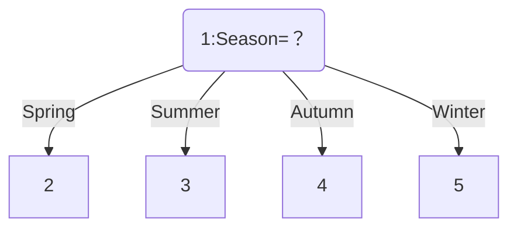
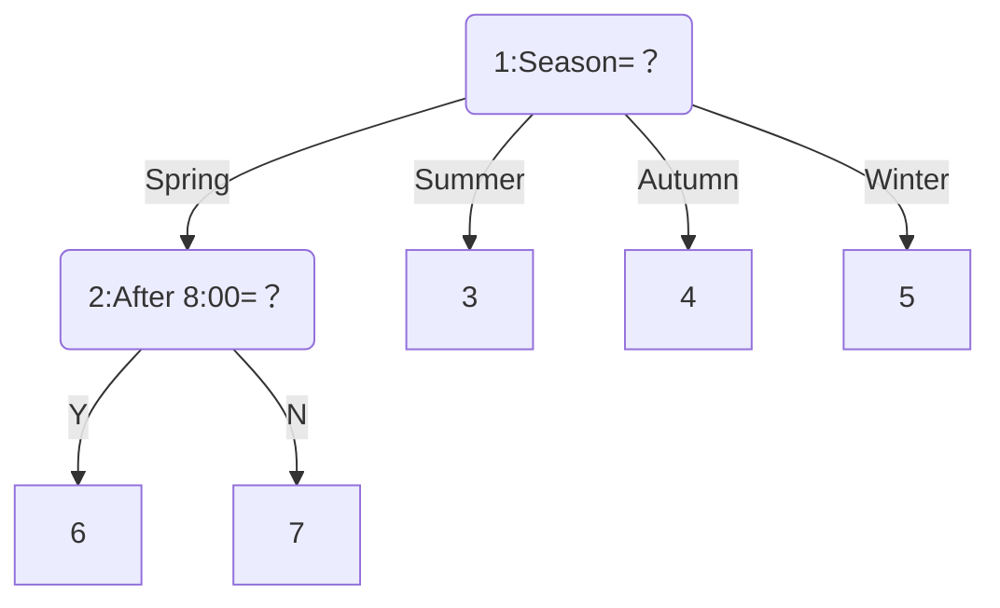
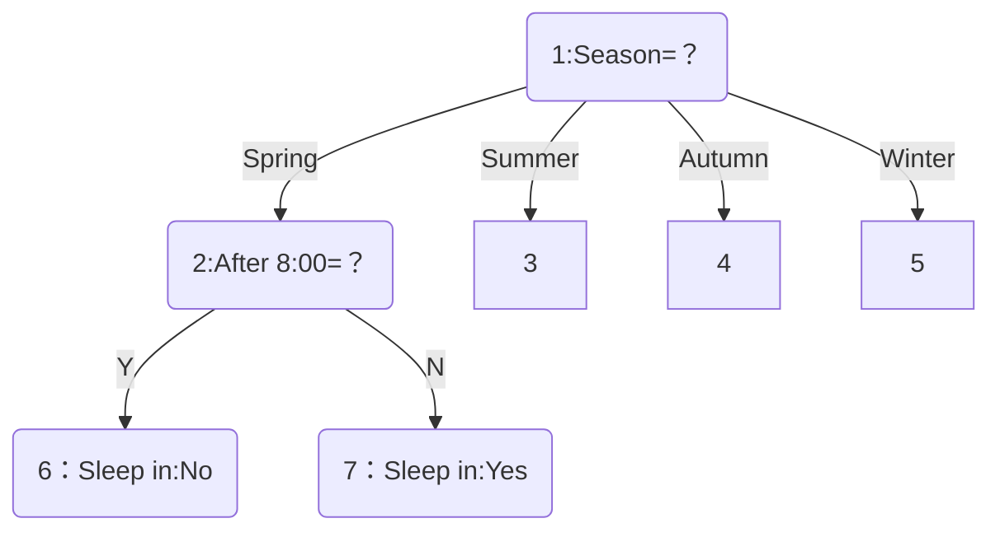
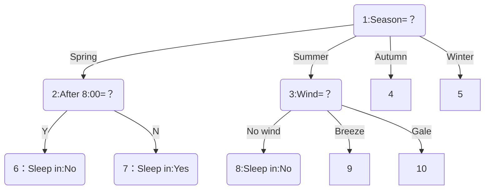
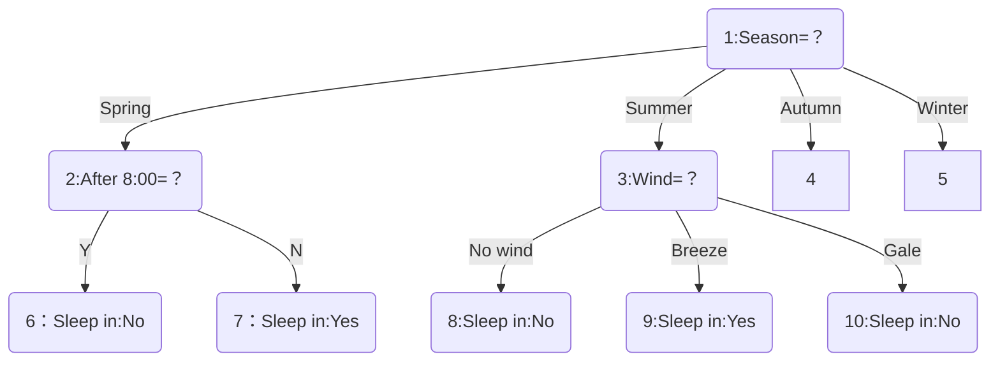
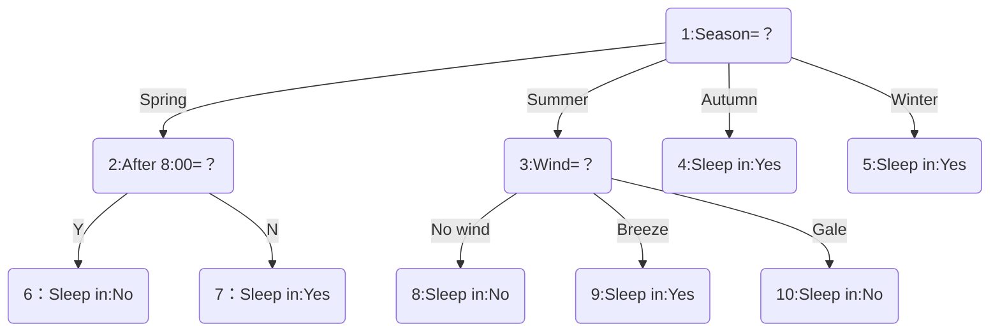

# 1.Calculate the gradient of the following multivariate function

(1) $u=xy+y^2+5$
$$
\frac{\partial u}{\partial x}=y \\
\frac{\partial u}{\partial y}=x+2y\\
\nabla u=(y,x+2y)
$$
(2)$u=ln\sqrt{x^2+y^2+z^2}$
$$
\frac{\partial u}{\partial x}=\frac{1}{\sqrt{x^2+y^2+z^2}}\times\frac{1}{2}\times\frac{1}{\sqrt{x^2+y^2+z^2}}\times2x=\frac{x}{{x^2+y^2+z^2}} \\
\frac{\partial u}{\partial y}=\frac{1}{\sqrt{x^2+y^2+z^2}}\times\frac{1}{2}\times\frac{1}{\sqrt{x^2+y^2+z^2}}\times2y=\frac{y}{{x^2+y^2+z^2}}\\
\frac{\partial u}{\partial z}=\frac{1}{\sqrt{x^2+y^2+z^2}}\times\frac{1}{2}\times\frac{1}{\sqrt{x^2+y^2+z^2}}\times2z=\frac{z}{{x^2+y^2+z^2}}\\
\nabla u=(\frac{x}{{x^2+y^2+z^2}} ,\frac{y}{{x^2+y^2+z^2}} ,\frac{z}{{x^2+y^2+z^2}})\\
\nabla u_{(1,2,-2)}=(\frac{\partial u}{\partial x},\frac{\partial u}{\partial y},\frac{\partial u}{\partial z})_{(1,2,-2)}=(\frac{1}{9},\frac{2}{9},\frac{-2}{9})
$$

# 2.

According to:
$$
\operatorname{Ent}(D)=-\sum_{k=1}^{|\mathcal{Y}|} p_k \log _2 p_k \\
\operatorname{Gain}(D, a)=\operatorname{Ent}(D)-\sum_{v=1}^V \frac{\left|D^v\right|}{|D|} \operatorname{Ent}\left(D^v\right)
$$
**Node 1:**
$$
Ent(D)=-\frac{3}{12}log_2(\frac{3}{12})-\frac{9}{12}log_2(\frac{9}{12})=0.8113 \\
$$
a=Season,
$$
\\
\sum_{v=1}^V \frac{\left|D^v\right|}{|D|}\operatorname{Ent}\left(D^v\right)=
\frac{2}{12}
(
-\frac{1}{2}log_2(\frac{1}{2})
-\frac{1}{2}log_2(\frac{1}{2})
)

+
\frac{3}{12}
(
-\frac{2}{3}log_2(\frac{2}{3})
-\frac{1}{3}log_2(\frac{1}{3})
)
\\
+
\frac{2}{12}
(-\frac{2}{2}log_2(\frac{2}{2}))
+
\frac{5}{12}
(-\frac{5}{5}log_2(\frac{5}{5}))
\\
=\frac{2}{12}\times1+\frac{3}{12}\times 0.9183+\frac{2}{12}\times 0+\frac{5}{12}\times 0
\\
=0.3962
\\
$$
a=After 8:00,
$$
\sum_{v=1}^V \frac{\left|D^v\right|}{|D|}\operatorname{Ent}\left(D^v\right)=\frac{7}{12}
(-\frac{1}{7}log_2(\frac{1}{7})
-\frac{6}{7}log_2(\frac{6}{7})
)+
\frac{5}{12}
(-\frac{2}{5}log_2(\frac{2}{5})
-\frac{3}{5}log_2(\frac{3}{5})
)
\\
=\frac{7}{12}\times0.5917+\frac{5}{12}\times 0.9710\\
=0.7497
$$
a=Wind,
$$
\sum_{v=1}^V \frac{\left|D^v\right|}{|D|}\operatorname{Ent}\left(D^v\right)=

\frac{4}{12}
(-\frac{1}{4}log_2(\frac{1}{4})
-\frac{3}{4}log_2(\frac{3}{4}))
+
\frac{5}{12}
(-\frac{5}{5}log_2(\frac{5}{5}))
+
\frac{3}{12}
(-\frac{2}{3}log_2(\frac{2}{3})
-\frac{1}{3}log_2(\frac{1}{3})
)
\\
=\frac{4}{12}\times 0.8113+\frac{5}{12}\times 0+\frac{3}{12}\times 0.9183
\\
=0.5
$$
So, Node split on feature **Season** with gain $\operatorname{Ent}(D)-\sum_{v=1}^V \frac{\left|D^v\right|}{|D|} \operatorname{Ent}\left(D^v\right)=0.4150$​​.

To generate **Node 2,3,4,5**.

**Node 2:**
$$
Ent(D)=-\frac{1}{2}log_2(\frac{1}{2})
-\frac{1}{2}log_2(\frac{1}{2})=1 \\
$$
a=After 8:00,
$$
\sum_{v=1}^V \frac{\left|D^v\right|}{|D|}\operatorname{Ent}\left(D^v\right)=
\frac{1}{2}
(-\frac{1}{1}log_2(\frac{1}{1}))
+
\frac{1}{2}
(-\frac{1}{1}log_2(\frac{1}{1}))
=0
$$
a=Wind
$$
\sum_{v=1}^V \frac{\left|D^v\right|}{|D|}\operatorname{Ent}\left(D^v\right)=
\frac{1}{2}
(-\frac{1}{1}log_2(\frac{1}{1}))
+
\frac{1}{2}
(-\frac{1}{1}log_2(\frac{1}{1}))
=0
$$
We can choose both of them.

So, Node split on feature **After 8:00** with gain 1.0.

To generate **Node 6,7**.

**Node 6:**

All target_values have the same value.

So this Node is `Sleep in:No`

**Node 7:**

All target_values have the same value.

So this Node is `Sleep in:Yes`

**Node 3:**
$$
Ent(D)=-\frac{2}{3}log_2(\frac{2}{3})
-\frac{1}{3}log_2(\frac{1}{3})=0.9183
$$
a=After 8:00,
$$
\sum_{v=1}^V \frac{\left|D^v\right|}{|D|}\operatorname{Ent}\left(D^v\right)=
\frac{2}{3}
(-\frac{1}{2}log_2(\frac{1}{2})
-\frac{1}{2}log_2(\frac{1}{2}))
+
\frac{1}{3}
(-\frac{1}{1}log_2(\frac{1}{1}))
=\frac{2}{3}\times1+\frac{1}{3}\times 0=0.6667
$$
a=Wind,
$$
\sum_{v=1}^V \frac{\left|D^v\right|}{|D|}\operatorname{Ent}\left(D^v\right)=
\frac{1}{3}
(-\frac{1}{1}log_2(\frac{1}{1}))
+
\frac{2}{3}
(-\frac{2}{2}log_2(\frac{2}{2}))
=0
$$
So,Node split on feature Wind with gain 0.9183.

Because $D_{No~wind}$ is empty, **Node 8 is marked as the class in $D$ with largest proportion: yes**.

To generate **Node 9,10**.

**Node 9:**

All target_values have the same value.

So this Node is `Sleep in:Yes`

**Node 10:**

All target_values have the same value.

So this Node is `Sleep in:No`

**Node 4:**

All target_values have the same value.

So this Node is `Sleep in:Yes`

**Node 5:**

All target_values have the same value.

So this Node is `Sleep in:Yes`

# 3.

The Prior probability：
$$
P(y=-1)=\frac{5}{15}\\
P(y=1)=\frac{10}{15}
$$
The condition probability:
$$
P(x_1=2|y=-1)=\frac{\frac{1}{15}}{\frac{5}{15}}=\frac{1}{5}\\
P(x_1=2|y=1)=\frac{\frac{4}{15}}{\frac{10}{15}}=\frac{4}{10}\\
P(x_2=S|y=-1)=\frac{\frac{3}{15}}{\frac{5}{15}}=\frac{3}{5}\\
P(x_2=S|y=1)=\frac{\frac{1}{15}}{\frac{10}{15}}=\frac{1}{10}
$$
And we have:
$$
P(y=-1|x_1=2,x_2=S)=P(y=-1)\times P(x_1=2|y=-1) \times P(x_2=S|y=-1)=\frac{5}{15}\frac{1}{5}\frac{3}{5}=\frac{1}{25} \\
P(y=1|x_1=2,x_2=S)=P(y=1)\times P(x_1=2|y=1) \times P(x_2=S|y=1)=\frac{10}{15}\frac{4}{10}\frac{1}{10}=\frac{2}{75}
$$
Because $P(y=-1|x_1=2,x_2=S)>P(y=1|x_1=2,x_2=S)$,So predict $y=-1$