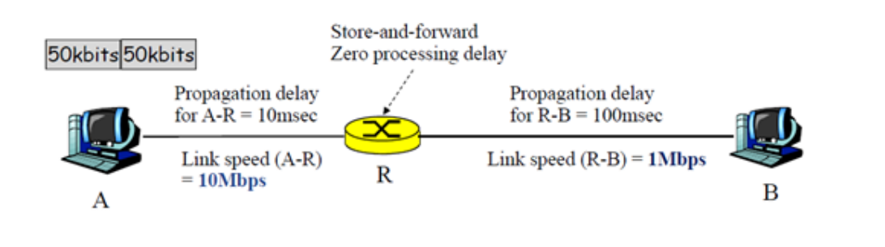
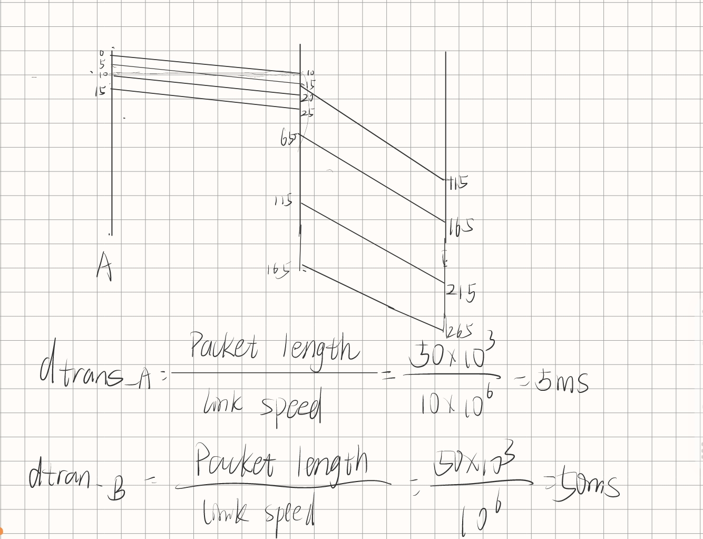
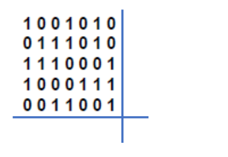

#### **1. Reference Model (8 points)**

**a)Transport Layer.**

In the transport layer, entire connections can be encrypted end to end, that is,process to process. For maximum security, end-to-end security is required.

**b)Data Link Layer.**

This function is often handled by the Medium Access Control (MAC) sublayer. The MAC sublayer manages the protocols that determine which device has control over the wireless channel.

**c)Data Link Layer.**

Data Link Layer frames the data to avoid transmit all the data repeatedly when errors of part of the data transmission occur.

**d)Network Layer.**

This layer is responsible for path determination and logical addressing, which includes deciding through which interface data should be sent to reach the destination network. 

#### **2. Transmission Medium and Modulation (12 points)**

Enumerate all the types of ... that we discussed in class.

##### **a) Modulation schemes**

- **A binary signal.** One constant amplitude level usually represents a 0 and another constant amplitude level represents a 1.
- **Amplitude Modulation/Amplitude shift keying.** By changing the amplitude of the carrier signal,digits 0 and 1 are presented.

- **Frequency Modulation** / **Frequency Shifted** **Keying **.By changing the frequency of the carrier signal, digital signals 1 and 0 are represented.
- **Phase Modulation /** **Phase Shifted Keying. **By changing the phase of the carrier signal by 180 degrees, digital signals 1 and 0 are represented.
- **Q(uadratic)Phase Shifted Keying. **By changing the phase of the carrier signal by 90 degrees,2 bits digital signals are represented.
- **8 Phase Shifted Keying. **By changing the phase of the carrier signal by 45 degrees,3 bits digital signals are represented.
- **Quadratic Amplitude Modulation**. Under the premise of the same frequency,combine ASK and PSK,by changing the combination of the amplitude and the phase ,$log_2(n)$bits digital signals are represented if there are $n$ sorts of combination.

##### **b) Communication satellites**

- **GEO** (**Geostationary Earth Orbit**) **satellites**. They are at high altitude, approximately 35,786 kilometers above Earth;orbit the Earth at the same rotational speed, so they appear stationary relative to the Earth's surface; Ideal for communication and broadcasting.
- **MEO**(**Medium-Earth Orbit**) satellites.  Located at medium altitudes. Used for global navigation systems like GPS .
- **LEO** (**Low-Earth Orbit**) **satellites**. Used for various purposes, including Earth observation, scientific research, and satellite internet.

##### c) Guided Medium

- **Twisted Pair**
- **Coaxial Cable**
- **Fiber Optic** **cable** 
- **Copper(wire).**

##### d) Multiplexing schemes

- **Space Division Multiplexing (SDM).**Divide the data channel into multiple physical channels, each of which can transmit independent data.
- **Frequency Division Multiplexing(FDM).**  It divides the spectrum into frequency bands, with each user having exclusive possession of some band in which to send their signal.
- **Wavelength Division Multiplexing(WDM).**It is, frequency division multiplexing of light.
- **Time Division Multiplexing(TDM).** The users take turns (in a round-robin fashion), each one periodically getting the entire bandwidth for a little burst of time.
- **Time and Frequency Multiplexing.**A Combination of FDM and TDM，A channel uses a certain frequency band for a certain amount of time.
- **Code Division Multiplexing(CDM).**Allows each station to transmit over the entire frequency spectrum all the time. Multiple simultaneous transmissions are separated using coding theory.

#### **3. Packet Switching v.s. Circuit Switching (10 points)**

Is the end-to-end delay in a packet switching system always smaller than the same systemwith circuit switching? Why or why not?

Answer:

No.

Circuit Switching is direct access,has little transmission delay,but constructing a Circuit consumes lots of time.

Packet Switching has no construction time,but has more transmission delay and need some extra information.

So when the amount of data to be transmitted is large and the transmission time is much longer, circuit switching is more suitable. When the end-to-end path consists of multiple links, packet switching is more suitable for data transmission.

#### **4. Bandwidth, Data rate, and Capacity (15 points)**

There is a link of data rate 6 Mbps, to be shared by 30 users. Suppose each user, when

active, needs a 500 Kbps data rate. Each user is active with a probability of 0.3.

##### a) If circuit switching is used, how many users can be hosted on this link?

Because the path is dedicated,although  each user is active with a probability of 0.3,so
$$
n=\frac{ 6 M}{500 K}=12
$$
**12** users can be hosted on this link.

**b) If packet switching is used, what is the probability that the link is overloaded?**

If the link is overloaded,more than $\frac{ 6 M}{500 K}=12$ users are using at the same time.
$$
P=\sum_{i=13}^{30}C_{30}^{i}(0.3)^i(1-0.3)^{30-i}=0.08447
$$

**c) What is the minimum signal-to-noise ratio (SNR) to provide for the required 6 Mbps data rate on a channel of bandwidth 30 MHz?**
$$
\because max \ datarate\  𝐶=BW log_2{(1+\frac{S}{N})}
\\
\therefore \frac{S}{N}\geq2^{\frac{c}{BW}}-1=0.1487
$$

#### **5. Store-and-Forward, Delay (10 points)**

Suppose host A has 3 packets to send to host B, who is joined to A by a router with zero processing delay. Each packet is 50 Kb. The network configuration is as follows. What is the queuing delay of the third packet at the router R?

Answer：

So,the queuing delay of the third packet is $115-25=90ms$

#### **6. CDMA (10 points)**

Consider 4 stations with the following chip sequences.

A: (-1 -1 -1 +1 +1 -1 +1 +1)

B: (-1 -1 +1 -1 +1 +1 +1 -1)

C: (-1 +1 -1 +1 +1 +1 -1 -1)

D: (-1 +1 -1 -1 -1 -1 +1 -1)

The received sequence S = (-1 +1 -3 +1 -1 -3 +1 +1).

Which station transmitted, and what are the transmitted bits?

Answer:
$$
R_A=\frac{1}{8}<S⋅A>=\frac{1}{8}(1-1+3+1-1+3+1+1)=1\\
R_B=\frac{1}{8}<S⋅B>=\frac{1}{8}(1-1-3-1-1-3+1-1)=-1\\
R_C=\frac{1}{8}<S⋅C>=\frac{1}{8}(1+1+3+1-1-3-1-1)=0\\
R_D=\frac{1}{8}<S⋅D>=\frac{1}{8}(1+1+3-1+1+3+1-1)=1\\
$$
A station transmit 1.

B station transmit 0.

D station transmit 1.

#### **7. Hamming Distance (10 points)**

What is the Hamming distance of the horizontal-vertical parity check code for the 7 *×* 7 block we discussed in class? Show correctness of your answer by considering the detection and correction capability of this coding scheme.

Answer: **Hamming distance is 4**.(**Think of the right-down corner**)

**Detection:**

**It can detect all 3-bit errors.**

- example1：Two bits in the same row or column are flipped.

  Assume we use the above example and that we try covering up the error in either the row or column parity bit by flipping a third bit. This will hide one of the errors, but not both. Hence, all 3-bit errors can be caught. 

- example2：Only one data bit is flipped,and its corresponding row check bit  and column check bit are flipped ,too.

  But the  **right-down corner** can detect the wrong bit in the row comprised of the column check bits.

**And It can't detect all 4-bit errors.**

Assume  four error data bits form a rectangle. Obviously it can't detect the error.

**Correct:**

**It can only detect only all the 1-bit errors.**

Assume we use the example: two bits in the same row. We only knows which two columns are wrong,but check bits for the row keeps the same. We can't locate it.

So,
$$
Hamming\ distace \geq 3+1\\
and,Hamming\ distace \geq 2*1+1
$$

**Hamming distance is 4**.(**Think of the right-down corner**).

#### **8. Hamming Code (10 points)**

A 9-bit (m=9) message with binary value 100101011 is to be encoded using a even-parity Hamming code.

**a) How many check bits are needed?**
$$
\because n+k≤ 2^k-1\\
\therefore k=4
$$
**b) What is the encoded Hamming codeword. Show your steps.**

| 1    | 2    | 3 (1,2 ) | 4    | 5(1,4) | 6(2,4) | 7(1,2,4) | 8    | 9(1,8) | 10(2,8) | 11(1,2,8) | 12(4,8) | 13(1,4,8) | XoR  |
| ---- | ---- | -------- | ---- | ------ | ------ | -------- | ---- | ------ | ------- | --------- | ------- | --------- | ---- |
| X    | X    | 1        | X    | 0      | 0      | 1        | X    | 0      | 1       | 0         | 1       | 1         |      |
| X    |      | 1        |      | 0      |        | 1        |      | 0      |         | 0         |         | 1         | 1    |
|      | X    | 1        |      |        | 0      | 1        |      |        | 1       | 0         |         |           | 1    |
|      |      |          | X    | 0      | 0      | 1        |      |        |         |           | 1       | 1         | 1    |
|      |      |          |      |        |        |          | X    | 0      | 1       | 0         | 1       | 1         | 1    |

the encoded Hamming codeword:  **11**1**1**001**1**01011

#### **9. CRC (15 points)**

Data stream 10010011101 is to be encoded using the standard CRC method. The generator

polynomial is $G(x) = x^ 3 + 1.$

**a) What is the bit string *T*(*x*) that is to be transmitted?**

First,r=3.

Remainder r(x)=$Remainder[\frac{M(x)x^r}{G(x)}]$

​                        1 0 0 0 0 0 1 1 1 1 0

------------------------------------

 1001 |  1 0 0 1 0 0 1 1 1 0 1 0 0 0

​               1 0 0 1  

--------------------------------------------------

​                           0 0 1 1 1 0

​                                  1 0 0 1 

-------------------------------------------------

​                                     1 1 1 1

​                                     1 0 0 1

------------------------------

​                                        1 1 0 0

​                                        1 0 0 1

------------

​                                           1 0 1 0

​                                           1 0 0 1

--------------

​                                              0 1 1 0

Remainder r(x)=1 1 0

There ,r=3
$$
T(x)=(x^{10}+x^7+x^4+x^3+x^2+x^0)x^3+x^2+x^1\\
=x^{13}+x^{10}+x^7+x^6+x^5+x^3+x^2+x^1
$$

And the code is 10010011101110

**b) Suppose the first three bits from the left are inverted/flipped during the transmission.**

**Can the errors be detected? Show your steps.**

So the code(wrong T'(x)) is 01110011101110

​                          1 1 1 1 1 0 0 0 0 1

---------------

1001 | 0 1 1 1 0 0 1 1 1 0 1 1 1 0

​                1 0 0 1

------------------------

​                   1 1 1 0

​                   1 0 0 1

--------------

​                      1 1 1 1

​                      1 0 0 1

-----------------------------

​                         1 1 0 1

​                         1 0 0 1

------------------------------------------------

​                            1 0 0 1               

​                            1 0 0 1

-----------

​                                         0 1 1 1 0

​                                            1 0 0 1  

----------

​                                               1 1 1

​                                              

​                                    

ro r'(x)=111$\neq$0

So the error can be detected.
