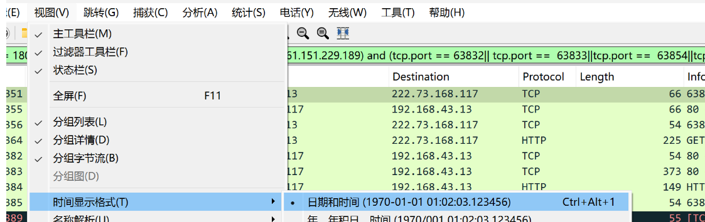
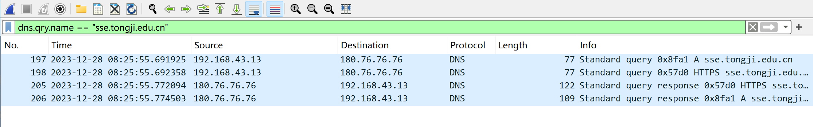
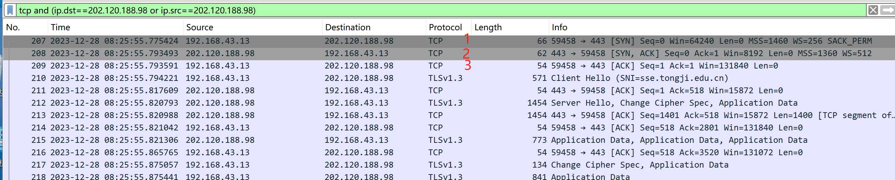
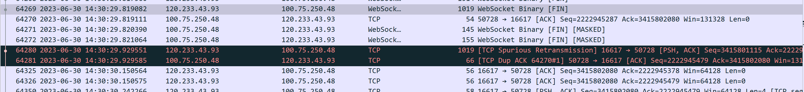
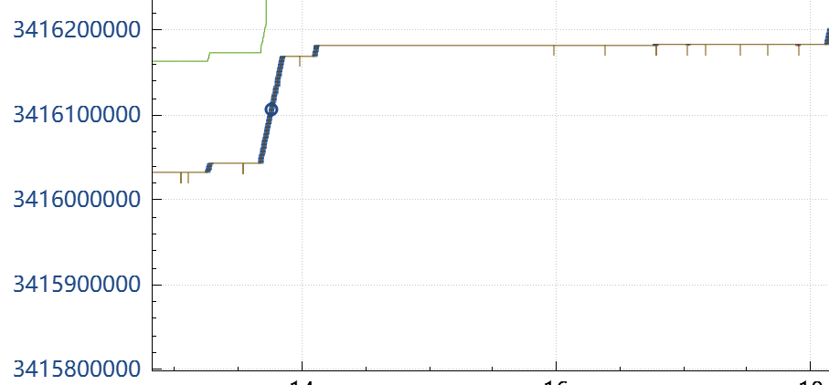
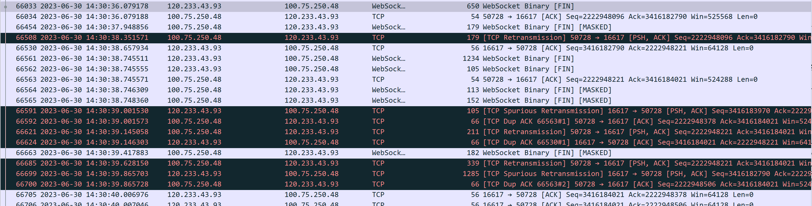

# 1. **Wireshark Basics (10%)**

**Q 1.1**(**5%**): What is the IP address used by your own computer, and the IP address of sse.tongji.edu.cn? (You’re required to show the **timestamp** in the form of (**yyyy/mm/dd** **exact time**) in your screenshot /printout, change of default setting may be needed.)

1. In the `cmd`, type in `ipconfig`, and we see:

   

   MY IP： `192.168.43.13` (IPv4)

2. Change the settings:

2. And I filter the records by   `dns.qry.name == "sse.tongji.edu.cn"`!

   `180.76.76.76` is  a public DNS service provided by BAIDU.

3. We should open a response package from `180.76.76.76`, check its detailed information about its Answers, and it shows:

   Because of the technology of CDN,  it shows 2 ip addresses.

  4. So,  `ip.addr == 222.66.109.32` and  `ip.addr == 202.120.188.98`. 

     In this case, I try `tcp and (ip.dst==222.66.109.32)`, but there is no record.

      I try `tcp and (ip.dst==202.120.188.98)`,  and it shows my laptop have a connection with this ip address. 

     

​	(My record: When I turn on the global proxy(clash),and the dns.qry.name is differnet.)

**Q 1.2** (**5%**): Now try launching some other applications on your computer (e.g., QQ, Wechat ...) that can **access the Internet**. Start capturing again while leaving the website you just accessed **open**, wait for a few seconds then stop.

What can you see from the packet trace? Use *filter* to show the **two** (There may be more connections on your laptop, but you only need to show two of them for this) connections respectively, including the filter statement you used.

**Connection: 哔哩哔哩**

1. In the `cmd`, type in ` tasklist | findstr "哔哩"` .

2. And type in`netstat -ano | findstr <port>`,querying each PID in turn for the corresponding port number.

   

   You can see that only the process with PID 39388 is using the port, and the connection is established. 

   The  ip address of "bilibili" is  `58.220.18.27 `

3. I filter the records by` (ip.addr == 58.220.18.27) and (tcp.port == 60213|| tcp.port == 60252)`

   

**Connection: QQMusic**

1. In the `cmd`, type in ` tasklist | findstr "QQMusic"` .

2. And type in`netstat -ano | findstr <port>`,querying each PID in turn for the corresponding port number.

   

   We can see that  port 63832, 63833,63854,63974 used by the WLAN IP(IPv4).

3. I filter the records by `(ip.addr == 180.153.202.43|| ip.addr == 222.73.168.117||ip.addr ==61.151.229.189) and (tcp.port == 63832|| tcp.port ==  63833||tcp.port ==  63854||tcp.port ==  63947)`

   

# **2. TCP Basics**

We’ll be exploring TCP protocol in this section. What you just did in part 1 is still useful and we’ll start from this. Consider about the connection between your laptop and `sse.tongji.edu.cn` for questions **2.1 - 2.3**

**Q 2.1** (**5%**):

a. What is the sequence number of the TCP SYN segment that is used to initiate the TCP connection between the source and destination?

b. What in the segment identifies the segment as a SYN segment?

1. We know the IP address of `sse.tongji.edu.cn` is , `ip.addr == 222.66.109.32` and  `ip.addr == 202.120.188.98`.

   In the section,  my laptop has the connection with the ip address  `202.120.188.98`.

2. I filter the records by `tcp and (ip.dst==202.120.188.98 or ip.src==202.120.188.98) `.Obviously, the  means of the three-way handshake is as  follows.
3. Check the detailed segment of the first handshake: 
4. Answer the question: 
   1. **2689392547**(0, relative on the client host ).
   2. Settings of  SYN=1,  ACK=0, identifies the segment  as a SYN segment. 

**Q 2.2** (**10%**):

a. What is the sequence number of the SYNACK segment sent by destination to the source in reply to the SYN?

b. What is the value of the Acknowledgement field in the SYNACK segment?

c. How did the destination determine the value in acknowledgement field?

d. What is it in the segment that identifies the segment as a SYNACK segment?

1. Check the detailed segment of the second handshake:
2. Answer the question: 
   1. **3284714436**(0, relative on the server host).
   2. **2689392548**(1,relative on the client host)
   3. **2689392548=2689392547+1**.  Assume *sequence number of the SYN segment* = *x*, and *acknowledgement number of the SYNACK segment* = *x+1*.
   4. Settings of  SYN=1,  ACK=1, identifies the segment  as a SYNACK  segment. 

**Q 2.3**(**5%**): Now you may know about the “three-way handshake” better! Is it possible to establish a TCP connection with less “handshakes” ? Give your reasons.

Answer: No. 

If we only configure the SYN segment and the SYNACK segment.

Assume a delaying SYN segment from client, after a long time(maybe it is detained at a node in the internet) ,it arrives at the server. Now it  is an invalid SYN segment, but  the server regards it as a new tcp connection request, and allocate resource for this connection. Obviously, the resource is wasted in this case.

Now it’s time for more challenging tasks! Open **Multiconnections2023.pcapng** using Wireshark. As you can read from its name, there were several connections in this file.

**Please read the requirements carefully.**

**Q 2.4**(**15%**): Pick **one** segment in the TCP connection you chose.

a. At what time was it sent?

b. When was the ACK for this segment received?

c. What is the length of the segment?

d. Given the difference between when each TCP segment was sent, and when its acknowledgement was received, what is the RTT value for this segment? Show your process and a plot for the segment you chose.

1. I choose the segment in the package of the red block, Frame 2 ,with $Seq_1=112287546$, $Len_1=1424$.

   And We can see:

   The package of the blue block，Frame 3: $Ack_2=112288970=Seq_1+Len_1$，so  it is a ACK for the segment in the red block.

2. Check the details of this package in the red block, Frame 2 .

   The length of TCP segment is $1424~bytes$, without header field.

3. Check the details of this package in the blue block， Frame 3.

Answer the question:

a. `2023-6-30 14:29:20.844658`.

b.`2023-6-30 14:29:20.844669`.

c. 1424 bytes(without  header field).

d. The RTT  value is $0.000011000$ seconds.

3. Select a TCP segment in the“listing of captured packets” window that is being sent from the source to the destination. Then select: *Statistics* *→* *TCP Stream Graph* → *Round Trip Time Graph.*

   And I should choose the direction of  from `146.56.196.163:8081` to `100.75.250.48:50555`.(By changing flow number and switch direction).

**Q 2.5**(**25%**): Similar as mentioned above, open **Time Sequence(tcptrace)** and other useful plots to answer following questions. (For this question, analyze the connection between **100.75.250.48** and **120.233.43.93) **

a. You may notice that for a TCP connection, plot of **tcptrace** differs from directions of  transmission. There’s a relating concept about it. Find out the concept, explain it and give another example.

b. Analyze the plot(s). Does the lack of receiver buffer space ever throttle the sender? How did you identify it?

c. Maybe you’ve found out that the connection isn’t very “smooth”. Were there any congestion during the whole process and can you evaluate their severity? (you don’t need to  give a specific quantitative indicator, qualitative ones will do. There’s no standard answer to this, logic is all you need.)

d. What actions did TCP connection take when retransmission is needed?(e.g. scale of window size, changes of sequence number) Make some reasonable assumptions on potential causes of transmission failure and try to give your ideas on how to prevent them(Same as  Q 2.5.c, logic is all you need.)

1. According to the TA' s reminder, I use `tcp.stream==110` to filter the records  .

2. Open the **Time Sequence(tcptrace)**, choose the flow number **110**.

   

3. Analysis the plots .

   - Horizontal coordinate indicates time

   - vertical coordinate indicates sequence number

   - the brown vertical  short line represents a ACK packet from the other side.

   - the brown continuous line represents the ACK  number of the ACK packet from the other side.

   - the green continuous line represents $the~sequence~number+the~size~of~the~receiver~ window$.

   - the difference between the upper green line and the lower brown line is the size of the receiving window, the ACK acknowledgement message is received, the window moves upward, and the packet can be sent only within the window.

   - the blue vertical short line represents a single data packet, with the bottom point meaning the first byte in the packet(the sequence number), the top point meaning the last byte in the packet.

     

Answer :

a. I think the concept is **full-duplex**. Data can be transmitted in both directions simultaneously, and network conditions may be different in each direction.
Another example is full-duplex Ethernet: the high-speed Ethernet, communications may both send and receive information simultaneously with two channels.

b. According to the trace, the sender is **never** throttled due to lacking of receiver buffer space.  Because the last byte in the all packets has a large room to reach the large byte it can send ( the upper green line).

c. Yes.  Analysis mainly  from `120.233.43.93` to `100.75.250.48`.

- 4.3s~ 6.0s

  The package according to this period:

  7.85s~8.3s

  The package according to this period:

  8.75~9.1s 

  The package according to this period:

  Data transmission has stalled for these periods of time, sequence number keeps still.

  And there is a few  packets for  TCP spurious retransmission, and duplicated ACKs. 

  There may be **minor** network congestion.

- 6.4s~7.8  s

  The package according to this period:

  

  10.3s~11.3s

  The package according to this period:

  14.2s~18s

  The package according to this period:

  Data transmission has stalled for this period of time, sequence number keeps still.

  18.2s~20.2s

  The package according to this period:

  Many duplicate ACKs from the other side, and  some retransmission packets to send.

  There may be **severe** network congestion.

d.

- When a TCP connection requires retransmission, several actions may be taken:
  - **Exponential Backoff**: The retransmission timeout is doubled after each consecutive timeout, which helps to prevent the network from being overwhelmed with too many rapid retransmissions.
  - **Window Size Adjustment**: The congestion window size may be reduced to control the rate at which the sender issues packets into the network, which is a part of TCP congestion control mechanisms like slow start, congestion avoidance, fast retransmit, and fast recovery.
  - **Sequence Number**: The sequence numbers remain the same for retransmitted packets as they identify the byte stream of the original transmission.(It can be seen in the images above.)
- Here are some of the main reasons why transmission failure occurs: 
  - **Network Congestion**: Overloaded network paths can lead to packet loss.
  - **Unreliable Network**: Fluctuations in network quality, such as in wireless connections, can cause packets to be lost or corrupted.
  - **Hardware Failures**: Faulty routers, switches, or other networking hardware can drop packets.
  - **High Latency**: Excessive delays can lead to TCP timeouts and unnecessary retransmissions.
  - **Software Issues**: Network stack implementation bugs or misconfigurations can result in failed transmissions.
- To prevent transmission failures, one could:
  - Implement quality of service (QoS) policies to prioritize important traffic.
  - Increase redundancy with error correction codes or duplicate transmissions.
  - Optimize TCP settings like initial window size or select TCP congestion control algorithms suited for the network conditions (e.g., BBR for high-bandwidth, high-latency networks).

**Q 2.6**(**10%**):How to calculate throughput (bytes transferred per unit time) for chosen TCP connection? You only need to explain how to do this.

Answer:

​	 The average throughput for this TCP connection is computed as the ratio between the total amount data and the total transmission time.
​	The total amount data transmitted can be computed by the difference between the sequence number of the first TCP segment and the acknowledged sequence number of the last ACK . 
​	The whole transmission time is the difference of the time instant of the first TCP segment  and the time instant of the last ACK .
​	And for TCP connections, the transmission throughput is usually different in both directions. Because TCP connections are full-duplex, data can be transmitted in both directions simultaneously, but network conditions may be different in each direction.
​	So we should calculate both the two directions.

**Q 2.7**(**10%**): Find out when the TCP connection is terminated, analyze and explain the “four-way handshake” process).

Illustrate your understanding with **visualization**(figures are needed for this. Any tools used in plotting is okay as long as you can make it clear.)

1. The packets in the last, represent the “four-way handshake” process.
2. Open *Statistics* *→* *Stream Graph*.

Answer the question:

TCP connection is full-duplex, both server and client can request to close the connection. For simplicity, we call  the side of the connection  deciding to close the connection the Client.

1. **Termination Request**: When one side of the connection (let's say the client) decides to close the connection, it sends a FIN (finish) packet to the server.

   The frame 69241, SYN=1, $Seq_1=2222949302$.

2. **Acknowledgment of Termination Request**: The server acknowledges this request by sending an ACK (acknowledgment) packet back to the client.

3. **Server Ready to Terminate**: The server then sends its own FIN packet to the client to indicate that it's ready to close the connection.

   - We find the Frame 69299, $Ack_2=2222949302$. Actually, it is **not a part of** the “four-way handshake” process.
   - In the Frame 69301, FIN=1, ACK=1, $Ack_3=2222949303=Seq_1+1$, $Seq_3=3416245010$.

   This FIN is then merged with the previous Ack to be sent out together.

4. **Final Acknowledgment**: The client responds with an ACK, acknowledging the server's FIN packet.

   

   The frame 69302, ACK=1, $Seq_4=2222949303=Ack_3$, $Ack_4=3416245011=Seq_3+1$.

**Q 2.8**(**5%**): About the termination process, is it possible to end a TCP connection with less “handshakes” ? Give your reasons.

Answer: 

Yes. It is only with three “handshakes” as mentioned above.

Because the delayed ACK mechanism is enabled, after the first FIN is received, the condition of sending ack cannot meet the condition of sending ACK immediately, resulting in the delay of ACK sending, during the delay, if the application confirms that there is no data to be sent and the connection is to be closed, it will trigger the sending of FIN, which will be merged with the previous ACK  and will be sent.

# **Feedback**

I  use time : 14h+.

Advice:

1. The original incentive is to let us known about TCP better, maybe HW should offer a detailed document to teach **WireShark** technique (not too much, just what we will use).

2. For some analysis questions , HW should point out what index we should pay attention to. Too much freedom makes us confused, though.

   