有些需要细看的知识点自行总结。

[TOC]


# Introduction

### Definition

**定义**：

**A collection of autonomous computers interconnected by a single technology.**

Internet是指因特网（专有名词），是internet的一种。采用TCP/IP协议，由众多网络组成，全球可以进行通信。

internet是指互联网or互连网。这里是指由多个计算机连接所组成的虚拟网络。

## **分类classification**：

### 按分布范围分类:by scale

- The Internet

- 广域网WAN：是Internet的核心部分 交换技术 (country / continent)

- 城域网MAN：metropolitan area network

- 局域网LAN Local Area Network ：**以太网技术** **广播技术** WIFI

  局域网主要工作在data link layer….

  局域网是指在某一区域内由多台计算机互联成的计算机组。一般是方圆几千米以内。局域网可以实现文件管理、应用软件共享、打印机共享、工作组内的日程安排、电子邮件和传真通信服务等功能。局域网是封闭型的，可以由办公室内的两台计算机组成，也可以由一个公司内的上千台计算机组成。

  **局域网一般为一个部门或单位所有，建网、维护以及扩展等较容易，系统灵活性高。其主要特点是：**

  1. 覆盖的地理范围较小，只在一个相对独立的局部范围内联，如一座或集中的建筑群内。
  2. 使用专门铺设的传输介质进行联网，数据传输速率高（10Mb/s～10Gb/s）。
  3. 通信延迟时间短，可靠性较高。

  局域网的类型很多，若按网络使用的传输介质分类，可分为有线网和无线网；若按[网络拓扑结构](https://www.zhihu.com/search?q=网络拓扑结构&search_source=Entity&hybrid_search_source=Entity&hybrid_search_extra={"sourceType"%3A"answer"%2C"sourceId"%3A2565012876})分类，可分为总线型、星型、环型、树型、混合型等；若按传输介质所使用的访问控制方法分类，又可分为**以太网(Ethernet)、[令牌环网](https://www.zhihu.com/search?q=令牌环网&search_source=Entity&hybrid_search_source=Entity&hybrid_search_extra={"sourceType"%3A"answer"%2C"sourceId"%3A2565012876})、FDDI网和无线局域网**等。

- 个人局域网PAN:bluetooth,zigbee

### 按拓扑结构分类 topology structure 

### 按传输技术分类：By transmission technology

- broadcasting/multi-casting
- Point to point (Wide Area Network )

### 按交换技术分类 Network layer : **Network Core: Switching**

Core: **interconnected routers**

**Circuit Switching:线路交换**

在进行数据传输前，两个结点之间必须先建立一条专用（双方独占）的物理通信路径（由通信双方之间的交换设备和链路逐段连接而成），该路径可能经过许多中间结点。这一路径在整个数据传输期间一直被独占，直到通信结束后才被释放。

**construct a dedicated path between the two end devices**

因此，Circuit Switching 分为三个阶段：连接建立、数据传输和连接释放。

- circuit establishment
- information transfer(analog and digital)
- circuit terminates

advantage:

*Once established,*

- *Network is transparent to users.*
- *Data* *rate is fixed**/guaranteed.*
- *Data arrives* *in order**.*

### disadvantage:

- *Circuit establishment delay*
- *Low utilization*
- *Resource is divided into channels,* *and a channel is occupied* *throughout the connection*

**Packet Switching:包交换**

限制了每次传送的数据块大小的上限，把大的数据块划分为合理的小数据块，再加上一些必要的控制信息（如源地址、目的地址和编号信息等），构成分组（Packet）网络结点根据控制信息把分组送到下一个结点，下一个结点接收到分组后，暂时保存并排队等待传输，然后根据分组控制信息选择它的下一个结点，直到到达目的结点。

### steps:

- Data is divided into packets.
- **store-and-forward**

*A* *packet* *must be received as a whole* *(every bit) before it can be transmitted.*

### advantages:

- *Each packet uses the full link* *bandwidth.*
- *Resource is shared among users.*
- *Resource can be used* ***on demand**.*
- *Can admit* *more users**!!*

### disadvantages:

- *Resource contention* 资源冲突
- *Congestion*堵塞 拥挤
- *Routing is complex*
- *Packets may arrive out of order.*

### Bursty Data:

*Packet Switching can handle* *bursty data:*

- *Resource is shared*.
- *Resource is used on demand.*
- *Each packet uses the full bandwidth.*

### Simple Router Model

要传送的数据量很大且其传送时间远大于呼叫时间时，采用电路交换较为合适。端到端的通路由多段链路组成时，采用分组交换传送数据较为合适

When the amount of data to be transmitted is large and the transmission time is much longer than the call time, circuit switching is more suitable. When the end-to-end path consists of multiple links, packet switching is more suitable for data transmission.


# Performance metric:

## bandwidth

the highest data rate is called bandwidth

## Data rate

## Delay:an important performance metric

指数据（一个报文或分组）从网络（或链路）的一端传送到另一端所需要的总时间，它由4部分构成：发送时延、传播时延、处理时延和排队时延。

- **Transmission delay**

**结点将分组的所有比特推向（传输）链路所需的时间**，即从发送分组的第一个比特算起，到该分组的最后一个比特发送完毕所需的时间，因此也称传输时延。

link speed 就是transmission rate

计算公式为发送时延=分组长度/信道宽度

$$ d_{trans}=\frac{packet \ length}{  data\ rate} =\frac{L}{R} $$

- **propagation delay**

电磁波在信道中传播一定的距离需要花费的时间，即一个比特从链路的一端传播到另一端所需的时间。计算公式为

传播时延=信道长度/电磁波在信道上的传播速率

- **Processing delay**

数据在交换结点为存储转发而进行的一些必要的处理所花费的时间。例如，分析分组的首部、从分组中提取数据部分、进行差错检验或查找适当的路由等。

通常小于毫秒级别。

- **Queuing delay**

分组在进入路由器后要先在输入队列中排队等待处理。路由器确定转发端口后，还要在输出队列中排队等待转发，这就产生了排队时延。

value depends on congestion level.

因此，数据在网络中经历的总时延就是以上4部分时延之和：

总时延=transmission delay+propagation delay+ processing delay+queuing delay

注意：做题时，**排队时延和处理时延**一般可忽略不计（除非题目另有说明）。另外，对于**高速链路，提高的仅是数据发送速率transmission** 而非比特在链路上的传播速率。提高数据的发送速率只是为了减少数据的发送时延。

计算题要注意b 和B

## Throughput

单位时间内通过某个网络的数据量

# *Network Software: Protocol Hierarchies*

## Hierachy ——a layer structure

SDU

PCU

PDU

Reason and target: explicit structure /modularization/

****\*Each layer does encapsulation/decapsulation\*****

## Protocol, Service, and Interface

protocol:a set of rules governing how communicating parties interact.

控制两个（或多个）对等实体进行通信的规则的集合，是水平的。不对等实体之间是没有协议的，比如用TCP/IP协议栈通信的两个结点，结点A的传输层和结点B的传输层之间存在协议，但结点A的传输层和结点B的网络层之间不存在协议。网络协议也简称为协议。

The protocol consists of three parts: **grammar, semantic and synchronization**. The syntax defines the format of the data transmission; the semantics defines the functions to be completed, what control information to be sent, what action to complete and what response to make; the synchronization of the conditions of various operations, timing relations, etc., a detailed description of the sequence of events. A complete protocol should usually have line management (establish, release connection), error control, data conversion, etc.

Interface: a set of allowed operations between layers/ how to access it.

Service: a set of operations that a layer provides to the layer above it.

### Service Classification

connection-oriented   connectionless

Reliable Service  unreliable Service

Acknowledged Service  Unacknowledged Service”

## The (ISO) OSI  **Open Systems Interconnection** Reference Model

OSI **Open Systems Interconnection** 是“开放系统互连”的缩写，该模型是由国际标准化组织（ISO International Standards Organization）开发的

**communication subnet** 通信子网包括物理层、数据链路层和网络层，主要负责数据通信data communication。

**resource subnet** 资源子网是OSI参考模型的上三层，传输层的主要任务是向高层用户屏蔽下面通信子网的细节（如网络拓扑、路由协议等）block the details of the communication subnet

**physical**

负责定义与传输媒介（例如铜线、光纤）的接口。这一层关心的是电压、时钟频率、物理连接等。

也有很多协议

**data link**

function: frame    error control   flow control (not *congestion*  control, Neighboring Nodes)  transmission management

**network:datagram**

function:      error control   flow control (whole network) *congestion*  control    router selection

*routing from source to destination*

- *subnet, addressing, routing, congestion control(拥塞控制)*
- 提供connection-oriented connectionless
- protocols: IP(connectionless) IPX ICMP 等。IP是无连接的网际协议

**transport  layer**

*process-to-process（进程到进程） **reliable data transfer***

- *error control, flow control(p2p), congestion control*

**session layer**

会话层允许不同主机上的各个进程之间进行会话。会话层利用传输层提供的端到端的服务， 向表示层提供它的增值服务。这种服务主要为表示层实体或用户进程建立连接并在连接上有序地传输数据，这就是会话，也称建立同步(SYN)。 会话层负责管理主机间的会话进程，包括建立、管理及终止进程间的会话。会话层可以使用校验点使通信会话在通信失效时从校验点继续恢复通信，实现数据同步

**presentation layer**

在两个通信系统中交换信息的表示方式。不同机器采用的编码和表示方法不 同，使用的数据结构也不同。为了使不同表示方法的数据和信息之间能互相交换，表示层采用抽 象的标准方法定义数据结构，并采用标准的编码形式。数据压缩、加密和解密也是表示层可提供 的数据表示变换功能

**application layer**

## The TCP/IP Reference Model(Real world)

network interface

internet layer

transport layer

application layer

- everything over/above ip
- not a general model
- 对蜂窝网络的支持非常差
- does not distinguish protocol/service /interface 不区分
- *TCP/IP does not require strict layering*

##  

| OSI                                            | TCP/IP                                       |
| ---------------------------------------------- | -------------------------------------------- |
| Standards before protocols                     | A description of existing protocols          |
| Protocol, Service, Interface                   | No clear distinction                         |
| Functionality not specific to layers           |                                              |
|                                                |                                              |
| Specific functionality to layers               |                                              |
| A unified architecture (which did not  happen) | Difficult to describe other protocol stacks. |
| Connectionless/connection oriented             |                                              |
| network layer                                  | Connectionless network layer                 |
| Connection oriented transport layer r          | Connectionless/connection oriented           |
| transport layer                                |                                              |

## a hybrid reference model in this course

physical

link

network

transport

application

### cross-layer design?

# Device

## **中继器 (Repeater)——physical layer**

**英语**：Repeater

**作用**：中继器是一种用于延长网络传输距离的设备，它工作在OSI模型的物理层。它接收来自网络的信号，清理并恢复原来的信号形态，然后将其放大或重新生成，最后发送出去。中继器主要用于克服由于长距离传输而导致的信号衰减问题，确保数据能够在更长的距离内传输而不会丢失或变得不可靠。

## **集线器 (Hub)是多端口的Repeater——physical layer**

**英语**：Hub

**作用**：集线器是一种基本的网络设备，用于将多个网络设备连接在一起形成一个单一的网络。当数据到达一个端口时，它会复制该数据并将其发送到其他所有端口，让所有连接的设备都能看到所有的数据。集线器工作在OSI模型的物理层，仅仅进行信号的再生成和放大。由于它向所有设备广播数据，因此它不是很高效，且所有设备共享带宽，可能会导致网络拥塞。

## 

## switch 交换机**——data link layer**

Switch（交换机）在网络中起着至关重要的作用。它是一个高效的网络设备，工作在OSI模型的数据链路层（第二层），主要用于连接多个设备，如计算机、打印机和服务器，在一个局域网（LAN）内部进行数据包的转发。以下是交换机的主要功能和特点：

1. **帧转发**：交换机接收到数据帧后，会根据帧内的MAC地址信息决定如何转发。它能够记住每个设备的MAC地址及其对应的端口号，因此只将数据发送到目的地设备所在的端口，而不是像集线器那样广播给所有端口。这显著提高了网络的效率和安全性。
2. **冲突域隔离**：在以太网中，交换机将每个端口视为一个独立的冲突域，这意味着数据包之间不会相互冲突，从而允许网络实现全双工通信，提高了网络的带宽和效率。
3. **虚拟局域网（VLAN）**：高级交换机支持虚拟局域网，它允许管理员在逻辑上划分网络，无论物理位置如何，从而提高了安全性，减少了广播流量，并允许更灵活的网络管理。

## reference model

### The (ISO) OSI  Open Systems Interconnection Reference Model

**network:datagram**

function:      error control   flow control (whole network) *congestion*  control    router selection

*routing from source to destination*

- *subnet, addressing, routing, congestion control(拥塞控制)*
- 提供connection-oriente/ connectionless   service
- protocols: IP(connectionless) IPX ICMP 等。IP是无连接的网际协议

### The TCP/IP Reference Model(Real world)


### comparison

| OSI                                                | TCP/IP                                              |
| -------------------------------------------------- | --------------------------------------------------- |
| Standards before protocols                         | A description of existing protocols                 |
| ***Protocol, Service, Interface***                 | No clear distinction                                |
| ***Functionality not specific to layers*** **  **  | **  *****Specific functionality to layers***        |
| A unified architecture (which did not  happen)     | ***Difficult to describe other protocol stacks.***  |
| Connectionless/connection oriented   network layer | ***Connectionless network layer***                  |
| Connection oriented transport layer r              | Connectionless/connection oriented  transport layer |


# Physical Layer

## 2.1 THE THEORETICAL BASIS FOR DATA COMMUNICATION

 Symbol 传输速率   单位是波特（Baud）

datarate  比特/秒（b/s)  比特率 

*max datarate* 𝑅𝑚𝑎𝑥=2 𝐵𝑊 𝑙𝑜𝑔2(𝑉) *bps 这里的带宽是指最高频率了*

两倍的采样速度*码元个数

*max datarate C*= BW log2（l + S/N） （单位为b/s） 这里计算的是单纯的比值！！

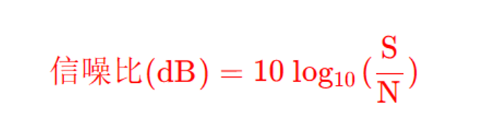

## **2.2 GUIDED TRANSMISSION MEDIA:***signal propagates along a direction,*

*****Media\*: \*where analog signal (that carries information) propagates\***

**Magnetic Media**

随机的电磁波辐射，也就是噪音，融合进环境


**Twisted Pairs**

双绞线是最常用的古老传输介质，

它由两根采用一定规则并排绞合的、相互绝缘的铜导线组成。绞合可以减少对相邻导线的电磁干扰。为了进一步提高抗电磁干扰的能力，可在双绞线的外面再加上一层，即用金属丝编织成的屏蔽层，这就是屏蔽双绞线(STP)O无屏蔽层的双绞线称为非屏蔽双绞线(UTP)

是最常用的传输介质之一，在局域网和传统电话网中普遍使用

**Coaxial Cable**

被广泛用于传输较高速率的数据

*Cable broadband Internet*

*Aircraft, military, medical*

*TV, video equipment*

**Fiber Optic cable**  

光纤不仅具有通信容量非常大的优点，还具有如下特点： 1） 传输损耗小，中继距离长，对远距离传输特别经济。 2） 抗雷电和电磁干扰性能好。这在有大电流脉冲干扰的环境下尤为重要。 3） 无串音干扰，保密性好，也不易被窃听或截取数据。 4） 体积小，重量轻。这在现有电缆管道已拥塞不堪的情况下特别有利。

##### Communication satellites**

- **GEO** (**Geostationary Earth Orbit**) **satellites**. They are at high altitude, approximately 35,786 kilometers above Earth;orbit the Earth at the same rotational speed, so they appear stationary relative to the Earth's surface; Ideal for communication and broadcasting.
- **MEO**(**Medium-Earth Orbit**) satellites.  Located at medium altitudes. Used for global navigation systems like GPS .南北极通信
- **LEO** (**Low-Earth Orbit**) **satellites**. Used for various purposes, including Earth observation, scientific research, and satellite internet.

*Modulation调制  digital→ anolog*

full-duplex -> modulator & demodulator

### *Multiplexing*：

SDM TDM FDM CDM 

> ##### A: (-1 -1 -1 +1 +1 -1 +1 +1)
>
> B: (-1 -1 +1 -1 +1 +1 +1 -1)
>
> C: (-1 +1 -1 +1 +1 +1 -1 -1)
>
> D: (-1 +1 -1 -1 -1 -1 +1 -1)
>
> The received sequence S = (-1 +1 -3 +1 -1 -3 +1 +1).
>
> Which station transmitted, and what are the transmitted bits?
>
> 
>
> Answer:
> $$
> R_A=\frac{1}{8}<S⋅A>=\frac{1}{8}(1-1+3+1-1+3+1+1)=1\\
> R_B=\frac{1}{8}<S⋅B>=\frac{1}{8}(1-1-3-1-1-3+1-1)=-1\\
> R_C=\frac{1}{8}<S⋅C>=\frac{1}{8}(1+1+3+1-1-3-1-1)=0\\
> R_D=\frac{1}{8}<S⋅D>=\frac{1}{8}(1+1+3-1+1+3+1-1)=1\\
> $$
> A station transmit 1.
>
> B station transmit 0.
>
> D station transmit 1.

#####  

### Device

Repeater——physical layer:它接收来自网络的信号，清理并恢复原来的信号形态，然后将其放大或重新生成，最后发送出去

Hub——physical layer:多端口的Repeater:当数据到达一个端口时，它会复制该数据并将其发送到其他所有端口，让所有连接的设备都能看到所有的数据。集线器工作在OSI模型的物理层，仅仅进行信号的再生成和放大。由于它向所有设备广播数据，因此它不是很高效，且所有设备共享带宽，可能会导致网络拥塞。


# Datalink Layer

## 3.1 DATA LINK LAYER DESIGN ISSUES

*Framing*：*

 Character-based count*    

*Flag* *byte with* *byte stuffing*

*Flag byte with bit stuffing* 0111110

## 3.2 ERROR DETECTION AND CORRECTION

### 3.2.2 Error-Detecting Codes

*Parity Check*

***Hamming Distance***

*the number of bit positions in which two codewords differ*

Code Distance

代码距离是指在一组编码中，任意两个代码之间的最小海明距离。

## 3.3 Basic Data link layer protocol

store and wait: 发送方每发送一帧，都要等待接收方的应答信号，之后才能发送下一帧；接收方每接收一帧，都要反馈一个应答信号，表示可接收下一帧。

效率Efficiency：信道利用率=传输帧的有效时间/传输帧的周期

发送方从开始发送数据到收到第一个确认帧为止，称为一个发送周期。

信道吞吐率=信道利用率x发送方的发送速率。

## 3.4 Sliding Window Protocols 

#  Multiple Access Control

最常用的以太网和无线局域网，都是使用 MAC 地址作为地址标识符进行通信的。

## 4.2 MULTIPLE ACCESS PROTOCOLS

Random Access MAC：contention system
Pure ALOHA 一直都不监听，随机发

*Slotted ALOHA*

### 4.2.2 *CSMA* Carrier Sense Multiple Access Protocols 载波监听多路访问

载波侦听协议（ carrier sense protocol ）CSMA协议是在ALOHA协议基础上提出的一种改进协议，它与ALOHA协议的主要区别是多了一个载波监听装置。（没有提发送后的监听）

- ***1-Persistent CSMA**: if the node detects the channel idle, it transmits a frame. Otherwise, the*

*node waits (keeps listening) until the channel becomes idle (so it can send immediately).*

“1-坚持”的含义是：监听到信道忙后，继续坚持监听信道；监听到信道空闲后，发送帧的 概率为1,即立刻发送数据。

- ***Non-persistent CSMA**: the node does not listen continuously, but checks the channel again*

*after a random period of time.*

一个结点要发送数据时，首先监听信道；如果信道空闲，那么立即发送数据；如果信道忙，那么放弃监听，等待一个随机的时间后再重复上述过程

- ***p-Persistent CSMA**: if the node detects the channel idle, it transmits a frame with probability*

*p (and defer/wait with probability 1-p).*

一个结点要发送数据时， 首先监听信道；如果信道忙，就持续监听，直至信道空闲；如果信道空闲，那么以概率p发送数据，以概率推迟到下一个时隙；如果在下一个时隙信道仍然空闲，那么仍以概率p发送数据，以概率1-p迟到下一个时隙；这个过程一直持续到数据发送成功或因其他结点发送数据而检测到信道忙为止，若是后者，则等待下一个时隙再重新开始监听。

C*SMA/CD Operations* 碰撞检测（Collision Detection）

① 准备发送：适配器从网络层获得一个分组，封装成帧，放入适配器的缓存。

② 检测信道：若检测到信道空闲，它就开始发送这个帧。若检测到信道忙，它就持续检测直至信道上没有信号能量，然后开始发送这个帧。

③ 在发送过程中，适配器仍持续检测信道。这里只有两种可能：

•发送成功：在争用期内一直未检测到碰撞，这个帧肯定能发送成功。 •发送失败：在争用期内检测到碰撞，此时立即停止发送，适配器执行指数退避算法，等待 一段随机时间后返回到步骤②。若重传16次仍不能成功，则停止重传并向上报错。

### **4.2.3 Collision-Free Protocols**

> In this section, we will examine some protocols that resolve the contention for the channel without any collisions at all, not even during the contention period. Most of these protocols **are not currently used in major systems,** but in a rapidly changing field, having some protocols with excellent properties available for future systems is often a good thing.

***“Taking Turns” MAC protocols:***

polling, token passing  环形局域网

****\*Bit-map  ： Reservation-based\*****

contention slots

***Binary Countdown Protocols***

## 4.3 Ethernet


802.3

two types: classic Ethernet, switched Ethernet (now use)

### 4.3.2 classic Ethernet MAC sublayer protocol

frame format;

**以太网类型/长度字段**（EtherType/Length）: 2个字节，用于标识上一层协议（通常是网络层）的类型，例如IPv4或IPv6，


前导码：使接收端与发送端时钟同步。在帧前面插入的8字节可再分为两个字段：第一个字段共7字节，是前同步码，用来快速实现MAC帧的**比特同步**；第二个字段是**帧开始定界符，表示后面的信息就是MAC帧。7B+1B**


MAC addressing   6个字节 

高24位为厂商代码，低24位为厂商自行分配的网卡序列号

如果传输出去的目标地址第一位是0 ，表示这是一个普通地址：如果是1 ，则表示这是一个组地址。

由全1组成的特殊地址保留用作广播（broadcasting ）。如果一个帧的目标地址宇段为全 1，则它被网络上的所有站接收。

1. **第一位的意义**：
   - **单播地址**：如果MAC地址的第一位是0，这表明这是一个单播地址，即地址是指向网络上的一个特定设备的。单播地址是唯一分配给网络上某一设备的，确保数据只发送给指定的接收方。
   - **组播地址**：如果MAC地址的第一位是1，这表明这是一个组播地址。组播地址用来同时发送数据给一组特定的接收者。所有属于这个组的设备都会接收到发送给该组播地址的数据。
2. **特殊的广播地址**：
   - **广播地址**：由全1组成的MAC地址（即FF:FF:FF:FF:FF:FF）是一个特殊的地址，它是一个预留的广播地址。当一个数据帧的目标地址字段为全1时，它被设计为在局部网络上的所有站都接收。这是一种特殊的组播，其中组包含了网络上的所有设备。

The Minimum Frame Length (MAC): L/R ≥ propagation delay *2 

> 以太网规定取51.2us为争用期的长度。对于10Mb/s的以太网，在争用期内可发送512bit, 即64B。在以太网发送数据时，如果前64B未发生冲突，那么后续数据也就不会发生冲突（表示已成功抢占信道）。换句话说，如果发生冲突，那么就一定在前64B由于一旦检测到冲突就立即停止发送，因此这时发送出去的数据一定小于64B。因此，以太网规定最短帧长为64B,凡长度小于64B的帧都是由于冲突而异常中止的无效帧，收到这种无效帧时应立即丢弃。

*Ethernet MAC: CSMA/CD*   binary exponential backoff 

 

### 4.3.4 交换式以太网

star topology

hub 集线器

交换机 switch——data link layer:交换机只把帧输出到该帧想去的端口。当交换机端口接收到来自某个站的以太网帧，它就检查该帧的以太网地址，确定该帧前往的目的地端口。*Buffer frames: Store-and-Forward*。通常都是full-duplex方式，就不需要CDMA/CD。如果half-duplex, 需要 *use CSMA/CD to access segments*。*No configuration needed: plug-and-play, self-learning*。做到了separate collision domain

## 4.4 Wireless LAN 无线局域网

### 4.4.1 The 802.11 Architecture and Protocol Stack

The main wireless LAN standard is 802.11

Two modes: infrastructure mode; ad-Hoc mode;

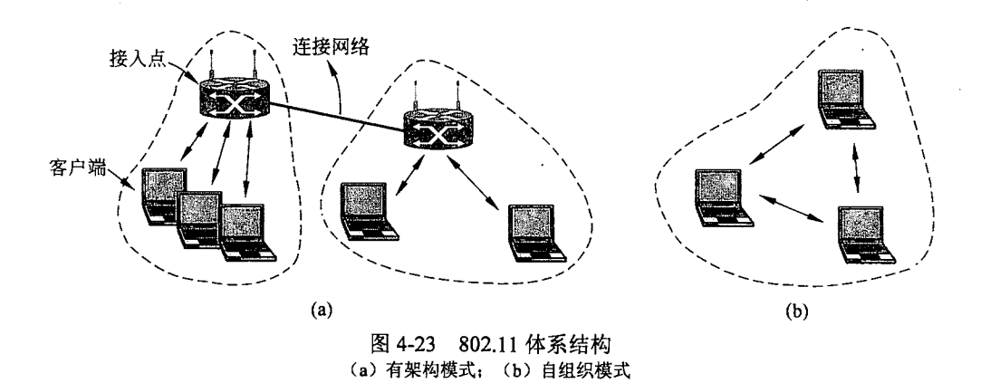

 Key differences: 衰减 干扰 多径效应

SNR信噪比很重要

### 4.4.3 802.11 MAC 子层协议

Why not CSMA/CD in wireless LAN?1）接收信号的强度往往会远小于发送信号的强度，且在无线介质上信号强度的动态变化范围很大，因此若要实现碰撞检测，则硬件上的花费就会过大。 hard to detect collision
2）在无线通信中，并非所有的站点都能够听见对方，即存在“隐蔽站”问题。Hidden Terminal Problem

 

**Hidden Terminal Problem**

target: collision Avoid

*IEEE 802.11 MAC:* **CSMA/CA**:

802.11使用了下列三种IFS：帧间间隔（InterFrame Space, IFS）。

1） SIFS （短IFS）：最短的IFS,用来分隔属于一次对话的各帧，使用SIFS的帧类型有ACK帧、CTS帧、分片后的数据帧，以及所有回答AP探询的帧等。

2） PIFS （点协调IFS）：中等长度的IFS,在PCF操作中使用。

3） DIFS （分布式协调IFS）：最长的IFS,用于异步帧竞争访问的时延。

backoff interval:退避时间。

**Sender:**

1. If sender senses the channel idle for *DIFS*, then transmit the entire frame.

   Otherwise,sender starts random backoff interval,by a timer.

2. Timer counts down when channel is idle,and freezes when channel is busy.

3. When Timer counts to zero,transmit the entire frame.

4. If an ACK is received by sender,go to step 1 to transmit the next frame;

   If an ACK is not received by sender,increase backoff interval(exponentially ) , go to step 2 , to transmit the same frame again.

**Receiver:**

​	If the frame is successfully received, replies an ACK after *SIFS*.

RTS（Request To Send）， CTT （Clear To Send）

源站要发送数据帧之前先广播一个很短的请求发送RTS （Request To Send）控制帧，它包括源地址、目的地址和这次通信（含相应的确认帧）所持续的时间，该帧能被其范围内包括AP在内的所有站点听到。

若信道空闲， 则AP广播一个允许发送CTS （Clear To Send）控制帧，它包括这次通信所需的持续时间（从RTS帧复制），该帧也能被其范围内包括A和B在内的所有站点听到。B和其他站听到CTS后， 在CTS帧中指明的时间内将抑制发送，如图3.24所示。CTS帧有两个目的：①给源站明确的 发送许可；②指示其他站点在预约期内不要发送。

## 4.8 DATA LINK LAYER SWITCHING 数据链路层交换

### 4.8.1 Uses of Bridges

以太网交换机是网桥的现代名称

它们提供的功能超越了传统的以太网和以太网集线器，可以很容易地把多个局域网加入到 一个更大更快的网络上。我们将交替着使用术语“网桥”和“交换机”

网桥工作在链路层的MAC子层，可以使以太网各网段成为隔离开的碰撞域（又称冲突域）。如果把网桥换成工作在物理层的转发器，那么就没有这种过滤通信量的功能。由于各网段相对独立，因此一个网段的故障不会影响到另一个网段的运行。不会冲突

### 4.8.2 self-learning bridge (in switch)

1. **Initial State**: When a bridge is first powered on, its forwarding table is empty.
2. **Bridge uses the backward learning algorithm**: By learning every frame sent on its ports,bridge can tell the source address of the frame can be accessible on the port the frame comes. And  bridge will add an entry to the forwarding table.
3. **Routing procedure**: 

   1. If the destination port is known( in the forwarding table), and the port for the destination address is the same as the **source** port,**discard** the frame.

   2. If the destination port is known( in the forwarding table), and the destination address and the source port are **different**, forward the frame on to the destination port.

   3. If the destination port is **unknown**, use **flooding** and send the frame on all ports **except the source port.** 
4. **Aging out old entries**: The forwarding table entries have a certain aging time. If an entry is not refreshed (by frames from the same source MAC address being seen again) within a certain time, the entry is removed from the table. This ensures that the table is kept up-to-date with only active hosts.
5. **Spanning Trees**: To avoid loops, bridg

switching table:*Entry:  MAC address of a host, interface* *to each host, and a time stamp*(time to live)

filter:  decide to forward or discard ; *local frames stay local*

forward: decide which port a frame to go

How does a bridge learn the hosts in a LAN?初始状态；backward learning algorithm；Routing procedure(known-same, known-different, unknown);aging out; Spanning tree

Flood :  *Forward to all* *interfaces except the one* *there the frame has arrived.* 

switch breaks subnets into LAN segments: LAN-segments-> separate  collision domain

### 4.8.3 生成树网桥

 hub: broadcast storm  switch: no （because spinning tree） 

## Device

### switch:data-link layer

### *Modes of NIC* Network interface card

• **Broadcast:** *accept* *broadcast* *frames (address FF:FF:FF:FF:FF:FF)*

• **Multicast:** *accept* *all groupcast* *frames (even if it is not a member of*

*the group)*

• **Direct:** *accept frames only destinated to itself (unicast address)*

• **Promiscuous** **混杂****:** *accept* *all* *frames - that’s how Wireshark works*

• *NIC of a switch/bridge works in this mode.*

*default mode of a NIC: Broadcast + Direct*

路由器网卡属于混杂模式

# Network

路由器连接的Heterogeneous Network: datalink  physical

路由器不转发广播消息 能分离广播域

在路由器互连的多个局域网的结构中，要求每个局域网物理层、数据链路层、网络层协议可以不同，而网络层以上的高层协议必须相同.


## 5.1 NETWORK LAYER DESIGN ISSUES

网络服务提供商 (ISP ） Network service providers

connectionless: 如果提供的是无连接的服务，那么，所有的数据包都被独立地注入到网络中，并且每个数据包独立路由，不需要提前建立任何设置。在这样的上下文中，数据包通常称为数据报（datagram ），它类似于电报（telegram),对应的网络称为数据报网络（ datagram network ）

connection-oriented:在发送数据包之前，必须首先建立起一条从源路由器到目标路由器之间的路径。这个连接称为虚电路 VC, virtual circuit ），它类似于电话系统中建立的物理电路，对应的网络称为虚电路网络（ virtual-circuit network)。*Packets in the same traffic* *flow follow the same path.* *Routing tables are fixed.*alse called labeling switch.

一种面向连接的网络服务例子是多协议标签交换（MPLS, MultiProtocol Label Switching ）

 

## 5.2 ROUTING ALGORITHMS

路由算法分为：static静态路由算法(非自适应)、dynamic动态路由算法(自适应)。

### 5.2.4*Distance Vector Routing*：dynamic.

简述：
慢收敛
在距离-向量路由算法中，所有结点都定期地将它们的整个路由选择表传送给所有与之直接相邻的结点。
a.通告新的路由，节点加入。
b.通告已有路由，更短替换。
RIP .
**Bellman-Ford** **Routing Algorithm** 1.initialization (detention node)2.*For each node* 𝑣 ≠ 𝑑*, for each neighbor w of v*,  𝐷 𝑣 *by* 𝐷 𝑣 ← min{𝐷(𝑤) + 𝑙(𝑣, 𝑤)}   util to *Converge*
有**Count-to-Infinity**的特点。good news fast. bad news infinity.

### 5.2.5 *Link State Routing*： global router information.

简述：
有快速收敛优点
1.发现它的邻居节点，并了解其网络地址。node发送hello给每个p2p，receiver要 *reply with its address**.*
2.设置到每个邻居节点的距离或者成本度量值。*Send* *an* **ECHO** *packet over each link*。*Nodes who receives an* **ECHO** *packet is required to**respond immediately*。根据时间来设置成本值。
3.构造一个包含所有刚刚获知的链路信息包 *Link State packet* 。内容首先是发送方的标识符，接着是一个序号（ Seq ）和年龄(Age),以及一个邻居列表。对于每个邻居，同时要给出到这个邻居的延迟。
4.将这个包发送给所有其他的路由器，并接收来自所有其他路由器的信息包。
发送：flooding 泛洪法。序号随着每新发一个包而递增。
接收：路由器记录下它所看到的所有（源路由器、序号〉对。新的转发（除了源头）。重复、小于丢弃。
age: --1 每秒。 *guarantees only live information are distributed*
5.计算出到每个其他路由器的最短路径。Dijkstra’s algorithm
OSFP。

**

```
#initialization
N<-{s}
for v not in N do:
	D(v)<-l(s,v)
#compute
while there is remaining nodes that are not in N do:
	w<-argmin {D(v)| v is not in N}
	N<-N U {w}
    for v not in N do:
		D(v)<-min{D(w)+l(w,v),D(v)}	
```

**

| Step | Set N       | D(B),p(B) | D(C),p(c) | D(D),p(D) | **D(E), p(E)** | **D(F), p(F)** |
| ---- | ----------- | --------- | --------- | --------- | -------------- | -------------- |
| 0    | A           | 4,A       | 1,A       | ∞         | ∞              | ∞              |
| 1    | A,C         | 3,C       | 1,A       | ∞         | 4,C            | ∞              |
| 2    | A,C,B       | 3,C       | 1,A       | 8,B       | 4,C            | 12,B           |
| 3    | A,C,B,E     | 3,C       | 1,A       | 5,E       | 4,C            | 7,E            |
| 4    | A,C,B,E,D   | 3,C       | 1,A       | 5,E       | 4,C            | 6,D            |
| 5    | A,C,B,E,D,F | 3,C       | 1,A       | 5,E       | 4,C            | 6,D            |

### 5.2.6 层次路由*Hierarchical Routing - in Reality*

当网络规模扩大时，路由器的路由表成比例地增大。这不仅会消耗越来越多的路由器缓冲区空间，而且需要用更多CPU时间来扫描路由表，用更多的带宽来交换路由状态信息。因此路由选择必须按照层次的方式进行。 **Routers are organized into regions or autonomous systems (ASs)***The routing algorithm running within an AS is called an intra-autonomous (***intra-AS***) system* *routing protocol (e.g.,* *RIP and OSPF**).*  外部：BGP

### 5.2.7 broadcasting route 广播路由

**Send a separate packet to each destination**

**Use flooding**

 **Spanning tree***: a subset of the subnet that includes all routers but contains no loops*. link state routing可以。distance vector不可以

**Reverse path forwarding 一种受控制的泛洪法**

> 当一个广播数据包到达一个路由器时，路由器检查它到来的那条线路是否正是通常用来给广播源端发送数据包用的那条线路。如果是，说明这是一个极好的机会，该广播数据包是沿着最佳路径被转发过来的，因而是到达当前路由器的第一份副本。如果是这种情况，则路由器将该数据包转发到除了到来的那条线路之外的所有其他线路上。然而，如果广播数据包是从其他任何一条并非首选的到达广播源的线路入境的话，该数据包被当作一个可能的重复数据包而丢弃。

### 5.2.8 组播路由

link state routing：直接用spanning tree

Distance Vector Routing

## SDN *Software-Defined Network*

> 软件定义网络（SDN）是近年流行的一种创新网络架构，它采用集中式的控制平面和分布式的数据平面，两个平面相互分离，控制平面利用控制-数据接口对数据平面上的路由器进行集中式控制，方便软件来控制网络。
>
> 远程控制器掌握各主机和整个网络的状态， 
>
> 为每个分组计算出最佳路由，通过Openflow协议（也可以通过其他途径）将转发表（在SDN中称为流表）下发给路由器。路由器的工作很单纯，即收到分组、查找转发表、转发分组。

SDN提供的编程接口称为北向接口，北向接口提供了一系列丰富的APL开发者可以在此基础上设计自己的应用，而不必关心底层的硬件细节。

SDN控制器和转发设备建立双向会话的接口称为南向接口，通过不同的南向接口协议（如Openflow）, SDN控制器就可兼容不同的硬件设备，同时可以在设备中实现上层应用的逻辑。

SDN控制器集群内部控制器之间的通信接口称为东西向接口，用于增强整个控制平面的可靠性和可拓展性。

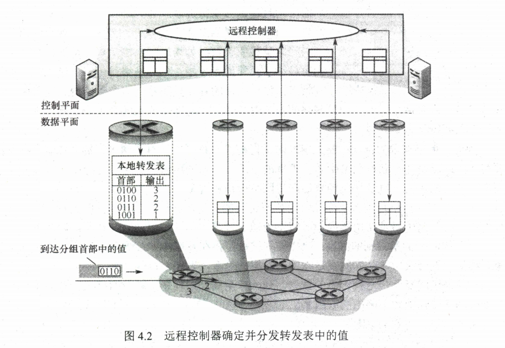

## 5.3 拥塞控制算法

**Two Types of Solutions**：
**Open-loop***: NO runtime feedback, to prevent the problem before it happens
***Closed-loop***: Use* *feedback* *(measurements of the* *system performance**) to make* *corrections* *at runtime*

*The Networking Layer Solution*：**Active Queue Management (AQM) at routers**

• **Drop-tail***: when congestion is detected, drop newly incoming packets.*

• **Random Early Detection** *(RED): When congestion is going to happen, randomly select* *and drop packets in the buffer.*

• **Early Congestion Notification** *(ECN)*

• *Others.*

## 5.4 服务质量

### 5.4.1 应用需求

从一个源端发到一个接收方的数据包流称为一个流 Cflow) (Clark, 1988 ）。
在面向连接的网络中，一个流或许是一个连接上的全部数据包：
而在无连接网络中，一个流是从一个进程发到另一个进程的所有数据包。
每个流的需求可由四个主要参数来表示：带宽、延迟、抖动和丢失。总之，这些参数决定了一个流要求的服务质量（QoS, Quality of Service ）

### 5.4.2 流量整形 traffic shaping

指调节进入网络的数据流的平均速率和突发性所采用的技术。

leaky bucket:𝑋< 𝑠, 𝑠 + 𝑡> ≤ 𝑀t
token bucket:𝑋 <𝑠, 𝑠 + 𝑡 >≤ min{𝑀𝑡, 𝜌𝑡 + 𝐶}

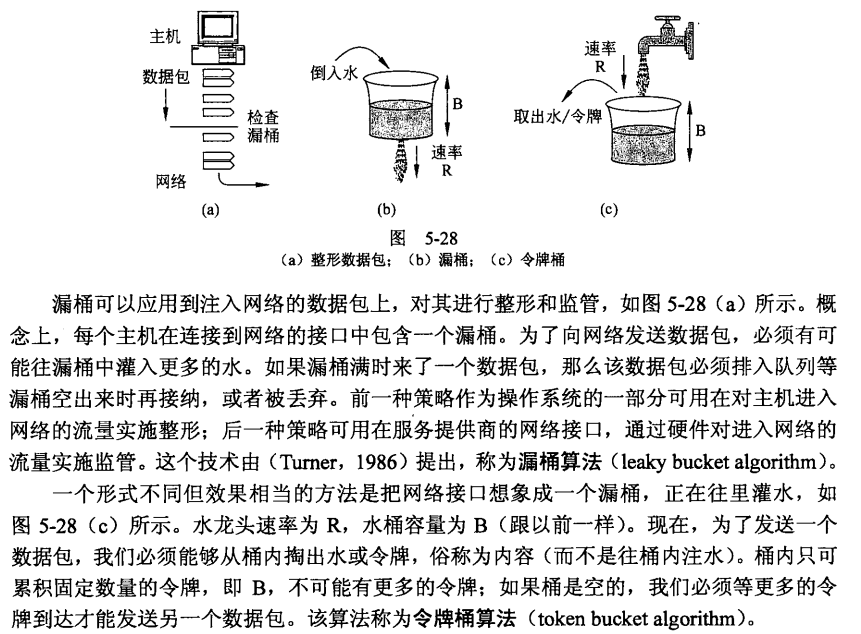

### 5.4.3 包调度  packet scheduling algorithms

FIFO

PQ:*Priority Queuing*：。高优先级数据包始终先于任何缓冲的低优先级数据包发送。具有相同优先级的数据包按照 FIFO 顺序发送。

*Round Robin* 

*Weighted Fair Queuing (WFQ)*：通过给高优先级队列更大的权重，例如，高优先级数据包往往会连续发送好几个（因为只有相对较少的数据包具有高优先级〉，然而，即使存在高优先级的流量，仍然有一定比例的低优先级数据包被陆续发送。

### 5.4.4 准入控制*Admission Control*

> 用户向网络提供一个有 QoS 需求的流量：然后，网络根据自己的容量以及向其他流做出的承诺决定是否接受或拒绝该流。如果接受，网络就要提前在路由器上预留容量，以便保证新流发送时的服务质量。

• **QoS Routing:** *Reservations made along the route.*

• **Flow Negotiating:** *Application and routers agree on a set of flow*  *parameters, which is called a* **flow specification***.*


• **Best effort model**

• *Every user receives the same level of service.*

• *Congestion results in severe degradation to applications requiring some min amount*  *of bandwidth/delay.*

• **Integrated services model**

• *Requires resources (bandwidth/buffers) to be explicitly reserved for each traffic flow* -> RSVP signaling protocol* Resource reSerVation Protocol 

• *Requires packet classification, packet scheduling and CAC (call admission control) * 

• **Differentiated services (DiffServ) model**

• *Scalable and flexible services based on “class” of traffic*

## 5.6 Internet Network layer

name 和address的一些原则：不会硬编码， 可以改变； 唯一的地址；名称不区分大小的ASCII；地址容易进行二进制运算；

### 5.6.1 1Pv4 协议 （header）

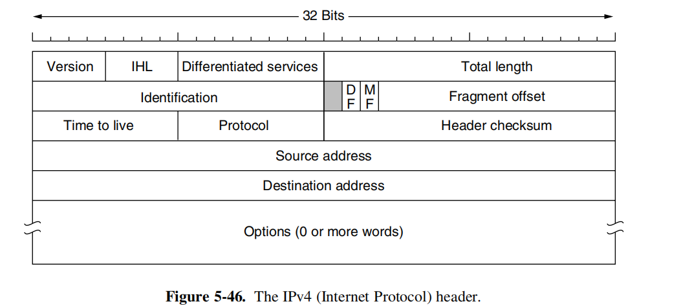

版本（Version ）宇段记录了数据报属于协议哪个版本。

由于头的长度不固定，所以头的 IHL 宇段指明了头到底有多长（以 32 位,**4B为单位**）。 IHL 的最小值为 5，这表明头没有可选项。该 位宇段的最大值为 15 ，把头的长度限制为最大 60 字节，因此选项（ Options ）宇段最多为 40 字节

总长度 。字段包含了该数据报中的所有内容，即头和数据。最大长度是65 535 个字节。目前情况下，这样的上界还是可以容忍的，但在未来网络中，可能需要更大的数据报。

总长度1B为单位

标识（ Identification ）宇段的用途是让目标主机确定一个新到达的分段属于哪一个数据报。同一个数据报的所有段包含同样的标识值。

所以IP地址都是32位的

IP首部中的标志位占3位，但只有后2位有意义,分别是MF位（More Fragment）和DF位（Don't Fragment）。只有当DF = 0时，该IP数据报才可以被分片。MF则用来告知目的主机该IP数据报是否为原始数据报的最后一个片。当MF= 1时，表示相应的原始数据报还有后续的片；当MF = 0时，表示该数据报是相应原始数据报的最后一个片。目的主机在对片进行重组时，使用片偏移字段来确定片应放在原始IP数据报的哪个位置。**8B为单位**。(偏移的字节要除以8哦)

**因此除了最后一分片，其他每个分片的数据部分长度都是8B的整数倍。**

协议字段表示使用IP的上层协议，如值为6表示TCP,值为17表示UDP  版本字段表示IP的版本，值为4表示IPv4,值为6表示IPv6。

生存期表示一个segment最多可以跳转的次数

**checksum只检查头部**

IP数据报分片：一个链路层数据报能承载的最大数据量称为最大传送单元（MTU）。 当IP数据报的总长度大于链路MTU时，就需要将IP数据报中的数据分装在多个较小的IP数据报中，这些较小的数据报称为片(segment)。

### 5.6.2 IP Addresses

一个 IP 地址并不真正指向 台主机，而是指向 1个网络接口，所以如果一台主机在两个网络上，它必须有两个 地址。然而，大多数主机都连在一个网络，因而只有1个 IP 地址。

 路由器有多个接口，从而有多个 IP地址。

IP地址有层次性：**Hierarchical**：*2-level (initially) -> 3-level (later)*

• *2-level: network id + host id*

• *3-level: network id + subnet id + host id*

MAC地址（ethernet地址）就没有层次性。

IP地址有classful:  *Class A, B, C (initially) ->classful subnet -> CIDR (later)，*Prefix* **前缀** *and mask* **掩码**

#### 分类寻址：classful  addressing + 2-level( network+host)不加mask的就是分类地址

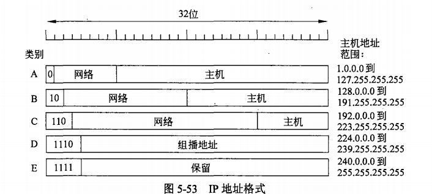

IP 地址分类同时支持组播 (D 类地址)，即数据包被直接发送给多台主机。

特殊用途ip:即IP地址:: = <网络号,主机号＞

- 主机号全为0表示本网络本身，如202.98.174.0\

- 主机号全为1表示本网络的广播地址，又称直接广播地址，如202.98.174.255  (不用于源地址 目的地址)

- 127.x.x.x保留为环回自检（Loopback Test）地址，此地址表示任意主机本身，目的地址为环回地址的IP数据报永远不会出现在任何网络上。（可以作为目的地址 返回本机）

-  32位全为0,即0.0.0.0表示本网络上的本主机。（可以作为本网络上本主机的ip地址 不能作为目的地址）

-  32位全为1,即255.255.255.255表示整个TCP/IP网络的广播地址，又称受限广播地址。 

  实际使用时，由于路由器对广播域的隔离，255.255.255.255等效为本网络的广播地址。 

**Unicast Addresses**:192.168.1.10

Multicast Addresses: 224.0.0.1

Broadcast Addresses:192.168.1.255

 网络地址转换 （ NAT ） 将专用网络地址（如**Intranet****）**转换为公用地址（如**Internet****）,从而对外隐藏内部管理的**IP**地址。NAT是由管理员呢配置的 找不到就丢弃不转发。                                  

>  为了网络安全，划出了部分**IP**地址为私有**IP**地址。私有**IP**地址只用于**LAN,**不用于**WAN**连接（因此私有**IP**地址不能直接用于**Internet,**必须通过网关利用**NAT**把私有**IP**地址转换为**Internet**中合法的全球**IP**地址后才能用于**Internet****）****,**并且允许私有**IP**地址被**LAN**重复使用。 
>
> 这有效地解决了 **IP**地址不足的问题。
>
> 私有**IP**地址网段如下： 
>
> **A** 类：**1** 个 **A** 类网段,即 **10.0.0.0****〜****10.255.255.255**。
>
> **B** 类：**16** 个 **B** 类网段，即 **1****72.16.0.0****—****172.31.255.255****o**
>
> **C** 类：**256** 个 **C** 类网段，即 **192.168.0.0****〜****192.168.****255.255**。 

 

#### classful  addressing + 3-level :*Subnet Addressing*

 **RFC 950, RFC 1122 – host must support this.**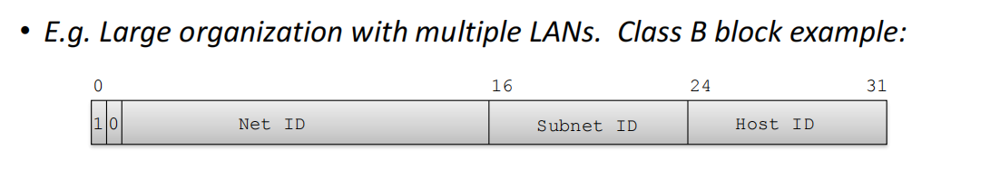

subnet masking: 1对应于IP地址中的网络号及子网号，而0对应于主机号

使用mask的，路由表中的每个条目，除要给出目的网络地址和下一跳地址外，还要同时给出该目的网络的子网掩码。

#### CIDR (Classless Inter Domain Routing)

CIDR是一种归并网络的技术，CIDR技术的作用是把小的网络汇聚成大的超网。

CIDR使用“网络前缀”的概念代替子网络的概念。IP:: = {v网络前缀〉，v主机号＞}。CIDR虽然不使用子网，但仍然使用**“掩码”** 一词。。“CIDR不使用子网”是指CIDR并没有在32位地址中指明若干位作为子网字段。但分配到一个CIDR地址块CIDR address block的组织，仍可以在本组织内根据需要划分出一些子网。例如，某组织分配到地址块/20,就可以再继续划分为8个子网（从主机号中借用3位来划分子网），这时每个于网的网络前缀就变成了 23位。全0和全1的主机号地址一般不使用。

把多个小前缀的地址块合并成一个大前缀的地址块。这个合并过程称为路由聚合（route aggregation ），由此产生的较大前缀地址块有时称为超网（supernet ），以便有别于地址块的分割。

最长匹配前缀（longest matching prefix ）

### IPV6

解决**“****IP**地址耗尽”问题的措施有以下三种：①采用无类别编址**CIDR,**使**IP**地址的分配更加合理；②采用网络地址转换**（****NAT****）**方法以节省全球**IP**地址；③采用具有更大地址空间的新版本的**IPv6o**其中前两种方法只是延长了 **IPv4**地址分配完毕的时间，只有第三种方法从根本上解决了 **IP**地址的耗尽问题。

**IPv6**的字节数**（****16B）**是**IPv4**字节数**（4B）**的平方。

**IPv6**数据报的目的地址可以是以下三种基本类型地址之一：

**1****）** 单播。单播就是传统的点对点通信。

**2****）** 多播。多播是一点对多点的通信，分组被交付到一组计算机的每台计算机。

**3****）** 任播。这是**IPv6**增加的一种类型。任播的目的站是一组计算机，但数据报在交付时只交付其中的一台计算机，通常是距离最近的一台计算机。

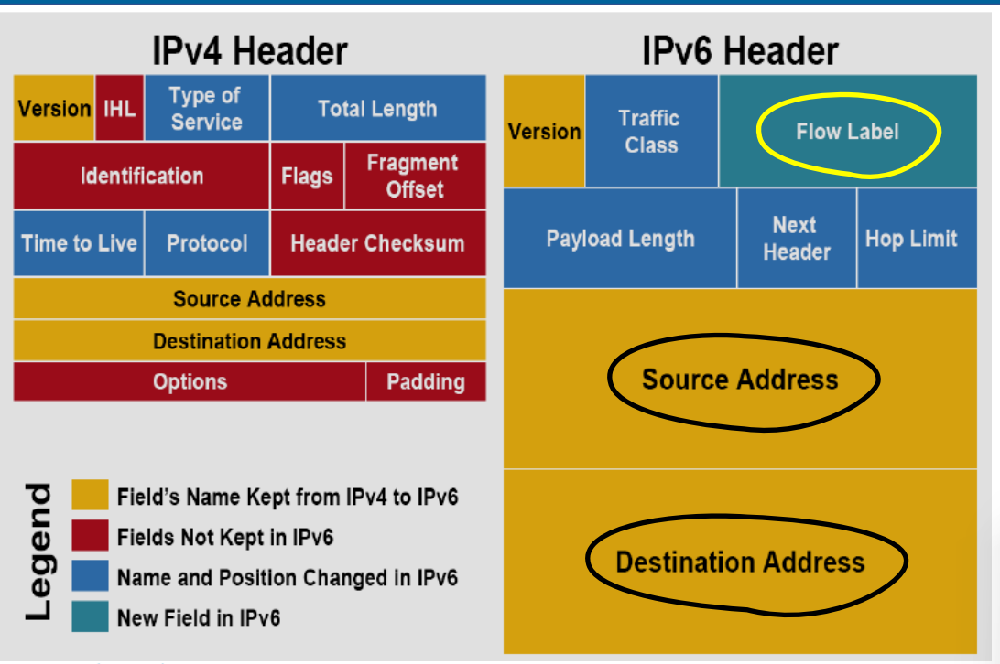

头部8个字段 没有checksum 不允许分片  首部长度不可变

### 5.6.4 Internet 控制协议

The Address Resolution Protocol 地址解析协议

> Host A wants to send a packet to Host B which is in the same LAN with A(in the network layer).
>
> 1. 其实第一步是找到B的ip 地址。因为目标接收方可能是21tongjisse.top这样的名字，所以第一步是找到主机B的IP地址，这个查找过程由域名系统 ***（DNS, Domain Name System ）***完成，
> 2. Host A checks if the IP address in its ARP cache.
> 3. If there is the IP address in its ARP cache,find out the corresponding MAC address,and write to the MAC frame, and then send the MAC frame to destination MAC address through the LAN.
> 4. If not,use destination MAC address FFFF-FF-FF-FF-FF to broadcast the APR request and all the hosts on LAN receive the request.
> 5. Then After receiving the ARP request, host B sends the ARP response packet (unicast delivery) to host A, which contains the mapping relationship between the IP of host B and the MAC address.
> 6. After host A receives the ARP response packet, host A will write the mapping to the ARP cache,and do the Step 2.

Reverse Address Resolution Protocol 逆地址解析协议

网际控制报文协议:**Internet Control Message Protocol** ( ICMP) 

> 为了提高**IP**数据报交付成功的机会，在网络层使用了网际控制报文协议**(Internet** **Control****Message** **Protocol,** **ICMP)**来让主机或路由器报告差错和异常情况。**ICMP**报文作为**IP**层数据报的数据，加上数据报的首部，组成**IP**数据报发送出去** ** **ICMP**是网络层协议。
>
> **ICMP**报文的种类有两种，即**ICMP**差错报告报文    ICMP**询问报文。
>
> **2****）** 源点抑制 当路由器或主机由于拥塞而丢弃数据报时，就向源点发送源点抑制报文，使源点知道应当把数据报的发送速率放慢。
>
> **ICMP**的两个常见应用是分组网间探测**PING**和**Traceroute**
>
> **PING**使用了 **ICMP**回送请求和回答报文。**PING**工作在应用层，它直接使用网络层的**ICMP,**而未使用传输层的**TCP**或**UDP**
>
> **Traceroute/Tracert** 工作在网络层可以用来跟踪分组经过的路由


###  什么是网关？ 

（可以联想下海关？什么是海关？）

连接两个不同的网络的设备都可以叫**网关设备**；网关的作用就是实现两个网络之间进行通讯与控制。

网关设备可以是 交互机（三层及以上才能跨网络）、路由器、启用了路由协议的服务器、代理服务器、防火墙等

**默认网关**

一台主机可以有多个网关。默认网关的意思是一台主机如果找不到可用的网关，就把数据包发给默认指定的网关，由这个网关来处理数据包。现在主机使用的网关，一般指的是默认网关。

**默认网关可以理解为离当前主机最近的路由器的端口地址**，所以是192.168.1.62,而该主机的子网掩码和网关的子网掩码也相同,/27即为255.255.255.224。

# Transport Layer

## 6.1 传输服务

### 6.1.1 提供给上层的服务

为了实现这个目标，传输层需要充分利用网络层提供给它的 服务。在传输层内，完成这项工作的硬件和／或软件称为传输实体〈transport entity ）

- end to end — process to process
- multiplexing and demultiplexing:不同的应用进程使用同一个传输层协议传输数据；接收方能够剥去首部交付给相应的应用进程
- 同时提供TCP和UDP （网络层就不行 要么数据报要么虚电路）
- 差错检测（首部和数据）（网络层IPv4只首部 IPv6不进行检测）

***connectionless***

***User Datagram Protocol (UDP)***

- *Unreliable, unordered, unicast/multicast delivery – “best-effort”, but quick and easy!*

***connection-oriented***

there are also two types of transport service

采用**TCP**时，传输层向上提供的是一条全双工的可靠逻辑信道

可靠就是指 会对数据进行确认

> **TCP**提供面向连接的服务，在传送数据之前必须先建立连接，数据传送结束后要释放连接。
>
> **TCP**不提供广播或组播服务。由于**TCP**提供面向连接的可靠传输服务，因此不可避免地增加了许多开销，如确认、流量控制、计时器及连接管理等。这不仅使协议数据单元的头部增大很多，还要占用许多的处理机资源。因此**TCP**主要适用于可靠性更重要的场合，如文件传输协议**（FTP）**、超文本传输协议**（HTTP）**、远程登录**（TELNET）**等。“

**）**服务器端使用的端口号。它又分为两类，最重要的一类是熟知端口号，数值为**0****〜****1023,****IANA** （互联网地址指派机构）把这些端口号指派给了 **TCP/IP**最重要的一些应用程序， 让所有的用户都知道。另一类称为登记端口号，数值为**1024****〜****49151**。它是供没有熟知端口号的应用程序使用的，使用这类端口号必须在**IANA**登记，以防止重复。 


### 6.1.2 传输服务原语

为了允许用户访问传输服务，传输层必须为应用程序提供一些操作，也就是说，提供一个传输服务接口。每个传输服务都有它自己的接口。

应用层就是代表各类网络过程，应用层对传输层调用，实际上通过网络编程来实现，网络编程接口标准是Socket.在应用程序加soccket编程接口就成为了网络程序。

> 网络编程模型称为客户机/服务器编程模型，用客户机 和服务器分别标识两台远程计算机上运行两个网络程序。
>
> 基于不对称的交互模式，客户机是指主动地发出交互 的应用一方，是数据使用方；服务器是指被动等待交互的 应用另一方，是数据的存储方，服务器端集中存放了需要处理的各类数据。但服务器必须首先运行，等待客户机的访问；客户机后运行，访问服务 。客户机和服务器之间交互的数据也分为请求数据和响应数据两类。请求数据 (Request)是指从客户机发送给服务器的消息，而响应数据(Response)是指由服务器返回客 户机的消息。
>
> 各类网络应用，尽管应用方式和内容有所不同，数据格式也不同，但网络编程原理完全一 样，客户机和服务器利用传输层进行通信，直接同各自的传输层交互，建立通信连接和收发消 息，传输层再调用网际层(IP)协议传输自身的数据包。

### 6.1.3 Berkeley 套接字

现在让我们简要地考查另一组传输原语，即 TCP 所用的套接宇（socket ）原语。作为 Berkeley UNIX4.2 BSD 软件的一部分。套接宇首次发布在 1983 年，这些原语很快得到流行， 现在己被许多操作系统广泛应用于 Internet 程序设计中，尤其是基于 UNIX 的系统， Windows 系统也有一个套接宇风格的 API ，称为“winsock ”。

表中列出的前 个原语由服务器按照顺序执行。 SOCKET 原语创建一个新的端点（ end point ），并且在**传输实体中为它分配相应的表空间?**。此调用的参数说明了采用的地址格式、 所需的服务类型（比如可靠的字节流），以及所用的协议。 soc 调用成功则返回一个普 通的文件描述符，供后续的调用使用， soc 调用与对文件实施的 OPEN 调用工作方式 一样。

## 6.3 拥塞控制

### 无连接服务和面向连接的服务

面向连接服务就是在通信双方进行通信之前，必须先建立连接，在通信过程中，整个连接的情况一直被实时地监控和管理。通信结束后，应该释放这个连接。

可以保证可靠和顺序交付

无连接服务是指两个实体之间的通信不需要先建立好连接，需要通信时，直接将信息发送到“网络”中，让该信息的传递在网上尽力而为地往目的地传送。

不提供流量管理和拥塞控制。

## 可靠和不可靠？

如果一个协议使用确认机制对传输的数据进行确认，那么可以认为它是一个可靠的协议；

如果一个协议采用“尽力而为”的传输方式，那么是不可靠的。

例如，TCP对传输的报文段提供确认，因此是可靠的传输协议；而UDP不提供确认，因此是不可靠的传输协议。

## 6.4 THE INTERNET TRANSPORT PROTOCOLS: UDP

### 6.4.1 Introduction to UDP

用户数据报协议（UDP, User Datagram Protocol ）。 UDP 为应用程序提供了一种无需建立连接就可发送封装的 IP 数据报的方法。

只在IP上加入 **复用分用，差错检测**。

**UDP**的首部格式：8B

**UDP**数据报包含两部分：**UDP**首部和用户数据。**UDP**首部有**8B,\**由\**4**个字段组成，每个字段的长度都是**2B,\**如图\**5.2**所示。各字段意义如下：

**1）** 源端口。源端口号。在需要对方回信时选用，不需要时可用全**0**。

**2）** 目的端口。目的端口号。这在终点交付报文时必须使用到。

**3）** 长度。**UDP**数据报的长度'（包括首部和数据），其最小值是**8** （仅有首部）。

**4）** 校验和。检测**UDP**数据报在传输中是否有错。有错就丢弃。该字段是可选的，当源主机不想计算校验和时，则直接令该字段为全**0**。


UDP的交付

**UDP**不保证可靠交付，但这并不意味着应用对数据的要求是不可靠的，所有维护可靠性的工作可由用户在***应用层***来完成。应用开发者可根据应用的需求来灵活设计自己的可靠性机制。

**UDP**是面向报文的。发送方**UDP**对应用层交下来的报文，在添加首部后就向下交付给**IP**层，一次发送一个报文，既不合并，也不拆分，而是保留这些报文的边界；接收方**UDP**对**IP**层交上来**UDP**数据报，在去除首部后就原封不动地交付给上层应用进程，一次交付一个完整的报文。

因此报文不可分割，是**UDP**数据报处理的最小单位。因此，应用程序必须选择合适大小的报文，若报文太长，**UDP**把它交给**IP**层后，可能会导致分片；若报文太短，**UDP**把它交给**IP**层后，会使**IP**数据报的首部的相对长度太大，两者都会降低**IP**层的效率。

 

UDP的校验和（上课也没讲，我自己了解下）

在**UDP**数据报之前增加**12B**的伪首部。

但UDP的校验和则检查***首部和数据***部分。

Before the UDP datagram, add a pseudo header of 12 bytes.

However, the UDP checksum only checks the header and data sections.


### **6.5 THE INTERNET TRANSPORT PROTOCOLS: TCP**

### 6.5.1 Introduction to TCP

**TCP** (**Transmission Control Protocol**) was specifically designed to provide a reliable end-to-end byte stream over an unreliable internetwork.

****\*TCP Features：Connection-oriented, duplex, reliable byte-stream service with flow control\*****

## 6.5.2 TCP 服务模型

TCP 服务由发送端和接收端创建一种称为套接字（ socket ）的端点来获得，正如我们 6.1.3 节中所讨论的那样。每个套接字有一个套接字编号（地址），该编号由主机的 IP 址以及一个本地主机的 **16 位数值**组成的。这个 16 位数值称为端口（port ），端口是 TCP TSAP 名字。

同一台计算机**TCP**和**UDP**分别拥有自己的端口号，它们互不干扰

Service Access Point.


### 6.5.4 TCP 段的头 Header Field：20B（5*4B）


TCP传送的data unit 称为报文段 segment。TCP报文段既可以用来运载数据，又可以用来建立连接、 释放连接和应答。

一个TCP报文段分为首部和数据两部分，整个TCP报文段作为IP数据报的数据部分封装在IP数据报中，如图5.6所示。其首部的前20B是固定的。TCP首部最短为20B,后面有4N字节是根据需要而增加的选项，长度为4B的整数倍。

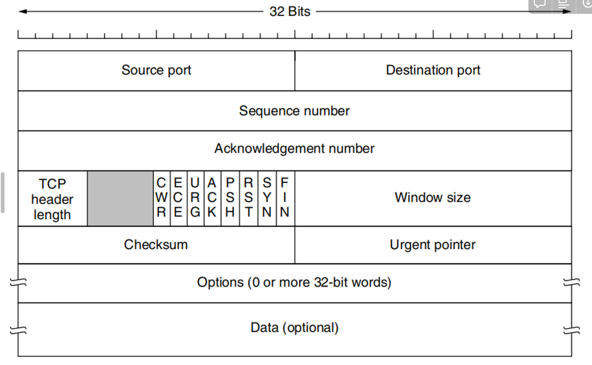

> 1） 源端口和目的端口。各占2B。端口是传输层与应用层的服务接口，传输层的复用和分用功能都要通过端口实现。
>
> 2_序号。占4B,范围为0〜2^32- 1,共2^32个序号。**tcp**是面向字节流的（即TCP传送时是逐个字节传送的），所以TCP连接传送的字节流中的每个字节都按顺序编号。序号字段的值指的是本报文段所发送的数据的第一个字节的序号。
>
> 例如，一报文段的序号字段值是301,而携带的数据共有100B,表明本报文段的数据的最后1个字节的序号是400,因此下一个报文段的数据序号应从401开始。
>
> 3） 确认号ack。占4B,是期望收到对方下一个报文段的第一个数据字节的序号。若确认号为N, 则表明到序号N-1为止的所有数据都己正确收到。 例如，B正确收到了 A发送过来的一个报文段，其序号字段是501,而数据长度是200B （序 号501〜700）,这表明B正确收到了 A发送的到序号700为止的数据。因此B期望收到A的下一个数据序号是701,于是B在发送给A的确认报文段中把确认号置为701。
>
> 4)首部长度）。占4位，这里不是IP数据报分片的那个数据偏移，而是表示首部长度（首部中还有长度不确定的选项字段），它指出TCP报文段的数据起始处距离TCP报文段的起始处有多远。“数据偏移”的单位是32位（以4B为计算单位）。由于4位二进制数能表示的最大值为15,因此TCP首部的最大长度为60B
>
> **6）** 紧急位**URG**。当**URG= 1**时，表明紧急指针字段有效。它告诉系统此报文段中有紧急数据，应尽快传送（相当于高优先级的数据）。但**URG**需要和首部中紧急指针字段配合使
>
> 用，即数据从第一个字节到紧急指针所指字节就是紧急数据。
>
> **7）** 确认位**ACK**。仅当**ACK= 1**时确认号字段才有效。当**ACK = 0**时，确认号无效。
>
> **TCP**规定，在连接建立后所有传送的报文段都必须把**ACK**置**1**。
>
> **8）** 推送位**PSH （Push）o**接收方**TCP**收到**PSH= 1**的报文段，就尽快地交付给接收应用进程,
>
> 而不再等到整个缓存都填满了后再向上交付。
>
> **9）** 复位位**RST （Reset）o**当**RST=1**时，表明**TCP**连接中出现严重差错（如主机崩溃或其他原因），必须释放连接，然后再重新建立运输连接。
>
> **10）** 同步位**SYN**。当**SYN= 1**时表示这是一个**连接请求或连接接受**报文。
>
> 当**SYN=1, ACK = 0**时，表明这是一个连接请求报文，对方若同意建立连接，则应在响应报文中使用**SYN=1, ACK=1**
>
> **11）** 终止位**FIN （Finish）o**用来释放一个连接。当**FIN= 1**时，表明此报文段的发送方的数据已发送完毕，并要求释放运输连接。
>
> **12）** 窗口。占**2B,\**范围为\**0〜2^16**一**1**。它指出现在允许对方发送的数据量，接收方的数据缓存空间是有限的，因此用窗口值作为接收方让发送方设置其发送窗口的依据。
>
> 例如，设确认号是**701,\**窗口字段是\**1000**。这表明，从**701**号算起，发送此报文段的一方还有接收**1000**字节数据（字节序号为**701〜1700）**的接收缓存空间。
>
> **13）** 校验和。占**2Bo**校验和字段检验的范围包括首部和数据两部分。在计算校验和时，和**UDP**一样，要在**TCP**报文段的前面加上**12B**的伪首部（只需将**UDP**伪首部的协议字段的**17**改成**6, UDP**长度字段改成**TCP**长度，其他的和**UDP** 一样）。
>
> **14）** 紧急指针。占**2B**。紧急指针仅在**URG = 1**时才有意义，它指出在本报文段中紧急数据共有多少字节（紧急数据在报文段数据的最前面）。
>
> 15） 可选项只规定了一种 MSS（maxinum segment size）,TCP报文段中的数据字段的最大长度。

### timestep

timestep is a option in the TCP header file. the format is :

```scss
kind(1 字节) + length(1 字节) + info(8 个字节)
```

其中 kind = 8， length = 10， info 有两部分构成: **timestamp**和**timestamp echo**，各占 4 个字节。

那么这些字段都是干嘛的呢？它们用来解决那些问题？

接下来我们就来一一梳理，TCP 的时间戳主要解决两大问题:

- 计算往返时延 RTT(Round-Trip Time)
- 防止序列号的回绕问题

### **计算往返时延 RTT**

在没有时间戳的时候，计算 RTT 会遇到的问题如下图所示:

 

如果以第一次发包为开始时间的话，就会出现左图的问题，RTT 明显偏大，开始时间应该采用第二次的；

如果以第二次发包为开始时间的话，就会导致右图的问题，RTT 明显偏小，开始时间应该采用第一次发包的。

实际上无论开始时间以第一次发包还是第二次发包为准，都是不准确的。

那这个时候引入时间戳就很好的解决了这个问题。

比如现在 a 向 b 发送一个报文 s1，b 向 a 回复一个含 ACK 的报文 s2 那么：

- **step 1:** a 向 b 发送的时候，`timestamp` 中存放的内容就是 a 主机发送时的内核时刻 `ta1`。
- **step 2:** b 向 a 回复 s2 报文的时候，`timestamp` 中存放的是 b 主机的时刻 `tb`, `timestamp echo`字段为从 s1 报文中解析出来的 ta1。
- **step 3:** a 收到 b 的 s2 报文之后，此时 a 主机的内核时刻是 ta2, 而在 s2 报文中的 timestamp echo 选项中可以得到 `ta1`, 也就是 s2 对应的报文最初的发送时刻。然后直接采用 ta2 - ta1 就得到了 RTT 的值。

## 6.5.5 TCP 连接建立 establishment of a **TCP** connection

The establishment of a **TCP** connection follows the client/server model. The application process that initiates the connection is called the client, while the application process that passively waits for the connection to be established is called the server. ****

normal

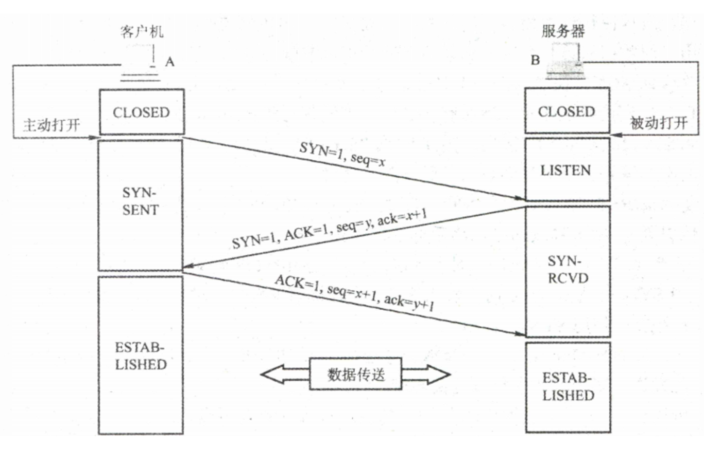

第一次握手：不能携带数据 消耗一个序号

第二次握手：不能携带数据 消耗一个序号

第二次握手：可以携带数据 不消耗序号了

## 6.5.6 TCP 连接释放

> 虽然 TCP 连接是全双工的，但是，为了理解 TCP 连接是如何释放的，最好将 TCP接看成一对单工连接。每个单工连接的释放彼此独立。
>
> 为了释放一个连接，任何一方都可以发送一个设置了 FIN 标志位的 TCP 段，这表示它己经没有数据要发送了。
>
> 当 FIN 段被另一方确认后，这个方向上的连接就被关闭，不再发送任何数据。然而，另一个方向上或许还在继续着无限的数据流。当两个方向都关闭后，连接才算被彻底释放。通常情况下，释 放一个连接需要 TCP 段：每个方向上一个 FIN 和一个 ACK。然而，第一个 ACK 和第二个 FIN 有可能被组合在同一个段中，从而将所需段总数降低到3个。 
>
> 时间等待计时器：等待2MSL 两个最长报文段寿命
>
> 正如在电话通话过程中，双方说完再见之后同时挂断电话一样，一个 TCP 连接的两端也可能会同时发送 FIN 段。这两个段按常规的方法被单独确认，然后关闭连接。实际上，两台主机可以先后释放连接，或者同时释放连接，这两者之间并没有本质的区别。

 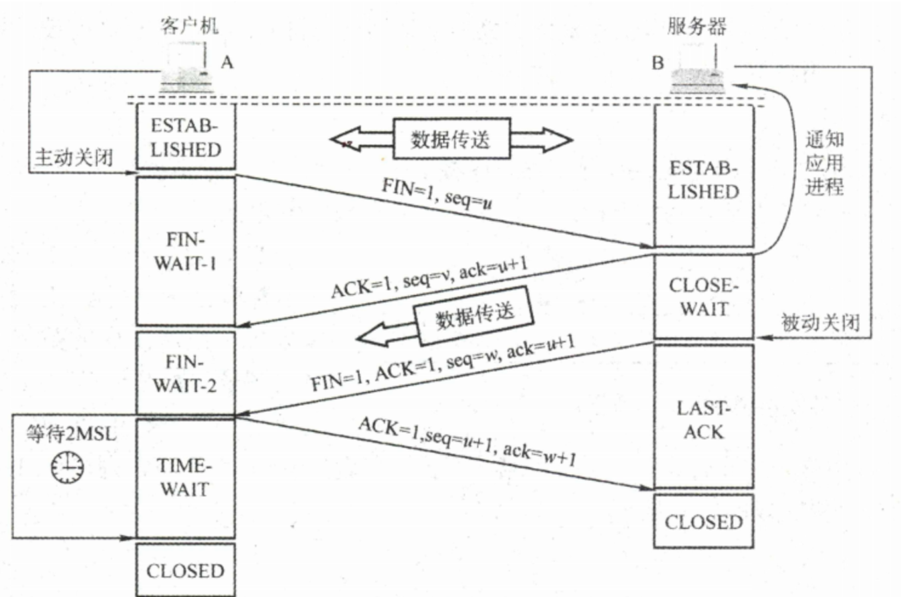


## 6.5.8 TCP 滑动窗口 sliding window 这是flow control 

window management in TCP decouples the issues of acknowledgement of the correct receipt of segments and receiver buffer allocation.

窗口过大 会由于传送的数据过多让路由器变的拥挤 

窗口过小ACK会很多

## **6.5.9 TCP Timer Management**

**Timeout**

the timer goes off before the acknowledgement comes in, the segment is retransmitted.

**RTO** (**Retransmission TimeOut**).

SRTT C Smoothed Round-Trip Time ，平滑的往返时间〉，它代表到达接收方往返时间的当前最佳估计值。

SRTT = αSRTT + (1-α)SRTT 

改进：跟踪另一个平滑变量， RTTVAR 往返时间变化， Round-Trip Time VARiation ），即更新为下列公式：

RTTVAR ＝$\beta$ RTTVAR + (1- $\beta$）|SRTT- R |

RTO = SRTT + 4 x RTTV AR

这就像以前的 EWMA，典型地，~＝ 3 *I* 4. 因此，重传超时值， RTO

RTO = SRTT + 4 x RTTV AR 

### 6.5.10 TCP Congestion Control：单位是B。增加和减少的东西是MSS

发送方在确定发送报文段的速率时，既要根据接收方的接收能力，又要从全局考虑不要使网络发生拥塞。因此，TCP协议要求**发送方**维护以下两个窗口： 1） 接收窗口 rwnd, **Receiver Window** 接收方根据目前接收缓存大小所许诺的最新窗口值，反映接收方的容量。 由接收方根据其放在**TCP报文的首部的窗口字段**通知发送方。 2） 拥塞窗口 cwnd, **congestion** **Window**发送方根据自己估算的网络拥塞程度而设置的窗口值，反映网络的当前容量。只要网络未出现拥塞，拥塞窗口就再增大一些，以便把更多的分组发送出去。但 只要网络出现拥塞，拥塞窗口就减小一些，以减少注入网络的分组数。 发送窗口的上限值应取接收窗口 rwnd和拥塞窗口 cwnd中较小的一个，

发送窗口的上限值=min[rwnd, cwnd]

 慢开始和拥塞避免   two phases    Slow Start   *Congestion Avoidance*

**Connection just established, set cwnd = 1 MSS**

慢开始：cwnd 一开始是1 后来指数增加。  ***ssthresh***

拥塞避免：每经过一个往返时延RTT就把发送方的拥塞窗口 cwnd加1

 **Increase window size by 1 MSS for each new ACK received**

网络拥塞的处理：无论在慢开始阶段还是在拥塞避免阶段，只要发送方判断网络出现拥塞（未按时收到确认）， **就要把慢开始门限ssthresh设置为出现拥塞时的发送方的cwnd值的一半（但不能小于2）**。然后把拥塞窗口 cwnd重新设置为1,执行慢开始算法。这样做的目的是迅速减少主机发送到网络中的分组数，使得发生拥塞的路由器有足够时间把队列中积压的分组处理完。

这是TCP Reno的做法。Tahoe没有3 duplicated ACKs

***快重传和快恢复 ***     Fast Retransmit        *Fast Recovery*

快重传：快重传技术使用了冗余ACK来检测丢包的发生。同样，冗余ACK也用于网络拥塞的检测。

当发送方连续收到三个重复的ACK报文时，直接重传对方尚未收到的报文段，而不必等待 那个报文段设置的重传计时器超时。（先）

快恢复：

当发送方连续收到三个重复的ACK报文时，就要把慢开始门限ssthresh设置为出现拥塞时的发送方的cwnd值的一半。 cwnd也为该值。


for experiment

主动队列管理AQM

1998年提出了主动队列管理AQM (Active Queue Management)。

所谓“主动”就是不要等到路由器的队列长度已经达到最大值时才不得不丢弃后面到达的分组。这样就太被动了。应当在队列长度达到某个值得警惕的 数值时（即当网络拥塞有了某些拥塞征兆时），就主动丢弃到达的分组。提醒发送方放慢发送速率， 会有可能减轻网络拥塞甚至不出现拥塞。

AQM 可以有不同实现方法，其中曾流行多年的就是随机早期检测RED (Random Early Detection)。

# 自治系统 Autonomous System

### Two types of internet router protocols

Interior gateway protocols

exterior gateway protocols

RIP  Routing Information Protocol  

interior gateway protocols

 OSFP

# Application Layer

## 7.1 DNS——Domain Name System

DNS系统采用客户/服务器模型，其协议运行在UDP之上，使用53号端口。

*Caches name server answers for better performances*

从概念上可将DNS分为3部分： **Hierarchy**  *DNS Name Space*、域名服务器和解析器。

（Top Level Domain, TLD (1)nTLD  (2)gTLD  (3) arpa


### 7.1.2 *Domain Resource Records*

Domain name 

Time to live

Class   对于 Internet 信息，它总是 IN

Type 

Value 

### 7.1.3 域名服务器 domain name server

**holds data of the name space**

**Resolution****: finding the IP address for a given hostname**：

• *Computer requests local name server to resolve.*

• *Local name server asks the root name server.*

• *Root returns the name server for a lower zone.*

• *Continue down zones until a name server can answer.*

## 7.2  电子邮件**Simple Mail Transfer Protocol** **SMTP **

***Works on TCP***

*A set of communication rules between*  **Mail Transfer Agents (MTA)**

- **User Agent (UA)***: Outlook, Mozilla…*，一个软件

  *the interface of a typical user agent**

- *Message Transfer (between MTAs)*

## 7.3  万维网（World Wide Web· ）

它是一个体系结构框架

万维网（WorldWideWeb, WWW）是一个分布式、联机式的信息存储空间，在这个空间中： 一样有用的事物称为一样“资源”，并由一个全域“统一资源定位符”（URL  Uniform Resource Locators & Hyperlinks ）标识。这些资源通过超文本传输协议（HTTP）传送给使用者，而后者通过单击链接来获取资源。 

*Server/Client Steps (web browsing)*

万维网以客户/服务器方式工作。浏览器是在用户主机上的万维网客户程序，而万维网文档所驻留的主机则运行服务器程序，这台主机称为万维网服务器。客户程序向服务器程序发出请求， 

服务器程序向客户程序送回客户所要的万维网文档。工作流程如下：

1） Web用户使用浏览器（指定URL）与Web服务器建立连接，并发送浏览请求。

V协议〉://<主机 >:<端口> /<路径＞。

2） Web服务器把URL转换为文件路径，并返回信息给Web浏览器。

3） 通信完成，关闭连接。 

万维网是无数个网络站点和网页的集合，它们在一起构成了因特网最主要的部分（因特网也包括电子邮件、Usenet和新闻组）。

超文本传输协议 （ HTTP ） ，它规定了在浏览器和服务器之间的请求和响应的格式与规则，是万维网上能够可靠地交换文件（包括文本、声音、图像等各种多媒体文件）的重要基础。

HTTP： **TCP 连接！！**

Cookie的工作原理：当用户浏览某个使用Cookie的网站时，该网站服务器就为用户产生

> 一个唯一的识别码，如“123456”，接着在给用户的响应报文中添加一个Set-cookie的首部行“Setcookie: 123456"o用户收到响应后，就在它管理的特定Cookie文件中添加这个服务器的主机名和Cookie识别码，当用户继续浏览这个网站时，会取出这个网站的识别码，并放入请求报文的Cookie首部行“Cookie: 123456”。服务器根据请求报文中的Cookie识别码就能从数据库中查询到该用户的活动记录，进而执行一些个性化的工作，如根据用户的历史浏览记录向其推荐新产品等。


• *Encoding of audio and video*

• *Streaming stored media*

• *Streaming live media*

• *Real-time conferencing*


• *Addressing: DNS, DHCP*

• *Web: URL, HTTP*

• *Streaming: RTP, RTSP*

• *File transfer: FTP*

• *Routing: BGP, OSPF, RIP*

• *Network Management: SNMP*

• *Email: SMTP, IMAP, POP*

• *Conferencing: H.323, SIP*

Addressing:

1. **DNS (Domain Name System)**:
   - **意义**: 将域名转换为IP地址，让用户能够访问使用人类可读名称的网站。
   - **传输层**: 主要使用UDP，但在响应数据较大或需要可靠性时会使用TCP。
2. **DHCP (Dynamic Host Configuration Protocol)**:
   - **意义**: 自动分配IP地址给网络中的设备，以及配置其他网络信息，如子网掩码和默认网关。
   - **传输层**: 主要使用UDP。

Web:

1. **URL (Uniform Resource Locator)**:
   - **意义**: 网络资源的地址，用于定位互联网上的资源，如网页。
   - **传输层**: 依赖于所使用的协议，通常是HTTP或HTTPS，后者通过TCP传输。
2. **HTTP (Hypertext Transfer Protocol)**:
   - **意义**: 用于在互联网上传输网页的协议。
   - **传输层**: 使用TCP。

Streaming:

1. **RTP (Real-time Transport Protocol)**:
   - **意义**: 用于传输实时音频和视频数据。
   - **传输层**: 通常使用UDP，因为它需要快速传输且可以容忍一定的丢失。
2. **RTSP (Real Time Streaming Protocol)**:
   - **意义**: 控制流媒体服务器，用户可以在不下载整个视频的情况下进行播放、暂停等操作。
   - **传输层**: 通常使用TCP。

File transfer:

1. FTP (File Transfer Protocol):
   - **意义**: 用于在网络上的计算机之间传输文件。
   - **传输层**: 使用TCP。

Routing:

1. **BGP (Border Gateway Protocol)**:
   - **意义**: 用于路由和传达网间可达性信息的协议，是互联网上主要的路由协议。
   - **传输层**: 使用TCP。
2. **OSPF (Open Shortest Path First)**:
   - **意义**: 一种内部网关协议，用于在单个自治系统内部进行路由选择。
   - **传输层**: 直接在IP之上，不使用TCP或UDP。
3. **RIP (Routing Information Protocol)**:
   - **意义**: 一种较老且简单的内部网关路由协议。
   - **传输层**: 主要使用UDP。

Network Management:

1. SNMP (Simple Network Management Protocol):应用层
   - **意义**: 用于网络管理的协议，可以监控网络设备。
   - **传输层**: 主要使用UDP。

Email:

1. **SMTP (Simple Mail Transfer Protocol)**:
   - **意义**: 发送电子邮件的协议。
   - **传输层**: 使用TCP。
2. **IMAP (Internet Message Access Protocol)**:
   - **意义**: 用于从邮件服务器检索电子邮件的协议。
   - **传输层**: 使用TCP。
3. **POP (Post Office Protocol)**:
   - **意义**: 另一种用于从邮件服务器检索电子邮件的协议。
   - **传输层**: 使用TCP。

Conferencing:

1. **H.323**:
   - **意义**: 用于语音、视频和数据通信的一组多媒体协议。
   - **传输层**: 使用TCP和UDP。
2. **SIP (Session Initiation Protocol)**:
   - **意义**: 创建、修改和终止会话（如视频和语音通话）的信号协议。
   - **传输层**: 主要使用UDP，但也可以使用TCP。

# Security

• *Crypto: symmetric key,* *public key*

 symmetric key,**Only the sender and the intended receiver understands the message.* **Use the same key for encryption and decryption**对称密钥加密是一种加密方法，其中加密和解密都使用相同的密钥。数据的发送方和接收方必须共享这个密钥才能进行安全通信。

*Public Key Cryptography*:在非对称加密中，公钥是可以公开的密钥，任何人都可以用它来加密信息，但只有持有对应私钥的接收方能解密。

• *Authentication: to prevent playback attacks, man-in-the-middle attack*
	     • *KDC *    *Key Distribution Center*

​	     • *CA* *Certification Authorities*  *binds public key to a particular entity E.*

• *Message Integrity:Authentivation with Digital signature*:数字签名

• *Access/Availability: Firewall*

• **Firewall** *isolates an organization’s internal network from the Internet,* 

*allowing some packets to pass, while blocking others.*

​		• *Prevent Denial of Service (DoS) attacks, e.g. SYN flooding.*

​		• *Prevent illegal modifications/access to internal data.*

​		• *Allow only authorized access to the internal network*

• **Three Types of Firewalls**

​		• *Stateless Packet Filtering (packet by packet)*

​		• *Stateful Packet Filtering (monitoring connections)*

​		• *Application Gateways*