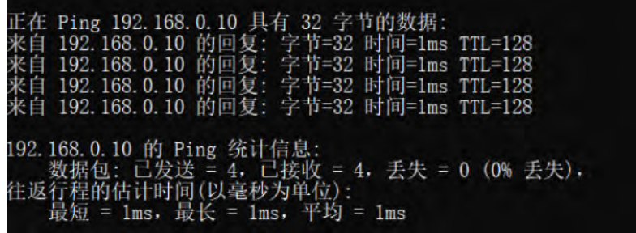
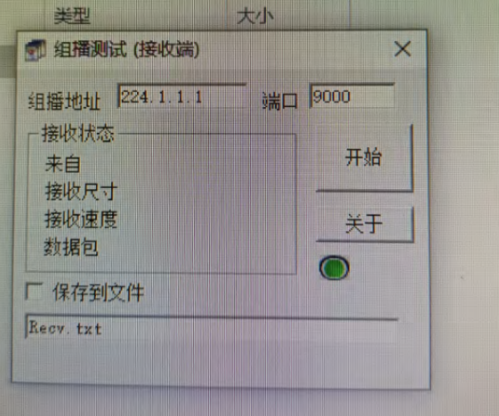
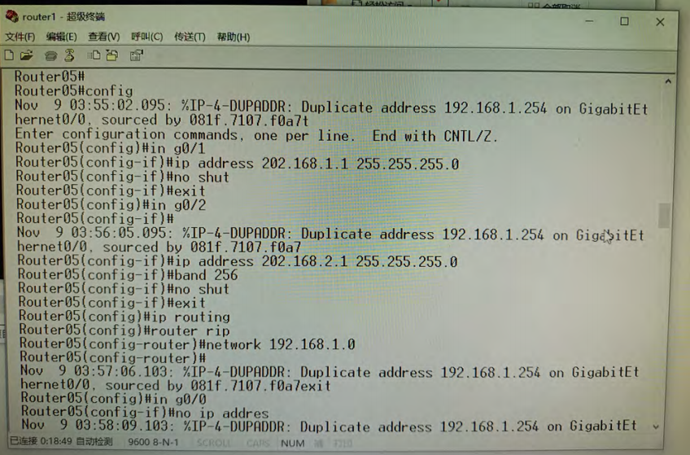
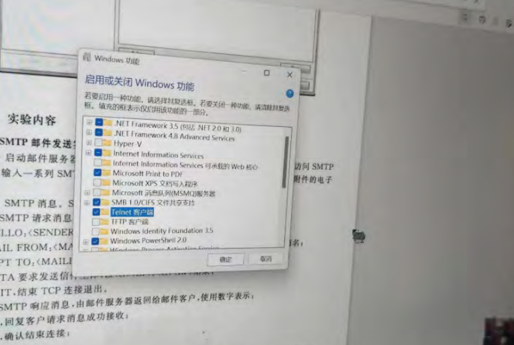
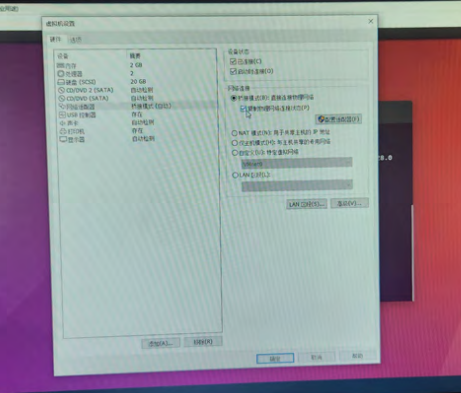
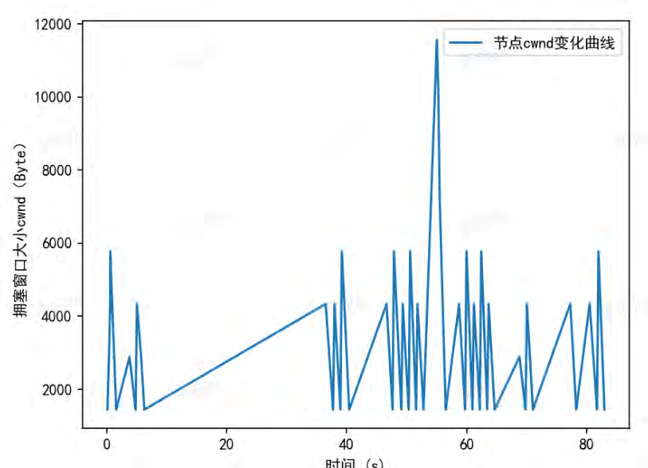

[TOC]

# 计算机网络实验报告

## 一、计算机网络基础知识实验

## 1 进程运行原理实验

### 实验目的

计算机网络交互主体是计算机进程,了解进程运行的基本原理，对于理解端与进程关系十分重要。本实验利用操作系统的进程管理软件来展示进程的生命周期。

（1）了解进程的基本概念。

（2）了解进程的基本运行原理,掌握基本进程管理技能

### 实验原理

计算机程序是指用计算机语言开发的代码文件,一般需要编译成可执行代码。程序以文件方式存储在操作系统的文件系统中。进程指程序装载到内存中进行运行的代码段。

现代操作系统可以对进程实施管理。

（1）进程创建。程序一旦运行就成为进程,每个进程都分配一个唯一的进程编号,但其进程编号并不固定。

（2）进程运行。现代操作系统允许同时运行多个进程,每个进程运行时需要使用多种计算机部件资源,其中CPU资源必不可少,当CPU核数量小于并发进程数量时,操作系统会对CPU实施共享,将CPU运行时间划分为多个时间片，分配给各个进程提供运行，使所有进程都能同时运行,进程的并发运行并不是直正意义上的并发。

（3）进程终止。一般通过程序提供的退出按钮终止进程,也可以通过进程管理命令或软件结束进程。

### 实验环境与设备

实验由一台安装 Windows 10企业版操作系统的计算机担当,使用其任务管理器软件实施进程管理实验,也可以使用其他操作系统作为操作平台。

### 实验内容 

实验将围绕进程的管理内容展开,使用任务管理器软件进行进程管理,通过鼠标进行操作,从屏幕观看操作结果。

（1）多次运行同一个特定应用程序,看到该程序可以以多个不同的进程同时运行,每次运行,进程号会不一样。

（2）通过应用程序界面关闭程序,看到其进程被结束。

（3）通过任务管理器关闭进程,终止应用程序的运行。

### 实验步骤

1.打开任务管理器。同时按“Ctrl"+“Alt”+"Delete”→“任务管理器”→“详细信息”，

显示进程运行状态信息。

右边第一列是程序名，第二列PID列出的就是当前所有已运行程序的进程号，没有看到命令行窗口程序（cmd）进程。


2.产生两个命令行窗口新进程。

（1）打开两个命令行窗口。连续两次执行命令行窗口程序。


（2）查看命令行窗口程序的进程信息。切换到任务管理器窗口。

可以看到任务管理器窗口中新增了两行命令行程序“cmd.exe”进程信息，其进程号分别为46568和42480


3.通过应用程序界面关闭进程。

（1）关闭一个命令行窗口程序

点击窗口关闭标签。

（2）查看命令行窗口程序的进程消息。切换到任务管理器。

可以看到进程号为46568的命令行窗口进程消失。

（3）通过任务管理器关闭进程。

右击42480号进程->”结束进程”，余下命令行窗口将被关闭。

### 实验总结与心得

这次进程管理实验让我对进程有了更深入的了解。通过实验我了解到,进程是已经加载到内存中正在运行的程序,每个进程都有一个唯一的进程号。

在实验中,我学习到了几种管理进程的方法:

1. 通过打开多个应用程序实例,可以产生多个进程。这些进程运行着相同的程序,但有不同的进程号。

2. 通过应用程序的退出菜单可以终止一个进程。这就是通过应用程序接口关闭一个进程。

3. 通过任务管理器可以查看所有的进程信息,并可以选择终止某个进程。这就是强制停止一个进程。

本实验主要了解了进程这一概念，学会了如何在windows操作系统上查看、关闭对应进程，属于计算机网络实验中的基础，同时也能在现实生活中加以运用，需要掌握。从应用层的角度来说，这是用户与网络交互的最高层面，对整个计算机网络的学习有高屋建瓴的作用。

## 2 网络端地址实验

### 实验目的

网络端地址用于标识计算机网络进程,网络进程是计算机网络传输主体,由于语言表达上同题,容易误将计算机作为计算机网络的传输主体。明确了网络传输主体,就容易理解计算机网络各项具体功能处理的基本原理。本实验利用浏览器上网这个最为熟悉的应用,呈现网络端地址作用。

1.明确计算机网络交互的主体是进程。计算机网络两台计算机之间的交互,实质上是两个进程之间的交互。

2.了解网络端地址构成及使用。端地址是用于标识网络上任意一台计算机上的任意一个网络进程,具有唯一性和不变性,只有通过访问网络端地址才能通过网络同该进程交互。但在日常使用应用协议时，常常忽略端口地址,自动采用该应用协议缺省端口地址作为网络端地址。

### 实验原理

计算机网络正如其名字所揭示的一样,就是用于计算机之间的交互,但只是宽泛的表述现代计算机中真正执行主体实际上是各个进程。所谓两台计算机交互,按照计算机网络通信交互模型,必然是某两个进程之间的交互。网络进程的识别是通过网络端地址来实施。

端地址格式如下:

IP:PORT

用于标识互联网任意一个节点上的任意一个网络进程,IP 指主机 IP 地址,也可以使用:名,域名会被域名系统自动转换成 IP 地址;PORT 指该进程的网络端口号,进程运行时会被注册并建立与进程号的映射关系,通过端口号,可以访问到对应进程,进行网络交互。

### 实验环境与设备

实验环境由一台计算机来担当实验设备,计算机必须连接互联网。使用浏览器访问互联网任意一个网站, 其目标网站的端地址为“www.×××.com: 80”，“×××”代表任意域名。


### 实验内容

任何开放的互联网 Web 网站按照业界习惯,都使用 80 端口地址作为 HTTP 协议的端地址。浏览器地址栏支持端地址使用,当没有输入端口时,就会自动采用应用协议的缺省端地址,HTTP 协议的缺省端地址是 80。实验使用 Chrome 浏览器访问互联网上任意一个网站,通过设置网络端地址,来验证其作用。

主要实验内容: 

1.端地址设置成 81 端口时,浏览器无法浏览网页。

2.端地址设置成 80 端口时,浏览器可以正常浏览网页。

### 实验步骤

启动浏览器,通过访问同一个网址的不同端口,实验中使用了同济大学官网,实际可使用任何一个网址。

1.访问非80端口。地址栏中输入“http://www.tongji.edu.cn:81”

若浏览器显示无法获得该 URL 地址网页，Web 服务器端口 地址不是 81。

2.访问80端口，在地址栏中输入“http://www.tongji.edu.cn:80”

浏览器能正常显示网站主页内容。


### 实验总结与心得

本次实验中主要进行了对于网络端地址的理解，验证了进程运行时会被注册并建立与进程号的映射关系,只有通过对应的端口号,可以访问到对应进程,进行网络交互。明确了网络的传输主题。 同时，我进一步了解了网站响应的原理：我们尝试访问同一个网站,但使用了不同的端口号。当使用非标准端口81时,无法访问网站,说明这个端口没有进程在监听。当使用标准HTTP端口80时,网站可以正常访问,说明有进程在这个端口监听,可以响应并交互。

此次实验强调了端口的概念，是网络交互的基础，让我更加明确了明确计算机网络交互的主体是进程。计算机网络两台计算机之间的交互,实质上是两个进程之间的交互。

## 三、物理网络实验

## 3 网络线的制作和测试实验

### 实验目的

学会利用TJ45水晶头和五类双绞线制作以太网直通线，并能够使用网络电缆测试仪对该以太网直通线功能进行测试。

### 实验原理

**在接通时主要是掌握两种接通方法，其一是直通线接法，该接法中：**

端1 白橙 橙 白绿 蓝 白蓝 绿 白棕 棕 

端2 白橙 橙 白绿 蓝 白蓝 绿 白棕 棕

**其二是交叉线接法，该接法中：**

端1 白橙 橙 白绿 蓝 白蓝 绿 白棕 棕 

端2 白绿 绿 白橙 蓝 白蓝 橙 白棕 棕

### 实验环境与设备

实验材料：

两个TJ45水晶头、一段五类双绞线、压线钳、网络电缆测试仪。

### 实验内容

学会利用TJ45水晶头和五类双绞线制作以太网直通线，并能够使用网络电缆测试仪对该以太网直通线功能进行测试。

### 实验步骤

1.准备所需工具和材料。

2.剥线：利用斜口剪切下所需的双绞线长度，然后用剥线刀口将外皮剥去2-3厘米。

3.拨线：将双绞线按颜色分组并拨正。

4.按照T568A或T568B的线序排列双绞线。

5.剪断多余的双绞线。

6.将双绞线一端插入RJ-45水晶头。

7.使用压线钳压紧RJ-45水晶头，确保每根线都与接头内的铜片接触。

8.重复上述步骤为双绞线的另一端安装RJ-45水晶头。

9.使用通断仪进行测试，观察通断仪的指示灯，从1-1到8-8依次亮起。

### 实验总结与心得

这次以太网直通线的制作与测试实验,让我对计算机网络在物理世界的连接有了更直观的感受，了解到完成网络的通信不止需要了解程序的设计，更有兼顾硬件的知识和实践的能力。

## 6 虚拟无线隐藏节点实验

### 实验目的

对无线网络的传输机制有一个直观的了解，加深对CSMA/CA协议的理解。该实验项目，允许学生可以随意调整节点的位置，并通过分析实验产生数据结果，来获得最终的实验结论。可以培养学生的初步的观察力和分析能力，形成最基本的研究能力。

### 实验原理

无线局域网络Wireless LANs，简称Wi-Fi，标准版本号是802.11，从此版本又发展了多个子版本，比如熟知的802.11g。但其传输机制是完全一致，所有节点都采用了同频率载波，采用了Carrier Sense On Multi-Access/ Collision Avoid (CSMA/CA)，即多路存取载波监听/避免碰撞机制，类似总线的共享发送模式，即任意时刻只有一个节点才能发送。

多路存取载波监听机制，根据监听通道传输状态以决定是否可以发送。

1、当节点需要发送数据时，进行载波监听。载波是网络上的传输信号。

2、如果节点在网络上监听到载波，说明其他节点在发送，那只能耐心等待，返回1。

3、如果没有监听到载波，就能直接往网上发送帧，用不着通知其他节点。这是没有节点在传输数据。

多路存取载波监听机制建立在所有节点都能监听其他任意节点的载波基础上，但在无线网络中，由于其可移动性，会发生隐藏节点问题。

隐藏节点是指在接收节点的覆盖范围内而在发送节点的覆盖范围外的节点。由于听不到发送节点的发送，隐藏节点可能向相同的接收节点发送分组，导致分组在接收节点处冲突。隐藏节点可以分为隐发送节点和隐接收节点。如下图所示。

A和C就互为隐藏节点。节点A和C同时想发送数据给节点B，但A和C都不在对方的传送范围内。所以当A发送数据给B时，C并未检测到A也在发送数据，会认为目前网络中无数据传送，会将数据发送给B。这样，A和C同时将数据发送给B，使得数据在B处产生冲突，最终导致发送的数据不可用。这种因传送距离而发生误判的问题称为隐藏节点问题。

解决隐藏节点的思路是使接收节点周围的邻居节点都能了解到正在进行的传输。RTS/CTS方式是解决隐藏节点问题的主要方法之一，发送节点在数据发送前与接收节点进行一次短控制消息握手交换，请求发送(Request to Send，RTS)和清除发送(Clear to Send，CTS)的控制信息来避免冲突。其握手过程如图所示。

  

发送方发出数据前，先送出一个RTS包，告知在传送范围内的所有节点不要有任何传送操作。如果接收方目前空闲，则响应一个CTS包，告诉发送方可开始发送数据，此CTS包就会告知所有在接收方信号传输范围内的其它节点不要进行任何传输操作。

### 实验环境与设备

本实验采用虚拟网络平台，NS3离散型仿真器, 可以像物理设备能生成数据包，根据数据包生成状况，真实反映其虚拟网络成效。虚拟实验步骤：

1、获取虚拟实验代码。虚拟实验由NS-3的脚本由C++或者Python编写。

2、利用waf运行虚拟实验代码。

3、使用NetAnim进行可视化展示实验过程。NS3本身并不具有可视化功能。

### 实验内容

隐藏节点实验主要是揭示无线节点传输过程中可能发生的冲突以及解决的过程。实验场景非常典型化，设置了两个发送节点和一个接收节点，实验中需要控制的是节点之间的距离可以自由调整，RTS/CTS控制可以启用或不启用，然后观察数据包丢失现象来获得实验结论。

1.实验场景如图3-3所示。

 圆圈表示无线信号覆盖的区域。

2.实验分析思考。给予学生一些启发思考。A.是否存在正常场景和隐藏场景以外的场景，有的话请提供；B.本实验能否通过pcap包解析获得实验结果，为什么？

3.学生实验。必须要实施两个典型实验场景，做对比实验，考察正常场景和隐藏节点场景两种情境下，无线网络传输状况；以及两种典型场景下，RTS/CTS对无线网络传输状况的影响。

[场景1－正常节点场景]

先考察原始情况下无线网络传输状况，即关闭RTS/CTS条件下启动无线传输，查看实验数据的影响，是否存在数据包丢失；然后进行对比实验，在不改动拓扑结构前提下，考察启用RTS/CTS协议的无线网络传输状况，有无差异。

[场景2－隐藏节点场景]

先考察原始情况下无线网络传输状况，即关闭RTS/CTS条件下启动无线传输，查看实验数据的影响，是否存在数据包丢失；然后进行对比实验，在不改动拓扑结构前提下，考察启用RTS/CTS协议的无线网络传输状况，有无差异。

### 实验步骤

#### [场景1－正常节点场景]

1.复制实验代码到NS_HOME/scratch：

`lab-wifi-hidden-stations.cc`、`phone.png`和`tongji.png`


2.以启用Rts方式运行虚拟实验项目：

```sh
./waf –run “scratch/wifi-hidden-stations.cc  enableRts=1”
```


3.展示虚拟网络实验动画

（1）将目录移动到执行目录netanim

（2）启动netanim动画工具程序：./NetAnim

（3）显示运行动画。打开`lab-wifi-hidden-stations.xml`, 如图所示。


4.数据分析。查看数据包丢失率。切换控制台的Packets，如表所示。在1.01秒传输了32个数据包。


#### [场景2－隐藏节点场景]

1.复制实验代码到NS_HOME/scratch：

`lab-wifi-hidden-stations.cc`、`phone.png`和`tongji.png`

2.以启用Rts方式运行虚拟实验项目：

```sh
./waf –run “scratch/wifi-hidden-stations.cc  enableRts=0”
```

3.展示虚拟网络实验动画

（1）将目录移动到执行目录netanim

（2）启动netanim动画工具程序：./NetAnim

（3）显示运行动画。打开`lab-wifi-hidden-stations.xml`, 如图所示。

4.数据分析。查看数据包丢失率。切换控制台的Packets，如表所示。在1.01秒传输了16个数据包。

### 实验总结与心得

通过参与无线局域网络隐藏节点实验，我对无线网络的传输机制和CSMA/CA协议有了更直观的了解。在实验中，我们探究了隐藏节点问题及其解决方法，主要通过实验场景的调整和数据分析来获得实验结论。首先，实验中我们了解到无线局域网络使用的是802.11标准，采用了CSMA/CA机制，即多路存取载波监听/避免碰撞机制。这种机制类似于总线的共享发送模式，其中节点在发送数据前进行载波监听，如果检测到其他节点在发送，则等待一定时间再尝试发送。在实验的隐藏节点场景中，我们深入研究了隐藏节点问题。隐藏节点是指在接收节点的覆盖范围内而在发送节点的覆盖范围外的节点，可能导致数据包冲突。为解决这一问题，引入了RTS/CTS方式，通过发送短控制消息握手交换，请求发送和清除发送的控制信息，以避免冲突。

在实际实验过程中，我们通过调整节点的位置、启用或关闭RTS/CTS控制等方式，观察了不同场景下无线网络传输的状况。通过实验数据的分析，我们发现在隐藏节点场景下，关闭RTS时发生了隐藏节点问题，导致数据包丢失率增加了几乎一倍。而在启用RTS/CTS的情况下，成功避免了隐藏节点问题，提高了数据传输的可靠性。

与此同时，我们掌握了ns-3的基本使用方式，为之后进行团队自主实验打下了良好的基础。

## 8 以太网组网实验

### 实验目的

物理网络是计算机网络的基本组织单元，其各个节点之间可以进行数据通信。物理网络是互联网的基础架构，无论对于理解网络基本原理还是网际互联原理都非常关键。实验利用以太网交换机组成一个独立的双绞线以太网物理网络，实现网络节点之间的互通。

(1) 理解局域网组网原理。

(2) 理解掌握以太网组网步骤。

(3) 了解以太网网络地址格式。

### 实验设备与环境

以太网组网实验拓扑结构如图所示，反映了典型的以太网组网方式。

两台计算机和一台交换机担当实验设备，使用两根双绞线网线，将两台计算机以太网网卡同交换机连接起来。计算机Host1作为操作平台和测试操作平台，另一台计算机Host2 作为测试平台。也可以使用家用无线路由器代替交换机，开展本实验。

### 实验原理

以太网是当今有线局域网主体，目前家庭和企业安装的有线局域网全部采用以太网，即使使用无线网络连接主机，无线网络最终还是要借助以太网连接互联网才能上网。以太网主要由以太网网络设备、以太网卡以及双绞线组成。双绞线以太网组网如图所示。

加入以太网的主机，必须拥有一块以太网卡，现在的计算机一般在主板上都已集成了以太网网卡。集线器和交换机是基于双绞线的以太网网络设备， 一般会提供多个以太网端口，使双绞线网线可以将主机网卡同交换机端口连接起来，构成一个独立的物理网络，加入网络的节点可以相互通信。

### 实验内容

1.双绞线直通线制作实验。使用工具和材料制作双绞线直通线。

2.以太网组网实验。

（1）将两台计算机和交换机连接成一个局域网。需要用双绞线网线将网卡和交换机端口连接起来。现有操作系统都使用TCP / IP 协议为网络协议，不直接支持物理网络通信，需要通过TCP / IP 协议使用网卡，必须为网卡配置IP 地址，为处理方便，所有子网掩码设置为255.255. 255.0 ，计算机Host1 网卡IP 地址设置为192. 168. 0. 12；计算机Host2 网卡IP 地址置为192.168.0.10 。

2.利用ping 命令对两台计算机间的连通进行测试。

3.以太网网卡地址查看实验。使用ipconfig 命令查看网卡物理地址，了解以太网地址格式。

### 实验步骤

#### 实验一：以太网直通线制作实验

1.实验材料：两个TJ45 水晶头，一段五类双绞线。

2.实验工具：压线钳和网络电缆测试仪。

3.制作一个插头，其步骤：

（1）用压线钳将网线一端的套管皮剪掉2cm 。

（2）按照白橙、橙、白绿、蓝、白蓝、绿、白棕、棕线序把网线排列好。

（3）把网线摆平拉直，剪齐留下1. 5cm 。

（4）将水晶头有塑料弹簧片的一面向下，有金属针脚的一面向上，将线插入水晶头，并使其紧紧地顶在顶端。

（5）把水晶头插入压线钳套住水晶头用力压，使得网线和水晶头卡在一起。

（6）同样方法制作另一个插头。

（7） 使用以太网测试工具，将网线线两端头插入网线测试仪，灯亮表示测试通过。

#### 实验二：以太网组网实验

1. 用两根双绞线网线分别将两台计算机网卡同交换机端口连接起来，这样就形成了局域网。

2.为主机配置IP 地址。主机网卡IP 地址设置如下。

Host1: IP 地址＝ `192. 168.0. 12`，子网掩码＝`255 . 255 . 255 . 0`

Host2: IP 地址＝ `192. 168. 0. 10` ，子网掩码＝ `255. 255. 255 . 0`


3. Host1 测试Host2 是否连通。打开Host1 命令行窗口，如图所示。输入ping 命令“ping 192. 168. 0. 10" ，可以看到连通，由于交换机处理有个延缓过程，命令要多打几次，才能实验成功。

   

   

#### 实验三：太网网卡地址查看实验

Host1查看自身以太网物理地址，打开命令行窗口，键入`ipconfig`如图所示。

### 实验总结与心得

本次实验目的在于让两台计算机在局域网内实现数据互通。在实验中我们通过使用双绞线连接交换机构成局域网,计算机通过网卡与交换机连接。计算机大多集成了以太网网卡,可以直接连接到局域网中，并通过采用TCP/IP协议,通过修改IP地址实现互联。IP地址有四段3位二进制组成,保证两机IP不同。我们在本次实验中通过查看计算机网卡物理地址,了解网卡地址的组成结构，并了解如何构建简单的以太网局域网，理解IP地址在网络互连中的作用。

同时我在实验中遇到的阻碍，是更改计算机的IP地址后立刻使用ping命令进行连通测试可能会失败，这可能是因为交换机处理存在延缓过程，可能无法立刻进行互通，所以需要多尝试几次ping命令直至成功，若仍无法互通则是实验步骤出现问题。与此同时我在实验过程中，出现了Host1能够接收到Host2的信息，但是Host2在接收Host1发送的信息时却会存在超时的现象。

## 10 VLAN配置实验

### 实验目的

了解和掌握VLAN基本概念和操作，VLAN即虚拟局域网 (Virtual Local Area Network, VLAN)，标准编号为IEEE 802. 1Q ，可以实现将两个相距较远的办公室组成同一个物理子网。 实验利用交换机提供虚拟局域网功能，实现VLAN 划分 。

(1) 了解虚拟局域网基本概念

(2) 掌握交换机实施虚拟局域网技术

### 实验原理

VLAN是通过软件把网络按逻辑分组，不受物理上交换机端口所限制，把不同地理位置的主机分割到相同VLAN内，VLAN是在交换机上实现。

VLAN能够解决广播风暴问题。交换机的每个端口是一个冲突域，但不能隔离广播，而一个VLAN就是一个广播域。

### 实验设备与环境

交换机 VLAN 配置实验拓扑结构如图示。

由 一 台 CISCO 交换机和两台计算机担当实验设备，使用两根双绞线网线，将两台计算机以太网网卡同交换机连接起来；通过串行线将计算机 Host1串口com1 同交换机 Console 口连接起来，使用超级终端作为交换机的操作平台。图中三个交换机图标表示要构建多个 VLAN ， 物理上它们仍属于同一个交换机。

### 实验内容

1.实验概况

使用 CISCO 交换机作为实验设备，将交换机将划分成 三个 VLAN,VLAN2 包含 1~4 端口， VLAN3 包含 21~ 24端口， VLAN1 包含其余端口；两台计算机作为测试平台，设置成同一个子网 IP 地址 。

（1）使用 Host1超级终端为交换机配置 VLAN 。

（2）为 Host1 和 Host2 以太网卡配置同子网 IP 地址，分别是 `192 . 168. 0. 2`和

`192.168.0.5 `。

（3）然后用双绞线将两个网卡连接到交换机端口上， 不断变换交换机的端口，测试连通状况 。位于同 一 个 VLAN 时，两个主机将会连通；位于不同 VLAN 时，两个主机将无法连通 。

  2. VLAN 主要配置命令

 CISCO 的 VLAN 配置涉及以下命令：

（1）进入 VLAN 配置模式： vlan database ，只有在此模式下，才能管理 VLAN 。

（2） 创建 vlan : `vlan NO name NAME `。

 其中， NO 代表 VLAN 组编号数字，可以任意，但必须保持唯 一， NAME 表 示 VLAN 别名。每个交换机都缺省包含一个编号为 1 的 VLAN ，该 VLAN 不能删除，缺省情况下所有交换机端口都属于该 VLAN .

（3） 物理端口划归指定 VLAN: `switchport access vlan NO`,NO 代表 VLAN 组编 号。

（4）显示 VLAN 配置情况 ： `show Vlan` 。

（5）删除 VLAN :` no vlan NO`, NO 代表 VLAN 组编号

### 实验步骤

1.未配置前端口通信测试。

（1）配置两主机IP地址：192.168.0.2和192.168.0.5

（2）通过计算机以太网网卡同交换机连接起来，连接任意端口至交换机。

（3）测试192.168.0.2：`ping 192.168.0.5`, 成功连通。

2.交换机配置VLAN2

（1）连接交换机。使用console线将计算机串口com2与路由器console口直接相连；

（2）建立HyperTerminal：开始->程序->附件->通讯->超级终端->名称= switch->连接=  com2->Baut Rate= 9600 ,8,no parity, 1 stop bit；

（3）

（.1）进入特权模式： `switch01> en(able)`  ，`Enable Secret Password=  cisco`. 

（.2）建立VLAN2

-  进入vlan配置模式： `switch01# vlan database `
-  添加vlan： `switch01(vlan)# vlan 2 name vlan2 `
-  退出和配置生效：` switch01(vlan)# exit `

（.3）为VLAN2分配端口

- --进入f0/1端口： `switch01(config)# in f0/1` 
- --将端口分配给vlan2：`switch01(config -if)# switchport access vlan 2 `
- --退出： `switch01(config -if) # exit` 
- --查看VLAN2配置： `switch01#  sh vlan name vlan2 `

3.交换机配置VLAN3。仿照操作，将端口f0/24分配给VLAN3。

4.重新测试不同 VLAN 之间主机连通性 。将 Host1 插到端口1, Host2 插到端口24。Host1 打开命令行窗口，测试连通性，如图所示 。

键入 `ping 192.168.0.5` ，无法连通就表示实验成功，因为两台主机分别位于 VLAN2和VLAN3。

### 实验总结与心得

虚拟局域网可以把处于不同地理位置的主机组成同个局域网 。 以太网交换机是网桥的 一种产品形态，原本用千扩展物理网络覆盖区域，利用交换机内部软件，可以将交换机网络上的端口进行逻辑分组， 一个逻辑端口组构成虚拟网络成为 一个独立的物理网络。一个 VLAN 就是一个广播域，不同 VLAN 之间的通信是隔离的，必须通过第 3 层的路由功能才能进行通信。VLAN 设置比较灵活，具有多种划分方法 。在本次实验中，我们通过将端口划分为3个VLAN区域，VLAN2包含1-4端口，VLAN3包含20-24端口，VLAN1则包含其余端口，我们可以在实验中发现用网线把host连接到交换机端口上时，如果两个端口位于同一个VLAN域，则两个主机接通，如果位于不同的VLAN域，则两个主机之间无法ping通。

在做实验的时候，由于我们小组分配到的交换机接触不良，过程中十分艰难，在未配置前端口通信测试就十分不顺利，必须用手施力才能让网线和交换机的端口有效接触。

此外，我们也遇到了一些配置上的困难。初次尝试配置VLAN时，我们遗漏了一些关键步骤，导致网络中断。这个过程虽然令人烦躁，但也警醒我们逐渐学会如何仔细检查每一项配置，确保所有设备都正确设置，这对于我们未来在更复杂网络环境中工作是一个宝贵的经验。

## 17 虚拟LTE蜂窝网络组网实验 

### 实验目的

本实验子项是LTE-EPC蜂窝网络信元切换实验，构建一个多信元场景，每个基站相隔足够远，以致于信元间的重叠区非常小，通过模拟移动终端的移动，根据基站的信号强度，自动进行信元切换，让学生了解LTE-EPC网络的信元的构成原理。

1）理解无线局域网的信元的构成及机制；

2）理解LTE-EPC网络X2切换原理和机制；

3）理解基于X2接口的内部切换仿真流程；

### 实验原理

信元，特指无线广域网无线信号覆盖区，区内都包含一个信号塔作为基站，负责同进入区域内智能终端的无线信号发送和接收，理想的信元是一个正六边形，如图所示。 


智能终端通过所在信元的基站接入LTE网络，智能终端在移动过程中，不断进出不同信元，就需要在不同的信元之间进行切换，信元切换是改变用户服务小区的连接方式的过程。

2.LTE蜂窝网络 X2接口

X2接口是LTE基站切换的接口标准。X2接口主要功能是在LTE系统内，UE在连接状态下从一个基站切换到另一个基站的移动性管理，技术上，前后两个基站分别称为源基站和目标基站。X2接口控制面还可以对各eNodeB之间的资源状态、负责状态进行监测，用于eNodeB负载均衡、负荷控制或者准入控制的判断依据。此外还负责X2连接的建立、复位、eNodeB配置更新等接口管理工作。

### 实验内容

主要实验内容了解在移动终端UE移动过程中，进入不同信元之间而进行信号切换处理情况，模拟控制智能手机移动方向，进行向上、下、左、右或随机方向，引起不同的信元之间的切换，还选择不同的切换算法，充分反映信元切换状况。实验结束后会生成日志文件，验证相邻信元切换情况。

### 实验环境与设备

一台linux虚拟机。

### 实验步骤

1.运行虚拟实验子项目。

（1）打开一个终端窗口。

（2）切换到执行目录。

（3）运行lte-ex-3.cc。`sudo ./waf --run "scratch/lab-lte-handover"`，输入口令，运行如图所示。

运行后，将生成lab-lte-handover.xml跟踪文件以及通信数据pcap文件。

2.运行NetAnim。

（1）打开一个新终端窗口。

（2）切换到执行目录。

（3）运行NetAnim。`./NetAnim`打开实验跟踪文件。将以动画方式呈现实验场景，如图所示。

3.验证日志文件数据验证。打开生成的日志文件log.out，分析在移动过程中移动终端和信元之间的切换，信元的区域可以使用红框所示，如图所示。在日志中，可以看到Service表示切换处理过程。

### 实验总结与心得

通过实验和资料，我了解到LTE-EPC（长期演进-演进型分组核心）网络是高度复杂的，主要包括用户设备（UE）、演进型基站（eNodeB）和演进型分组核心网。

信元是构成LTE无线网络的基本单元，负责处理无线信号和信息的传递。每个信元都连接到核心网络，通过EPC管理数据的路由和转发。在EPC中，关键组件如服务网关（SGW）和分组数据网络网关（PGW）负责处理用户数据和信号，而移动性管理实体（MME）则负责信号控制和移动性管理。

X2切换是LTE网络中的一个关键机制，它允许用户设备（UE）在信元之间平滑转移，确保在移动过程中服务不中断。当UE从一个eNodeB移动到另一个eNodeB时，X2接口被用于两个eNodeB之间的通信。这个过程包括几个步骤，如准备切换、执行切换和完成切换，涉及到信号的交换和数据的同步。

此外，了解X2切换的工作原理也意味着要熟悉相关的协议和流程，如X2-AP（X2应用层协议）。这些协议定义了eNodeBs之间如何通信以及在切换过程中如何协调动作。

在NS-3模拟器上进行实验比较顺利与简单，按照实验步骤就能顺利完成得到要求的结果，为了了解较为复杂的机制的原理，还需要阅读更多的资料和书籍。

## 四、SOCKET编程实验

## 4 UDP协议网络编程实验

### 实验目的

UDP 协议应用面没有TCP 协议广，但影响也很大，如微信和QQ 等都是典型的UDP 应用。UDP 网络编程原理基本相同。本实验是使用Socket 来编写一个基于UDP 简易通信程序，进行即时通信。

### 实验原理

本实验旨在介绍UDP 编程原理，遵循客户机/服务器模型。创建两个网络程序进行简单通信，基本功能是客户机从发送窗口发送任意一段字符串给服务器，服务器接收来自客户机的 字符串，然后将字符串返回给客户机，客户机在另一个显示窗口显示返回消息。

### 实验环境

1.安装Java项目开发插件。 

① 启动安装新插件。

运行 Eclipse。

"Help"→"Install  New  Software"。

② 安装Java 项目开发插件。

下拉"Work with"→"The Eclipse Project Updates  https://download. eclipse. org/ eclipse/updates/4.6”→选中"Eclipse Java Develpment Tools"→"Next",重启 Eclipse。


2.创建Java项 目Socket。 该项目将被所有本书实验所共用，创建如图5-8一图5-10所 示。"File”→ “new”→"Other"→ “Java"。

选择“Java Project”→ “Next”。

输入Java项目名： Project=Socket→ “Finish”(图5-9)。

Socket 项目被创建。


### 实验原理

本实验旨在介绍UDP 编程原理，遵循客户机／服务器模型。创建两个网络程序进行简单通信，基本功能是客户机从发送窗口发送任意一段字符串给服务器，服务器接收来自客户机的字符串，然后将字符串返回给客户机，客户机在另一个显示窗口显示返回消息。

客户机由UDPClient 类担当，通过端口号5555 ，访问服务器，客户机端口号不需要指定，系统会自动赋予；服务器由UDP Server 类担当，服务端口号为5555 。实验时服务器必须首先启动，才能让客户机能访问。Java 的Socket 接口类中，已实现了UDP 协议若干对象，主要有DatagramPacket 类和DatagramSocket 类。

(1) DatagramPacket 类。代表UDP 数据对象。

(2) DatagramSocket 类。代表UDP 协议对象，对象包含了代表UDP 端口的属性，两个主要方法send (DatagramPacket) 和receive(DatagramPacket) ，采用无连接的传输服务，直接同对方进行数据发送和接收。UDP 即时通信实验程序处理流程图如图所示。


图中右边代表客户机编程流程，左边代表服务器编程流程，虚线代表客户机和服务器之间的数据通信。

(1 ) UDPServer 类。作为服务器程序，涉及三个处理环节。

1.创建Socket 。DatagramSocket 作为UDP Socket ，封装了传统Socket 的多种功能，创建时需提供服务端口号，核心代码如下：

`DatagramSocket server= new DatagramSocket (5555) ;`

2.创建UDP 数据包缓冲区，用于存放应用数据，由DatagramPacket 对象担当，核心代码如下：

`private byte[ ] buffer=new byte[101];
private DatagramPacket request;`
`request = new DatagramPacket(buffer, buffer. length) ;`

＠ 利用Socket直接收发应用数据， send ( )方法用于发送， receive( )方法用于接收，核心代码如下：

`server. receive( request);`
`server. send(request);`

(2) UDPClient 类，作为客户端程序，涉及四个处理环节。

1.获取UDP服务器地址对象，该对象是lnetAddress 类，调用getByName( )方法进行地址解析，从点分十进制IP 地址或域名获取服务器IP 地址对象，核心代码如下：

`private lnetAddress server;`
`String serverIP ="" ;`
`serverIP = this. textFieldIP. getText;`
`server = InetAddress.getByName(serverIP);`

2.创建Socket ，客户端也同样使用DatagramSocket 作为UDPSocket ，但不需要指定端口号，核心代码如下：

private DatagramSocket client;
client = new DatagramSocketO ; / / client

＠ 创建UDP 数据包缓冲区，用于存放应用数据，由DatagramPacket 对象担当，客户端需要指定服务器地址和服务端口号，核心代码如下：

`private byte[ ] bufferSended;`
`private DatagramPacket request, response ;`
`bufferSended = this. textMessage. getText(). getBytes() ;`
`client = new DatagramSocket() ; / / client`
`request = new DatagramPacket ( bufferSended , bufferSended. length,server, 5555);`

＠利用Socket 直接接发应用数据， send ( )方法用于发送， receive()方法用于接收，核心代码如下：

`client. send (request) ;`
`this.textMessage.setText(" ");`
`client. receive(response);`

### 实验内容

在Java 项目Socket下，开发UDP Server 和UDPClient 两个类。

1.开发服务器程序UDPServer 类，将附录2 的UDPServer 源代码全部复制进去。

2.开发客户机程序UDPClient 类， UDP Client 包含图形化界面，将附录2 的UDPClient 源代码全部复制进去。

3.测试交互。先运行UDPServer ，后运行UDPClient ，然后在UDPClient 界面中输入字符串发送，进行即时通信。

### 实验步骤

1.运行Eclipse 开发平台，并选择已创建Socket 项目。

（1）创建Java 包"edu.tongji.networklab. udp" ，如己创建请忽略，如图所示。
右击项目“Socket/Java Resources/ src” 。点击"New"->"Package".


输入包名“Name=edu. tongji. networklab. udp"→"Finish” 。创建该包用于存放UDP 实验类。


2.开发UdpClient类。

（1）创建UdpClient 类。在包” edu. tongji. networklab. udp” 下，创建UDPClient 类。右击“src/ edu. tongji . networklab.udp"→"New”→"Class”


输入类名，Name= UdpClient ，选择“public static void main(String[ ] arg)”→"Finish" 。


（2）输入实验代码。用附录2中UdpClient 源代码完全覆盖初始代码。

（3）保存。保存包含着对Java 编译，键入“Ctrl + S”或菜单“File"→"Save"。

3.开发UdpServer 类。

（1）创建UdpServer 类；类似UdpClient ，在“edu. tongji. network.lab. udp“下，创建UDPServer 类。右击“ src/ edu. tongji. network.lab. udp”→" New"→Class"→Name=UdpServer ，选择“public static void main(String[ ] args) "→"Finish” 。

（2）输入实验代码。用附录2中UdpServer 源代码完全覆盖初始代码。

（3）保存。保存包含着对Java 编译，键入“Ctrl + S”或菜单“File"→"Save"。

4.代码运行测试。

（1）运行UdpServer。右击UdpCerver类，选择“Run As"→"1 Java Application” 。

（2）同样运行UdpClient。右击UdpClient类，选择“Run As"→"1 Java Application” 


点击“连接”，然后在发送区输入hello，然后点击“发送”。

(3)接收文本。

UdpClient 上面的接收区显示“hello” ；左下角是UdpServer 控制台，显示UdpServer 收到的客户端请求数据“hello” ，实验成功 。


### 实验总结与心得

由客户端和服务端组成的通信模型就叫做 **CS**模型 ，这种架构在分布式系统中非常常见，客户端和服务端之间采用 UDP 作为通信协议通过本次实验，我更加深刻理解了UDP协议的特点，我认为，客户端和服务器之间选择使用UDP（用户数据报协议）作为通信协议有几个原因：

**低延迟**: UDP不像TCP那样有建立连接的过程，它直接发送数据，没有握手环节，这使得延迟最小化，适用于对实时性要求较高的应用，如视频会议和在线游戏。

**简单性**: UDP的头部信息比TCP少，处理起来更简单快捷。对于一些需要快速处理并且可以容忍部分数据丢失的应用来说，这一点非常重要。

**无连接性**: UDP是无连接的，意味着发送数据之前不需要建立连接。这对于客户端和服务器需要频繁且快速交换少量数据的场景非常有效。

**效率和控制**: 使用UDP，应用程序可以更精细地控制要发送的数据和发送的时间，而不是依赖于TCP的拥塞控制算法。这对于需要高吞吐量的应用程序来说非常有用。

## 5 TCP应用协议编程实验

### 实验目的

TCP 是使用最为广泛的传输层协议，绝大多数的网络应用服务器都使用 TCP 协议以保证数据传输可靠，但工程上服务器还需要具有并发能力，允许多个客户并发访问 。 本实验是使用 Socket 来编写一个基于 TCP 简易通信程序，且具有并发能力 。
(1 ) 了解基于 TCP 网络应用服务器的基本编程架构 。
(2) 了解面向连接和无连接的区别，了解 TCP 编程基本步骤 。
(3) 了解并发服务原理及编程方式 。

### 实验环境

同UDP协议网络编程实验。

### 实验原理

1.并发服务

UDP 采用无连接服务，可同时接待多个客户访问 。 

TCP 采用面向连接方式，服务器 一旦同一个客户机建立了会话，就无法同其他客户再建立会话，严重影响用户体验 。并发服务能力是指服务器具有同时建立多个会话，允许多个客户访问的能力，日常使用的 TCP 服务器均是并发服务器 。 

但并发服务不属于网络技术而属于编程技术研究范畴，并发服务器程序有着特殊的编程架构，典型架构由两部分代码组成，第 一部分是主进程，负责请求调度，接受客户请求申请，建立会话并为每个请求创建服务处理线程；第二部分是服务处理线程，负责具体会话处理，为客户请求提供服务，可以被主进程不断创建 。 图表示动态服务器创建过程 。


假定有两个客户访问同 一 个 TCP 服务器 。 TCP 服务器启动后，只有主进程在运行，开启服务端口 PORT ，等待客户端访问 。第 一个客户访问 PORT 端口，主进程接收到请求 1 ，创建一个服务线程 1 负责处理请求 1 ，随后的会话发生在客户机1和服务线程1之间， 主进程等待下一次请求到来；第二个客户访问 PORT 端口，主进程接收到请求 2 ，再创建另一个服务线程2 负责处理请求，随后的会话发 生在客户机2和服务线程2之间 ，主进程继续等待下一个请求 。

如果同时有 N 个客户访问服务器，这时候，就有 N+ l 个线程（进程）在运行；主进程永远等待客户访问。并发处理的数量理论上没限制，主要取决于计算机处理能力，涉及 CPU 核数量和内存大小。

2.TCP 实验程序编程

TCP 服务器编程除了要遵循客户机／服务器模型，还要让服务器具备并发能力，所以需要创建三个类，客户端仍一个，服务器两个：主进程和服务线程 。基本功能同 UDP 编程实验类似，客户机从发送窗口发送任意一 段字符串给服务器，服务器接收来自客户机的字符串，然后将字符串返回给客户机，客户机在另 一个窗口显示 。

客户机由 TCPClient 类担当，通过端口号 5588 访问服务器；服务器主进程由 MainServer类担当，服务端口号为 5588 ，主要功能是接受客户机访问并创建服务线程来处理 ， 实验时主进程必须首先启动，才能让客户机能访问服务器；服务线程由 ServiceServer 担当，承担实际服务处理功能。

Socket 接口中，已实现了 TCP 协议若干对象，主要有 ServerSocket 类和 Socket类 。

(1) ServerSocket类 。 代表 TCP 协议对象，包含了代表 TCP 端口的属性，主要方法有accept()。 accept( )用于接受客户会话请求创建 Socket 会话对象，然后，通过会话对象进行数据通信 。

(2) Socket类 。 代表 TCP 会话对象，主要方法 getInputStream( )和 getOutputStream ()分别用于应用数据流的接收和发送，进行双向通信 。 应用数据大小不限， TCP 发送前会自行分割，收到后会自行拼接，其功能已封装在接口内 。当不再需要通信， close ( )方法用于关闭会话 。

TCP 通信实验程序处理流程如图所示。


图中右边代表客户机编程流程，中间代表主进程的编程流程，左边代表服务线程编程流程，虚线代表客户机同服务器主进程和服务器服务线程之间的数据交互，客户机同服务器主进程交互主要是建立 TCP 会话，客户机同服务线程交互是通过会话进行数据收发 。

（1）MainServer 类，作为服务器主进程，负责接受客户会话请求，创建服务线程，涉及三个环节。

（.1）创建 TCP 服务 Socket, Java 提供了 ServerSocket 专门作为 TCP 服务 Socket, 已封装了传统 Socket 的多种功能，创建端口并实施监听，核心代码如下：

`ServerSocket server = new ServerSocket(5588) ;`

（.2）等待来自客户端的会话请求，一旦成功就会创建 Socket 会话对象，该对象代表同客户端的 TCP 会话，通过该对象才能进行数据通信，核心代码如下：

`Socket client = server.accpet() ;`

（.3）创建 ServiceServer 服务线程，将 Socket 会话对象传递过去，启动线程运行，负责同客户端的数据传输及处理，核心代码如下 ：

`ServiceServer service = new ServiceServer(client);`
`Thread thread= new Thread(service) ;`
`thread. start() ;`

（1） ServiceServer 程序，作为服务线程负责实际数据处理和服务，需要实现 Runnable 线程接口，核心处理代码包含在 run( )方法中，由 MainServer 启动线程运行，涉及三个环节。

（.1）从会话对象 Socket 获得数据流，发送是输出流，接收是输入流，核心代码在构造方法中：

`public ServiceServer(Socket c) throws IOException {`
`this. client=c;`
`is = new ObjectlnputStream(client. getlnputStream()) ;`
`os=new ObjectOutputStream(client. getOutputStream()) ;`
`}`

（.2）利用输入输出流同客户端进行数据交互，核心代码片段如下：

`//发送`
`Object obj =is.readObject();`
`BufferedReader in = new BufferedReader(new lnputStreamReader(client.getlnputStream());`

`//接收`
`out = new PrintWriter(client. getOutputStream());`

（.3）交互结束，关闭会话对象，核心代码片段如下：

`in. close () ;`
`out. close();`
`client. close();`

(3) 客户端 TcpClient 程序，作为客户端程序，使用面向连接方式进行通信，包含三个步骤。

（.1）请求同 TCP 服务器建立会话，指定服务器地址和服务端口，该对象代表同服务器的网络连接，通过该会话对象可以进行数据传输，核心代码如下：

`/ / 1. Open a Socket`
`serviceSocket = new Socket(this. txtFieldIP. getText(), 5588);`

（.2）从会话对象 Socket 获得数据流，发送是输出流，接收是输入流，核心代码在构造方法中：

`out = new PrintWriter(serviceSocket. getOutputStream()) ;`
`in = new BufferedReader(new lnputStreamReader(serviceSocket. getlnputStream());`

（.3）交互结束，关闭会话对象，核心代码片段如下：

`serviceSocket. close();`

为方便实验， TcpClient 包含图形化界面和测试控制代码，图形化代码较长请参看源码 。

4.测试控制代码。

测试控制代码包含在 TcpClient 程序中，主要嵌入到 main()中，目的是创建两个测试客户，以检验并发访问，核心代码片段如下：

```java
public static void main(String[ ] args) { 
//TODO Auto-generated method stub 
TcpClient client1 = new TcpClient("Jin"); 
client1. pack() ; 
client1. setSize(400, 360) ; 
client1. setVisible(true) ;`
TcpClient client2 = new TcpClient("zhang");`
client2. pack(); 
client2. setSize(400, 360); 
client2. setVisible(true) ;`
}
```

### 实验内容

在 Java 项目 Socket 下，开发服务器程序和客户机程序。

1.开发服务器程序，创建并实现 MainServer 类和 ServiceServer 类，将附录 3 的

MainServer 类和 ServiceServer 类全部源代码复制进去。

2.开发客户机程序 TCPClient 类，为方便实验， TCPClient 包含图形化界面，代码较长，将附录 3 的 TCPClient 全部源代码复制进去。

3.测试交互。先运行 MainServer ，后运行 TCPClient ，将连续创建两个 TCPClient 进程，并同时访问服务器，然后在 TCPClient 界面中输入字符串，测试并发通信服务 。

### 实验步骤

运行 Eclipse 开发平台，并选择已创建 Socket 项目 。

1.创建 Java 包 "edu. tongji. networklab. tcp"，用于存放实验代码，方式类似 UDP 开发。右击项目 Socket /src-"New"- "Package” 。输入包名 “Name = edu. tongji. networklab. tcp"-"Finish"。


2.开发数据类 User 。 User 代表用户对象，是辅助类，开发如图所示 。

（1）创建 User类。在包" edu.tongji.networklab. tcp" 下，创建 User 类，操作类似UdpClient ，右击 “src/edu.tongji. networklab. tcp"-"New"-"Class” 。


（2）开发。输入源代码，用附录 3 中 User 源代码完全覆盖初始代码。

（3）保存及编译。 键入 Ctrl + S 或菜单 ”File"→ " Save” 。

3.开发客户端 TcpClient类 。

（1）创建 TcpClient 类 。在包 ”edu. tongji. networklab. tcp” 下，创建 TcpClient类 ，操作类似 UdpClient, 右击 “src/edu. tongji. networklab. tcp"→"New"→"Class"→Name=TcpClient→选择 “public static void main ( Sring[ ] args)"→"Finish” 。

（2）输入实验代码 。用附录 3 中 TcpClient 源代码完全覆盖初始代码，如图 所示。

（3）保存。保存包含了编译，键入 Ctrl + S 或 “ File"→ " Save” 。

4.开发基于线程的服务处理类 ServiceServer 类 。

（1）创建 ServiceServer 类，在包 “edu.tongji.networklab. tcp“ 下，创建ServiceServer 类 ，操作类似 UdpClient ，右击 “src/ edu. tongji. networklab. tcp"→"New"→"Class”→输入类名： Name = ServiceServer→取消 “public static void main ( String [ ] ags )”→"Finish” 。

（2）输入实验代码 。 用附录 3 中 ServiceServer 源代码完全覆盖初始代码。

（3）保存。保存包含编译，键入 “Ctrl + S”或 “File"→"Save” 。

5.开发服务调度类 MainServer 类 。

（1）创建 MainServer 类，右击 “Socket/src/edu.tongji.networklab. tcp"→ New→Class→Name= MainServer ，选择 “public static void main ( String[ ] args)"→"Finish” 。

（2）输入源代码，用附录 3 中 MainServer 源代码完全覆盖初始代码，开发如图所示。

（3）保存及编译，键入 “Ctrl+S” 或 “File"-"Save” 。


6.运行实验 。

（1）运行 MainServer。右击“Socket/src/edu.tongji.networklab.tcp.MainServer"---"run as"---"Java Application” 。


2.运行客户端 TcpClient ，发送文本 。 右击 “Socket/ src/edu.tongji.networklab.tcp/TcpClient"--"run as"---"Java Application",用鼠标拖动 zhang 窗口，出现两个窗口 。


点击“连接“，在下面 MainServer 控制台上，会显示用户连接信息 。 在发送区域，分别输入"hi 和 hello”- “发送 ”。

3.接收文本

TcpClient 上面的接收区显示，在数据前面加上用户标识 ”Jin: hi"和 “zhang : hello” ；左下角是 Main Server 控制台，显示处理请求过程，实验成功。


### 实验总结与心得

本次实验的主要目的是学习Socket编程,实现一个基于TCP协议的简易通信程序，同时利用编程的并发性来解决TCP协议中一个服务器只能同时与一个客户端建立连接的限制。在实验中需要配置Eclipse编译环境,使用Java 1.8版本的JDK,否则部分package无法编译。实验分两个步骤,首先运行MainServer类搭建服务器,然后运行TCPClient类连接服务器。用户需要在TCPClient界面点击“连接”按钮与服务器建立连接后才能通信,否则会连接错误。  

通过这个实验,我对以下几点有了进一步的了解:

1.了解了基于TCP的网络应用服务器的基本编程架构。
2.理解了面向连接和无连接的区别,掌握了TCP编程的基本步骤。
3.学习了并发服务的原理和编程实现方式。

在TCP中，每个连接都是独立的，这意味着服务器需要为每个客户端维持一个独立的连接状态。如果服务器只能处理一个连接，其他客户端必须等待，这会导致显著的延迟和效率低下。而并发允许服务器同时处理多个客户端请求，显著提高服务器的吞吐量和资源利用率。没有并发，服务器将无法有效地扩展以服务多个客户端，这在当今的网络环境中是不可接受的。

## 二、数据通信实验

## 7 异步串联通信收发实验项目

### 实验目的

数据通信是物理层的核心功能，其基本原理属于通信学范畴。实验利用计算机的串行口进行两台计算机间的字符收发，展示通信基本原理，加深了解物理层作用。

（1）理解异步串行通信基本原理。

（2）熟悉掌握RS-232通信标准以及RS-232帧格式。

（3）了解波特率等主要通信参数的作用和使用。

### 实验原理

**1.串行传输模式**

串行传输模式是指任何通信用户单独只能占用一条通信信道，对二进制数据按照顺序依次发送，每次只能传输一个数位，0或1。串行传输模式被广泛应用在远程通信中。

**2.** **ASCII编码** 

计算机内部所有的数据都使用二进制数字。当需要标识非数字信息时，就需要用数字组成码来标识。编码标准是指规定各个字符使用什么样的二进制数字来表示。

ASCII，美国信息交换标准编码，是基于拉丁字母的一套电脑编码标准，主要用于显示现代英语和其他西欧语言，使用一个字来表示英语字母。

**3.** **RS-232接口** 

RS-232接口是1970年由美国电子工业协会联合贝尔实验室，调制解调器厂家及计算机终端生产厂家共同制定的用于异步串行传输的标准。主要内容就是定义数据终端设备DTE和数据通信设备DCE之间的接口标准。RS-232传输对象是字符，每次传输一个字符，可持续传输多个字符。RS-232异步串行传输模式，其物理信号采用电压作为传输信号，电压处于±15V之间，其信号状态标准：

（1）空闲状态信号，用负电压来表示。
（2）数位0，用正点压表示。
（3）数位1，用负电压表示。

**4.** **波特率**

波特率也称调制速率，指单位时间内通信信号变化的次数。波特率决定着每个数位的传输速率，显然，涉及接收与发送两端的两个设备配置，为保证两者在发送信号和检测信号时的时间同步，就必须设置成相同的波特率。发送设备和接收设备采用相同波特率成为波特率匹配。如果接发双方波特率不匹配，就会发生传输错误，称为帧错误。

### 实验设备与环境

实验环境主要由两台带串口的计算机组成，一根串行交叉线用于连接两个计算记得串口。使用超级终端工具软件作为异步串行通信的实验操作平台。

### 实验内容

进行两台计算机之间的异步串行通信，一端从键盘输入字符发送，另一端观看接收到的内容。使用超级终端工具软件作为实验操作平台。

（1）异步串行通信实验。相同通信参数下的通信，进行相互间的字符接发送。
（2）波特率通信实验。不同波特率条件下的通信，其他参数保持相同，进行相互间的字符接发送。

### 实验步骤

按照实验拓扑结构要求，将两台计算机的COM口用串口反接连接线连接起来，实验拓扑结构如下图所示：

 

#### 实验一：异步串行通信实验

1.建立异步串行连接。

（1）Host1运行超级终端创建连接。输入连接名:”testCOMA”->”确定”


（2）设置通信参数。接受缺省通信参数。点击”确定“。

（3）Host2建立串行传输连接，操作完全同Host1一样。新建超级终端连接testCOMB，接受缺省通信参数。

2.Host2至Host1字符发送实验。在两端建立超级终端连接后，进行字符收发，由Host2发送，Host1接收。

（1）Host2发送字符。

从键盘键入”Hello From Host2”，请注意该工具软件并不会屏幕上回显输入内容。

（2）Host1接收字符。Host1超级终端会自动接收，并显示接收到的内容”Hello  From Host2”。


3.Host1至Host2字符发送实验。由Host1发送，Host2接收。

（1）Host1发送字符。

从键盘键入”Hello From Host1”，请注意该工具软件并不会屏幕上回显输入内容。

（2）Host2接收字符。Host2超级终端会自动接收，并显示接收到的内容。可以看到接收到的字符串”Hello From Host1”；结果完全正确。

#### 实验二：波特率通信实验

重新设置Host1通信参数，保留Host2原有通信参数，使用不同的波特率。

1.重新设置Host1通信参数。将Host1通信参数设置为：波特率（4800）、校验位（无）、数据位（8）、停止位（1）。

（1）断开连接。点击断开连接图标，中断通信连接。

（2）修改通信参数。

“文件”->“属性”。点击”配置“。修改参数，端口设置：波特率（4800）、校验位（无）、数据位（8）、停止位（1）


点击”确定“。

（3）重新建立通信连接。点击链接图标重新建立连接。

2.通信测试。

（1）Host2发送字符。从键盘键入”12 35 46 77“，屏幕上并不会显示输入内容。

（2）Host1接收字符。Host1超级终端将显示接收到的内容。屏幕上显示乱码。当通信双方采用不同波特率，将导致通信错误，显示乱码。

### 实验总结与心得

本实验主要在于掌握异步串行通信的基本原理，采用的是RS-232通信标准，并且了解超级终端软件的操作基础。在此标准下，两个用户之间需要建立通信需要保证两台客户机之间用串行交叉线进行连接，但是通信双方需要保证采用的波特率一样，否则双方数据之间的传输会出现错误。

本次实验目前只考虑了波特率作为通信参数的影响和作用，但是波特率不是在进行异步串行传输通信时影响通信的唯一标准，在接下来的实验中会研究校验方式等因素对于异步串行通信的影响。

在使用超级终端软件进行异步串行通信的时候，需要注意的是在客户机上不会出现本客户机发送的信息，只能接收到另一台客户机所发送的信息，而且在键入信息的时候，超级终端软件只支持以行为单位输入、撤销字符，而无法对已经输入的上一行字符进行撤销操作。

在实验中，由于不能回显的缘故，我做实验时有不能完全确认发送端和接收端内容是否正确通信的疑虑，但只要确定自己输入的内容无误，就能够顺利的进行下去实验。

## 五、网际网络实验

## 9 主机路由实验

### 实验目的

按照网际网组网原理， IP 网络是个多跳网络，两个节点之间的传输将穿越多个 IP 子网，经过多个路由器，才能到达目标主机，而这一切均有赖于路由机制完成。一般认为，路由是路由器的专利 。实际上，主机上也设置 路由表，只是较为隐蔽 。主机路由表是理解主机和路由器建立转发关系的关键所在。实验构建两个 IP 子网，利用单路由器实现子网互联，验证主机缺省网关作用 。

(1) 深入了解主机路由机制。

(2) 了解和掌握主 机路由配置方法。

### 实验设备及环境

主机路由实验拓扑结构如图所示 。

实验环境由一台路由器、两台计算机和一台交换机组成 。由交换机担当网络连接设备，将路由器两个以太网端口和两台计算 机网 卡都用网线直接连接到交换机；通过串行线将主机Host1 串口 com 同路由器 Console 口连接起来 ， 启用其超级终端作为路由器管理的操作平台，主机 Host2 则使用命令行窗口用于连通测试 。 为处理方便，所有 IP 子网掩码都设置成 255.255.255.0 ，配置参数如下：

(1) 路由器 A 设置 。以太网接入端口 g0 / 0 ，其 IP 地址设置为 `192. 168. 1. 1` ；以太网接入端口 g0 / 1, IP 地址设置为`192. 168. 3. 1` 。

(2) 主机 Host1 网卡地址设置为 `192. 168. 1. 254` ，网关地址设置成 `192. 168.1.1 `。

(3) 主机 Host2 网卡地址设置为 `192. 168. 3. 254` ，网关地址设置成` 192. 168.3.1` 。

### 实验内容

设置两个子网，子网间无法连通。用路由器直接连接这两个子网，为子网连通进行路由，但前提是主机设置 IP 地址时，必须将缺省网关设置为路由器以太网端口地址，以便通过路由器实现路由 。

1.主机路由实验

(1) 配置主机 IP 地址，并将缺省网关地址设置为路由器以太网端口地址 。

(2) 配置路由器各个以太网端口地址，并启用路由功能 。

(3) 验证子网互通。测试两台主机是否连通 。

2.主机网关缺失实验

在上述连通基础上，取消主机缺省网关，再测试两台主机是否连通 。

3.涉及路由器配置命令

(1) 端口 IP 地址配置命令 ：` ip address <address> <subnet mask>` 

其中， *address* 指 *IP* 地址， *subnet mask* 指地址掩码 。

(2) 启用端口功能命令 ： ` no shutdown` 。

(3) 开启路由功能命令：  `ip routing`  。


### 实验步骤

#### 实验一：主机路由实验

1.配置主机 Host1 和 Host2 地址，并测试子网连通性 。 配置与测试如图所示。

（1）配置 Host1 和 Host2 地址 。 主机网卡 IP 地址设置如下：

Host1: IP 地址＝ `192. 168. 1. 254` ，子网掩码＝ `255 . 255. 255. 0`, 网关＝` 192. 168. 1. 1`

Host2: IP 地址＝ `192. 168. 3. 254` ，子网掩码＝ `255. 255 . 255.0`, 网关＝ `192 . 168. 3. 1`

（2）测试子网连通性 。 Host1打开命令行窗口。键入`ping 192. 168. 3. 254` ，没有连通，原因是 Host1 和 Host2 的网络地址不同，网关地址虽设置了，但网关节点并不存在，设置无法起作用 。

（3）查看主机 Host1 主机路由表。 Host1使用命令行窗口，键入`Route print`可以看到缺省路由 (0.0. 0. 0 0.0. 0. 0) 是 `192 . 168. 1. 1 `。!

2.配置 Router A 以设置子网网关 。启用超级终端，配置路由器两个以太网端口分别成为两个子网的网关，如图所示。

（1）进入配置模式。

- 进入特权模式 ：` routerA >en, Enable Secret Password = cisco`
- 进入配置模式： `routerA# config t`

（2）`192. 168. 1. 0 / 24 `网关配置 。

- 进入 g0 / 0 以太网端口配置模式 ：` routerA ( config) int g0/ 0`
- 设置 IP 地址：` routerA ( co nfig-if) # ip address 192. 168. 1. 1 255 . 255. 255 . 0`
- 开启端口 ：` routerA ( config- if) # no shut`
- 退出端口配置模式，使端口配置生效 ：` routerA (config- if) # exit`

（3）`192. 168. 3. 0 / 24 网关配置 `。

- 进入 g0 / 1 以太网端口配置模式 ：` routerA(config) # in g0/ 1`
- 设置 IP 地址： `routerA(config- if) # ip adress 192. 168. 3. 1 255 . 255. 255. 0`
- 开启端口：` routerA(config-if) # no shut`
- 退出端口配置模式，使端口配置生效 ： `routerA (config-if) # exit`

（4）启用路由功能 。

- 启用路由功能：` routerA(config) # ip routing`
- 退出配置模式，使配置生效：` routerA(config) # exit`


3.测试子网连通性。测试主机 Host1是否连通主机 Host2, Host1 中打开命令行窗口，如图所示。

键入`ping 192.168.3. 254`表示Host1已连通主机 Host2 ，主机路由表和主机网关发生作用，发挥了路由器路由转发功能。

#### 实验二：主机网关缺失实验

取消主机 Host1 缺省网关地址，并测试同 Host2 连通性 。

1.重置主机 Host1 的缺省网关地址，如图所示。删除默认网关地址→“确定” 。

2.测试子网连通性。测试主机 Host1是否连通主机 Host2, Host1 中打开命令行窗口，如图所示。

键入`ping 192.168.3. 254`表示不能连通 Host2 。网关节点存在，但主机的网关地址没有设置，将不能发挥网关节点作用，无法访问其他子网。

### 实验总结与心得

IP 网络模型中，不存在孤立的 IP 子网络，所有子网都应通过路由器连在一起，因此每个 IP 子网对外均有一个进出口，称之为网关，网关相连就是路由器 。 根据源主机节点和目标节点所在子网关系，主机存在两种传输目标 ：子网内或子网外，其传输目标策略模型如图所示 。 

当主机发送的数据包目的地不在本网段时,会首先发送到配置好的默认网关,这通常是一个路由器的接口。默认网关收到数据包后,根据自身的路由表继续转发数据包到下一个路由器,直到数据包通过网络设备被转发到达目的主机所在的网段。

在做实验的过程中，我明白了主机路由的作用是在主机需要与不在本网段的其他主机通信时,通过配置默认网关实现数据包的转发和传输。想要实现不同网段主机间的互联，关键是源主机要正确配置默认网关,网络中的路由设备也需要构建完整的路由,保证任意两台主机之间在网络层存在一条可达通信路径。


## 11 静态路由配置实验

### 实验目的

静态路由，是指由人工根据网络拓扑结构来创建路由表。路由器需要依靠路由表来转发IP 数据包，该实验是路由器实验中最基础的实验，后续的几个实验都以静态路由为基础。静态路由也是理解路由原理最直观的途径。实验模仿两个远程子网的互联，两个子网在本地各接一个路由器，路由器之间用远程网络相连，使用静态路由实现远程子网互联。
(1) 深入了解 IP 路由基本原理。
(2) 了解和掌握配置静态路由配置方法。 

### 实验原理

静态路由是指通过人工编辑方法,在路由器中直接设置路由表。静态路由表可以由多条路由条目组成，表是静态路由表典型结构。

表中代表两类路由条目,第一类目标网络是本地网络地址(Local Network Address)指直接跟路由器端口相连的IP 子网网络地址,MS是网络掩码，路由器就会直接发送IP 数据包给该目标节点;第二类目标网络是非本地网络(Network Address),路由器会转发到IPR地址，该地址往往是通往目标节点的邻居路由器接入地址。
静态路由最大的优点是能揭示路由的基本原理，因为路由由手工配置出来，一般适用于比较简单的网络环境，工程实践采用动态路由为主。

### 实验环境及设备

两台路由器，使用串行线将两个0串口对接；两台计算机作为操作平台；一台交换机担当网络连接。网络拓扑结构如图所示。

### 实验内容

1.实验概况
两个以太网子网各自在本地连接一个路由器,然后将两个路由器的串口连接起来配置成远程连接子网，使得两个以太网子网经过该连接子网实现互通。
（1）以太网子网配置。使得主机和所连接路由器的以太网端口节点同处一个子网，RouterA和 Host1为一组,RouterB和 Host2 为另一组。主机的缺省网关设置成路由器以太网端口节点地址。
（2）配置静态路由。为两个路由器各自配置静态路由表,开启路由功能(3)验证子网互通。测试两台主机Host1到Host2连通。
2.涉及配置命令
（1）端口IP地址配置命令：`ip address <address> <subnet mask>` 其中,address代表IP地址,subnetmask代表地址掩码。
（2）静态路由表添加命令;`ip route <Dest,address>  <subnet mask><NextHop.address>`
其中,Dest.address代表目标网络地址,subnet mask 代表目标网络地址掩码,NextHop.address代表下一跳地址。
(3)查看静态路由表命令:`show ip route`.

### 实验步骤

1.配置主机 Hostl 和 Host2 网卡地址，测试连通性。
（1）配置主机网卡地址 。 主机网卡 IP 地址设置如下：
Hostl: IP 地址 ＝ 192 . 168. 1. 254 ，子网掩码＝ 255. 255. 255. 0, 网关＝ 192. 168. 1. 1
Host2: IP 地址＝ 192. 168. 2. 254 ，子网掩码＝ 255 . 255. 255 . 0, 网关＝ 192. 168. 2. 1

（2）测试子网连通 。 Hostl 打开命令行窗口，测试 Host2 是否连通。
输入 `ping 192. 168. 2. 1`，没有连通，因为两个节点在不同两个子网中，网关节点还不存在，无法通过网关连通 。

2.路由器 Router A 配置 。 启用 host1 超级终端，进行网关设置、远程连接子网设置和静态路由配置，如图所示。 

具体配置流程如下：

（1）进入配置模式 。

进入特权模式： `routerA >en, Enable Secret Password= cisco`

进入配置模式： `routerA# config t`

（2）网关配置， 以太网端口作为 `192. 168. 1. 0 /24` 子网网关。

进入以太网端口配置模式：`uterA(config) # int g0 / 0`

设置 IP 地址： `routerA (config-if) # ip address 192.168.1.1 255.255.255.0`

开启端口 ： `routerA (config-if）＃ no shut`

退出端口配置模式，使端口配置生效： `routerA(config-if) # exit `

（3）远程连接子网配置 。

进入串口 配置模式 ：` routerA (config ) # int s0/ 0/ 0``

设置 IP 地址： `routerA(config- if) # ip address 202. 168. 1. 1 255. 255. 255. 0`

开启端口 ：` routerA (config-if) # no shut`

退出端口配置模式，使端口配置生效：` routerA (config-if) # exit`

（4）配置静态路由表 。

添加对端路由：` routerA(config) # ip route 192.168. 2. 0 255. 255. 255. 0 `202.168.1.2

退出配置模式，使配置生效： `routerA(config) # exit`

查看路由表 ： `routerA# sh ip route `

3.路由器 RouterB 配置。启用 host2 超级终端，进行网关设置、远程连接子网设置和静态路由配置，操作方式同 RouterA， 具体配置如下：

（1）进入配置模式 。

进入特权模式： `routerB 〉en, Enable Secret Password = cisco`

进入配置模式 ：` routerB # config t`

（2）网关配置，以太网端口作为 `192.168. 2.0/24 `子网网关 。

进入以太网端口配置模式：` routerB (config ) int g0/0`

设置 IP 地址： `routerB(config-if) # ip address 192.168.2.1 255.255.255. 0`

开启端口： `routerB (config-if） # no shut`

退出配置模式，使端口配置生效 ：` routerB(config- if) # exit`

（3）远程连接子网配置 。

进入串口配置模式：` routerB ( config) # int s0/ 0/ 0`

设置 IP 地址 ：` routerB (config- if) # ip address 202.168.1.2 255.255.255.0`

开启端口 ： `routerB (config-if) # no shut`

退出配置模式，使端口配置生效 ：` routerB (config-if) # exit`

（4）配置静态路由表 。

添加对端路由： `routerB (config) # ip route 192.168.1.0 255. 255.255. 0 202.168.1.1`

退出配置模式，使配置生效 ：` routerB(config) # exit`

查看路由表 ： `routerB# sh ip route`


4.测试子网连通。测试 Host1 是否连通 Host2，列出传输路径， Host1打开命令行窗口。

测试连通性： `ping 192. 168. 2. 254` ，连通就表示实验成功，网关 、连接子网和静态路由均发挥作用 。

跟踪路由： `tracert 192. 68.2.254`, 经过了` 192.168.1.1` 和 `202.168.1.2` 两个中间节点，恰好是网关 地址 (路由器 A 的以太网端口地址）和路由器B的串口地址。

### 实验总结与心得

本实验主要是通过交换机模拟不同子网场景,验证网关、子网间连接、静态路由等的正常工作。静态路由是由用户管理员在路由器中手动配置的固定路由，因为是人工配置的，所以当网络的拓扑结构或链路的状态发生变化时，需要我们手动修改路由表里面的相关信息。这有助于我们更好地掌握静态路由原理,为后续实验打基础。静态路由还有其他作用和应用场景有待我们在后续实验中进一步了解。

静态路由的特点：
（1）静态路由固定了路径的转发，因此对路由器的路由选择进行控制，节省了网络带宽，减少了额外开支；
（2）静态路由是单向的，它只设定了从此路由设备转发到目标出去的路径；
（3）静态路由是缺乏灵活性的，网络发送变化时需要人工进行配置修改。

在我们做实验的过程中，遇到了路由器设备的问题，一些接口没有亮起，表明它们并未正常工作。我们反复更换了两三台路由器，却始终无法确定问题所在。这个过程中，我意识到了设备诊断和问题解决能力的重要性。我们怀疑问题可能不是硬件故障，而是由前一组在实验中对路由器进行的配置所导致的。此外，静态路由需要精确的配置，一开始我们在在配置路由的命令输入上有误而且没有注意，导致网络无法按预期工作。我们反复检查，花费了一些时间，最终发现并修正了问题。这个过程锻炼了我们的细心和耐心，也加深了对路由原理的理解。同时，也让我们明白做实验应该细心，不然会消耗不必要的时间。

## 12 组播实验

### 实验目的

组播是一对多的传输模式，即一个节点向组播地址发送一个 IP 数据包，所有该组播的成员都将接收这个IP数据包，具有较高传输效率。组播应用非常广泛，视频会议就是组播的典型应用，正确使用组播对于提高网络传输效率非常有价值。但组播不会自动跨域子网，需要对路由器进行适当设置。实验模仿两个远程子网的互联，两个子网各接一个路由器，路由器之间用远程网络相连，安排一个组播发送节点和两个组播接收节点，配置路由器使得组播能越子网 。
(1) 了解组播协议基本原理。
(2) 掌握路由器组播配置技能 。

### 实验原理

IP组播地址指位于224.0.0.0到239.255.255.255之间的IP地址段。组播在一个IP子网内部使用没任何问题,只要直接使用以太网组播地址,其成员均能接收 IP 数据包。但当组播跨越IP 子网时，路由器并不会自动支持组播路由。组播地址使用始终处于动态变化中,不断有成员加入，也不断有成员离开,无法像单播地址那样事先在路由器中设置组播路由。
组播协议包括组成员管理协议和组播路由协议。组成员管理协议用于管理组播组成员的加人和离开。互联网组播协议(Internet Group Multicast Protocol,IGMP)是组成员管理议,运行在主机和组播路由器之间。路由器为建立组播路由必须了解每个组员在网络中的分布,当新成员加人某个组播时,通知路由器,由路由器设置该组播地址，一旦接收到该组播地址数据包就予以转发;日常会定时主动查询组播成员,以维护组播成员构成状况,适应组播成员的动态变化。IGMP协议运行原理如下:
(1)当主机上的一个进程加人组播组时,就必须发送一个GMP 请求消息给路由器,让该主机加人组播组。IGMP协议以主机身份方式而非进程方式加人组播组，多个进程加人同一组播,只需要发送一条IGMP请求消息。进程退出组播组时,则主机不需要发送IGMP 请求消息。
(2)组播路由器收到IGMP 请求消息。路由器为每个组播维护一个组播组成员表。将发送请求的主机加入组播组成员表中。
(3)组播数据报转发。当路由器收到组播数据报时,就会将该数据报转发到属于组播组成员的主机所连接的端口上。
(4)组播路由器定时发送IGMP查询消息来维护组播组成员表。
(.1)组播路由器定时通过各个端口发送一个IGMP查询消息了解主机是否还包含属于组播组的进程。
(.2)尚处于组播组成员的主机通过发送IGMP 响应消息来回复IGMP 查询否则就不用响应IGMP查询。
(.3)组播路由器根据收到的响应消息维护当前组播组成员表。凡是没有响应的主机就表示已退出组播组，响应的主机继续保留在组播组内。组播路由协议负责在路由器之间交互信息来建立组播树。协议无关组播 PIM(Prutocal Indepentent  Multicast)是一个组播路由协议,利用单播路由协议所生成的单播路由表为IP组播提供转发路径

### 实验环境与设备

1.组播路由实验拓扑结构如图所示 。

实验环境主要由两台路由器 、三 台计算机和两台交换机组成 。 使用单根串行交叉线将路由器 A 同路由器 B 的串口对接起来，模拟远程传输网络；将路由器 A 以太网端口和主机Host1 用网线直接连接到 一个交换机 Switch1 ；将路由器 B 以太网端口和主机 Host2 和Host3用网线直接连接到另一个交换机 Switch2 ；按图通过串行线将主机 Host1 和 Host2 串口com 同路由器console 口连接起来，使用超级终端充当路由器管理的操作平台。运行组播测试工具软件用于组播测试 。

为处理方便，所有 IP 子网掩码都设置成 255. 255. 255. 0 ，配置参数如下：
(1) 路由器 A ：以太网端口 g0 / 0,IP 地址设置为 192. 168. 1. 1 ；串口 s0/0/0, IP 地址设置为202 . 168. 1. 1 
(2) 路由器 B ：以太网端口 g0 / 0, IP 地址设 置为 192 . 168. 2. 1 ；串口 s0 / 0 / 0, IP 地址设置为 202. 168. 1. 2 。
(3) 主机 host1网卡地址设置为 192 . 168. 1. 254 ，网关 地址设 置成 192. 168. 1. 1 ;运行组播接收器 MeastReceiver 。
(4) 主机 host2 网卡 地址设 置为 192 . 168. 2. 254 ，网关 地址设 置成 192 . 168. 2. 1 ； 运行播发送器 McastSender 。
(5) 主 机 host3 网卡地址设置为 192. 168. 2. 10 ，网关地址设置成 192 . 168. 2. 1；运行组播接收器 McastReceiver 。

2.组播测试工具软件
我们需要启动组播发送器以及组播接收器，书上给出的是下载组播测试工具软件压缩包，但是考虑到我们的实验设备上已经安装好了对应的发送器和接收器，所以这里不再赘述。

### 实验内容

1.实验概况
(1)建立两个远程子网的互联。可以按照静态路由或动态路由要求,具体参见4.5节和4.9节,配置主机和路由器使得两个子网通过路由器处于连通状态。
(2)在三台主机上运行组播软件,Host2 运组播发送器以发送组播数据包,Host1和 Host3运行组播接收器以接收组播数据包,可以看到 Host3可以接收包它和 Host2 同处一个交换机而Host1 不能收到,尽管通信是连通的,主要是组播被路由器阻隔,路由器没配置转发组播。
(3)配置路由器支持组播转发。在路由器的各个端口,都启用 PIM 组播路由协议。观测Host3 的组播接收状态,可以接收组播数据包。一个节点发送,两个节点同时接收。
2.组播涉及命令
(1)端口启用PIM组播路由协议命令:`ip pim dense-mode`
(2)启用组播路由命令:`ip multicast-control`

### 实验步骤

 按照实验环境要求，完成实验拓扑结构连接，并打开相关设备电源 。

1.配置主机网卡地址。主机网卡 IP 地址设置如下：

Host1: IP 地址 ＝ `192 . 168. 1. 254 `，子网掩码 ＝ `255. 255. 255. 0`, 网关 ＝ `192.168.1.1`

 Host2: IP 地址 ＝ `192.168.2.254 `，子网掩码 ＝ `255.255.255.0 `，网关 ＝ `192.168. 2.1`

 Host3: IP 地址 ＝ `192.168. 2.10 `，子网掩码＝ `255. 255.255.0` , 网关 ＝ `192.168.2.1`

2.按照《静态路由实验 》 或 《 OSPF 动态路由协议实验 》 要求，建立两个远程子网的互联。

3.组播测试。 测试如图所示 。

（1）禁用其他无关网卡.在每台主机上实施禁用其他无关网卡，尤其安装虚拟机后出现的虚拟网卡,否则,有可能会影响实验效果。打开网络连接区域，选中所有无关网卡-“禁用” 。

（2）Host2 执行组播发送器，进行组播数据发送。Host2 打开组播工具软件所在文件夹，双击 MCastSender.exe文件。点击“开始”，可以看到该组播发送器在不断地发送组播数据包 。

（3）测试 Host2 同 Host1 和 Host3 是否处于连通状态。Host2 打开命令窗口输入命令： `ping 192. 168. 2. 10` ` ping 192. 168. 1. 254`。Host2 同 Host1 和 Host3 都处于连通状态。 

（4）Host3 启动组播接收器，准备接收发出的组播数据， Host3 打开组播工具软件所在文件夹，双击 MCastReceiver. exe 文件。

点击“开始“，可以看到正在接收组播数据，而且注明是从 192 . 168. 2. 254 主机获得，Host2 和 Host3 连接在同 一 个交换机上，直接就能获得组播数据包。

（5）Host1也启动组播接收器，准备接收发出的组播数据 。 Host1打开组播工具软件所在文件夹，双击 MCastReceiver. exe 文件

点击“开始”，但未能看到接收组播数据， Host1和Host2虽然连通，但需要通过路由器进行转发，组播数据包被路由器阻隔了，无法接收。 

4.路由器 A 配置组播路由协议。启用Host1 超级终端，进行组播配置，在各个端口上实施PIM 协议无关组播。

（1） 进入配置模式

进入特权模式： `routerA>en, Enable Secret Password= cisco`

进入配置模式： `routerA# config t`

（2）启用各端口 PIM 协议无关组播

进入端口以太网端口配置模式： `routerA (config) #in g0/ 0`

启用 PIM 协议无关组播： `routerA (config-if) # ip pim dense-mode`  退出端口配置模式，使端口配置生效：` routerA(config-if) # exit`

进入串口端口 s0 / 0 / 0 配置模式 ： `routerA(config) # in s0 / 0/ 0`

启用 PIM 协议无关组播： `routerA(config-if) # ip pim dense-mode`

退出端口配置模式，使端口配置生效： `routerA (config- if) # exit`

进入串口端口 s0/0/1 :`routerA(config) # in s0/ 0/ 1`

启用 PIM 协议无关组播：` routerA(config-if）# ip pim dense-mode`

退出端口配置模式，使端口配置生效：` routerA(config-if) # exit`

（3）启用组播路由功能

`routerA(config) # ip multicast- control`

退出配置模式，使配置生效： `routerA(config) # exit `


5.路由器 B 配置组播路由协议。启用 Host2 超级终端，进行组播配置，在各个端口上实施 PIM 协议无关组播，因为不涉及具体地址，配置与A完全一致。

6.重新观看Host1 接收数据状况 , Host1 可以重启组播接收器 。接收发出的组播数据如图所示。可见其得到了路由器的转发，跨越了子网，组播实验成功。

### 实验总结与心得

组播技术的提出,解决了IP网络中单播数据重复占用带宽资源和广播方式下带宽资源浪费的问题。它实现了以“尽力而为”的形式,将数据高效地发送给目标组播组内的多个主机。信息的发送者称为“组播源”,信息的接收者称为“组播组”成员,支持组播转发的路由器称为“组播路由器”。组播源向指定的组播组地址发送数据报文,属于该组播组的成员都可以接收到数据的一份拷贝。组播组可以广泛分布在整个网络中,没有地域限制。

组播协议分为主机与路由器之间的组成员关系协议和路由器与路由器之间的组播路由协议,常用的组播协议除了IGMP之外,还有CGMP,PIM-SM等。IGMP是主机和直接连接的路由器之间的组管理协议,CGMP是Catalyst设备上的组播协议,PIM-SM是路由器之间的无状态组播路由协议。

组播路由实验可以让我们直观地了解和掌握组播技术的转发实现原理,是非常重要的一个网络实验。需要重点理解和掌握。建议构建不同的组播拓扑场景,分析异常情况下的组播转发,并掌握组播调试和诊断工具的使用。

在这次的组播路由实验中，我们小组的进展确实相对顺利，这在很大程度上得益于前期静态路由实验中的已有准备和对设备配置的熟悉。 组播通信允许单个数据源同时发送数据给多个接收者，这种方式在多方视频会议、网络直播等应用中非常常见。我们了解到，组播能够有效减少网络带宽的占用，提高数据传输的效率。尤其是在发送相同数据给多个接收者的场景下，组播比起传统的单播或广播方式更为高效。


## 14 RIP动态路由实验

### 实验目的

1.了解和掌握路由信息协议RIP概念

2.配置RIP动态路由，实现网际通信

### 实验原理

RIP（Routing Information Protocol）动态路由协议是一种内部网关协议，旨在在网络内部进行路由信息的传递和更新。在进行RIP动态路由实验时，理解其工作原理是至关重要的，这不仅有助于正确配置实验环境，还能帮助我们理解动态路由在实际网络中的应用。

RIP基于距离矢量算法。这种算法允许每个路由器向其邻居发送其整个路由表，邻居路由器则根据接收到的信息更新自己的路由表。距离通常以跳数计算，RIP限制最大跳数为15，超过15跳的目标被认为是不可达的。

### 实验环境与设备

实验拓扑结构如图。

实验环境主要由两台路由器、两台计算机和一台交换机组成。使用两根串行交叉线将两个路由器的串口对接起来,创建两个远程传输子网,便于动态路由选择;将路由器以太网端口和两台计算机网卡都用网线直接连接交换机,由交换机担当网络连接;通过串行线将计算机串com同路由器console 口连接起来,两台计算机超级终端作为路由器管理的操作平台。为处理方便，所有IP子网掩码都设置成255.255.255.0，配置参数如下:
(1)RouterA:以太网端口 g0/0,IP 地址设置为192.168.1.1;串口s0/0/0IP 地址设置为202.168.1.1;串口s0/0/1,IP地址设置为202.168.2.1。
(2)RouterB:以太网端口g0/0,IP 地址设置为192.168.2.1;串口s0/0/0,IP 地址设置为202.168.1.2;串口s0/0/1,IP地址设置为202.168.2.2。
(3)主机 host1网卡地址设置为192.168.1.254,网关地址设置成192.168.1.1。
(4)主机 host2网卡地址设置为 192,168.2.254,网关地址设置成192.168.2.1。

### 实验内容

两个以太网子网，各自在本地连接一个路由器,然后将两个路由器的两个串口连接起来配置成两个远程连接子网,使得两个以太网子网经过这两个连接子网中任意一个实现互通。
(1)以太网子网配置。使得主机和所连接路由器的以太网端口节点同处一个子网，RouterA和 Host1为一组RouterB和Host2为另一组。主机的缺省网关设置成路由器以太网端口节点地址。
(2)配置RIP动态路由。
(3)验证子网互通。

### 实验步骤

1.配置主机网卡地址，测试连通性。
（1）配置主机网卡地址。主机网卡IP地址设置如下：
Hostl;IP地址=192.168,1.254,子网掩码=255.255.255.0,网关=192.168.1.1
Host2:IP地址=192.168.2.254,子网掩码=255.255.255.0,网关=192.168.2.1


（2)测试子网连通。Host1打开命令行窗口，测试Host2是否连通。
输入`192.168.2.1`没有连通，因为两个节点在不同两个子网中网关节点还不存在，无法通过网关连通。

2.路由器B配置。
（1）连接路由器。
--打开路由器电源
--使用console线将计算机串口com1与路由器console口直接相连；

--建立HyperTerminal：开始→程序→附件→通讯→超级终端→名称=**router**→连接

=**com1**→Baut Rate=**9600**,8,no parity, 1 stop bit；

--进入特权模式：`routerB>en(able) ，Enable Secret Password= cisco`

--进入配置模式：`ruoterB#config t`

（2）网关配置
进入以太网端口配置模式:`routerB(config)#in g0/0`
设置IP地址:`routerB(config-if)#ip address 192.168.2.1 255.255.255.0`
开启端口:`routerB(config-if)#no shut`
退出端口配置模式，使端口配置生效:`routerB(config-if)#exit`
（3）远程连接子网`202.168.1.0/24`配置。
进入串口配置模式:`routerB(config)#in s0/0/0`
设置IP地址:`routerB(config-if)#ip address 202.168.1.2 255.255.255.0`
开启端口功能`:routerB(config-if)#no shut`
退出端口配置模式，使端口配置生效:`routerB(config-if)#exit`
（4）远程连接子网`202.168.2.0/24`配置。
进入串口配置模式:`routerB(config)#in s0/0/1`
设置IP地址:`routerB(config-if)#ip address 202.168.2.2 255.255.255.0`
开启端口:`routerB(config-if)#no shut`
设置传输速率256Kbps:`routerB(config-if)#band 256`
退出配置模式，使配置生效:`routerB(config-if)#end`
（5）配置RIP动态路由。
添加RIP：` router01(config)#router rip` #如果路由功能关闭，rip必须重新配置；
指定邻居网络：
`router01(config-router)# network 192.168.1.0``
routerB(config-router)# network 202.168.1.0`
``routerB(config-router)# network 202.168.2.0`
查看RIP路由表：`routerB# sh ip route rip`
退出配置模式，使配置生效：`routerB(config-router)#end`


3.按照同样的方式，配置RouterA。
4.测试子网连通。
（1）跟踪调试。
查看信息发送端口： `routerA# debug ip rip`


（2）尝试ping通路由器和对方主机


成功ping通。表示网关，远程连接子网和动态路由均有发挥作用。

### 实验总结与心得

RIP（Routing Information Protocol）动态路由协议是一种内部网关协议，旨在在网络内部进行路由信息的传递和更新。在进行RIP动态路由实验时，理解其工作原理是至关重要的，这不仅有助于正确配置实验环境，还能帮助我们理解动态路由在实际网络中的应用。
RIP路由器每隔一定时间（通常为30秒）向其所有邻居发送完整的路由表。这种定期更新确保了网络中的路由信息能够反映出网络的当前状态。如果路由器在一定时间内（通常为180秒）没有收到某个路由的更新，它将认为该路由不再可用。
RIP使用跳数作为度量标准来确定最佳路径。路径的跳数越少，就被认为越好。当一个路由器收到一个新的路由信息时，它会检查这个新路径是否比现有的路径更优，如果是，它会更新自己的路由表，并将这个改变通知给邻居。
通过实验，我们不仅能够掌握RIP的理论知识，还能通过实际操作加深对动态路由协议工作原理的理解。这对于理解更复杂的路由协议和处理实际网络问题都是非常有价值的。
在本次实验中，先遇到了路由器接触不良的情况。在多次尝试无果后，换了一台路由器才解决了问题。此外，对于每条指令后输出的具体含义，我们花了相当的时间在网络中搜索，根据一些教程才正确理解和确定了输出内容的意义。

## 15 OSPF动态路由实验

### 实验目的

动态路由是指由软件根据网络拓扑结构自动构建路由表,适合于较大规模网络的路由配置。最难能可贵的是动态路由能自动适应网络故障,一旦发生网络故障,会根据网络故障发生情况重新生成路由表,及时消除故障的影响。动态路由配置技能是路由器管理的主要工程技能,必须熟悉和掌握。实验模仿两个远程子网的互联,两个子网各接一个路由器，路由器之间用远程网络相连使用开放式最短路径优先协议(OSPF)实现远程子网互联
(1)了解动态路由表生成基本原理。
(2)了解最短路径优先算法基本思想
(3)了解掌握OSPF动态路由技能。

### 实验原理

开放式最短路径优先协议(Open Shortest Path First,OSPF),是目前路由配置管理中应用最广泛的动态路由协议之一。
OSPF 路由协议的核心算法称为最短路径优先(Shortest Path First,SPF 算法)SPF算法以Diikstra算法为基础。Dikstra算法可以为图中任意两个节点,找出一条最短路径。SPF算法原理:用路由器相互连接的拓扑图构建一个图,在图中以所在路由器为源点，寻求到其他路由器节点的所有最短路径,最终将找到若干条最短路径,网络中所有路由器节点都分布在这些最短路径上。
由最短路径很容易计算获得下一跳路由，图是最短路径路由计算示意图。

图表示找到了一条S为源节点到节点4的最短路径用反证法就不难证明从S到路径上其他中间节点的路径也是最短路径。对于这条最短路径上所有节点而言,如果作为目标节点,则具有共同下一跳,即这条最短路径上的第二个节点,节点 1。图中节点 1,2,3,4 为目标节点的下一跳路由都是节点 1。因此,由这些最短路径就能生成完整路由表链接状态信息是指两个路由器之间连通性,利用链接状态信息可以方便地构建网络拓扑图，以便进行最短路径计算。因此 OSPF 路由协议也称链路状态协议,其处理步骤如下:
(1)广播链接状态信息。每个路由器生成各自同相邻路由器之间的链接状态信息然后通过广播方式将链接状态信息发送给所有其他路由器。
(2)每台路由器使用OSPF算法计算路由表。路由器一旦收到从其他路由器发送过来的最新链接状态信息，就需要重新构建整个网络拓扑图,并用 SPF 重新计算并更新各自的动态。

### 实验环境与设备

实验拓扑结构如图。

实验环境主要由两台路由器、两台计算机和一台交换机组成。使用两根串行交叉线将两个路由器的串口对接起来,创建两个远程传输子网,便于动态路由选择;将路由器以太网端口和两台计算机网卡都用网线直接连接交换机,由交换机担当网络连接;通过串行线将计算机串com同路由器console 口连接起来,两台计算机超级终端作为路由器管理的操作平台。为处理方便，所有IP子网掩码都设置成255.255.255.0，配置参数如下:
(1)RouterA:以太网端口 g0/0,IP 地址设置为192.168.1.1;串口s0/0/0IP 地址设置为202.168.1.1;串口s0/0/1,IP地址设置为202.168.2.1。
(2)RouterB:以太网端口g0/0,IP 地址设置为192.168.2.1;串口s0/0/0,IP 地址设置为202.168.1.2;串口s0/0/1,IP地址设置为202.168.2.2。
(3)主机 host1网卡地址设置为192.168.1.254,网关地址设置成192.168.1.1。
(4)主机 host2网卡地址设置为 192,168.2.254,网关地址设置成192.168.2.1。

### 实验内容

两个以太网子网，各自在本地连接一个路由器,然后将两个路由器的两个串口连接起来配置成两个远程连接子网,使得两个以太网子网经过这两个连接子网中任意一个实现互通。
(1)以太网子网配置。使得主机和所连接路由器的以太网端口节点同处一个子网，RouterA和 Host1为一组RouterB和Host2为另一组。主机的缺省网关设置成路由器以太网端口节点地址。
(2)配置OSPF动态路由。
(3)验证子网互通。

### 实验步骤

1.配置主机网卡地址，测试连通性。
（1）配置主机网卡地址。主机网卡IP地址设置如下：
Hostl;IP地址=192.168,1.254,子网掩码=255.255.255.0,网关=192.168.1.1
Host2:IP地址=192.168.2.254,子网掩码=255.255.255.0,网关=192.168.2.1


（2)测试子网连通。Host1打开命令行窗口，测试Host2是否连通。
输入`192.168.2.1`没有连通，因为两个节点在不同两个子网中网关节点还不存在，无法通过网关连通。

2.路由器B配置。
（1）连接路由器。
--打开路由器电源
--使用console线将计算机串口com1与路由器console口直接相连；

--建立HyperTerminal：开始→程序→附件→通讯→超级终端→名称=**router**→连接

=**com1**→Baut Rate=**9600**,8,no parity, 1 stop bit；

--进入特权模式：`routerB>en(able) ，Enable Secret Password= cisco`

--进入配置模式：`ruoterB#config t`

（2）网关配置
进入以太网端口配置模式:`routerB(config)#in g0/0`
设置IP地址:`routerB(config-if)#ip address 192.168.2.1 255.255.255.0`
开启端口:`routerB(config-if)#no shut`
退出端口配置模式，使端口配置生效:`routerB(config-if)#exit`
（3）远程连接子网`202.168.1.0/24`配置。
进入串口配置模式:`routerB(config)#in s0/0/0`
设置IP地址:`routerB(config-if)#ip address 202.168.1.2 255.255.255.0`
开启端口功能`:routerB(config-if)#no shut`
退出端口配置模式，使端口配置生效:`routerB(config-if)#exit`
（4）远程连接子网`202.168.2.0/24`配置。
进入串口配置模式:`routerB(config)#in s0/0/1`
设置IP地址:`routerB(config-if)#ip address 202.168.2.2 255.255.255.0`
开启端口:`routerB(config-if)#no shut`
设置传输速率256Kbps:`routerB(config-if)#band 256`
退出配置模式，使配置生效:`routerB(config-if)#end`

（5)配置OSFP动态路由。
添加RIP：` router01(config)#router osfp 100`  
指定邻居网络：
`router01(config-router)# network 192.168.1.0 0.0.0.255 area 0`
`routerB(config-router)# network 202.168.1.0 0.0.0.255 area 0`
``routerB(config-router)# network 202.168.2.0  0.0.0.255 area 0` 

退出配置模式，使配置生效：`routerB(config-router)#end`

3.按照同样的方式，配置RouterA。
4.测试子网连通。
（1）跟踪调试。
查看信息发送端口： `routerA# debug ip osfp`


（2）测试连通:`ping 192.168.2.1`,连通就表示网关远程连接子网和动态路由均发挥作用跟踪传输路径;
`tracert 192.168,2.254`,经过了网关、远程连接子网 `202.168.1.0/24`的`202.168.1.2`端口,没经过远程连接子网`202.168.2.0/24`。
5.RouterA查看OSPF动态路由配置。切换到 Host1 超级终端RouteA看OSPF态路由配置。
查看OSPF路由表:`routerA#sh ip route ospf`
查看OSPF邻居:`router01#sh ip ospf nei`

### 实验总结与心得


OSPF（开放最短路径优先）是一种用于互联网协议网络的链路状态路由协议。它属于内部网关协议（IGP），主要用于在单个自治系统（AS）内部进行路由决策。OSPF是在1989年设计的，目的是超越早期的RIP（路由信息协议）等协议的限制。它是开放标准的，由互联网工程任务组（IETF）维护。

以下是OSPF的主要特点和功能：

1. **链路状态路由协议**：OSPF通过发送链路状态广告（LSA）来构建对整个网络拓扑的完整了解，每个参与节点都会计算出从它到所有其他节点的最短路径。
2. **分区（Area）**：了规模化和减少开销，OSPF网络可以划分为多个区域。每个区域只需维护自己内部的路由信息，而边界路由器则负责在区域间和主干区域（Area 0）传递信息。
3. **最短路径优先（SPF）算法**：OSPF使用Dijkstra算法来计算最短路径树，从而确定到各个网络的最佳路径。
4. **快速收敛**：当网络拓扑变化时，OSPF可以快速计算出新的最短路径并传播，这意味着它能够迅速适应网络的变化，确保路由的有效性和可靠性。

OSPF广泛应用于各种规模的网络中，从小型企业网络到大型ISP网络都可以见到它的身影。它通过提供灵活的网络设计选项、可靠的路由更新机制和对复杂网络的良好支持，成为了现代网络中不可或缺的组成部分。

而在实验过程中，可以看到一路按流程进行中，测试子网连通时跟踪调试，键入`debug ip osfp` ,显示了`incomplete command`。而在RIP实验中，该条指令是正常工作的。而此时却没有正常的输出，说明我们中间步骤可能出现了差错，由时间所限，需要进行再次实验修正错误。


## 16 帧中继配置实验

### 实验目的

广域网是另一类主要有线物理网络，可以实现跨地域的网络连接，承担着骨干传输网络作用，只有 ISP(internet Service Provider ，互联网服务提供商）才会拥有，如中国电信、移动等，普通企业很难见到此类设备。因此本书没有对广域网进行详尽介绍，但了解广域网网络和局域网互联，有助千深入理解网际网的异构特性 。 本实验利用路由器模拟帧中继交换机，用于远程连接两个以太网，实现网络互联。

(1) 了解广域网基本概念。

(2) 区分二层路由和 三 层路由基本概念。

(3) 熟悉帧中继交换机永久虚电路及配置步骤。

### 实验原理

广城网跨越地域,由多个包交换机(Packet Switch)组成,包交换机分布在各个地域上,相互之间用高速通信线路直接相连，具有远距离、高性能,承担骨干网络作用。其结构如图所示。

包交换机是广域网组成核心,控制着数据的传输。物理网络分一跳网络和多跳网络。一跳网络就是数据从源节点直接到达目标节点,以太网就是典型的一跳网络。多跳网是指数据从源节点发送给目标节点的途中,需要经过其他网络节点才能到达,中间节点称为路由节点，广域网是典型的多跳网络。图4-25 中 Switch3就是Switch1和 Switch2 之间传输的路由节点。
广域网连接到互联网,也需要进行类似以太网的地址解析,但方式不同,广域网采用面向车接通信,使用电路号作为通信标识,因此需要将电路号同IP 地址建立映射,IP 数据包封装时就可以通过映射表进行转换。
帧中继(Frame Relay，FR)是一种广域网技术,在功能上只实现了物理层和链路层两层功能。帧中继利用数字电话进行传输,不进行差错纠正,依靠高层协议纠错，如果帧包含误码,或者输人缓冲区满，就简单地丢弃到来的帧。帧中继采用面向连接服务,在两个节点之间进行数居通信之前，必须先建立数据链路,然后利用连接标识进行数据交换。
1.DLCI(数据链路连接标识)
DLCI是一种电路号,用于标识中继源和目的设备间的逻辑链路。DLCI是中继网络中的第2层地址。路由器将IP 数据通过中继网络转发到下一跳路由器时，必须知道IF地址和 DLCI的映射关系才能进行帧的封装。有两种方法可以获得该映射，一种是静态映射，由管理员手工输人;另一种是动态映射。默认时，路由器中继接口开启动态映射功能。
2.PVC(永久虚电路)
永久虚电路是指人工建立的链路,通过设置顿中继交换机静态路由表实现。一对进出的链路可以配置成一条永久虚电路。
3.LMI(本地管理接口)
一种信令标志,负责设备管理,实现帧中继设备之间的连接管理,本地管理接口类型分cisco,ansi和q939a三种配置时需要将中继交换机和路由器相连端口设置成同一种接口类型。

### 实验环境与设备

帧中继网络实验拓扑结构如图所示 。

实验环境主要由 三 台路由器、 三 台计算机和一台交换机组成，模拟一个由局域网和广域网组成的网际网 。 路由器（模拟帧中继交换机）使用单根串行交叉线将路由器 A 和路由器 C 的广 域网串口连接起来，路由器 B 和路由器 C 的广域网串口连接起来（构建帧中继网络专线以连接两个远程子网），并使得同 RouterC 相连的电缆连接线类型均为 DCE ，将路由器A 和路由器 B 以太网端口和两台计算机网卡都用网线直接连接到交换机，由交换机担当网络连接；通过串行线将各个计算机串口 com 同路由器 console 口连接起来，使用各自超级终端作为路由器管理的操作平台 。为处理方便，所有子网掩码设置成 255. 255. 255. 0 ，配置参数如下：

(1) 路由器 A ，以太网端口地址 ： 192. 168. 1. 1 ，串口地址 202. 168. 1. 1 。

(2) 路由器 B ，以太网端口地址： 192. 168. 2. 1 ，串口地址 202. 168. 1. 2 。

(3) 路由器 C 和 host3 ，分别充当帧中继设备和配置平台，不用配置 IP 地址 。

(4) host1网卡配置： 192. 168. 1. 254 ，网关地址设置成 192. 168. 1. 1 。

(5) host2 网卡配置： 192. 168. 2. 254 ，网关地址设置成 192. 168. 2. 1

### 实验内容

1.实验概况
两个以太网子网各自在本地分别连接一个路由器,然后用一个中继交换机将两个路由器连接起来，使两个以太网子网经过帧中继交换机实现互通。
(1)以太网子网配置。使得主机和所连接路由器的以太网端口节点同处一个子网RouterA和Host1为一组,RouterB 和 Host2为另一组。主机的缺省网关设置成路由器以太网端口节点地址。
(2)配置中继交换机。将中间一台路由器 C作为中继交换机使用，分别用串行线同另两个路由器串口对接,配置成两条中继通信链路,形成单条永久虚电路。
(3)配置静态路由。路由器A和路由器B使用中继永久虚电路作为连接网络实现网际连,需要将连接端口设置成帧中继类型，以便正确封装;路由表配置还是按照静态路由设置。
2.主要路由器涉及命令
(1)启用作为帧中继交换机命令:`frame switching`。
(2)设置端口为顿中继封装方式命令:`encap frame`。
(3)设置帧封装类型命令:`fram intf-type dce`。
(4)设置lmi管理类型命令:`fram lmi-type cisco`。
(5)配置广城路由命令:`fram route <IN DLCI> inter<Interface> <OUT_DLCI>`
其中IN_DLCI代表进入数据链路连接标识OUT_DLCI代表离开数据链路连接标识两个标识构成了一条电路,Interface代表链路出口端口名。
例如:`fram route 200 inter s0/1 100`。
(6)顿中继上查看二层路由表命令:`sh frame route`,即pvc构成
(7)路由器上查看永久虚电路命令:`sh frame pvc`。
(8)路由器上查看DLCI同IP地址映射关系:`sh frame map`

### 实验步骤

按照实验环境要求，完成实验拓扑结构连接，并打开相关设备电源。

1.RouterC 配置成为帧中继交换机 。 启用超级终端，将路由器配置成一 台帧中继交换机，并建立一条 PVC 电路用于连接两个以太网子网，配置如图所示 。

（1）确认串口线是否连接正确。必须使得同 RouterC 相连的电缆连接线类型均为 DCE 。

进入特权模式： `routerC > en, Enable Secret Password = cisco`
查看端口 s0 / 0 物理线路连接状态及接口类型， 必须是 DCE:` routerC # sh control s0/ 0`
查看端口 s0 / 1 物理线路连接状态及接口类型，必须是 DCE :` routerC # sh control s0 / 1`
看到 DCE 表示连接正确，否则，要重新连线 。

（2）帧中继配置。 配置帧中继永久电路以连接路由器 RouterA 和 RouterB 。

a. 启用路由器作为帧中继运行 。

进入全局配置模式：` routerC# config t`

设置成帧中继仿真模式：` routerC(config) # frame switching`

b. 串口 s0 / 0 / 0 配置模拟帧中继端口 。

进入端口配置模式 ：` routerC (config) int s0/ 0 / 0`

设置端口为帧中继帧封装方式：` routerC (config-if) # encap frame`

设置帧封装类型 ：` routerC (config-if) # fram intf-type dce`

设置 lmi 管理类型： `routerC (config-if） # fram lmi- type cisco`

时钟频率设置：` routerC(config- if) # clock rate 56000`

配置广域路由 (pvc): `routerC(config-if) # fram route 200 inter s0/0/1 100`

启动端口 ：` routerC(config-if) # no shut`

退出端口配置，使端口配置生效：` routerC (config-if） # exit`.

c. 串口 s0/0/1 配置模拟帧中继端口。

进入端口配置模式： `routerC (config) # int s0/0/1`

设置端口为帧中继帧封装方式：` routerC(config-if) # encap frame`

设置帧封装类型：` routerC(config-if) # fram ind-type dee`

设置 lmi 类型：` routerC(config- if) # fram lmi-type cisco`

时钟频率设置：` routerC(config-if）＃ clock rate 56000`

配置广域路由 (pvc) :`routerC(config-if) # fram route 100 inter s0/0/0 200`

启动端口： `routerC(config-if) # no shut`

退出端口配置，使端口配置生效：` routerC(config- if) # end`

d. 查看帧中继交换机永久电路 。

查看二层路由表： `routerC # sh frame route` ，即 pvc 构成。

2.主机 Host1和 Host2网卡地址配置。主机网卡IP 地址设置如下：

Hostl: IP 地址 ＝ 192 . 168. 1. 254 ，子网掩码＝ 255 . 255. 255 . 0, 网关＝ 192. 168. 1. 1

Host2: IP 地址＝ 192. 168. 2. 254 ，子网掩码＝ 255 . 255 . 255.0, 网关＝ 192. 168. 2. 1

3.路由器 RouterA 和 RouteB 配置。

（1）路由器 RouterA 端口配置 。启 用 host1 超级终端，进行网关设置和帧中继连接端口配置，如图所示

a. 进入配置模式。

进入特权模式：` routerA>en, Enable Secret Password= cisco`

进入配置模式：` routerA# config t`

b. 192. 168. 1. 0/24 网关配置。

进入以太网端口配置模式： `routerA(config) # in f0 /0`设置 IP 地址： `routerA(config-if) # ip address 192. 168. 1. 1 255. 255. 255. 0`

开启端口：` routerA(config-if) # no shut`

退出端口配置，使端口配置生效：` routerA(config- if) # exit`

c. 帧中继连接端口配置。

进入串口端口配置模式：` routerA(config) # in s0/ 0/ 0`

设置 IP 地址：` routerA(config) # ip addr 202.168.1.1 255.255.255.0`

设置端口为帧中继封装方式： `routerA(config- if) # encap frame`

设置 lmi 管理类型：` routerA(config-if) # fram lmi-type cisco`

启动端口功能： `routerA(config-if）＃ no shut`

退出配置模式，使配置生效：` routerA(config-if）＃ end`


2.路由器 RouterB 端口配置。启用 host2 超级终端，仿照 RouterA 配置，除网关设置和帧

中继连接端口配置，还进行路由配置，具体配置：

a. 进入配置模式。

进入特权模式： `routerB > en, Enable Secret Password= cisco`

进入配置模式： `routerB # config t`

b. 192. 168. 2. 0/24 网关配置。

进入以太网端口配置模式： `routerB(config) # in f0 /0`

设置 IP 地址：` routerB(config-if) # ip address 192. 168. 2. 1 255 . 255. 255 . 0`

开启端口：` routerB(config-if）＃ no shut`

退出端口配置，使端口配置生效：` routerB (config-if) # exit`

c. 帧中继连接端口配置。

进人串口端口配置模式 ：` routerB(config) # in s0/0/0`

设置 IP 地址：` routerB(config) # ip addr 202.168.1.2 255.255.255.0`

设置端口为帧中继封装方式：` routerB(config-if） # encap frame`

设置 lmi 管理类型： `routerB(config- if) # fram lmi-type cisco`

启动端口功能：` routerB(config-if) # no shut`

退出配置模式，使配置生效 ：` routerB(config-if) # end`

d . 路由器 RouterB 路由配置,添加静态路由 。

添加缺省路由： `routerB(config) # ip route 0. 0. 0. 0  0. 0. 0. 0  202.168.1.1`

启动 IP 路由功能 ：` routerB(config) # ip routing`

退出配置模式，使配置生效： `routerB(config) # exit`


3.路由器 RouterA 路由配置。查看帧中继线路使用状况，添加静态路由，如图 所示。

a. 查看帧中继永久电路使用状况。

查看 DLCI 同 IP 地址映射状态，已设立映射 ： `routerA# sh frame map`

查看 pvc 的 DLCI 编号， routerC 配置后才能看到 ：` routerA# sh frame pvc`

b. 静态路由添加 。

添加缺省路由： `routerA(config) # ip route 0. 0. 0. 0 0. 0. 0. 0 202. 168. 1. 2`

查看静态 IP 路由表 ：` routerA# sh ip route`

(4) 测试子网连通 。 测试主机 Host1是否连通主机 Host2 ，主要环节如图所示 。

Host1 打开命令窗口 。

键人`ping 192. 168. 2. 254`, 连通就表示网关、帧中继交换机永久电路和路由均起作用，实验成功 

此外，我们继续测试`ping 192. 168. 2. 254`

### 实验总结与心得

本实验是关于广域网的第一个实验，让我们在了解广域网的概念的基础上第一次了解到广域网的连接方式。广域网可以实现跨地域的网络连接，拥有以下优点：支持用户使用计算机进行远距离的信息交换、覆盖范围广,通信的距离远。但也正因为广域网覆盖范围广的特点，需要考虑的点更多，并且有线路的冗余、媒体带宽的利用和差错处理问题，因此一般由电信部门或公司负责组建、管理和维护，并向全社会提供面向通信的有偿服务，流量统计和计费问题，普通企业很难见到此类设备。

在本实验中采用了利用帧中继交换机进行广域网连接，处于条件原因，本实验中利用路由器模拟帧中继交换机，用于远程连接两个以太网，实现网络互连。在实验中主要注意的是，与静态路由等实验不同，RouterA和RouterB都需要用单根串行交叉线和第三台路由器C连接起来，并且需要保证相连的电缆连接线类型均为DCE。


## 18 NAT网络地址转换实验

### 实验目的

通常情况下，不管穿越多少个 IP 子网， IP 数据包地址是始终不会改变的 。 网络地址转换( Network Address Translation, NAT) ，是指实施包过滤机制时，通过对 IP 数据包地址进行改变而实现不同地址类型转换的 一种网络技术。 网络地址转换用途广泛 ， 可用于私有网络与互联网互通，家庭接入互联网共享等网络应用 。 学习网络 地址转换， 不但可以帮助理解各种网络共享现象，而且还能结合访问控制列表，实施一些网络安全任务。本实验利用路由器的 NAT 功能，结合访问控制列表，实现具有一 定安全保护能力的私网与互联网互通 。

(1) 了解地址转换原理，理解私有网与互联网互通和互联网接入共享原理 。

(2) 了解 NAT 技术和 NAPT 技术 。

(3) 理解与掌握网络地址转换技术，应用于网络安全 。

### 实验原理

网络地址转换就是利用连接双方的路由器，在实施包过滤机制时进行地址转换，当从私有网络前往互联网时，就将私有地址转换成一个标准 IP 地址，当从互联网返回私有网络时，就将这个标准 IP 地址再转换回私有地址 ， 这样就能实现私有网络与互联网互联 。有两种网络地址转换技术，一种称为网络地址转换(Network Address Translation,NAT) ，仅限于 IP 地址转换，能够实现互通；另一种称为网络地址端口转换 (Network Address and Port Translation, NAPT) ，将端地址也加入作为转换内容，能够实现多个私网节点同时共享一个互联网地址，家庭共享上网就采用这种方式。NAT 和 NAPT 的拓扑结构类似，都在私有网和互联网连接的边界路由器上实施。


### 实验环境与设备

网络地址转换 NAT 实验拓扑结构如图所示：

实验环境主要由两台路由器、两台计算机和一台交换机组成。使用单根串行交叉线将两个路由器的串口对接起来；将路由器以太网端口和两台计算机网卡都用网线直接连接交换机，由交换机担当网络连接；通过串行线将计算机串口 com 同路由器 console 口连接起来，两台计算机超级终端作为路由器管理的操作平台 。 为处理方便，所有子网掩码设置成255.255.255. 0 ，配置参数：
(1) RouterA ，以太网端口 g0/ 0,IP 地址设置为 192 . 168. 1. 1 ，串口地址设置为 202 . 168. 1. 1 。
(2) RouterB ，以太网端口 g0/ 0, IP 地址设置为 192. 168.2. 1 ，串口地址设置为 202 . 168.1. 2 。
(3) 主机 host1承担测试任务，网卡地址设置在 192. 168. 1. 0 / 24 网段，具体地址按实验内容要求，在 192. 169. 15 和 192. 168. 1. 17 之间进行切换，网关地址设置成 192. 168. 1. 1 。
(4) 主机 host2 网卡地址设置为 192. 168. 2.254 ，网关地址设置成 192. 168. 2. 1 。

### 实验内容 

1.实验概况

构建一个私有网与互联网互通的实验场景。让私网内的某些 IP 地址转换成互联网地址，从而能接受互联网访问，没有转换的地址就不能接受互联网访问 。 路由器A 以太网端口所连的是私网，将 192. 168. 1.0 /24 视作私网地址；路由器 B 以太网端口所连子网和两个路由器的连接子网为互联网，将 192 . 168. 2. 0/24 和 202 . 168. 1.0/24 视作互联网地址。
(1) 配置单向路由。路由器 A 上配置静态路由表，路由器 B 只配端口地址，不配路由表。
(2) 路由器 A 上配置访问控制组和 地址转换池 。设置 192. 168. 1. 16—192. 168. 1.31 地址段为访问控制组，外出时将转换成互联网地址 202. 168. 1. 4一6 ，允许该组地址访问192. 168. 2. 0 网络，其他地址不予转换 ，从而不允许访问。
 (3)转换测试，将 Host1 网卡 地址设置为 192. 168. 1. 15 时，连通 Host2 网卡；将网卡地址 设为 192. 168. 1. 17 时，无法连通 Host2 网卡。

2.主要配置命令

(1) 建立 地址池：` ip nat pool <POOL_NAME > <IP_ ADDRESS2 > netmask` 

其中， POOL_NAME 指 IP 地址池名 ， IP_ADDRESS1 指起始 IP 地址，IP_ADDRESS2 指终止 IP 地址， NETMASK 指地址掩码。

例如，` ip nat pool mypool 202. 168. 1. 4  202. 168. 1. 6 netmask 255. 255 . 255 . 0`

(2) 设置动态 NAT 转换功能：` ip nat inside source list pool <POOL_NAME >,`其中， No 表示访问控制组编号， POOL_NAME 指 IP 地址池名。

### 实验步骤

1.按照《静态路由实验》要求，建立两个远程子网的互联。

2.测试 Host1 网卡使用 192. 168. 1. 15 和 192. 168. 1. 17 是否都能连通 Host2 。

3.配置 RouterB 。在完成静态路由配置成功基础上修改， 删除 RouterB 路由，或者在实施静态路由配置时，不要为 RouterB 配置路由表。

（1）进入配置模式 。

进入特权模式：` routerB ＞ en, Enable Secret Password = cisco`

进入配置模 式：` routerB # config t`

（2）删除 192. 168. 1. 0 路由条目 。

删除路由：` routerB (config) # no ip route 192. 168. 1. 0 255. 255. 255 . 0 202. 168. 1. 1`

退出配置模式，使配置生效 ：` routerB (config) # exit`

4.RouterA 配置 NAT。在静态路由配置成功基础上修改，进行 NAT 配置。


（1）进入配置模式 。

进入特权模式：` routerA >en, Enable Secret Password = cisco`

进入配置模式： `routerA # config t`

（2）建立 NAT ，建立访问控制组和 NAT 转换规则。

建立访问控制组 ：` routerA (config) # access-list 1 permit 192.168. 1.16 0.0.0.15`

建立转换标准 IP 地址池 mypool: `routerA (config) # ip nat pool mypool 202. 168. 1. 4  202.168.1.6 netmask 255.255.255.0`

设置 NAT 转换规则 ：` routerA (config) # ip nat inside source list 1 pool mypool`

（3）配置以太网端口实施入口 NAT 转换 。``

进入以太网端口配置模式： `routerA (co nfig) # in g0/0`

设置实施进入地址转换： `routerA (config-if) # ip nat inside`

退出端口配置模式，使端口配置生效：` routerA (config-if) # exit`

（4）配置串口实施出口 NAT 转换 。

进入串口配置模式： `routerA (config ) # in s0/0/0`

设置实施外出地址转换： `routerA (config-if） # ip nat outside`

退出配置模式, 使配置生效： `routerA (config-if）＃ end`

查看转换地址表：`router A# sh ip nat translation`

转换表刚开始是空的 。 只有步骤(5)NAT 测试成功后，地址转换表才会建立显示出来，私有地址 192.168.1.17 被转换成互联网地址 202 . 168. 1. 4 。

5.地址转换测试 。 Host1 地址设置为 192. 168. 1. 17 ，该地址将被转换

（1）测试私网到互联网地址转换 。 测试 Host1 到 Host2 连通性。打开命令窗口键入 `ping 192. 168. 2. 254` ，私网能直接连通互联网，表示私有地址进行转换测试目标地址可以直接使用互联网地址 。

（2）测试互联网到私网地址转换 。 测试 Host2 到 Host1 连通性， Host2 打开命令窗口 。

键入 `ping 192. 168.1.17` ，不连通，表示互联网不能直接使用私网地址

键入`ping 202 . 168.1.4`，连通，表示互联网连通私网必须使用互联网转换地址 202. 168.1 .4 ，202.168.14 是 192.168. 1.7 的转换地址， NAT 进行了地址转换。

6.地址转换限制测试 。 改变 Host1 地址为转换限制地址，重新测试私网到互联网连通性。

（1）Host1 修改地址为转换限制地址 。 设置为 192 . 168. 1. 15 ，该地址将不被转换。Host1: IP 地址 ＝ 192. 168.1. 15 ，子网掩码＝ 255.255.255.0 , 网关＝ 192. 168. 1. 1 。

（2）测试私网到互联网连通性 。测试 Host1 到 Host2 连通性，如图所示 。键入 `ping 192. 168. 2. 254` ，不连通，表示 192.168.1.15 不能被 NAT 转换，实验成功 。

### 实验总结与分析

本实验的目标是加深对NAT地址转换方法的理解。NAT(网络地址转换)利用外部公网的一个IP地址,允许内部多个私有IP的主机访问外部网络,解决了公网IP不足的问题。NAT的实现方式有多种,本实验使用了较为常见的动态NAT地址转换。该转换方式会将内部网络主机发出的网络包中的源IP替换成NAT设别的公用IP,以实现内外网通信。这需要理解IP包在通过NAT网关时的源IP和目的IP的转换过程。

总的来说,本实验帮助我进一步掌握了NAT动态地址转换的基本原理。通过亲身操作、配置NAT设备,加深了解NAT是如何通过IP和端口的转换,实现了内部多个私有IP主机访问Internet的能力。这有助于在今后配置使用NAT时能够更好地理解其内部处理机制。NAT为内部网络提供了一定程度的安全保护，因为外部网络无法直接访问内部的私有IP地址。

## 六、应用层实验

## 19 邮件收发实验

### 实验目标

电子邮件是目前人们工作和个人进行沟通交流的主要渠道，已成为人们生活和工作的重要组成部分，也是互联网应用最广的服务之一。了解电子邮件原理，可以更有效地开展邮件应用。实验通过安装邮件服务器，创建一个邮件应用环境，然后使用 Telnet 工具，使用命令行操作进行简单邮件的收发 。
(1) 了解应用层数据规范和交互命令基本组成。
(2) 了解电子邮件运行的基本模型 。
|(3) 了解邮件服务器基本安装和管理步骤。
(4) 了解邮件发送交互方式，熟悉 SMTP 协议消息。
(5) 了 解邮件接收交互方式，熟悉 POP 协议消息 。

### 实验原理

电子邮件具备传统邮箱相同特性,任何人不需要得到收件人许可,就可以通过邮箱软件往某个邮箱中放入信件,但该信件只有所有者才能处理。电子邮件系统较其他应用系统复杂，它具有两类客户,寄信人客户和收信人客户,却具有共同的邮箱。电子邮箱采用域名方式定义，电子邮箱格式如下:
mailbox@computer
其中,mailbox表示电子邮箱名标识收信用户;computer 表示电子邮箱所在主机域名标识邮箱所在的主机。
邮件服务为寄信人和收信人制订了不同的应用协议。简单邮件传输协议(Simple MailTransfer Protoco,SMTP),用于发送邮件;邮局协议(Post Office Protocol,POP),用于接收邮件。两个协议配合使用才构成完整的电子邮件系统,电子邮件运行模型如图所示。

邮件存储区担当个人邮箱,是一个被动存储区域，通常用数据文件来担当,用来存放邮件每个收件人均拥有独立的邮件存储区域。发件人使用 SMTP 客户机把电子邮件发送给SMTP 服务器,SMTP 服务器的主要功能是把接收到的邮件存放到个人邮箱邮件存储区;收件人使用POP客户机从POP 服务器接收邮件POP 服务器的主要功能是对个人邮箱邮件存储区进行管理,只有邮箱所有者才被允许管理，必须通过身份认证。SMTP 协议和 POP 协议均有专门客户端软件,比如Outlook 软件就包含了SMTP客户机和 POP 客户机。SMTP客户机和 POP 客户机需要安装设置,操作较为繁复，目前主流是基于 HTTP 协议的邮件客户机,一个特殊网页担当SMTP客户机和 POP客户机处理邮件收发,使用浏览器访问SMTP服务器和POP服务器
1.SMTP协议
SMTP协议作为一个应用层协议,使用TCP 协议作为传输层协议,以保证邮件发送的可靠性,SMTP服务器缺省端口号是 25。STMP 只负责邮件发送,SMTP客户机同SMTP服务器建立一条TCP 连接会话后，通过一系列 SMTP交互消息,可以将邮件内容发送过去。

2.POP协议
POP协议,也采用TCP协议作为传输层通信协议,POP 服务器缺省端口号是110。该协议允许邮箱用户远程存取邮箱,完全仿照手工取信方式,从邮箱取走信件。POP 客户机同POP服务器建立一条TCP连接会话后,通过同一系列 POP 交互消息，才能对邮箱中的邮件实施管理,查看邮件或者删除邮件。
SMTP 协议和 POP 协议就像其他应用层协议一样,其协议消息都采用字符格式,非常容易理解。
邮件服务器是邮件协议的产品形态均包含了SMTP 服务器和POP 服务器。操作系统自身一般不包含邮件服务器,需要额外安装。

### 实验环境与设备

使用一台计算机作为实验运行平台，实验环境主要由软件环境担当。

(1) 启动包含 SMTP 和 POP 服务器的邮件服务器，并开设实验邮件账号供实验使用；

(2) 创建 networklab. com 作为邮箱服务器伪域名；

(3) 使用 Telnet 工具软件作为客户机，分别访问 SMTP 服务器和 POP 服务器，进行邮件的发送和接收 。

1.安装和设置邮件服务器

本文选用 hMailServer 作为实验平台， hMailServer 是一个基于 Windows 的开源邮件服务器 。实验环境需要安装邮件服务器，设置邮箱域名，开设实验邮件账号和口令。

(1) 下载 hMailServer 邮件服务器。连接互联网，从 hMailServer 邮件服务器官网网址https: // www.hmailserver.com/ download 下载 。点击 “Download hMailServer 5. 6. 6-Build 2383" ，将下载得到安装文件 ”hMailServer-5.6.6-B2383. exe" 。
 (2) 安装 hMailServer 邮件服务器。安装如图所示 。 

1. 运行安装文件 ” hMailServer-5. 6. 4-B2283. exe", 点击 “Next" →" I accept the  agreement"→"Next”→安装目录，缺省 “C: \Program Files(X86)\hMailServer"→ "Next”→邮 件组件，缺省 Full installation→"Next"→数据库类型，缺省内置数据库→"Next”→快捷方式， 缺省 hMailServer→ "Next” 。
    服务器管理员口令＝ password ，确认口令 ＝ password→"Next"→"Install"→"Finish” 。

2. 安装 Framework 。 hMailServer 需要 Framework3. 5 作为运行环境。安装主要环节如图所示 。
    ”是“→“下载并安装此功能”。

（3）hMailServer 邮件服务器设置 。设置如图所示 。

1. 启动邮件服务器管理平台。启动 hMailServer 管理器。 左击“开始"→所有程序→hMailServer/ hMailServer Administrator→" connect” 。
    输入邮箱服务器管理员口 令 ： password→"OK“ 。

2. 设置邮箱服务器域名为 networklab. com 。选择 Domain-"Add"-Domain= networklab. com-"Save” 。

3. 创建实验邮件账号 。 创建邮件账户 student1@ networklab. com。
    选择 Domain/networklab. com/ Accouts→"Add" →Address = student1, Password =password, Maxiam size(MB) = 1→"Save"→"Exit” 。

(4)检查是否设置伪域名。必须设置 networklab. com 为 127. 0. 0. 1 ，如已同 1. 3. 1 小节 设置 ，就不再需要设置 。

2.环境设置

(1) 设置 networklab. com 伪域名。

(2) 操作系统启用 Telnet 工具软件。这里详情可见附录中的Telnet


### 实验内容

1.SMTP 邮件发送实验

(1) 启动邮件服务器服务，然后利用 Telnet 作为客户机，连接 TCP 端口 25 ，访问SMTP服务器 ， 输入一系列 SMTP 请求消息，目的是向 student1 邮件账 号 发送一 封不带附件的电子邮件 。

(2) SMTP 消息 。 SMTP 消息分请求消息和响应消息 。
1.SMTP 请求消息，由邮件客户发送给邮件服务器，采用字符串格式 。

HELLO: < SENDER> ，标识发送人身份；

MAIL FROM: < MAILBOX> ，指明发件人邮箱地址， MAILBOX 是发件入邮箱名；

PCPT TO : ，指明收件入邮箱地址， MAILBOX 是收件人邮箱名 ；

DATA 要求发送信件主体，以 < cr>. < cr > < LF>的结束；

QUIT ，结束 TCP 连接退出 。

2.SMTP 响应消息，由邮件服务器返回给邮件客户 ， 使用数字表示：

250 ，回复客户请求消息成功接收 ；

221 ， 确认结束连接；

220 ，正常 。

2.POP 邮件接收实验

(1) 启动邮件服务器服务，然后利用 Telnet 作为 客户机，连接110端口访问 POP 服务器 ，输入一系列 POP 请求消息 ， 目的是从 student1 邮箱中获取已接收的邮件，并查看邮箱中的电子邮件内容 。

(2) POP 消息 。 主要 POP请求消息 。

USER < MAILBOX > ，指明邮件接收者的邮箱账号， MAILBOX 代表邮箱名；

PASS ，指明邮件接收者的邮箱账号口令， PASSWORD 代表邮箱账号口令；

LIST ，列出邮箱内邮件编号列表；

RETR < NO > ，显示指定邮件编号内容， NO 代表邮件编号；

QUIT ，结束 POP 服务器连接退出 。

### 实验步骤

起初我们尝试在学校机房的电脑上进行这个实验，但是尝试了很久后我们发现学校电脑上的端口25和110没有打开，导致hmailserver一直无法成功connect，并且机房电脑没有安装.net 3.5导致无法连接数据库。

只能使用自己的电脑进行实验。

实验一： SMTP 邮件发送实验

1.启动 hMailServer 服务 。 打开系统服务管理，”开始”→”系统”→“其他管理工具”→“管理工具”→“服务“，启动操作如图所示 。

如果 hMailServer 还没启动，右击 hMailServer→“启动” 。

2.使用 Telnet 发送邮件。

(1)进入 Telnet 命令。打开命令行窗口 。

输入 “telnet” ，进入 Telnet 交互模式

(2)连接 SMTP 服务器，端口号是 25。

输入`open networklab. com 25`

（3）向邮箱 studentl@networklab.com 发送邮件消息 。 使用 SMTP 消息向邮箱 student1@networklab.com 发送邮件，具体消息含义参见 SMTP 消息介绍，数字开头是服务器的响应状态码。

标识发件人身份， HELO networklab. com

指定发件人邮箱， MAIL FROM:jinweizu@l63.com

指定收件人邮箱， RCPT TO:studentl@networklab.com

输入信件主体 ：

DATA
Subject: test SMTP.

结束信件输入 ： ＜ er> < LF >. ＜ er > < LF > ，使用 ＜ 回车 > ． ＜ 回车 >

结束连接 ： QUIT 。


### 实验总结与心得

电子邮件利用互联网成为人们工作和生活中常用的通信方式。本实验的目的是通过搭建邮件服务器,亲身体验邮件在服务器端的收发流程,加深对邮件技术原理的理解。实验使用了SMTP和POP3两种常见协议演示邮件过程。其中,SMTP协议负责传输和中转邮件,由邮件客户端将邮件发往邮件服务器;POP3则用于客户端下载和获取服务器端的邮件。二者互为补充,共同完成邮件在用户、客户端、服务器之间的传递。如果用生活场景类比的话,SMTP好似我们将信件投递到近邻的邮筒,而POP3则是定时去信箱开锁取信。服务器端类似一个集中的邮政信箱间,负责暂存和分拣邮件。这种工作模式使得子邮件可以高效快速地在千里之外的地址之间传递。

总体上,本次实验通过构建邮件服务器,利用Telnet模拟邮件发送和接收过程,使我们直观地了解了电子邮件在技术层面上的原理运作。 我确实一直好奇邮件的地址最后的域名有何深意却一直没有去了解，今天却有了直接的感受和具象的流程，收获颇丰。

## 七、数据包分析实验

## 21 IP数据包分析实验项目

### 实验目标

IP 协议是 TCP / IP 模型的核心协议， IP 数据包是网际网上进行传输的网络数据包，所有的传输与处理都围绕 IP 数据包展开，因此，了解 IP 数据包格式，理解每一个数据域含义，对于网际网的传输机制理解至关重要。本实验将借助 Tcpdump 工具，捕获和分析 IP 数据包。

(1 ) 了解 IP 数据包格式以及各个数据域含义。

(2 ) 了解 IP 数据包传输原理。

### 实验原理

IP 网络数据报实行无连接传输,十分类似以太网顿传输方式,只要有目标IP 地址，就可以直接发送。IP数据包(IP datagram)结构也类似以太网数据结构。前面是个头部,后跟数据体。IP 数据包头部,其功能同以太网十分类似，用于传输控制,为标识接发双方,包含了源 IP 地址和目的 IP 地址,还设计了其他多个数据域,以帮助实现IP 数据包的虚拟传输:一般而言,IP 数据包头部尺寸固定常见是 20个字节IP 数据包数据体区,用于存放传输层数据,常见如 TCP 段和UDP 用户数据包,数据区尺寸完全由封装层决定,大小并不固定,最小为一个字节,最大可以达到 64K 字节。
IP 数据包在传输过程中可能遭遇分段。IP 数据分段是指 IP 数据实施进一步分制物理网络最大传输单元(Maximum Transmission Unit,MTU),是指物理最大传输尺寸显然,封装时IP数据包必须小于或等于MTU,否则IP 包将无法封装到物理中。在由异构物理网络组成的网际网上,当一个路由器连接具有不同MTU的网络时如果后续网络MTU小于前面网络MTU,路由器就有可能面临由于受到 MTU 限制而不能完整地向下一个网络转发 IP 数据包，路由器就必须将 IP 数据包分制成更小尺寸的IP 分段,才能继续传输。


### 实验环境与设备

本次实验环境与UDP数据包分析相同，用 一 台计算机作为实验平台，借助于虚拟机，构建两个网络点： Windows 节点和 Ubuntu 节点，开展两个节点之间的网络通信，并使用Ubuntu 下Tcpdump 网络工具捕获数据包，对数据包实施分析 。

计算机以太网端口要用网络线插到交换机上或互联网上，保证网卡是启用的，并需要将虚拟机网络设置桥接为网卡方式，以便和 Windows 节点能够通信，读者也可以使用其他 Linux操作系统开展实验 。
1.Window 节点网络设置
主机网卡 IP 地址设置如下：
IP 地址 ＝ 192. 168. 1. 254 ，子网掩码 ＝ 255.255.255.0, 网关 ＝ 192. 168.1.1

2.Ubuntu 网络设置

关闭防火墙，将 Ubuntu 的 IP 地址设置为 192 . 168. 1. 19 ，设置过程如图所示。

(1) 将网络设置桥接为网卡方式 。 从 Ubuntu 主界面底部工具条右击“网络图标”- “ 网络“ 。连接方式 ＝ ＂桥接网卡＂。

 (2) 关闭防火墙和设置 IP 地址。 使用 ifconfig 命令设置 IP 地址设为 192. 168.1.19/24,打开终端。

 关闭防火墙：` sudo ufw disable`

 设置 IP 地址： `sudo ifconfig enps33 192. 168. 1. 19 netmask 255 . 255. 255. 0`

 确认 IP 地址配置巳完成：` ifconfig`


### 实验内容

(1)一个终端启用 Tcpdump 工具软件,并设置相应过条件,从指定网卡捕获 IP 数据包,并进行分析。
(2)另一个终端触发产生IP数据包。输ping命令向 Windows 节点发出ICMP消息该消息封装在 IP数据包中进行传输。

### 实验步骤

1.启动捕获 IP 数据包监听。创建终端 1 ，进入捕获 IP 数据包监听状态，如图所示 。输入捕获 IP 数据包监听命令： `sudo tcpdump -ex -i ens33 ip`口令： 123456789 ，处于监听状态 。

2.触发产生 IP 数据包 。 创建终端 2, 向 Windows 节点发出 ICMP 消息，如图所示 。

输入 `ping 192. 168. 1. 254` 。

3.分析捕获 IP 数据包。终端 1 ,捕获了 一 个 IP 数据包,如图所示 。

### 实验总结与心得

IP数据包是TCP/IP协议栈中承载实际数据的核心运输单位。所有网络通信的数据均通过IP数据包传输,因此充分理解IP数据包的格式和结构对于掌握网络通信原理至关重要。IP数据包由报头和数据两部分组成。其中报头包含了控制和路由选择所必须的信息,而数据部分则承载着真正传输的业务内容。报头再细分为固定长度的必选部分和可选的可变长度部分。报头固定段长度为20字节,包含了源和目的IP地址等关键信息,所有IP数据包都必须包含该部分。后面的可选可变部分则按需加入。IP数据包在网络层起着关健作用,它屏蔽了链路层的差异,为上层提供了标准统一的数据传输方式。各种网络业务均最终转换为IP数据包在网络间传递。所以充分理解IP数据报的结构和作用可以让我们更好地把握TCP/IP网络通信技术的核心运行机制。这是我们学习网络知识的重要基础。

 在进行此次实验之外，我上网查询资料发现了wireshark这一工具可以更加方便的捕捉数据包，也可以让我们更好地把握TCP/IP网络通信技术的核心运行机制，了解网络拥塞、三次握手、四次挥手等基础内容，十分便捷，课后的时候进行了自主的实验查看，收获颇丰。

## 22 UDP用户数据报分析实验

### 实验目的

UDP 协议是非常重要的传输层协议，人们常用的即时工具软件就是使用 UDP 作为传输层协议， UDP 用户数据包格式非常简单，了解 UDP 用户数据包有利千帮助理解传输层作用 。本实验将借助 Tcpdump ，捕获和分析 UDP 用户数据包 。

(1) 理解传输层作用。

(2) 了解 UDP 用户数据包结构。

### 实验原理

UDP 协议层使用的数据包称为用户数据报。UDP 为应用层提供了面向消息的接口,但UDP 不提供分割机制,只能将整个应用数据作为 UDP 用户数据包负载，封装到单个 UDP 用户数据包中。UDP用户数据包需要封装到 IP 数据包中才能进行传输因此应用程序的数据尺寸受到极大的限制,不能超过IP 数据包尺寸限制。像视频和音频应用的 UDP 大数据应用就需要应用层实施分割控制。
UDP用户数据包采用无连接通信,因此UDP用户数据包头部数据结构十分类似IP 数据包格式:前面是个头部,用于标识接发双方应用程序,通过设置16 位端口号来作为应用程序标识;UDP 数据包数据区,直接存放用户数据,数据区尺寸由应用层决定,大小并不固定。数据区尺寸可变最小为一个字节,最大为 64K 字节。UDP用户数据包头部格式图所示。
头部包含四个数据域,长度都占16 位。UDP SOURCE PORT,源端口,标识发送数据的进程;UDP DESTINATION PORT的端口,标识接收数据的进程;UDP MESSAGE LENGTH标识整个UDP 数据包长度包括UDP头部和数据UDPCHECKSUM,校验和,用于检验传输后的信息正确性,但校验范围超出了 UDP用户数据包头部范围,实际还包括了 IP 数据包头部地址部分。

### 实验环境及设备

本次实验环境与前面一个实验完全相同，在此不赘述。

### 实验内容

(1)一个终端,启用 Tcpdump 工具软件,并设置相应过滤条件,从指定网卡捕获 UDP用户数据包，对UDP用户数据包进行分析。
(2)另一个终端使用echo命令,发送一串字符串重定向 Windows 节点一个UDP端口。

### 实验步骤

1.创建终端 1，启动抓包监听，以便在网络上捕获 UDP 用户数据包，”应用程序”-“附件”-“终端＂，操作步骤如图所示。

监听 UDP 端口 5555: `sudo tcpdump -xp -i ens33 udp and port 5555`口令： 123456789 ，处千监听状态。

(2) 产生 UDP 用户数据包 。 创建终端 2 ，使用 Linux 命令方式向 Windows 节点UDP5555 端口发送字符串， 以触发 UDP 用户数据包，如图所示。

输入 `“echo'networklab'>／dev/ udp / 192.168.1. 254/5555 " `，将字符串重定向到 Windows主机的 UDP5555 端口 。

(3) 分析捕获 UDP 数据包 。 终端1 ，捕获了封装 UDP 用户数据包的 IP 数据包 ，如图所示。

### 实验总结与心得

UDP是传输层的轻量级协议,广泛应用于对实时性要求较高的网络应用场景。尽管UDP不提供数据校验、流量控制等功能,但其优势在于开销小、传输快。深入理解UDP数据报的结构和工作流程,可以让我们更好利用UDP协议传输数据。UDP工作在端到端的会话层,和TCP协议一样负责组装数据报文并传送。但UDP不建立连接,对数据包的到达顺序没有保证,这为后续应用开发提供了更大灵活性。比如流媒体、IP电话等对时延敏感而可以容忍丢包。UDP还被一些需要高效请求-响应的网络服务用于构建简单的客户端-服务器 模型。总的来说,UDP协议通过“最少化”的控制开销和简单逻辑提供了一个非常高效的数据报传输服务。对于不需全部可靠到达而注重传输速率和实时性的应用,UDP协议无疑是最合适的网络数据传输方案。其广泛应用也体现了UDP的实用性。

对于我来说，对UDP头部的内容有了知识性的拓展和了解，因为在计算机网络的理论课上对TCP比较关注，UDP被一带而过，本次实验是对我计算机网络知识面一个很好的补充。

## 八、网络管理与安全实验

## 13 ACL访问控制实验

### 实验目的

包过滤机制是路由器基本处理机制，加入过滤规则，可以实施基本的网络安全控制 。 阻隔访问敏感网站和关键主机，均可以使用访问控制列表作为过滤规则实施。学习访问控制列表，不但可以了解基本网络安全知识，而且还可以提高路由器使用水平。本实验利用路由器的访问控制列表功能，使得特定的 IP 地址不能访间，实现网络安全管理任务 。

(1) 了解路由器包过滤基本原理。

(2) 了解访问控制列表实施原理。

(3) 利用控制列表实施网络安全。 

### 实验原理

路由器包过滤机制是指路由器在转发 IP 数据包时需要对每一个IP 数据包头部进行分析,检查头部是否损坏并用于计算路由，为转发服务
访问控制列表(Access Control Lists,ACL),是指路由器在包过滤时,以IP数据包头部中的信息,诸如以源地址和目的地址等数据域作为规则条件,制订访问控制规则,只允许让满足条件的IP 数据包通过,达到访问控制的目的,从而提高网络可管理性和安全性。
在工程应用中,可以设置规则不允许访问某些网站,比如禁止访问一些不健康网站;也可以对自身网络中某段地址进行保护,比如保护网站服务器。典型的 Web 应用，一般有 Web 服务器和数据库两种服务器,Web 服务器必须让外界直接访问,但数据库服务器就不应让外部直接访问,避免遭受攻击。通过访问控制列表,可以允许外部网能访问 Web 服务器地址,但不允许访问数据库服务器地址。

### 实验设备及环境

访问控制列表 ACL 实验拓扑结构如图所示 ：

实验环境主要由两台路由器、两台计算机和一台交换机组成。使用单根串行交叉线将两个路由器的串口对接起来；将路由器以太网端口和两台计算机网卡都用网线直接连接到交换机，由交换机担当网络连接；通过串行线将计算机串口 com 同路由器 console 口连接起来，两台计算机超级终端作为路由器管理的操作平台。为处理方便，所有子网掩码设置成255.255.255.0 。 配置参数如下：
(1) 路由器 A ：以太网端口 g0/0 ,IP 地址设置为 192.168.1.1 ，串口地址设置为 202. 168. 1. 1 。
(2) 路由器 B ： 以太网端口 g0 / 0, IP 地址设置为 192. 168. 2. 1 ，串口地址设置为 202. 168. 1. 2 。
(3) host1承担测试任务，网卡地址设置在 192. 168.1. 0 / 24 网段，网卡地址将根据实验要求，在 192. 168. 1. 15 和 192 . 168. 1. 17 之间进行切换，网关地址设置成 192 . 168. 1. 1 。
(4) host2 网卡地址设置为 192. 168. 2. 254 ，网关地址设置成 192. 168. 2. 1 。

### 实验内容

1.实验概况
(1)建立两个远程子网的互联。按照静态路由实验要求,配置路由表,使得两个远程子网实现互联。
(2)单个路由器配置访问控制组。在路由器A上设置 192.168.1.1-19218.115 地址段为访问控制组,允许该组地址被访问,除此以外的其他地址均不允许被访问。路由器 A 以太网端口地址必须包含在访问控制组允许的地址段内,否则路由功能会发生异常。不要同时为路由器RouteB进行访问控制组配置。
(3)访问控制测试。先设置主机 Host1 的网卡地址为192.168115,测试同主机 Host2网卡是否连通,应该是连通的;再设置网卡地址为 192.168.1.17,重新测试同主机 Host2 网卡是否连通,应该是不连通的。
2.访问控制列表配置
包过滤机制是在路由器各个端口上实施,实验中必须具体指定实施端口和实施过滤方向，过滤方向决定了使用源地址还是目标地址作为过滤条件;两者性质完全不同。过滤端口则只要选择一个端口就可，既可以使用以太网端口也可以使用串行端口,只要造成一个方向上的传输失败就能达成控制目的。访问控制列表实验中,要特别注意以下两个概念。
(1)通配符掩码。一个32数位的数字字符串,它规定了 IP 地址中哪些位应该被保留和忽略。其含义十分类似于地址掩码,为示区别,改变了通配符数字含义,通配符掩码中的“1”表示忽略IP地址中对应的位,而“0”则表示该位必须保留。
(2)数据流方向。网络传输往往涉及两个方向的数据流，为标识数据流方向，以路由器中心,进人端口的数据流称为入站,用in 表示;离开端口的数据流称为出站,用out 表示。
3.涉及路由器命令
(1)创建访问控制组：`access-list<No>`
其中,No表示访问控制组编号,从1开始编号,不需要连续;rule指规则,permit 表示允许,deny表示拒绝;Network Address是IP网络地址;MASK就是通配符掩码。例如,`access-list 1 permit 192.168.1.0  0.0.0.15`。
(2)端口实施访问控制策略:`ip access-group `
其中No表示访问控制组编号;Direction指数据流方向in表示入站，out 表示出站。例如,`ip access-group 1 in`。

### 实验步骤

按照实验环境要求，完成实验拓扑结构连接，并打开相关设备电源 。

1.按照《静态路由实验》要求建立两个远程子网的互联。其实验内容完全等同实验 静态路由实验，限于篇幅，就不再累述。

2.测试 Host1 网卡使用` 192. 168. 1. 15 `和` 192 . 168. 1. 17 `地址是否都能连通 Host2 。

（1）配置主机 Host1网卡地址。主机网卡 IP 地址设置如下：

Hostl: IP 地址 ＝ 192 . 168. 1. 15 ，子网掩码＝ 255.255.255.0, 网关＝ 192. 168. 1. 1

（2）测试子网连通。 Host1 打开命令行窗口，如图所示。

键入`ping 192. 168. 2. 254` ，连通就表示静态路由配置成功。将 Host1地址改成 `192. 168. 1. 17`,

测试仍旧连通。

3.RouterA 配置访问控制列表。在完成静态路由配置成功基础上修改，配置访间控制组及实施，配置如图所示。注意不要同时为 RouterB 配置访问控制列表。 

（1）进入配置模式 。

进入特权模式： `routerA >en, Enable Secret Password= cisco`
查看静态路由表， `routerA >sh ip route `，核实静态路由已配置完毕
进入配置模式： `routerA#config t`

（2）建立访问控制组，访问控制策略是允许访问 192. 168. 1. 1—192. 168. 1. 15 地址段：
`routerA(config) # access-list 1 permit 192.168.1.0 0. 0. 0. 15`
查看访问控制组（可选）: `routerA# sh access-list`

（3）设置以太网端口作为访间列表控制策略实施端口，允许外部进站访间，也可以采用串口作为实施点，但控制方向是出站：
进入以太网端口配置模式：` routerA(config) # in g0 / 0`
实施访问控制策略 ：` routerA(config) # ip access-group 1 in`
退出配置模式，使配置生效： `routerA(config- if) # end`

（4）重新测试连通 。 重新测试访问控制组是否发生作用，如图所示。
（.1）修改 Host1 的 IP 地址 。
Host1: IP 地址＝ 192. 168. 1. 17 ，子网掩码 ＝ 255. 255.255. 0, 网关 ＝ 192. 168. 1. 1 。
（.2）重新测试，测试 Host1地址为 197. 158. 1. 17 时是否连通计算机 2, Host1打开命令窗口 。

键入 `ping 192. 168. 2.254`，不连通就表示访问控制表发生作用，192.168 .1.17地址没有得到允许访问，所以无法访问 。 

（.3）Host1地址改回 192. 168. 1. 15 ，

并重新测试，可能需要重复几次。

键入 `ping 192.168.2.254`,连通就表示实验成功，表示控制列表访问组起作用， 允许访问192.168.1.15地址 。

### 实验总结与心得

ACL访问控制的原理是，路由器在转发IP数据包时,会对每一个数据包头部进行检查分析,这就是路由器的包过滤机制。为实现访问控制和提高网络安全性,路由器还可以利用访问控制列表(ACL)进行更精细化的包过滤。ACL就是制定一系列基于IP数据包头部信息(如源、目的地址)的访问控制规则。满足ACL规则的IP数据包才允许通过路由器进行转发。ACL访问控制规则便于管理员对网络访问进行控制,如禁止访问某些网站,或者保护内部网络中特定服务器不被外部直接访问。一个典型案例是Web应用系统中同时存在对外的Web服务器和内部的数据库服务器。通过ACL可以允许外部用户访问Web服务器,但禁止外部直接访问数据库服务器,保证数据库安全。

本次访问控制列表(ACL)实验的目的是了解路由器的包过滤机制和ACL的实现原理,我们通过利用ACL可以实现网络访问控制,提高网络安全性;并且实验通过在路由器上配置ACL规则,限制特定地址段的访问权限,测试发现配置的地址可以访问而其他地址不可以访问,达到了访问控制的目的,从而验证了ACL的使用和功能;实现ACL需要明确通配符掩码和数据流方向等概念,ACL具有重要的网络安全意义,是我们在实际应用中值得掌握的网络安全技术。

在实验过程中，我们需要注意的点是正确配置ACL规则。当我们尝试限制Host1的IP地址192.168.1.17访问另一网络段时，仔细编写规则非常重要，我们需要确保不会影响到其他正常的网络通信。所以这个过程中的一个关键点是理解ACL是如何按顺序处理规则的，以及如何利用通配符掩码精确控制IP地址范围。总体实验很有收获和成就感，明白了平常自己上网的时候可能被拦截的现象原因所在。

## 自主虚拟实验团队项目——自主阅读文献

阅读论文链接：PI2: A Linearized AQM for both Classic and Scalable TCP

https://dl.acm.org/doi/10.1145/2999572.2999578

### 一、本TCP拥塞算法的适用场景

- 针对公共互联网上的**交互式延迟敏感（Interactive latency-sensitive applications）**应用，如Web、语音、视频通话、金融应用、在线游戏、基于云的应用和远程桌面等，提出了一个新型的线性化主动队列管理（AQM）——PI2方法。
- 该方法旨在解决网络中的排队延迟问题，特别是针对容量寻求的流量（如TCP流量）与延迟敏感应用的流量在瓶颈处产生排队延迟的情况。
- 论文提出的PI 2方法旨在支持同时适用于经典TCP和可扩展TCP的AQM控制，以解决排队延迟问题。

> 1. 经典拥塞控制（Classic Congestion Control）:
>    1. 基本概念：经典拥塞控制通常是基于TCP（传输控制协议）实现的，目的是调整数据包的发送速率以避免网络拥塞。
>    2. 工作原理：当网络中的数据包丢失或延迟增加时，经典拥塞控制机制会减少数据的发送速率。常见的经典拥塞控制算法包括TCP Tahoe, Reno, 和 NewReno，Cubic
>    3. 局限性：在高速网络环境或非常大的网络中，这些传统方法可能不够高效，因为它们在响应网络状态变化时可能会过于保守。
>    4. Classic traffic:这种流量模式可能包括周期性的数据传输、较低的带宽需求和较少的并发连接。
> 2. 可扩展拥塞控制（Scalable Congestion Control）:
>    1. 基本概念：可扩展拥塞控制是一种更现代的方法，旨在适应大型和高速网络环境。
>    2. 工作原理：这种方法通常基于更复杂的算法来监测和响应网络状态的变化，可以更有效地管理大量的数据流。如BBR(Bottleneck Bandwidth and Round-trip propagation time)，Data Center TCP (DCTCP)
>    3. 优点：可扩展拥塞控制能更好地适应网络环境的变化，尤其是在高带宽和低延迟的网络中效果更佳。
>    4. Scalable traffic:概念: 可扩展流量是指在现代、大规模网络环境（如云计算、大数据中心和广域网）中常见的流量类型。   特点: 这种流量的特点是高带宽需求、大量并发连接和可能的突发性高流量。它需要网络架构能够灵活适应快速变化的流量模式和高负载条件。

### 二、本算法基于PI算法的改进原理

#### 2.1 Proportional Integral (PI) AQM.简介

> 经典的PI控制，target: queuing delay to a target $$\tau_0$$  , by updating the drop probability, $$p$$ , every update interval, $$T $$ .
>
> 
>
> 比例部分估计负载的增长能力，通过测量队列增长速度。
>
> 积分部分通过测量实际排队延迟与目标之间的误差，纠正任何由于负载超过容量而随时间产生的稳定队列。
>
> 比例增益因子 β 可以被视为减少过量负载的最佳已知的 p 的校正。积分增益因子 α 通常小于比例增益，用于纠正与目标的任何长期偏差。

#### 2.2 PI2=PI can be improved with a square简介

改进动机：对于较低的负载，当有10个流量时（在0-50秒和200-250秒之间），任何拥塞的开始都会被非常激进地立即抑制（p变得太高，因为β太高），导致利用率不足和队列波动。(sensitivity is high )

因此提出控制 $$\sqrt{p}$$ 的对PIE的改进的想法。


尽管 PI2 比 PIE 更简单，但它的性能并不差，在某些情况下甚至更好，特别是在动态过程中具有出色的响应能力，而且不会带来不稳定的风险。这已通过分析和大量实验得到证明。换句话说，PIE 引入的启发式缩放步骤可以通过对输出进行平方来代替，这样计算成本较低，并且在某些情况下提高了稳定性。

#### 2.3  PI2 Design (for classic traffic)


我们**移除了**PIE中根据当前概率缩放增益因子的代码，而是**添加了**代码来将结果概率与两个随机变量进行比较。

与PIE相比，缩放模块被移除了，丢弃/标记决策模块被修改为应用平方后的丢弃概率。

平方可以通过将p'与其自身相乘来实现，或者在丢弃决策中将其与两个随机变量的最大值进行比较。前者在软件实现中容易执行，也许可以作为现有PIE硬件的一个补充。后者可能更适合硬件实现。

### 三、论文中的实验方法与探究指标

#### 3.1 拓扑结构


使用了一个AQM、2台客户端机器和2台服务器机器，所有这些机器都运行着Linux（Ubuntu 14.04 LTS，内核版本为3.18.9），其中包含了TCP变种和AQM的实现。

#### 3.2 性能比较与结果

comparing the performance of PI2 with PIE.比较PI2和PIE的性能。

 在响应性和稳定性方面：

1. 
   比较了在不同流量负载下的排队延迟和吞吐量：链路容量 = 10 Mbps，往返时间(RTT) = 100 ms。

   1. 轻量级TCP流量：5个TCP流。
   2. 重量级TCP流量：50个TCP流。
   3. TCP和UDP混合流量：5个TCP流和2个UDP流，每个以6Mbps的速度发送。

   

2. 在不同链路容量下比较了PI2与PIE的排队延迟。链路容量在100:20:100 Mb/s间变化，持续时间分别为50:50:50秒。

3. 在网络流量强度变化下比较了PI2与PIE的排队延迟。10:30:50:30:10个TCP流在持续时间50:50:50:50:50秒内变化，链路容量：10 Mbps，RTT：100 ms。

4. 统计了PI2与PIE在目标延迟为5毫秒（上行）和20毫秒（下行）时的排队延迟的“累积分布函数”。在这项实验中，我们在第一部分(a)使用20个TCP流和5个TCP + 2个UDP。

### 四、研究结论

​      尽管PI2比PIE简单，但它在性能上不仅不逊色，某些情况下甚至更好，特别是在动态变化时表现出更优越的响应性，而不会冒险导致不稳定。这一点通过分析和多项实验得到了证明。换句话说，PIE引入的启发式缩放步骤可以被输出的平方替代，这在计算上不那么昂贵，并且在某些情况下能提高稳定性。

## 自主虚拟实验团队项目——团队实验报告

### 实验目的

本实验的目的是评估和比较不同的主动队列管理(AQM)算法在不同网络条件下对网络性能的影响,为网络管理者选择和调整合适的AQM算法提供依据。整个实验通过设置两个小实验进行。实验一在相同网络条件下,考察PfifoFast、RED、PIE等不同AQM算法对网络延迟、吞吐量、丢包率的影响,评估各算法的优劣。实验二考察RED算法和PIE算法在不同的网络负载条件下对网络吞吐量的影响,主要是比较AQM算法在处理大流量时的性能表现。

总之，本次实验通过比较不同AQM算法在相同或者不同网络条件下的性能指标,可以明确各算法控制网络性能的长处和不足，比如通过考察AQM算法在不同网络负载下的吞吐量变化,可以进一步评估AQM算法适应网络负载变化的能力。

### 实验环境与设备

Windows 11 现行版本客户端

VMware Workstation 17虚拟机

Linux 操作系统下Ubuntu 20.04 NS-3 3.35

### 实验原理

**NewReno算法**

本次实验中的不同主机之间通过TCP协议进行逻辑通信,并且采用了NewReno算法进行拥塞控制来优化网络通信性能，其中算法具体介绍如下：NewReno算法是一种改进的TCP拥塞控制算法,被广泛应用于TCP连接的快重传与快恢复机制中。NewReno算法的主要改进在于区分了两种丢包情况:随机丢包和网络拥塞造成的丢包。在检测到丢包时,NewReno会先假设是随机丢包,进行快重传,只重传丢失的报文段。如果继续检测到后续报文段的丢失,则判断为网络拥塞导致,此时进入快恢复阶段:暂停发送新数据,等待恢复期间继续接收ACK,根据ACK来判断网络中还在传输的报文段数,以便恢复后可以按顺序传输,避免不必要的重传。

相比早期TCP Reno算法,NewReno明确区分了随机丢包和拥塞丢包,避免了不必要的重传,提高了网络吞吐量。特别是在高延迟和高数据丢失率的网络中,效果更加明显。因此在本次实验的网络通信中我们使用NewReno算法可以进一步优化不同主机之间的传输性能。

**PfifoFast算法**

PfifoFast(Priority FIFO Fast)是一种改进的先进先出(FIFO)队列管理算法。它在早期的FIFO算法基础上,通过优先级队列和自适应随机早期检测(RED)算法来改进队列管理。PfifoFast使用多个优先级队列,将网络量分为实时优先级、网络控制优先级和普通优先级。实时业务会被分配到实时优先级队列,获得最高的出队优先级。网络控制流量如路由协议被分配到网络控制优先级。普通数据流分配到多个普通优先级队列中。当拥塞发生时,实时和网络控制流量依然能第一时间送出,而普通数据流会随机丢弃。另外,PfifoFast集成了RED算法来检测拥塞并主动丢弃普通优先级队列中的部分普通数据包,以控制队列长度、避免全面拥塞。这比FIFO被动等待队列溢出再丢弃要更加合理高效。

**RED算法**

RED(Random Early Detection)是一种主动队列管理算法,通过随机丢包来降低网络拥塞。RED会监控队列长度,当队列长度超过最小阈值时,按照线性函数开始随机丢弃部分数据包,丢弃概率随队列长度增加而增大。当队列满时,直接丢弃所有新到达的数据包。通过提前随机丢弃部分包来主动控制队列,RED降低了全面拥塞发生的可能。由于随机丢包,连接粒度减小,拥塞回避时更加平稳。RED通常与其他控制机制如ECN结合使用。

**PI算法介绍——基于链路（路由器）的拥塞控制**

PI(Proportional Integral Controller Enhanced)是一种改进的RED算法。它引入了一个比例积分控制器来计算丢包概率,从而可以更快地响应拥塞并更平稳地减少队列长度。PI使用当前队列时延和目标时延的误差来计算丢包概率。它包含一个比例项和一个积分项,比例项根据当前误差计算,积分项根据过去误差累计计算。这样就同时利用了当前历史信息来决策。

相比RED,PI算法可以更快速准确地调整丢包概率,从而将网络延迟控制在预设目标附近。当队列消退时,积分项会减小丢包概率,加速队列恢复,避免浪涌。因此，由于PI算法的优点，PI已成为新一代AQM算法的代表，被广泛地应用于网络的拥塞控制中。

### 实验内容

#### 实验一：评估不同主动队列管理（AQM）算法对网络性能的影响

##### 实验目的

1. 比较和分析不同AQM算法（PfifoFast, RED 和 PIE）在相同网络条件下的性能。
2. 评估这些算法在控制延迟、提高吞吐量和降低丢包率方面的效果。

##### 实验网络拓扑


1. 三个节点（n1, n2, n3）以线性方式连接。n1和n3代表客户端，n2代表瓶颈路由器。

2. 两个点对点（P2P）链接：

   a. n1-n2：访问链路，固定带宽100Mbps，延迟0.1ms，使用PfifoFast队

   列。

   b. n2-n3：瓶颈链路，可配置带宽和延迟，默认10Mbps和5ms，使用不同的AQM算法。

##### 实验变量

1. AQM算法：PfifoFast, RED, PIE。

2. 瓶颈链路带宽10Mbps，瓶颈链路延迟5ms。

##### 实验设置

1. 主机端的拥塞控制算法：NEWRENO算法。

2. 流量配置：从n1到n3和从n3到n1各有一个TCP流，以模拟双向通信。流的数据速率为20Mbps，包大小为1000字节。

3. PING测试：n1对n3进行PING测试，以测量往返时间（RTT）。

4. 流量监控：使用NS-3的FlowMonitor来捕获和分析流量统计信息，如丢包率、吞吐量和延迟。

5. 运行了60s。

##### 实验测量指标

1. 吞吐量：从FlowMonitor报告的上行和下行TCP流的平均吞吐量。（----Goodput.txt文件）

2. 丢包率：计算在整个传输期间丢失的数据包比例。（计算写在下方了）

3. 队列长度：监控和记录在瓶颈链路上的队列长度变化。（-----bytesInQueue.txt 文件）

##### 实验步骤

1. 设置实验网络和流量。

2. 对于每种AQM算法，运行仿真，并记录各项指标。

3. 收集和整理数据，进行统计分析

##### 实验结果分析

1.比较使用不同AQM算法时队列长度变化曲线

我们依据生成的-bytesInQueue.txt 文件，得到了分别使用PfifoFast, RED和PIE三种AQM算法时瓶颈链路上的队列长度变化曲线图，如下：

通过对上图进行分析，以下是使用PfifoFast、RED、PIE三种AQM算法时的队列长度特征表现的简要总结：

**PfifoFast** 算法：

初始阶段队列长度波动明显，在 0-5300 之间变化。约2秒后队列长度趋于稳定，在 3000-4000 之间波动。

**RED** 算法：

在整个模拟期间，队列长度波动十分剧烈，一直在 0-4300 之间波动。

**PIE** 算法：

波动相对较剧烈，稳定约10秒左右会发生短暂的剧烈波动。多数时间在 2000-4600 之间波动。

此外，还可以计算出应用三种AQM算法时在瓶颈链路上的平均队列长度：

| 算法          | 平均队列长度**/BYTES** |
| ------------- | ---------------------- |
| PfifoFast算法 | 35511.506              |
| RED算法       | 25542.154              |
| PIE算法       | 31434.517              |

综上，可以得出以下结论：

- PfifoFast 算法相对来说在较短时间内能够较好地适应网络波动。
- RED 算法显著地降低了平均队列长度，但可能会导致较大的波动。
- PIE 算法在平均队列长度和波动性能之间取得一定的平衡。

2.性能总体分析

| 算法          | 平均队列长度**/BYTES** | 平均吞吐量**/KBPS** | 丢包率    |
| ------------- | ---------------------- | ------------------- | --------- |
| PfifoFast算法 | 35511.506              | 8922.170            | 0%        |
| RED算法       | 25542.154              | 7989.344            | 0.088931% |
| PIE算法       | 31434.517              | 8428.823            | 0.109788% |

丢包率的计算过程如下：

| 算法          | 总发送数据包 | 总丢失数据包 | 丢包率平均队列长度**/BYTES** |
| ------------- | ------------ | ------------ | ---------------------------- |
| PfifoFast算法 | 207798       | 0            | 0%                           |
| RED算法       | 194533       | 173          | 0.088931%                    |
| PIE算法       | 197653       | 217          | 0.109788%                    |

根据提供的AQM算法性能指标，以下是对PfifoFast、RED和PIE算法的简要分析：

**PfifoFast**算法：

- 平均队列长度较大，可能导致较高的延迟。
- 平均吞吐量相对较高，没有发生丢包。

**RED**算法：

- 平均队列长度较小，可能有助于降低延迟。
- 平均吞吐量较低，可能是为了维持较低的丢包率而采取的措施。
- 发生了少量的丢包，但丢包率较低。

**PIE**算法：

- 平均队列长度介于PfifoFast和RED之间，表现出一定的平衡。
- 平均吞吐量较高，但没有达到PfifoFast的水平。
- 发生了一些丢包，但丢包率较低。

综上，可以得出以下结论：

- PfifoFast： 高吞吐量，但较大的队列可能引入延迟。
- RED： 较小的队列和较低的吞吐量，但较低的丢包率可能有助于网络性能。
- PIE： 在平均队列长度和吞吐量之间取得一定平衡，同时保持相对较低的丢包率。

##### 实验结论

基于上面收集的实验数据和分析，我们对PfifoFast, RED和PIE这三种AQM算法的优势和适用场景进行了如下分析：


| 算法          | 优势                                                         | 缺点                                   | 适用场景                                                     |
| ------------- | ------------------------------------------------------------ | -------------------------------------- | ------------------------------------------------------------ |
| PfifoFast算法 | 较高的平均吞吐量；自适应能力强，队列长度在一定时间后趋于稳定。 | 较大的平均队列长度可能会引入一些延迟。 | 适用于对吞吐量要求较高、对队列长度波动有一定要求的网络环境；可以在网络负载较高时提供相对较高的性能。 |
| RED算法       | 较小的平均队列长度，有助于降低延迟；相对低的丢包率。         | 平均吞吐量较低。                       | 适用于注重低延迟和对丢包率有一定要求的网络环境。可以在需要平衡性能和网络拥塞控制的场景中发挥作用。 |
| PIE算法       | 在平均队列长度和吞吐量之间取得一定平衡。相对高的平均吞吐量。 | 需要进一步优化参数以适应具体网络条件。 | 可以在需要平衡性能和网络拥塞控制的场景中发挥作用。在网络负载变化较快的环境中表现出一定的适应性。 |

总体而言，选择适当的AQM算法应该基于具体的网络环境和性能需求。可能需要通过实际部署和监测来确定最适合特定场景的算法及其参数设置。

#### 实验二：复杂拓扑结构评估不同主动队列管理（AQM）算法对网络性能的影响

在实验一的基础上,我们搭建了一个更复杂的网络拓扑,包含了多个发送端主机、路由器和接收端主机。主机之间使用TCP协议和UDP协议（其中6个host采用TCP协议，2个host采用UDP协议）传输数据,路由器启用了不同的主动队列管理(AQM)算法来控制网络拥塞,包括RED和PIE。

##### 实验目的

1.在这个更加复杂的网络环境下,比较和评估RED算法和PIE算法对网络性能的影响。主要关注的评估指标包括:数据发送端的拥塞窗口大小变化、路由器队列的长度变化、网络延迟、网络吞吐量以及丢包率。通过调整网络条件,我们将分析不同AQM算法在拥塞控制和提高网络性能方面的效果。

2.通过本次实验我们进一步理解不同的AQM算法机制,并评估它们在具有代表性的网络环境下的优劣。实验结果将为网络拥塞控制提供优化参考,使我们能够根据实际需要选择和调整合适的AQM算法,从而提高网络的质量和效率，并为构建高性能网络提供参考。

##### 实验网络拓扑

本次实验的具体网络拓扑结构如下：


本实验拓扑呈现左右对称结构,包含多个点对点连接，具体的拓扑节点介绍如下：

左侧包含8个客户端节点(host0-5，12-13),右侧也包含8个客户端节点(host6-11,14-15)。

左边的host0-5通过TCP连接发送数据,host12-13通过UDP连接发送数据。右边的host6-11通过TCP连接,host14-15通过UDP连接。中间包含3个路由器节点(n16-18)作为瓶颈路由器。

另外还有4个接收端节点(host19-22)，也呈现左右对称结构。

##### 实验变量

1. 客户端到瓶颈路由器的访问链路:
   1. 固定带宽:10Mbps
   2. 链路容量:10Mbps
   3. 延迟:5ms配
   4. 置了 PfifoFast作为根队列调度算法,内部包含3个 DropTail 队列

2. 瓶颈路由器之间的链路:
   1. 固定带宽：10Mbps
   2.  链路容量：为10Mbps
   3. 可配置延迟,默认50ms
   4.  使用RED/PIE等不同的AQM算法进行队列管理

3. 客户端采用TCP newReno进行拥塞控制

4. 路由器端采用配置的AQM算法(包括PIE和RED)进行拥塞控制
5. TCP连接的发送速率受拥塞控制影响,默认初始拥塞窗口为1，包大小为1000字节，并设置了TCP默认的最大段大小(MSS)为1446字节（加上TCP header和IP header）
6. UDP连接发送速率固定为10Mb/s,包大小1000字节

##### 实验设置

1. 主机端的拥塞控制算法： 使用了NEWRENO算法。

2. 流量配置：
   1.  有两组TCP流和两组UDP流，每组TCP流包含6个发送方和2个接收方，每组UDP流包括2个发送方和2个接收方。每个发送方通过点对点连接与一个网关相连，而网关通过另一个点对点连接与一个共享的接收方相连，以模拟双向通信。
   2.  每个TCP流和UDP流的数据速率为10Mbps，包大小为1000字节。
3.  流量监控：
   1. 使用NS-3的FlowMonitor来捕获和分析流量统计信息，包括丢包率、吞吐量和延迟。
   2. 在代码中，通过创建FlowMonitorHelper对象、安装FlowMonitor实例到所有节点、收集流量统计信息并计算总体性能指标，最后打印输出这些指标。
4.  运行时间: 整个实验运行时间为101秒

##### 实验测量指标

1. TCP流发送端的cwnd：分别记录RED和PIE队列管理下的发送端cwnd变化。

2. 队列长度：监控和记录在n16路由器节点的队列长度变化。
3. 总体性能指标：丢包率、吞吐量和平均延迟。

##### 实验步骤

1. 设置实验网络和流量。

2. 对于每种AQM算法，运行仿真，并记录各项指标。

3. 收集和整理数据，进行统计分析。

##### 实验结果分析

1.比较使用不同AQM算法时TCP流发端的cwnd变化曲线。

我们依据生成的cwndTraces文件，得到了分别使用RED和PIE两种AQM算法时TCP流的5个发端的cwnd变化曲线，我们在每种算法下选择分别取5个TCP主机的cwnd进行绘图，具体如下：

PIE:

n1主机节点：

n2主机节点：

n3主机节点

n4主机节点：

n5主机节点：

其中我们重点分析一下n1主机节点的cwnd拥塞窗口大小变化曲线，我们发现如：

- 首先是不同TCP连接主机的拥塞窗口初始值各不相同，并且接下来cwnd大小会在仿真过程中根据网络条件不断变化。
- 在某些时间点，可能由于网络拥塞或其他因素，拥塞窗口会出现明显的变化，例如时间3.1597s和42.9448s，此时cwnd窗口大小会出现陡然上升和陡然下降的变化。
- 我们推测在某些时间点，拥塞窗口的变化可能与数据包的丢失或重传有关。

RED

n1主机节点：

n2主机节点：

n3主机节点：

n4主机节点：

n5主机节点：

其中我们重点分析一下n1主机节点的cwnd拥塞窗口大小变化曲线，我们发现如下：

- 在时间点2.82862s，n1节点的拥塞窗口迅速增大，而在时间点9.05957s，TCP连接1 的拥塞窗口急剧减小，接着在时间点10.2898s 拥塞窗口重新增长。
- 在某些时间点，拥塞窗口突然同时减小，这可能与网络拥塞或其他共享资源有关。
- 拥塞窗口的波动可能受到网络拓扑结构、拥塞控制算法和流量特性等多方面因素的影响。

总之，通过对上图进行分析，以下是使用PIE、RED两种AQM算法时的cwnd窗口大小表现的简要总结：

**RED** 算法：

- 在整个模拟期间，cwnd波动十分剧烈，波动范围更大。

**PIE** 算法：

- 波动相对较剧烈，稳定约5秒左右会发生短暂的剧烈波动。
- 多数时间在 2000-6000 之间波动。

2.比较使用不同AQM算法时路由器的包队列长度变化曲线

我们挑选n16瓶颈路由器节点进行详细分析，计算了其包队列长度变化曲线如下：

**PIE**

**RED**


根据上述实验结果，可以得出以下结论：

- PIE包队列长度变化曲线呈现较为陡峭的特征，主要在0到50之间迅速变化。这可能反映了PIE算法对网络流量的高度敏感性，使得队列长度在网络负载较低时快速增加，并在达到一定阈值后引发相应的拥塞控制机制。
- 相对而言，RED包队列长度变化曲线相对较为稳定，主要在20到40之间波动。这表明RED算法更具有平滑调控的特性，对网络流量的波动更为缓和，可能通过早期探测拥塞信号并采取适当的措施来维持较为稳定的队列长度。
- 综合而言，PIE和RED在包队列管理方面展现出不同的特点，前者更为灵敏，对网络负载的变化有更为迅速的响应，而后者更注重平滑调控，以维持相对稳定的队列长度。

3.比较使用不同AQM算法时的各项性能指标

| 算法     | 总发送字节**/BYTE**                                   | 总接收字节**/BYTE**                                 | 总吞吐量**/MBPS**                                            | 平均延迟**/S**                                         | 总丢包率**/%**                                    |
| -------- | ----------------------------------------------------- | --------------------------------------------------- | ------------------------------------------------------------ | ------------------------------------------------------ | ------------------------------------------------- |
| RED      | 517252294                                             | 250194948                                           | 18.8994                                                      | 0.255824                                               | 0.401014                                          |
| PIE      | 516737162                                             | 250263354                                           | 18.9045                                                      | 0.24728                                                | 0.400683                                          |
| 比较结论 | RED 和 PIE 在总发送字节方面的差异不大，两者非常接近。 | 在总接收字节方面，RED 和 PIE 也非常接近，差异不大。 | 两者的总吞吐量非常接近，表明它们在网络传输性能方面表现相似。 | PIE 算法在平均延迟方面表现更优秀，具有更短的平均延迟。 | RED 和 PIE 在总丢包率方面差异不大，两者性能相近。 |

综合来看，RED 和 PIE 在总发送字节、总接收字节和总吞吐量等性能指标上表现相似，但PIE 在平均延迟方面略优于 RED。在网络场景中，选择适当的 AQM 算法需要综合考虑多个性能指标，以确保网络的整体性能和稳定性。

##### 实验结论

通过对网络拓扑的构建以及在复杂网络环境下使用 RED 和 PIE 两种 AQM 算法的实验，我们得出以下结论：

1. 拥塞窗口变化趋势：
   1.  使用 PIE 算法时，TCP 发送端的拥塞窗口波动相对较剧烈，但整体趋势较为稳定，波动频率在 5 秒左右。
   2.  RED 算法下，拥塞窗口波动更为剧烈，波动范围更大。

2. 路由器队列长度变化：
   1. 在瓶颈路由器节点（n16）上，使用 PIE 算法时，队列长度变化相对平滑，波动不明显。
   2.  RED 算法下，队列长度变化更加剧烈，出现了明显的波动。

3. 性能指标对比：

   a. 总发送字节/Byte： RED 和 PIE 在总发送字节方面表现非常接近，差异微乎其微。

   b. 总接收字节/Byte： 两者在总接收字节方面也相近，差异不大。

   c. 总吞吐量/Mbps： RED 和 PIE 的总吞吐量几乎相等，两者性能相似。

   d. 平均延迟/s： PIE 算法在平均延迟方面表现更优秀，具有更短的平均延迟。

   e. 总丢包率/%： RED 和 PIE 在总丢包率方面差异微小，性能相近。

最后，在这个更加复杂的网络环境下，对比 RED 和 PIE 两种 AQM 算法，可以得出以下结论：

- 拥塞控制效果： PIE 算法相对于 RED 算法表现更为平稳，拥塞窗口的波动频率较低，有助于网络稳定性的维持。
- 队列管理： RED 算法在路由器队列长度的变化上波动更为剧烈，可能对网络的整体性能产生一定的影响。
- 性能指标： PIE 在总体性能指标上稍微优于 RED，特别是在平均延迟方面表现更为出色。

综上所述，根据实验结果，我们可以在特定网络场景中选择合适的 AQM 算法。在追求低延迟和相对平稳拥塞控制的需求下，PIE 算法可能更为适用。而在一些对于波动相对不敏感的应用场景，RED 算法也能够提供相对稳定的性能。因此，选择合适的 AQM 算法需要根据具体的网络要求和性能需求来进行综合考虑。

## 自主虚拟实验团队项目——虚拟实验代码

### 实验一

```c
#include "ns3/core-module.h"
#include "ns3/network-module.h"
#include "ns3/internet-module.h"
#include "ns3/point-to-point-module.h"
#include "ns3/applications-module.h"
#include "ns3/internet-apps-module.h"
#include "ns3/traffic-control-module.h"
#include "ns3/flow-monitor-module.h"
#include "ns3/netanim-module.h"
using namespace ns3;

NS_LOG_COMPONENT_DEFINE ("BenchmarkQueueDiscs");

// This example serves as a benchmark for all the queue discs (with BQL enabled or not)
//
// Network topology
//
//                192.168.1.0                             192.168.2.0
// n1 ------------------------------------ n2 ----------------------------------- n3
//   point-to-point (access link)                point-to-point (bottleneck link)
//   100 Mbps, 0.1 ms                            bandwidth [10 Mbps], delay [5 ms]
//   qdiscs PfifoFast with capacity              qdiscs queueDiscType in {PfifoFast, ARED, CoDel, FqCoDel, PIE} [PfifoFast]
//   of 1000 packets                             with capacity of queueDiscSize packets [1000]
//   netdevices queues with size of 100 packets  netdevices queues with size of netdevicesQueueSize packets [100]
//   without BQL                                 bql BQL [false]
//   *** fixed configuration ***
//
// Two TCP flows are generated: one from n1 to n3 and the other from n3 to n1.
// Additionally, n1 pings n3, so that the RTT can be measured.
//
// The output will consist of a number of ping Rtt such as:
//
//    /NodeList/0/ApplicationList/2/$ns3::V4Ping/Rtt=111 ms
//    /NodeList/0/ApplicationList/2/$ns3::V4Ping/Rtt=111 ms
//    /NodeList/0/ApplicationList/2/$ns3::V4Ping/Rtt=110 ms
//    /NodeList/0/ApplicationList/2/$ns3::V4Ping/Rtt=111 ms
//    /NodeList/0/ApplicationList/2/$ns3::V4Ping/Rtt=111 ms
//    /NodeList/0/ApplicationList/2/$ns3::V4Ping/Rtt=112 ms
//    /NodeList/0/ApplicationList/2/$ns3::V4Ping/Rtt=111 ms
//
// The files output will consist of a trace file with bytes in queue and of a trace file for limits
// (when BQL is enabled) both for bottleneck NetDevice on n2, two files with upload and download
// goodput for flows configuration and a file with flow monitor stats.
//
// If you use an AQM as queue disc on the bottleneck netdevices, you can observe that the ping Rtt
// decrease. A further decrease can be observed when you enable BQL.

void
LimitsTrace (Ptr<OutputStreamWrapper> stream, uint32_t oldVal, uint32_t newVal)
{
  *stream->GetStream () << Simulator::Now ().GetSeconds () << " " << newVal << std::endl;
}

void
BytesInQueueTrace (Ptr<OutputStreamWrapper> stream, uint32_t oldVal, uint32_t newVal)
{
  *stream->GetStream () << Simulator::Now ().GetSeconds () << " " << newVal << std::endl;
}

static void
GoodputSampling (std::string fileName, ApplicationContainer app, Ptr<OutputStreamWrapper> stream, float period)
{
  Simulator::Schedule (Seconds (period), &GoodputSampling, fileName, app, stream, period);
  double goodput;
  uint64_t totalPackets = DynamicCast<PacketSink> (app.Get (0))->GetTotalRx ();
  goodput = totalPackets * 8 / (Simulator::Now ().GetSeconds () * 1024); // Kbit/s
  *stream->GetStream () << Simulator::Now ().GetSeconds () << " " << goodput << std::endl;
}

static void PingRtt (std::string context, Time rtt)
{
  std::cout << context << "=" << rtt.GetMilliSeconds () << " ms" << std::endl;
}

int main (int argc, char *argv[])
{
  std::string bandwidth = "10Mbps";
  std::string delay = "5ms";
  //std::string queueDiscType = "PfifoFast";
  //std::string queueDiscType = "PIE";
  std::string queueDiscType = "RED";
  uint32_t queueDiscSize = 1000;
  uint32_t netdevicesQueueSize = 50;
  bool bql = false;

  std::string flowsDatarate = "20Mbps";
  uint32_t flowsPacketsSize = 1000;

  float startTime = 0.1f; // in s
  float simDuration = 60;
  float samplingPeriod = 1;

  CommandLine cmd (__FILE__);
  cmd.AddValue ("bandwidth", "Bottleneck bandwidth", bandwidth);
  cmd.AddValue ("delay", "Bottleneck delay", delay);
  cmd.AddValue ("queueDiscType", "Bottleneck queue disc type in {PfifoFast, RED,ARED, CoDel, FqCoDel, PIE, prio}", queueDiscType);
  cmd.AddValue ("queueDiscSize", "Bottleneck queue disc size in packets", queueDiscSize);
  cmd.AddValue ("netdevicesQueueSize", "Bottleneck netdevices queue size in packets", netdevicesQueueSize);
  cmd.AddValue ("bql", "Enable byte queue limits on bottleneck netdevices", bql);
  cmd.AddValue ("flowsDatarate", "Upload and download flows datarate", flowsDatarate);
  cmd.AddValue ("flowsPacketsSize", "Upload and download flows packets sizes", flowsPacketsSize);
  cmd.AddValue ("startTime", "Simulation start time", startTime);
  cmd.AddValue ("simDuration", "Simulation duration in seconds", simDuration);
  cmd.AddValue ("samplingPeriod", "Goodput sampling period in seconds", samplingPeriod);
  cmd.Parse (argc, argv);

  float stopTime = startTime + simDuration;

  // Create nodes
  NodeContainer n1, n2, n3;
  n1.Create (1);
  n2.Create (1);
  n3.Create (1);

  // Create and configure access link and bottleneck link
  PointToPointHelper accessLink;
  accessLink.SetDeviceAttribute ("DataRate", StringValue ("100Mbps"));
  accessLink.SetChannelAttribute ("Delay", StringValue ("0.1ms"));
  accessLink.SetQueue ("ns3::DropTailQueue", "MaxSize", StringValue ("100p"));

  PointToPointHelper bottleneckLink;
  bottleneckLink.SetDeviceAttribute ("DataRate", StringValue (bandwidth));
  bottleneckLink.SetChannelAttribute ("Delay", StringValue (delay));
  bottleneckLink.SetQueue ("ns3::DropTailQueue", "MaxSize", StringValue (std::to_string (netdevicesQueueSize) + "p"));

  InternetStackHelper stack;
  stack.InstallAll ();

  // Access link traffic control configuration
  TrafficControlHelper tchPfifoFastAccess;
  tchPfifoFastAccess.SetRootQueueDisc ("ns3::PfifoFastQueueDisc", "MaxSize", StringValue ("1000p"));

  // Bottleneck link traffic control configuration
  TrafficControlHelper tchBottleneck;

  if (queueDiscType.compare ("PfifoFast") == 0)
    {
      tchBottleneck.SetRootQueueDisc ("ns3::PfifoFastQueueDisc", "MaxSize",
                                      QueueSizeValue (QueueSize (QueueSizeUnit::PACKETS, queueDiscSize)));
    }
    else if(queueDiscType.compare ("RED") == 0){
       tchBottleneck.SetRootQueueDisc ("ns3::RedQueueDisc");
       Config::SetDefault ("ns3::RedQueueDisc::MaxSize",
                          QueueSizeValue (QueueSize (QueueSizeUnit::PACKETS, queueDiscSize)));
    }
  else if (queueDiscType.compare ("ARED") == 0)
    {
      tchBottleneck.SetRootQueueDisc ("ns3::RedQueueDisc");
      Config::SetDefault ("ns3::RedQueueDisc::ARED", BooleanValue (true));
      Config::SetDefault ("ns3::RedQueueDisc::MaxSize",
                          QueueSizeValue (QueueSize (QueueSizeUnit::PACKETS, queueDiscSize)));
    }
  else if (queueDiscType.compare ("CoDel") == 0)
    {
      tchBottleneck.SetRootQueueDisc ("ns3::CoDelQueueDisc");
      Config::SetDefault ("ns3::CoDelQueueDisc::MaxSize",
                          QueueSizeValue (QueueSize (QueueSizeUnit::PACKETS, queueDiscSize)));
    }
  else if (queueDiscType.compare ("FqCoDel") == 0)
    {
      tchBottleneck.SetRootQueueDisc ("ns3::FqCoDelQueueDisc");
      Config::SetDefault ("ns3::FqCoDelQueueDisc::MaxSize",
                          QueueSizeValue (QueueSize (QueueSizeUnit::PACKETS, queueDiscSize)));
    }
  else if (queueDiscType.compare ("PIE") == 0)
    {
      tchBottleneck.SetRootQueueDisc ("ns3::PieQueueDisc");
      Config::SetDefault ("ns3::PieQueueDisc::MaxSize",
                          QueueSizeValue (QueueSize (QueueSizeUnit::PACKETS, queueDiscSize)));
    }
  else if (queueDiscType.compare ("prio") == 0)
    {
      uint16_t handle = tchBottleneck.SetRootQueueDisc ("ns3::PrioQueueDisc", "Priomap",
                                                        StringValue ("0 1 0 1 0 1 0 1 0 1 0 1 0 1 0 1"));
      TrafficControlHelper::ClassIdList cid = tchBottleneck.AddQueueDiscClasses (handle, 2, "ns3::QueueDiscClass");
      tchBottleneck.AddChildQueueDisc (handle, cid[0], "ns3::FifoQueueDisc");
      tchBottleneck.AddChildQueueDisc (handle, cid[1], "ns3::RedQueueDisc");
    }
  else
    {
      NS_ABORT_MSG ("--queueDiscType not valid");
    }

  if (bql)
    {
      tchBottleneck.SetQueueLimits ("ns3::DynamicQueueLimits");
    }

  NetDeviceContainer devicesAccessLink = accessLink.Install (n1.Get (0), n2.Get (0));
  tchPfifoFastAccess.Install (devicesAccessLink);
  Ipv4AddressHelper address;
  address.SetBase ("192.168.0.0", "255.255.255.0");
  address.NewNetwork ();
  Ipv4InterfaceContainer interfacesAccess = address.Assign (devicesAccessLink);

  NetDeviceContainer devicesBottleneckLink = bottleneckLink.Install (n2.Get (0), n3.Get (0));
  QueueDiscContainer qdiscs;
  qdiscs = tchBottleneck.Install (devicesBottleneckLink);

  address.NewNetwork ();
  Ipv4InterfaceContainer interfacesBottleneck = address.Assign (devicesBottleneckLink);

  Ptr<NetDeviceQueueInterface> interface = devicesBottleneckLink.Get (0)->GetObject<NetDeviceQueueInterface> ();
  Ptr<NetDeviceQueue> queueInterface = interface->GetTxQueue (0);
  Ptr<DynamicQueueLimits> queueLimits = StaticCast<DynamicQueueLimits> (queueInterface->GetQueueLimits ());

  AsciiTraceHelper ascii;
  if (bql)
    {
      queueDiscType = queueDiscType + "-bql";
      Ptr<OutputStreamWrapper> streamLimits = ascii.CreateFileStream (queueDiscType + "-limits.txt");
      queueLimits->TraceConnectWithoutContext ("Limit",MakeBoundCallback (&LimitsTrace, streamLimits));
    }
  Ptr<Queue<Packet> > queue = StaticCast<PointToPointNetDevice> (devicesBottleneckLink.Get (0))->GetQueue ();
  Ptr<OutputStreamWrapper> streamBytesInQueue = ascii.CreateFileStream (queueDiscType + "-bytesInQueue.txt");
  queue->TraceConnectWithoutContext ("BytesInQueue",MakeBoundCallback (&BytesInQueueTrace, streamBytesInQueue));

  Ipv4InterfaceContainer n1Interface;
  n1Interface.Add (interfacesAccess.Get (0));

  Ipv4InterfaceContainer n3Interface;
  n3Interface.Add (interfacesBottleneck.Get (1));

  Ipv4GlobalRoutingHelper::PopulateRoutingTables ();

  Config::SetDefault ("ns3::TcpSocket::SegmentSize", UintegerValue (flowsPacketsSize));

  // Flows configuration
  // Bidirectional TCP streams with ping like flent tcp_bidirectional test.
  uint16_t port = 7;
  ApplicationContainer uploadApp, downloadApp, sourceApps;
  // Configure and install upload flow
  Address addUp (InetSocketAddress (Ipv4Address::GetAny (), port));
  PacketSinkHelper sinkHelperUp ("ns3::TcpSocketFactory", addUp);
  sinkHelperUp.SetAttribute ("Protocol", TypeIdValue (TcpSocketFactory::GetTypeId ()));
  uploadApp.Add (sinkHelperUp.Install (n3));

  InetSocketAddress socketAddressUp = InetSocketAddress (n3Interface.GetAddress (0), port);
  OnOffHelper onOffHelperUp ("ns3::TcpSocketFactory", Address ());
  onOffHelperUp.SetAttribute ("Remote", AddressValue (socketAddressUp));
  onOffHelperUp.SetAttribute ("OnTime", StringValue ("ns3::ConstantRandomVariable[Constant=1]"));
  onOffHelperUp.SetAttribute ("OffTime", StringValue ("ns3::ConstantRandomVariable[Constant=0]"));
  onOffHelperUp.SetAttribute ("PacketSize", UintegerValue (flowsPacketsSize));
  onOffHelperUp.SetAttribute ("DataRate", StringValue (flowsDatarate));
  sourceApps.Add (onOffHelperUp.Install (n1));

  port = 8;
  // Configure and install download flow
  Address addDown (InetSocketAddress (Ipv4Address::GetAny (), port));
  PacketSinkHelper sinkHelperDown ("ns3::TcpSocketFactory", addDown);
  sinkHelperDown.SetAttribute ("Protocol", TypeIdValue (TcpSocketFactory::GetTypeId ()));
  downloadApp.Add (sinkHelperDown.Install (n1));

  InetSocketAddress socketAddressDown = InetSocketAddress (n1Interface.GetAddress (0), port);
  OnOffHelper onOffHelperDown ("ns3::TcpSocketFactory", Address ());
  onOffHelperDown.SetAttribute ("Remote", AddressValue (socketAddressDown));
  onOffHelperDown.SetAttribute ("OnTime", StringValue ("ns3::ConstantRandomVariable[Constant=1]"));
  onOffHelperDown.SetAttribute ("OffTime", StringValue ("ns3::ConstantRandomVariable[Constant=0]"));
  onOffHelperDown.SetAttribute ("PacketSize", UintegerValue (flowsPacketsSize));
  onOffHelperDown.SetAttribute ("DataRate", StringValue (flowsDatarate));
  sourceApps.Add (onOffHelperDown.Install (n3));

  // Configure and install ping
  V4PingHelper ping = V4PingHelper (n3Interface.GetAddress (0));
  ping.Install (n1);

  Config::Connect ("/NodeList/*/ApplicationList/*/$ns3::V4Ping/Rtt", MakeCallback (&PingRtt));

  uploadApp.Start (Seconds (0));
  uploadApp.Stop (Seconds (stopTime));
  downloadApp.Start (Seconds (0));
  downloadApp.Stop (Seconds (stopTime));

  sourceApps.Start (Seconds (0 + 0.1));
  sourceApps.Stop (Seconds (stopTime - 0.1));

  Ptr<OutputStreamWrapper> uploadGoodputStream = ascii.CreateFileStream (queueDiscType + "-upGoodput.txt");
  Simulator::Schedule (Seconds (samplingPeriod), &GoodputSampling, queueDiscType + "-upGoodput.txt", uploadApp,
                       uploadGoodputStream, samplingPeriod);
  Ptr<OutputStreamWrapper> downloadGoodputStream = ascii.CreateFileStream (queueDiscType + "-downGoodput.txt");
  Simulator::Schedule (Seconds (samplingPeriod), &GoodputSampling, queueDiscType + "-downGoodput.txt", downloadApp,
                       downloadGoodputStream, samplingPeriod);

  // Flow monitor
  Ptr<FlowMonitor> flowMonitor;
  FlowMonitorHelper flowHelper;
  flowMonitor = flowHelper.InstallAll();

  Simulator::Stop (Seconds (stopTime));
  AnimationInterface anim ("lab3.xml");
  Simulator::Run ();

  flowMonitor->SerializeToXmlFile(queueDiscType + "-flowMonitor.xml", true, true);

  flowMonitor->CheckForLostPackets();  // 检查丢失的数据包

// 初始化变量以存储总的发送和丢失的数据包数量
uint64_t totalTxPackets = 0;
uint64_t totalLostPackets = 0;

// 仿真结束，收集并计算统计数据
flowMonitor->CheckForLostPackets();  // 检查丢失的数据包

Ptr<Ipv4FlowClassifier> classifier = DynamicCast<Ipv4FlowClassifier>(flowHelper.GetClassifier());
std::map<FlowId, FlowMonitor::FlowStats> stats = flowMonitor->GetFlowStats();
for (std::map<FlowId, FlowMonitor::FlowStats>::const_iterator i = stats.begin(); i != stats.end(); ++i) {
    // 累加每个流的发送和丢失的数据包数量
    totalTxPackets += i->second.txPackets;
    totalLostPackets += i->second.lostPackets;
}

// 计算总丢包率
double totalLossRate = 0;
if (totalTxPackets > 0) {
    totalLossRate = (static_cast<double>(totalLostPackets) / totalTxPackets) * 100.0;
}

// 打印总丢包率
std::cout << "总发送数据包: " << totalTxPackets << "\n";
std::cout << "总丢失数据包: " << totalLostPackets << "\n";
std::cout << "总丢包率: " << totalLossRate << "%\n";

  Simulator::Destroy ();
  return 0;
}

```

### 实验二

```C
#include "ns3/core-module.h"
#include "ns3/network-module.h"
#include "ns3/point-to-point-module.h"
#include "ns3/applications-module.h"
#include <fstream>
#include "ns3/ipv6-static-routing-helper.h"
#include "ns3/ipv6-routing-table-entry.h"
#include "ns3/internet-module.h"
#include "ns3/tcp-header.h"
#include "ns3/traffic-control-module.h"
#include  <string>
#include "ns3/netanim-module.h"
#include "ns3/flow-monitor-module.h"

using namespace ns3;

std::string dir = "MixTraffic/";

void
CheckQueueSize (Ptr<QueueDisc> queue,std::string queue_disc_type)
{
  double qSize = queue->GetCurrentSize ().GetValue ();
  // check queue size every 1/10 of a second
  Simulator::Schedule (Seconds (0.1), &CheckQueueSize, queue, queue_disc_type);

  std::ofstream fPlotQueue (dir + queue_disc_type + "/queueTraces/queue.plotme", std::ios::out | std::ios::app);
  fPlotQueue << Simulator::Now ().GetSeconds () << " " << qSize << std::endl;
  fPlotQueue.close ();
}

static void
CwndTrace (Ptr<OutputStreamWrapper> stream, uint32_t oldCwnd, uint32_t newCwnd)
{
  *stream->GetStream () << Simulator::Now ().GetSeconds () << " " << newCwnd / 1446.0 << std::endl;
}

static void
TraceCwnd (std::string queue_disc_type)
{
  for (uint8_t i = 0; i < 5; i++)
    {
      AsciiTraceHelper asciiTraceHelper;
      Ptr<OutputStreamWrapper> stream = asciiTraceHelper.CreateFileStream (dir + queue_disc_type + "/cwndTraces/S1-" + std::to_string (i + 1) + ".plotme");
      Config::ConnectWithoutContext ("/NodeList/" + std::to_string (i) + "/$ns3::TcpL4Protocol/SocketList/0/CongestionWindow", MakeBoundCallback (&CwndTrace,stream));
    }
}

#define TCPNUM 6
#define UDPNUM 2
#define GROUPNUM 2
#define SINKNUM 4
void experiment (std::string queue_disc_type)
{
  // Set the simulation stop time in seconds
  double stopTime = 101;
  std::string queue_disc = std::string ("ns3::") + queue_disc_type;

  std::string bottleneckBandwidth = "10Mbps";
  std::string bottleneckDelay = "50ms";

  std::string accessBandwidth = "10Mbps";
  std::string accessDelay = "5ms";

  // Create sender
  NodeContainer tcpSender[GROUPNUM];
  for(int i=0;i<GROUPNUM;i++)
  {
      tcpSender[i].Create (TCPNUM);
  }


  NodeContainer udpSender[2];
  for(int i=0;i<GROUPNUM;i++)
  {
      udpSender[i].Create (UDPNUM);
  }

  // Create gateway
  NodeContainer gateway;
  gateway.Create (3);

  // Create sink
  NodeContainer sink;
  sink.Create (SINKNUM);

  Config::SetDefault ("ns3::TcpSocket::SndBufSize", UintegerValue (1 << 20));
  Config::SetDefault ("ns3::TcpSocket::RcvBufSize", UintegerValue (1 << 20));
  Config::SetDefault ("ns3::TcpSocket::DelAckTimeout", TimeValue (Seconds (0)));
  Config::SetDefault ("ns3::TcpSocket::InitialCwnd", UintegerValue (1));
  Config::SetDefault ("ns3::TcpSocketBase::LimitedTransmit", BooleanValue (false));
  Config::SetDefault ("ns3::TcpSocket::SegmentSize", UintegerValue (1446));
  Config::SetDefault ("ns3::TcpSocketBase::WindowScaling", BooleanValue (true));
  Config::SetDefault (queue_disc + "::MaxSize", QueueSizeValue (QueueSize ("200p")));

  InternetStackHelper internet;
  internet.InstallAll ();

  TrafficControlHelper tchPfifo;
  uint16_t handle = tchPfifo.SetRootQueueDisc ("ns3::PfifoFastQueueDisc");
  tchPfifo.AddInternalQueues (handle, 3, "ns3::DropTailQueue", "MaxSize", StringValue ("1000p"));

  TrafficControlHelper tch;
  tch.SetRootQueueDisc (queue_disc);

  PointToPointHelper accessLink;
  accessLink.SetDeviceAttribute ("DataRate", StringValue (accessBandwidth));
  accessLink.SetChannelAttribute ("Delay", StringValue (accessDelay));

  // Configure the senders and sinks net devices
  // and the channels between the senders/sinks and the gateways
  NetDeviceContainer devices [GROUPNUM][TCPNUM];
  for (int j=0;j<GROUPNUM;j++)
  {
  for (uint8_t i = 0; i < TCPNUM; i++)
    {
      devices [j][i] = accessLink.Install (tcpSender[j].Get (i), gateway.Get (j));
      tchPfifo.Install (devices[j] [i]);
    }
  }

  NetDeviceContainer devices_sink[SINKNUM];
  for(int i=0;i<SINKNUM;i++)
  {
  devices_sink[i] = accessLink.Install (gateway.Get (2), sink.Get (i));
  tchPfifo.Install (devices_sink[i]);
  }
 

  PointToPointHelper bottleneckLink;
  bottleneckLink.SetDeviceAttribute ("DataRate", StringValue (bottleneckBandwidth));
  bottleneckLink.SetChannelAttribute ("Delay", StringValue (bottleneckDelay));

  NetDeviceContainer devices_gateway[GROUPNUM];
  devices_gateway[0] = bottleneckLink.Install (gateway.Get (0), gateway.Get (2));
  devices_gateway[1] = bottleneckLink.Install (gateway.Get (1), gateway.Get (2));
  // Install QueueDisc at gateway
  QueueDiscContainer queueDiscs = tch.Install (devices_gateway[0]);
  tch.Install( devices_gateway[1].Get(0));

  Ipv4AddressHelper address;
  address.SetBase ("10.0.0.0", "255.255.255.0");

  Ipv4InterfaceContainer interfaces [GROUPNUM][TCPNUM];
  Ipv4InterfaceContainer interfaces_sink[SINKNUM];
  Ipv4InterfaceContainer interfaces_gateway;
  Ipv4InterfaceContainer udpinterfaces [GROUPNUM][UDPNUM];

  NetDeviceContainer udpdevices [GROUPNUM][UDPNUM];

  for (int j=0;j<GROUPNUM;j++)
  {
  for (uint8_t i = 0; i < TCPNUM; i++)
    {
      address.NewNetwork ();
      interfaces[j][i] = address.Assign (devices[j][i]);
    }
  }

  for(int j=0;j<GROUPNUM;j++)
  {
  for (uint8_t i = 0; i < UDPNUM; i++)
    {
      udpdevices[j][i] = accessLink.Install (udpSender[j].Get (i), gateway.Get (j));
      address.NewNetwork ();
      udpinterfaces[j][i] = address.Assign (udpdevices[j][i]);
    }
  }
    for(int j=0;j<GROUPNUM;j++)
  {
  address.NewNetwork ();
  interfaces_gateway = address.Assign (devices_gateway[j]);
  }

  address.NewNetwork ();
  for (int i=0;i<SINKNUM;i++)
  {
     address.NewNetwork ();
    interfaces_sink[i] = address.Assign (devices_sink[i]);
  }
 
  Ipv4GlobalRoutingHelper::PopulateRoutingTables ();

  uint16_t port = 50000;
  uint16_t port1 = 50001;
  Address sinkLocalAddress (InetSocketAddress (Ipv4Address::GetAny (), port));
  Address sinkLocalAddress1 (InetSocketAddress (Ipv4Address::GetAny (), port1));
  PacketSinkHelper sinkHelper ("ns3::TcpSocketFactory", sinkLocalAddress);
  PacketSinkHelper sinkHelper1 ("ns3::UdpSocketFactory", sinkLocalAddress1);

  for(int i=0;i<SINKNUM;i++)
  {
      AddressValue remoteAddress (InetSocketAddress (interfaces_sink[i].GetAddress (1), port));

      BulkSendHelper ftp ("ns3::TcpSocketFactory", Address ());
      ftp.SetAttribute ("Remote", remoteAddress);
      ftp.SetAttribute ("SendSize", UintegerValue (1000));
      
      ApplicationContainer sourceApp;
      int offset=0;
      if(i%2)
      {
        offset=3;
      }
      for(int j=0;j<3;j++)
      {
        sourceApp.Add(ftp.Install(tcpSender[i/2].Get(j+offset)));
      }
      sourceApp.Start (Seconds (0));
      sourceApp.Stop (Seconds (stopTime - 1));

      sinkHelper.SetAttribute ("Protocol", TypeIdValue (TcpSocketFactory::GetTypeId ()));
      ApplicationContainer sinkApp = sinkHelper.Install (sink.Get(i));
      sinkApp.Start (Seconds (0));
      sinkApp.Stop (Seconds (stopTime));

  }
  
  for(int i=0;i<SINKNUM;i++)
  {
  OnOffHelper clientHelper6 ("ns3::UdpSocketFactory", Address ());
  clientHelper6.SetAttribute ("OnTime", StringValue ("ns3::ConstantRandomVariable[Constant=1]"));
  clientHelper6.SetAttribute ("OffTime", StringValue ("ns3::ConstantRandomVariable[Constant=0]"));
  clientHelper6.SetAttribute ("DataRate", DataRateValue (DataRate ("10Mb/s")));
  clientHelper6.SetAttribute ("PacketSize", UintegerValue (1000));

  AddressValue remoteAddress1 (InetSocketAddress (interfaces_sink[i].GetAddress (1), port1));

  ApplicationContainer clientApps6;
  clientHelper6.SetAttribute ("Remote", remoteAddress1);
  clientApps6.Add (clientHelper6.Install (udpSender[i/2].Get (i%2)));
  clientApps6.Start (Seconds (0));
  clientApps6.Stop (Seconds (stopTime - 1));

  sinkHelper1.SetAttribute ("Protocol", TypeIdValue (UdpSocketFactory::GetTypeId ()));
  ApplicationContainer sinkApp1 = sinkHelper1.Install (sink.Get(i));
  sinkApp1.Start (Seconds (0));
  sinkApp1.Stop (Seconds (stopTime));
  }

  Ptr<QueueDisc> queue = queueDiscs.Get (0);//只看一个链路的情况
  Simulator::ScheduleNow (&CheckQueueSize, queue,queue_disc_type);

  std::string dirToSave = "mkdir -p " + dir + queue_disc_type;
  if (system ((dirToSave + "/cwndTraces/").c_str ()) == -1
      || system ((dirToSave + "/queueTraces/").c_str ()) == -1)
    {
      exit (1);
    }

    
      for (int i = 0; i < TCPNUM; ++i){
      AnimationInterface::SetConstantPosition(tcpSender[0].Get(i), 20, 20 + i * 10);
      AnimationInterface::SetConstantPosition(tcpSender[1].Get(i), 80, 20 + i * 10);
       
    }

      for (int i = 0; i < UDPNUM; ++i){
      AnimationInterface::SetConstantPosition(udpSender[0].Get(i), 20, 20 + (i+6) * 10);
      AnimationInterface::SetConstantPosition(udpSender[1].Get(i), 80, 20 + (i+6) * 10);   
    }

          for (int i = 0; i < SINKNUM; ++i){
      AnimationInterface::SetConstantPosition(sink.Get(i), 20, 20 + (i+6) * 10);
       AnimationInterface::SetConstantPosition(sink.Get(i),50 + (i - (SINKNUM+1) / 2) * 10, 80);
    }

    AnimationInterface::SetConstantPosition(gateway.Get(0), 40, 15 + 5 * 4);
    AnimationInterface::SetConstantPosition(gateway.Get(1), 60, 15 + 5 * 4);
    AnimationInterface::SetConstantPosition(gateway.Get(2), 50, 60);
 
 AnimationInterface anim ("lab2.xml");
    uint32_t hostLogo= anim.AddResource("../ns-3.35/scratch/host.png");
    uint32_t switchLogo = anim.AddResource("../ns-3.35/scratch/switch.png");
    uint32_t routerLogo = anim.AddResource("../ns-3.35/scratch/router.png");

          for (int i = 0; i < TCPNUM; ++i){
           anim.UpdateNodeSize(tcpSender[0].Get(i)->GetId(),6,6);
            anim.UpdateNodeImage(tcpSender[0].Get(i)->GetId(), hostLogo);
            anim.UpdateNodeSize(tcpSender[1].Get(i)->GetId(),6,6);
           anim.UpdateNodeImage(tcpSender[1].Get(i)->GetId(), hostLogo);
    }

              for (int i = 0; i < UDPNUM; ++i){
           anim.UpdateNodeSize(udpSender[0].Get(i)->GetId(),6,6);
          anim.UpdateNodeImage(udpSender[0].Get(i)->GetId(), hostLogo);
           anim.UpdateNodeSize(udpSender[1].Get(i)->GetId(),6,6);
           anim.UpdateNodeImage(udpSender[1].Get(i)->GetId(), hostLogo);
    }


          for (int i = 0; i < SINKNUM; ++i){
           anim.UpdateNodeSize(sink.Get(i)->GetId(),6,6);
           anim.UpdateNodeImage(sink.Get(i)->GetId(), hostLogo);
    }
     for (int i = 0; i <3; ++i)
     {
           anim.UpdateNodeSize(gateway.Get(i)->GetId(),6,6);
           anim.UpdateNodeImage(gateway.Get(i)->GetId(), routerLogo);
     }

  Simulator::Schedule (Seconds (0.1), &TraceCwnd,queue_disc_type);

  Simulator::Stop (Seconds (stopTime));
  // 创建FlowMonitorHelper对象
FlowMonitorHelper flowHelper;
// 安装一个FlowMonitor实例到所有节点
Ptr<FlowMonitor> monitor = flowHelper.InstallAll();
 
  Simulator::Run ();
//暂时未成功
// // 创建FlowMonitorHelper对象
// FlowMonitorHelper flowHelper;
// // 安装一个FlowMonitor实例到所有节点
// Ptr<FlowMonitor> monitor = flowHelper.InstallAll();

  // 收集并报告流量统计信息
monitor->CheckForLostPackets(); // 检查丢失的数据包

Ptr<Ipv4FlowClassifier> classifier = DynamicCast<Ipv4FlowClassifier>(flowHelper.GetClassifier());
std::map<FlowId, FlowMonitor::FlowStats> stats = monitor->GetFlowStats();

// 初始化变量以存储总的发送和接收的字节及丢失的数据包数量
uint64_t totalTxBytes = 0;
uint64_t totalRxBytes = 0;
uint64_t totalLostPackets = 0;
double totalDelaySum = 0;
uint64_t totalRxPackets = 0;

for (std::map<FlowId, FlowMonitor::FlowStats>::const_iterator i = stats.begin(); i != stats.end(); ++i)
{
    // 累加每个流的发送和接收的字节及丢失的数据包数量
    totalTxBytes += i->second.txBytes;
    totalRxBytes += i->second.rxBytes;
    totalLostPackets += i->second.lostPackets;
    totalDelaySum += i->second.delaySum.GetSeconds();
    totalRxPackets += i->second.rxPackets;
}

// 计算总吞吐量、平均延迟和总丢包率
double totalTime = stopTime;
double totalThroughput = totalRxBytes * 8.0 / totalTime / 1024 / 1024; // Mbps
double averageDelay = totalRxPackets > 0 ? totalDelaySum / totalRxPackets : 0; // seconds
double totalLossRate = totalTxBytes > 0 ? (static_cast<double>(totalLostPackets) / totalTxBytes * 8) * 100 : 0; // %

// 打印总体性能指标
std::cout << "总发送字节: " << totalTxBytes << "\n";
std::cout << "总接收字节: " << totalRxBytes << "\n";
std::cout << "总吞吐量: " << totalThroughput << " Mbps\n";
std::cout << "平均延迟: " << averageDelay << " s\n";
std::cout << "总丢包率: " << totalLossRate << "%\n";
  Simulator::Destroy ();
}

int main (int argc, char **argv)
{
  //experiment ("RedQueueDisc");
  experiment ("PieQueueDisc");
  return 0;
}

```

