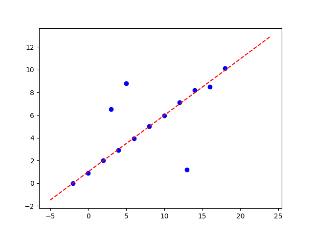

# Programming4

## 1.Environment Configuration

- Programming Language: python 

- Installing  Dependencies:

  `pip install numpy matplotlib tqdm`

## 2.Result

Show my result graphically as follows.

