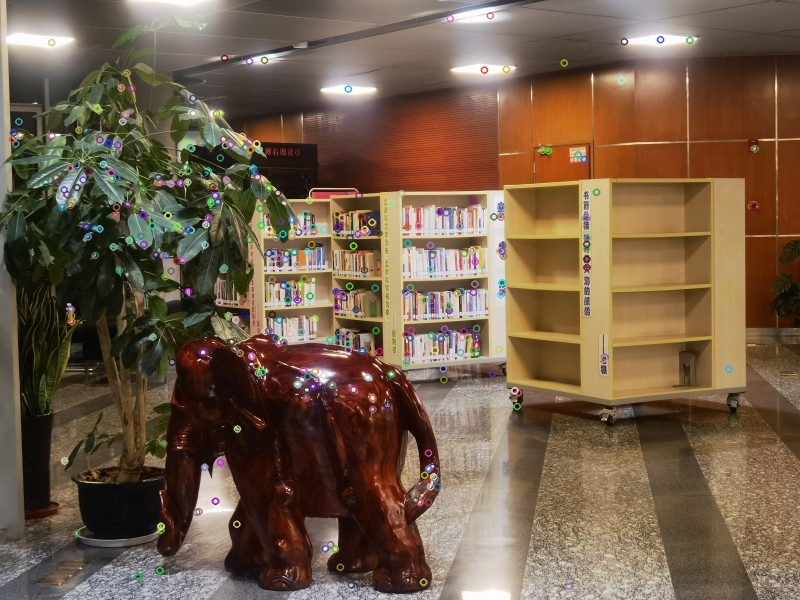
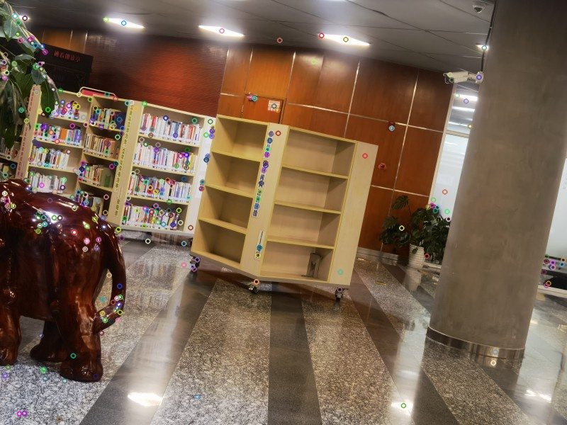
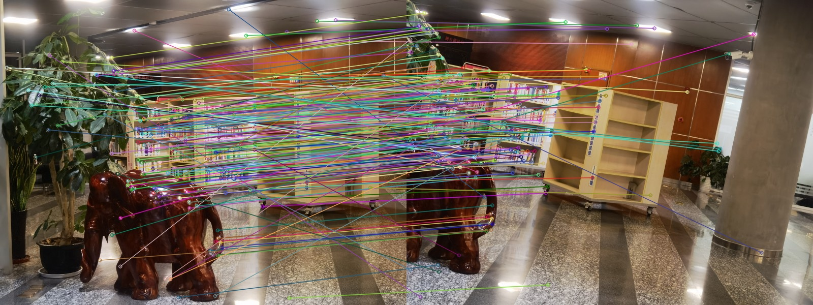
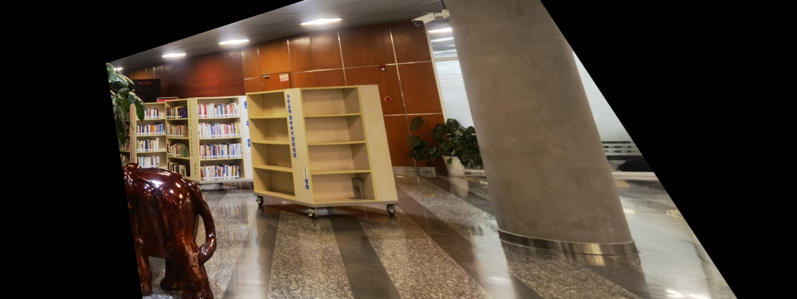
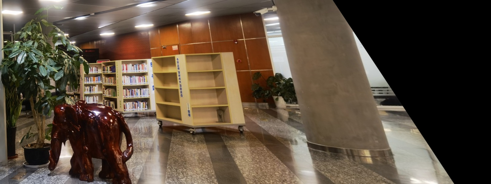

# Programming5

## 1. Environment Configuration

- Programming Language: python 

- Installing  Dependencies:

  `pip install numpy matplotlib tqdm opencv-python`

## 2. Implementation

### Steps:

1. Compute key-points and sift-Features using built-in functions in opencv.

   

   

2. Match key-points using built-in functions in opencv.

   

3. Solve projective transformation $H$ using RANSAC.

   | Hyper | Number of iterations(k) | Square Distance Threshold | Number of Inlier Threshold |
   | ----- | ----------------------- | ------------------------- | -------------------------- |
   |       | 1000                    | 10000                     | 225                        |

4. Apply $H$ to `imgr`  to get `perspective_imgr`

    

5. Stitch `imgl` and `perspective_imgr` and `imgl`

    