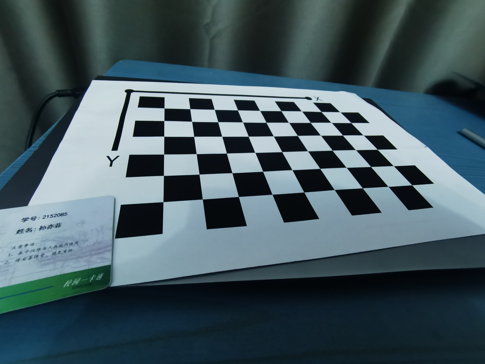
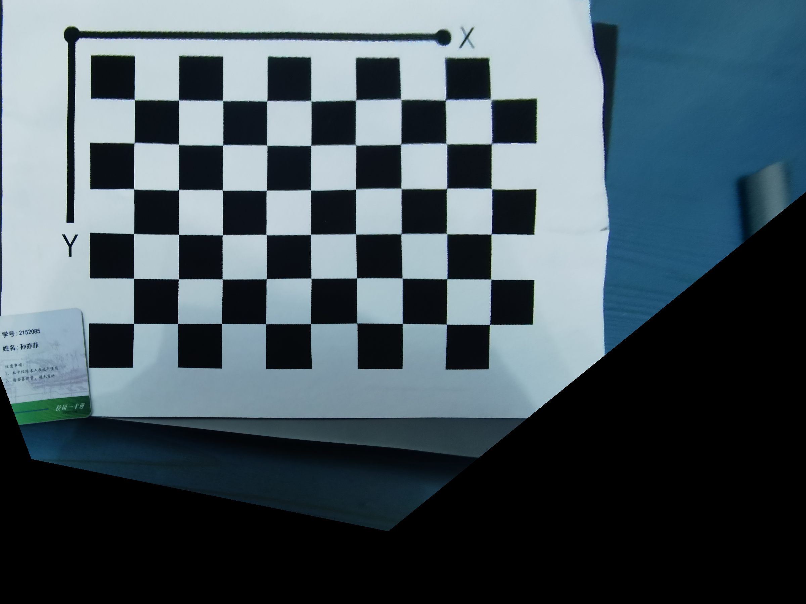

# 1. The intrinsic parameters of your camera

$$
K=\begin{bmatrix}3393.513&0&2039.741\\0&3388.031&1538.314\\0&0&1 \end{bmatrix} \\
\mathcal D=(\kappa_1,\kappa_2,\rho_1,\rho_2,\kappa_3)=(-0.0161,-0.0621,0,0,0)
$$

# 2. Original image

# 3. The generated bird’s-eye-view image

 
