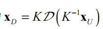
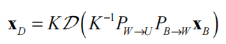

期末考试真的就基本考这么多。真的。

## write contribution

Chris  Harris, Zhengyou Zhang, David Lowe, Tony Lindeberg, Yann LeCun, Geoffrey Hinton, David Marr, Marvin Minsky. You can select 5 of the aforementioned guys and for each guy, please write out his/her major contributions to the CV field.

Harris: 提出哈里斯角点检测法，判断图形中的一个区域是否是角点。

Zhengyou Zhang：提出张正友平面标定法，测量相机内参。该方法操作简便，标定精度高。

David Lowe:发表了SIFT(scale-invariant feature transform), 包含两部分，尺度不变特征点的检测和尺度不变特征描述子的构建

Tony Linderberg：提出了尺度归一化高斯-拉普拉斯算子，scale-normalized Gaussian Laplacian of Gaussian

Yann LeCun:将反向传播算法运用到手写数字的识别上，使用的卷积神经网络是后来LeNet的卷积网络雏形。首次提出卷积一词，是卷积网络之父。

Geoffrey Hinton：反向传播算法的创始人之一

Kenneth Levenberg/Donald W. Marquardt:  Levenberg–Marquardt 非线性最小二乘解法

## 无穷远点的齐次坐标（simple）

## class imbalance问题（第7章ppt）

## RANSAC steps简述

1.随机选择一个子集si$\in$ S, 用此子集生成一个模型

2.S中，若数据点带入模型所得误差小于 *t*，则认为该数据点属于该模型的一致集;遍历S中的数据，得到该模型的一致集；

3.若一致集中的个数大于阈值d, 使用一致集中的所有数据点计算出一个模型

4.计算一致集中所有点带入模型后所得到的误差之和；若误差小于当前最小的误差，则更新最佳模型和最小误差；

5.重复n次后，此时最佳模型就是结果模型

## SIFT basic steps简述

1.高斯尺度空间的构建

2.DoG尺度空间的构建，DoG尺度空间中的层由高斯尺度空间内相邻两层相减得到

3.DoG尺度空间中极值点的检测，在DoG尺度空间中，如果某点**x**0=(*x*0, *y*0, *l*0)的值比它周围26个邻居处的值都大（或者小），该点为局部极值点

4.粗略极值点位置精化：利用二阶泰勒展开，基于初始**x**0的信息，迭代精化得到精化极值点位置

5.过滤掉边缘和低对比度的相应点

6.确定特征点的局部领域主方向 

7.构造SIFT描述子：将某区域旋转到主方向以保持旋转不变性，将区域划分为4x4的子区域，每个子区域，基于高斯加权计算8 维的梯度方向直方图，把所有子直方图连接起来成为一个128维度的向量，

## Result1-4

result1: 从相机光心到图片上一点的连线是K^(-1)u

result2:想计算两条射线的夹角，公式为：。当两条射线相互垂直时，他们的点乘结果为0。

而一条直线的灭点v，指过光心且与该直线平行的线与成像平面的交点；可知：1.灭点在成像平面上；2.一条直线只有一个灭点；3.一组平行线的灭点相同；4.ov与该直线平行

result3:所以计算现实中两条射线的夹角，可以计算对应的灭点v1,v2, ov1,ov2之间的夹角

result4:现实中这两条直线是垂直的，则夹角也为垂直的

## 针孔相机，从WCS到PCS

## 详细描述相机标定流程

1.准备一个棋盘标定板

2.给这个标定板拍摄照片

3.检测图片中的特征点（交叉的点）

4.基于像素点和世界坐标系中的点建立等量关系

5.通过解等式来得到参数

## 相机内参标定问题的目标函数与解释

## 证明L-M法函数为严格凸函数

## 讲述行人检测和单目相机测量距离的方式

1.首先需要获取包括畸变系数在内的相机所有内参数。

2.通过离线外参数标定，确定出相机的成像平面（去畸变之后）与目标物体所处平面（间的线性几何变换 *H*。以上可以使用张正友标定法

3.对相机获取的图片进行去畸变，识别出减速带。可以使用yolo系列模型，YOLO 采用单个神经网络直接回归出目标检测信息，包括目标边界框（bounding box）、预测置信度、目标所属类别概率向量等，实现了端到端的目标检测。

4.获得减速带在成像平面上的 像素坐标 (取识别框底部中心位置）

5.根据求出的外参/像素平面->物理平面的单应矩阵计算出减速带在物理平面中的位置,从而计算出实际距离

## 如何获取鸟瞰视图

从B鸟瞰视图图像坐标系到W物理平面坐标系的映射关系、相似变换

从W物理平面坐标系到去U畸变图像坐标系的映射关系，射影变换矩阵，利用4个点对，线性最小二乘法

从U去畸变图像坐标系到D原始图像坐标系的映射关系，我们便可以生成查找表

## 平面基本变换

## 序列卷积计算
