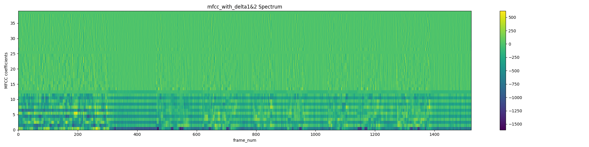

# Assigenment 1 Mel-frequency cepstral coefficients


[TOC]


## 1.Introduction

Mel Frequency Cepstral Coefficients (MFCCs) are a type of spectral representation used extensively in speech and audio processing. The MFCC process aims to mimic the human auditory system and is performed on a speech segment to extract useful features for further analysis. 

This report outlines the various steps involved in MFCC feature extraction and discusses key output figures like spectrograms and MFCCs that illustrate the spectral content of the speech segment.

## 2.Process

### Pre-emphasis

The `pre_emphasis` function **enhances the high-frequency components of the speech signal using a pre-emphasis filter.**

Speech signals tend to have spectral tilt (Spectral Tilt) phenomenon, that is, the amplitude of the high-frequency part will be smaller than the low-frequency part, pre-emphasis here is to play a role in balancing the spectrum, increasing the amplitude of the high-frequency part. 

The frequency of the signal is mainly determined by the speed of the signal level change, the signal to do a first-order differential, the high-frequency part (where the change is fast) difference value is large, the low-frequency part (where the change is slow) difference value is small, to achieve the role of balancing the frequency spectrum.

```python
def pre_emphasis(signal, alpha=0.97):
    emphasized_signal = np.append(signal[0], signal[1:] - alpha * signal[:-1])
    return emphasized_signal
```

#### output

- before pre_emphasis:


- after pre_emphasis:


### framing

After `pre-emphasis`, **the signal needs to** **be split into short time frames.**

The reason for doing this step is that the frequencies in the signal change over time (unstable) and some signal processing algorithms (such as the Fourier Transform) usually expect the signal to be stable, i.e. it does not make sense to process the whole signal because the frequency profile of the signal will be lost over time. 

To avoid this, the signal needs to be processed in frames, considering the signal within each frame to be constant over short periods of time. The frame length is usually set to take 20ms to 40ms, with 50% (+/-10%) coverage between adjacent frames. **For ASR, the frame width is usually taken as 25ms and the shift as 10ms.**

```python
##main##
	sr=16000#sample_rate
    frame_len = int(sr * 0.025)  # the length of frame(25 ms)
    frame_mov = int(sr * 0.010)  # the frame movement(10 ms)
    audio_frame=frame_divide(audio,frame_len,frame_mov)

    
def frame_divide(data, frame_len,frame_mov):

    sig_len = len(data)  # the length of signal
    frame_num = int(np.ceil((sig_len - frame_len) / frame_mov))  # frame number

    # pad zeros (that is because the ceil function makes the actual length of frame longer,so we have to pad zeros)
    zero_num = (frame_num * frame_mov + frame_len) - sig_len
    zeros = np.zeros(zero_num)
    # concat data with zeros
    filled_signal = np.concatenate((data, zeros))
    indices = np.tile(np.arange(0, frame_len), (frame_num, 1)) + \
              np.tile(np.arange(0, frame_num * frame_mov, frame_mov), (frame_len, 1)).T#每个frame开始的地方

    # get the data
    indices = np.array(indices, dtype=np.int32)
    divided = filled_signal[indices]
    return divided
```

### Windowing

After framing, it is often necessary to window the signal in each frame. The purpose is to let the ends of the frame attenuate smoothly, which can reduce the intensity of the side flaps after the subsequent Fourier transform, and obtain a higher quality spectrum. Commonly used windows are: rectangular window, Hamming window, Hanning window.This assignment uses the  Hamming window,  its window function is:
$$
w(n)=0.54−0.46cos( \frac{N−1}{2πn})
$$

```python
def hamming_window(audio,frame_len,alpha=0.46164):
    save_image(audio[710],"before window",'samples','Amplitude')
    
    n = np.arange(frame_len)
    window = 1-alpha - alpha * np.cos(2 * np.pi * n / (frame_len - 1))
    save_image(window,"Window",'samples','Amplitude')
    windowed_audio = audio * window
    save_image(windowed_audio[710],"after window",'samples','Amplitude')
    return windowed_audio
```


#### output

- One frame before windowing(for example,frame with index 710):

  

- And the window:

  

- after window:

  

### STFT(short time fast Fourier transform)

For each frame of the windowed signal, an N-point FFT transform, also known as the short-time Fourier transform (STFT), with N usually taken as 256 or 512, is performed, and then the energy spectrum is calculated using the following equation:
$$
P=\frac{{|FFT(x_i) |}^2}{N}
$$

```python
def stft(audio_frame,n_fft):
    magnitude_frame = np.absolute(np.fft.rfft(audio_frame, n_fft))  # the magnitude
   # print("shape",magnitude.shape)
    power_frame=(1.0/n_fft*(magnitude_frame**2))
    
    return power_frame
```

#### output

- The power of One frame after STFT(for example,frame with index 710):


### Mel-filter bank

After the above steps, the FBank features are extracted by applying the Mel filter bank on the energy spectrum.

**Mel scale**  is a scale that can simulate the law of receiving sound by the human ear, the human ear presents a non-linear state when receiving sound, and is more insensitive to the high frequency, so the Mel scale has a higher resolution in the low frequency region, and a lower resolution in the high frequency region, and the conversion relationship with the frequency is:
$$
\begin{aligned}
&m=2595 \log _{10}\left(1+\frac{f}{700}\right)\\
&f=700\left(10^{m / 2595}-1\right)
\end{aligned}
$$
Mel filter bank is a series of triangular filters, usually 40 or 80 in number, with a response value of 1 at the centre frequency point, attenuating to 0 at the center of the filters on either side.

To get Mel filter bank:

```python
def mel_filter(sample_rate,n_fft):
    low_freq_mel = 0
    high_freq_mel = 2595 * np.log10(1 + (sample_rate / 2) / 700)
    #print(low_freq_mel, high_freq_mel)
    
    nfilt = 40
    mel_points = np.linspace(low_freq_mel, high_freq_mel, nfilt + 2)  # 所有的mel中心点，为了方便后面计算mel滤波器组，左右两边各补一个中心点
    hz_points = 700 * (10 ** (mel_points / 2595) - 1)#对应的f
    
    fbank = np.zeros((nfilt, int(n_fft / 2 + 1)))  # 各个mel滤波器在能量谱对应点的取值
    bin = (hz_points / (sample_rate / 2)) * (n_fft / 2)  # 各个mel滤波器中心点对应FFT的区域编码，找到有值的位置
    for i in range(nfilt + 1):
        left = int(bin[i-1])
        center = int(bin[i])
        right = int(bin[i+1])
        for j in range(left, center):
             fbank[i-1, j+1] = (j + 1 - bin[i-1]) / (bin[i] - bin[i-1])
        for j in range(center, right):
            fbank[i-1, j+1] = (bin[i+1] - (j + 1)) / (bin[i+1] - bin[i])
            
    return fbank
```

Specially,High_freq_mel calculates the highest frequency on the Mel frequency scale for an audio signal with a sample rate/2  because of ***the Nyquist frequency*** : half the sample rate of the signal, which is the highest frequency at which the signal can be represented correctly.


Finally the Mel filter bank is applied to the energy spectrum:

```python
    filter_banks = np.dot(power_frame, fbank.T)
    filter_banks = np.where(filter_banks == 0, np.finfo(float).eps, filter_banks)
    mel_data = 20 * np.log10(filter_banks)  # dB
```

#### output


### DCT(Discrete Cosine Transform)

The FBank features extracted earlier are often highly correlated. Therefore it is possible to continue to compress these correlated filter bank coefficients with the DCT transform. For ASR, which usually **takes 1 to 12(remove 0)** dimensions, the information thrown away contains filter bank coefficients that change rapidly partially, and this detailed information may not be helpful on the ASR task.

The DCT transform is actually an equivalent replacement for the inverse Fourier transform:
$$
y_t(n)=\sum_{m=0}^{M-1} \log \left(Y_t(m)\right) \cos \left(n(m+0.5) \frac{\pi}{M}\right), \quad n=0, \ldots, J
$$

```python
def dct(log_mel, n_mfcc=26, n_ceps=12):
    transpose = log_mel.T
    len_data = len(transpose)
    # print(len_data)
    dct_audio = []
    for j in range(n_mfcc):
        temp = 0
        for m in range(len_data):
            temp += (transpose[m]) * np.cos(j * (m + 0.5) * np.pi / len_data)
        dct_audio.append(temp)
    ret = np.array(dct_audio[1:n_ceps + 1])
    return ret
```

And to add **energy dimension** to feature:

```python
energy_frame=np.sum(power_frame.T, axis=0,keepdims=True)  # get the energy
mfcc=dct(mel_power_frame)
mfcc=np.append(mfcc,energy_frame,axis=0)
```


#### output


### Dynamic features

Speech is not constant frame-to-frame, so we can add features to do with how the cepstral coefficients change over time.

```python
def delta(data, k=1):

    delta_feat = []
    transpose = data.T
    q = len(transpose)  # the dimension of the mfcc
    for t in range(q):
        if t < k:
            delta_feat.append(transpose[t + 1] - transpose[t])
        elif t >= q - k:
            delta_feat.append(transpose[t] - transpose[t - 1])
        else:
            denominator = 2 * sum([i ** 2 for i in range(1, k + 1)])
            numerator = sum([i * (transpose[t + i] - transpose[t - i]) for i in range(1, k + 1)])
            delta_feat.append(numerator / denominator)
    return np.array(delta_feat)
```

“Standard” ASR features (for GMM-based systems) are 39 dimensions:

• 12 MFCCs, and energy

• 12 ΔMFCCs, Δenergy

• 12 Δ2MFCCs, Δ2energy

So,to generate these features:

```python
    delta_data = delta(mfcc)  # first delta
    delta_square_data = delta(delta_data.T)  # second delta
    mfcc_with_delta1 = np.append(mfcc ,delta_data.T, axis=0)  # append first delta
    mfcc_with_delta_1_2 =  np.append(mfcc_with_delta1, delta_square_data.T, axis=0)# append second delta
```

#### output：



### Feature normalization

The aim is to hopefully reduce the mismatch between the training set and the test set.

We use CMVN（Cepstral mean and variance normalization).

```python
def normalization(data):
    data_mean=np.mean(data,axis=1,keepdims=True)
    data_vari=np.var(data,axis=1,keepdims=True) 
    return (data-data_mean)/data_vari
```

### output


## 3.Summary

The output figures generated by the code, including the audio waveform, pre-emphasis audio waveform, and MFCC coefficients, provide a visual understanding of the transformations applied to the speech segment at different stages of the MFCC feature extraction process. Through these figures, one can observe the spectral and cepstral characteristics of the speech segment, which are crucial for various speech processing applications.

However,it might be due to the relatively small fluctuations in frequency in the audio I recorded myself, many features are not displayed very clearly.:cry:So I have ***test.wav and light.wav.***

And I use another music audio to test my code.

## 4.How to run my code

### Project Structure

```
├─code
│  ├─image_light
│  └─image_test
└─report.pdf
```


### cmd

```shell
pip install librosa numpy matplotlib
```

In the directory `code`:

```
python main.py 
```

