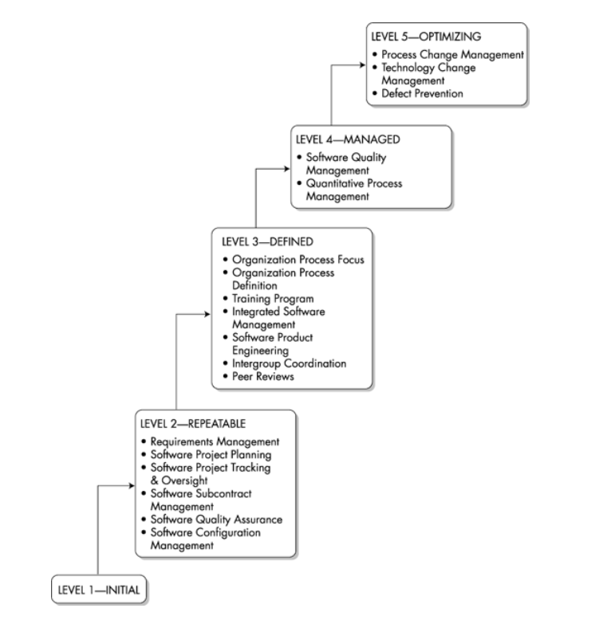

### 1.2 PROJECT  MANAGEMENT AND THE CMM

Once it is accepted that use of effective  processes can help in executing a project successfully, a question immediately  arises: What are the desirable characteristics of these processes? The CMM for  software is a framework that tries to answer this question.

The CMM for software is a framework that was  developed by the Software Engineering Institute (SEI) at Carnegie Mellon  University by observing the best practices in software and other organizations.  Hence, the CMM reflects the collective process experience and expectations of  many companies. It specifies desired characteristics of processes without  prescribing specific processes. Thus, different processes can fulfill the  requirements of the CMM. It can be used to evaluate the software process of an  organization and to identify deficiencies.

The CMM is one of the most popular frameworks  for software process improvement (the other commonly used framework is ISO  9001[3](http:// /?xmlid=0-201-73721-3/ch01lev1sec6#ch01entry03),[4](http:// /?xmlid=0-201-73721-3/ch01lev1sec6#ch01entry04),[5](http:// /?xmlid=0-201-73721-3/ch01lev1sec6#ch01entry05)). The  foundations of the CMM were laid down in Watts Humphrey's Managing the Software Process,[6](http:// /?xmlid=0-201-73721-3/ch01lev1sec6#ch01entry06) and the  framework itself is described completely in the SEI's The Capability Maturity Model: Guidelines for Improving the  Software Process.[7](http:// /?xmlid=0-201-73721-3/ch01lev1sec6#ch01entry07) A "new  edition" of the CMM, called CMM-I, has been released. But because the focus of  this book is not on the models and because there is still little experience  available with CMM-I, I discuss only the CMM for software and only the project  management aspects, even though the CMM also covers organizational and process  management issues. I do not discuss the assessment procedure, a brief  description of which is given in my book CMM in  Practice,[8](http:// /?xmlid=0-201-73721-3/ch01lev1sec6#ch01entry08) and a  detailed description given in CMM Based Appraisal for  Internal Process Improvement, by S. Masters.[9](http:// /?xmlid=0-201-73721-3/ch01lev1sec6#ch01entry09)

#### 1.2.1 Overview of the  CMM

One objective of the CMM is to distinguish  mature processes from immature, or ad hoc, processes. Immature software  processes imply that projects are executed without many guidelines, and the  outcome of a project depends largely on the capability of the team and the  project leader. On the other hand, with mature processes, a project is executed  by following defined processes. In this case, the outcome of the project is less  dependent on people and more on the processes. It follows, then, that the more  mature the processes, the more predictable the results and the more well  controlled the projects.

The range of results that can be expected in a  project when it is executed using a process is its process capability. The actual result achieved in a  project executed using the process is its process  performance. Clearly, the process performance depends on the process  capability. To consistently improve process performance on projects, you must  enhance the process capability; the process itself must become more  mature.

The path to higher maturity includes some  well-defined plateaus referred to as maturity  levels by the CMM. Each maturity level specifies certain characteristics  for processes, with higher maturity levels having more advanced characteristics  that are found in more mature software processes. Hence, the CMM framework  describes the key elements of software processes at different levels of  maturity. Consequently, it also specifies the path that a software process  follows in moving from immature processes to highly mature processes. This path  includes five maturity levels, as shown in

##### Figure 1.1. Maturity levels in the  CMM

In level 1, the initial level, a project is executed in a manner that  the team and project manager see fit. The repeatable level (level 2) applies when established  project management practices are employed, although organization-wide processes  may not exist. At the defined level (level 3),  organization-wide processes have been defined and are regularly followed. At the  managed level (level 4), quantitative  understanding of the process capability makes it possible to quantitatively  predict and control the process performance on a project. At the optimizing level (level 5), the process capability is  improved in a controlled manner and the improvement is evaluated  quantitatively.

Each maturity level (except level 1) is characterized by key process areas (KPAs), which specify the areas on  which the organization should focus to elevate its processes to that maturity  level.  Figure 1.1 also shows the KPAs for the  different levels. For an organization to achieve a maturity level, it must  satisfy all the KPAs at that maturity level as well as the KPAs at all lower  maturity levels.

Maintaining processes at higher levels of maturity is a  challenging task requiring commitment from the organization and a proper work  culture. Of the 900 assessments conducted between 1996 and June 2000 whose  assessment results were provided to the SEI, only 3% of the organizations were  at level 5, and another 5% were at level 4.[10](http:// /?xmlid=0-201-73721-3/ch01lev1sec6#ch01entry10) The rest were at level 3 or below,  with 38% at level 2 and 18% at level 3.

#### 1.2.2 KPAs for Project  Management

Each KPA specifies goals that the processes of the organization  must meet to satisfy that KPA. In addition, each KPA specifies a group of  activities, called key practices, that  collectively satisfy the goals of that KPA. In many senses, the goals for each  KPA capture its essence. They specify the objectives that the CMM has set for  the processes relating to the KPA. To illustrate the KPAs associated with  project management, we briefly discuss here the goals of these KPAs. These goals  are taken from the CMM,[7](http:// /?xmlid=0-201-73721-3/ch01lev1sec6#ch01entry07) with some minor changes in the wording  of some goals.

 Table 1.1 lists all the goals for KPAs at  level 2, showing clearly that the level 2 focus is almost exclusively on project  management. Under these goals, you create and document a project plan, evaluate  the ongoing project performance against the plan, and take actions when the  actual performance significantly deviates from the plan. Requirements are  properly documented, and changes to requirements are properly managed. All work  products are controlled, and changes to products are properly managed through a  planned configuration management plan. Reviews and audits are performed to  ensure that planned processes and standards are being followed. If some parts of  the project are subcontracted to other vendors, the subcontracted work is also  monitored properly.

[Table 1.2](http:// /JVXSL.asp?x=1&mode=section&sortKey=insertDate&sortOrder=desc&view=book&xmlid=0-201-73721-3/ch01lev1sec2&open=true&title=New This Week&catid=&s=1&b=1&f=1&t=1&c=1&u=1#ch01table02#ch01table02) details the goals of three of the  seven KPAs at level 3. The other KPAs focus on organizational and process  management issues. A project in a level 3 organization uses a tailored version  of the standard process and reuses assets, data, and experience from past  projects for planning. The various groups that contribute to the project  cooperate smoothly through well-defined interfaces and mechanisms. Reviews are  properly carried out to identify defects in work products, and sufficient  support for conducting reviews and follow-up activities is provided.

| Table 1.1. Goals for KPAs at Level  2 (Repeatable) |                                                              |
| -------------------------------------------------- | ------------------------------------------------------------ |
| KPA                                                | Goals                                                        |
| Requirements  Management (RM)                      | ·     Software requirements  are controlled to establish a baseline for software engineering and management  activities. ·     Software plans,  products, and activities are kept consistent with requirements. |
| Software Project  Planning (SPP)                   | ·     Estimates are  documented for use in planning and tracking the project. ·     Project activities  and commitments are planned and documented. ·     Affected groups and  individuals agree to their commitments related to the project. |
| Software Project  Tracking and Oversight (SPTO)    | ·     Actual results and  performances are tracked against the software plans. ·     Corrective actions  are taken and managed to closure when actual results and performance deviate  significantly from the software plans. ·     Changes to  commitments are agreed to by the affected groups and individuals. |
| Software Subcontract  Management (SSM)             | ·     The prime contractor  and the subcontractor agree to their commitments. ·     The prime contractor  tracks the subcontractor's actual results against its commitments. ·     The prime contractor  and the subcontractor maintain ongoing communication. ·     The prime contractor  tracks the subcontractor's actual performance against its  commitments. |
| Software Quality  Assurance (SQA)                  | ·     Software quality  assurance activities are planned. ·     Adherence of software  products and activities to the applicable standards, procedures, and  requirements is verified objectively. ·     Affected groups and  individuals are informed of software quality assurance activities and  results. ·     Noncompliance issues  that cannot be resolved within the project are addressed by senior  management. |
| Software  Configuration Management (SCM)           | ·     Software  configuration management activities are planned. ·     Selected software  work products are identified, controlled, and available. ·     Changes to identified  software work products are controlled. ·     Affected groups and  individuals are informed of the status and content of software  baselines. |

 

| Table 1.2. Goals of Three KPAs at  Level 3 (Defined) |                                                              |
| ---------------------------------------------------- | ------------------------------------------------------------ |
| KPA                                                  | Goals                                                        |
| Integrated Software  Management (ISM)                | ·     The  project's defined software process is a tailored version of the organization's  standard software process. ·     The  project is planned and managed according to the project's defined software  process. |
| Intergroup  Coordination (IC)                        | ·     All  affected groups agree to the customer's requirements. ·     All  groups agree to the commitments between different groups. ·     The  groups identify, track, and resolve intergroup issues. |
| Peer Reviews  (PR)                                   | ·     Peer  review activities are planned. ·     Defects in the software work products are identified and  removed. |

 Table 1.3 shows  the goals for the two KPAs at level 4. At level 4, the capability of the  organization's process is understood in quantitative terms. The process  capability is used to set quantitative goals for a project. Data on project  performance are collected on an ongoing basis and are compared with data on past  performance; if significant deviations are observed, proper corrective actions  are applied to bring the project back in control. A key aspect of level 4 is the  use of statistical process control techniques on an ongoing basis so that each  activity can be evaluated and corrective action taken if needed.

The three KPAs at level 5 focus on improving  the capability of the process. Of the three KPAs, the Defect Prevention KPA is  the one that most directly affects project management. This KPA requires that  defects be prevented proactively by systematically analyzing the causes of  defects and then eliminating those causes. If defects can be prevented from  entering the software, the effort spent in removing them can be reduced, thereby  improving quality and productivity.

| Table 1.3. Goals for  KPAs at Level 4 (Managed) |                                                              |
| ----------------------------------------------- | ------------------------------------------------------------ |
| KPA                                             | Goals                                                        |
| Quantitative Process  Management (QPM)          | ·     The  quantitative process management activities are planned. ·     The  process performance of the project's defined software process is controlled  quantitatively. ·     The  process capability of the organization's standard software process is known in  quantitative terms. |
| Software Quality  Management (SQM)              | ·     The  project's software quality management activities are planned. ·     Measurable goals for software product quality and their priorities  are defined. ·     Actual progress toward achieving the quality goals for the software  products is quantified and managed. |

 