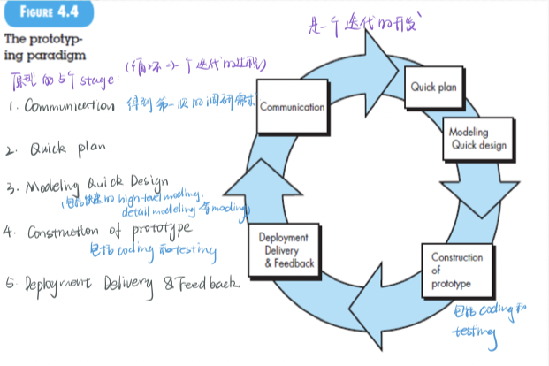

[TOC]


# 1 THE NATURE OF SOFTWARE

## 1.1 软件的本质

### 1.1.1 Defining Software

1.完成软件的特性，功能，性能等所需要的 **计算机程序，指令代码**——**程序**

feature特性： 非功能需求 non-functional：如安全性，兼容性，可移植性，可扩展性等

function功能：与非功能需求相对应

performance性能：feature的一部分，但因为很重要所以单拉出来

2.使得程序可以充分利用操纵信息所使用的 **数据结构**——**数据**

3.描述程序操作使用的硬拷贝和虚拟形式的 **描述性信息**——**文档**

### **生命周期**

 

1. 硬件的生命周期——浴缸曲线（早期的infant mortality是由于设计引起问题，当设计问题解决后可以平稳运行，直到硬件损耗，期间替换硬件不影响failure rate）(早期故障多，后期磨损）
2. 理想曲线——开发后可以一致运行实际曲线——考虑：1.功能增强的update；2. 功能修改和错误修复modify & bugfixed不断改变后failure rate的突然上升与总体上升: 修改change后导致其他新的问题出现，有”传染性”错误的可扩展性，这是功能调整增强的代价 (错误的扩展性，修复某问题的副作用 )

## 1.1.2 Software Application Domains 软件分类

1、系统软件（System Software）

2、应用软件（Application Software）

3、工程/科学软件（Engineering/scientific software）

4、嵌入式软件（Embedded software）

5、产品线软件（Product-line software）

6、Web/移动App（Web/Mobile applications）

Mobile app包括：

**user interface** 用户界面

**interoperability with Web-based resources** 与基于web的资源的互操作性

**local processing capabilities** 本地处理能力

7、人工智能软件（AI software）

## 1.1.3 Legacy Software**遗留软件**

特点

- 生命周期长（老不死） longevity 
- 业务关键性（涉及ys的底层代码了） business criticality
- 质量差：**设计难以扩展，代码令人费解，文档混乱，糟糕或不存在的文档，管理不善的变更历史**  *poor quality*

**遗留系统演化原因：**evlove reason

-  需要进行适应性调整，满足新的计算环境和计算需求（比如：密码升级到指纹） adapted to meet new computing environment and  tchnology
-  升级以实现商业需求 **to be  enhanced  to implement new business and requiremnets**
-  扩展使得可以与更多的系统交互，如现代系统或数据库 **extend** to interoperable with  
-  构需要重新部署来适应新环境（例如下面以前没有mobile，或部署微服务框架等） **re-architected**

## 1.2 软件改变的特性

### 1.2.1 WebApps


### 1.2.3 Cloud Computing

**云平台架构包括：据说很重要，考试一定考？（⭐️⭐️⭐️）**

从底到上

-  资源层 或基础设施层（ IaaS, Infrastructure as a Service ） 由服务器集群组成。提供基础物理硬件资源，通过分布式技术提供可靠服务，降低成本。可以利用性能较低的服务器，节省费用。

- 虚拟层：**虚拟机**（跨IaaS与PaaS） 技术：KVM（硬件支持的完全虚拟化），XEN，VMware（软件模拟的全虚拟化）。

-  中间件层 或平台层（ PaaS, Platform as a Service）：这层应该是云平台的核心层，主要功能为：对虚拟机池资源状态进行监测、预警、优化决策。组件：操作系统、文件存储、负载均衡（如Nginx）、容器管理（如k8s）

-  应用层 或软件服务层（ SaaS，Software-as-a-Service (软件，可视化界面)

  给用户提供可视化界面，应用若为存储：比如百度云会给用户提供交互界面，建立文件夹，进行数据存储，在线播放视频等界面，供用户选择操作。应用若为租用服务器：界面应该有租用的服务器资源状态。

  目前，云平台已经过度到微服务架构（是面向服务的体系架构(SOA)的变种）。

# 2 软件工程

## 2.1 DEFINING THE DISCIPLINE（⭐️⭐️⭐️）定义规则？

（1）将**系统化的**（systematic）、**规范化的**(disciplined)、**可量化的**(quantifiable)方法应用于软件的**开发**、**运行**和**维护**

（2）对（1）方法的研究  the study of the approaches

SE的核心是quality focus,为了实现这一点需要工程化，工程化需要过程化，过程化需要方法，很多的方法被工具化了

Software engineering is a layered technology 软件工程是层次化的技术

### 软件工程的层次：（⭐️）

最基本  ：bedrock   quality focus 

基础  foundation: process  定义了framework, 形成了管理控制的基础， work products （models, documents, data, reports, forms, ）被生产

methods:   Software engineering  *methods* provide the technical how-to’s for building  software.  eg：UseCase建模，数据库设计方法，架构方法，分析方法，设计方法，测试方法等多种方法

tools : provide automated or semi-automated support  for the process and the methods 自动或半自动的支持 为process和method 

## 2.2 THE SOFTWARE PROCESS

A *process* is a collection of activities, actions, and tasks that are performed when  some work product is to be created。process是activities, actions, tasks的集合， 当一些word product被创造

activity 达成广泛的目标

action包括一个集合的tasks

A *task* focuses on a small, but well-defined objective (e.g., conducting a unit test) that produces a tangible outcome

task关注一个小的，完整定义的目标，有切实的产出

- **活动activity**主要实现宽泛的⽬标，与应⽤领域，项⽬⼤⼩，结果复杂性或者实施软件⼯程的重要程度没有直接关系
- **动作action**包含了主要⼯作产品⽣产过程中的⼀系列任务
- **任务task**关注⼩⽽明确的⽬标，能够⽣产实际的产品

例如testing这个activity,包括actions：单元测试、集成测试、系统测试、验收测试

 单元测试这个action包括tasks:计划、⽤例分析、设计测试⽤例、技术评审、运⾏测试⽤例、debug、软件配置管理

### 2.2.1 The Process Framework

流程框架通过识别适用于所有软件项目的少量框架活动，为完整的软件工程过程奠定了基础，无论其大小或复杂性如何。此外，流程框架还包括一组适用于整个软件流程的伞式活动。软件工程的通用流程框架包括五个活动：

**CPMCD**

1. **交流Communication**：需求收集requirement gathering& 需求诱导 elicitation
2. **计划Planing**：planning是一个大的，阶段的计划（如人员安排等），有很多template
3. **建模Modeling**：包括分析建模(Analysis modeling)，概要设计(high-level design)， component design 组件设计(detailed design)
4. **构建Construction**：coding & testing 写代码&测试,测试包括单元测试，系统测试
5. **部署Deployment**：delivery & maintenance & feedback 交付，维护，反馈

**软件开发过程包括很多迭代，并不是线性顺序的模型，而是循环往复**

**Standard Process包含的Activity**

1. requirement elicitation 需求诱导
2. requirement analysis modeling 需求分析建模
3. architecture design 架构设计
4. component design 组件设计
5. coding 写代码
6. unit testing 单元测试
7. integration testing 集成测试
8. system testing 系统测试
9. acceptance testing 验收测试（用户在开发环境下的测试）
10. Release & Delivery， Feedback & Support 发布，交付，反馈，支持

**对应CPMCD：**

Communication: 1

Planning:(umbrella activity)

Modeling: 2、3、4

Construction: 5、6、7、8、9

Deployment:10

## 2.2.2 Umbrella Activities **伞形活动（umbrella activity）,也叫quality actitvities：（⭐️⭐️⭐️）**

目的是提高软件开发过程中work products工作产品的质量=>提高软件质量

### **跟风质技测配复工（跟风至极，则配复工）**

- **软件项目跟踪控制**：根据计划评估进度，采取措施保证计划实施（如：人员计划，发挥成员特长能力，了解人员是tracking，调整人力是control）
- **风险管理**：对可能影响成果或产品质量的风险进行评估(例如，人员流失跳槽风险，新技术、云平台、数据库不熟悉等)
- **软件质量保证**：确定和执行保证软件质量的活动(编程管理，代码规范，需求规约等）
- **技术评审**：评估软件工程 (比如代码Review，需求Review等）
- **测量**：定义和收集过程、项目以及产品的度量（对schedule进行测量，对发现的缺陷进行度量，对人员工作量进行度量等）
- **软件配置管理**：整个软件过程中变更带来的影响（**用Git进行版本控制**）
- **可复用管理**：定义工作产品复用的标准，建立构建复用机制（苹果的复用做的很好，通过标准化可以降低成本）
- **工作产品的准备和生产**：包括生成产品所必须的活动（例如模型、文档、日志、表格和列表）

# 3  A GENERIC PROCESS MODEL

## 3.1 通用过程模型Generic Process Model

通用过程框架(generic process framework) 定义了5个框架活动(framework activity)——CPMCD，以及一系列伞活动(umbrella activity)——project tracking and control, risk management, quality assurance, configuration management, technical reviews, and others

**※软件过程框架Software process framework**

通用过程框架(generic process framework) 包含两部分

- 框架活动(framework activity)(CPMCD)——development dimension开发维度
- 伞型活动(umbrella activity)——management dimension管理维度(评审，QA等）

framework activity → software engineering action → task sets

action是若干个task的集合(sets)，其内容：

- T：work tasks:
- P：work products: 在work tasks之后形成一个work products
- Q：quality assurance( QA ) points: 产生work products后要有质量保证
- M：milestone: 形成里程碑

**※工作流Process flow**

process flow过程流程，工作流 - 描述了如何在序列和时间内组织在每个框架活动中发生的框架活动的动作和任务

种类:

1. Linear 线性
2. Iterative 迭代
3. Evolutionary 演化
4. Parallel 并行

## 3.4 过程模式 Process Pattern

**※ 非常重要**

定义：

过程模式Process Pattern描述了在软件工程工作中遇到的与过程有关的问题，确定了遇到该问题的环境，并提出了一个或多个行之有效的解决问题的方法。

**※ 描述模板template**（主要看例子）

| 英文                   | 中文             | 描述                                                         | 例子                                                         |
| ---------------------- | ---------------- | ------------------------------------------------------------ | ------------------------------------------------------------ |
| Pattern Name           | 模式名字         | 形容软件过程的context                                        | TechnicalReviews                                             |
| Force                  | 环境             | 所需要的环境，硬件，网络，版本管理工具等                     |                                                              |
| Type                   | 类型             | stage pattern: 解决activity相关的（EstablishingCommunication）；task pattern：解决action或task的(RequirementGathering)；phase pattern: 整个框架活动的序列，涉及各种activity(SpiralModel, Prototyping) | stage pattern; task pattern; phase pattern                   |
| Initial Context        | 启动条件         | 在模式启动之前： (1) 已经发生了哪些组织或团队相关的活动？ (2)进程的入口状态是什么？ (3) 已有哪些软件工程信息或项目信息？ （Activity Happended? State ? SE info) | 规划模式Stage pattern的Initial Context（1）客户和软件工程师建立了协作沟通； (2) 成功完成了通信模式的多个任务模式[指定]； (3)项目范围、基本业务需求、项目约束条件已知。 |
| Problem                | 问题             | Pattern可以用来解决什么问题                                  |                                                              |
| Solution               | 解决方案         | 描述如何成功执行Pattern                                      |                                                              |
| Resulting Context      | 接口（出口条件） | 为接下来提交什么信息(哪些activity必须出现；过程的出口状态是怎样的；开发了什么软件工程信息) |                                                              |
| Related Pattern        | 相关的Pattern    | 提供与此直接相关的所有流程模式的列表。这可以表示为层次结构或以其他示意性形式表示（同级或上下） | 比如：同一个action下的两个task上下相关；又比如关于unit test不知道怎么做，去寻找相关、包含或并行的stage pattern |
| Know Uses and Examples | 用过的案例       |                                                              |                                                              |

## **3.5 过程评估与改进Assessment and Improvement**

Process patterns必须与可靠的软件工程实践相结合。 此外，可以对过程本身进行评估，以确保它满足一组基本过程标准，这些标准已被证明对于成功的软件工程至关重要。

(CMMI)

Initial Repeatable Defined Managed Optimize

## **软件成熟度模型CMM （很重要…………？）**

Capability Maturity Model

The CMM is one of the most popular frameworks for software process improvement

CMM的“新版”CMM-I已经发布。

**Overview of the CMM**

CMM的一个目标是区分成熟的过程和不成熟的，或特别的过程。不成熟的软件过程意味着项目的执行没有许多指导方针，而项目的结果在很大程度上取决于团队和项目负责人的能力。另一方面，对于成熟的流程，项目通过以下定义的流程来执行。在这种情况下，项目的结果较少地依赖于人员，而更多地依赖于流程。因此，流程越成熟，结果就越可预测，对项目的控制就越好。

CMM框架描述了不同成熟度的软件流程的关键元素。因此，它还指定了软件过程从未成熟过程移动到高度成熟过程时所遵循的路径。此路径包括五个成熟度级别，如所示


架构：5个Level ，当时dqf课上专门讲了Level2 Repeatable,Level3-5叫我们自己泛读，可能Level2非常重要？

Level2 分析：6个KPA(key process area) Requirement Management是需求管理，需求有一致性需求、兼容性需求，Software Project Planning软件需求规划，Software Project Tracking&Oversight 软件项目追踪监督 Software Subcontract Management （？）Software Quality Assurance (SQA)软件质量保证，Umbrella activity Software Configuration management(软件配置管理)

**实施KPA(过程能力的衡量标准)从 what to do 到how to do it 的关键：1.实施规则,用 documents表述 2.工具(开源) 3.监控(monitor and control)**

# 4 过程模型 Process Models

## 4.1 规定的过程模型 PRESCRIPTIVE PROCESS MODELS

"prescriptive": 规定了一系列过程元素：framework activities, SE actions ,tasks ,work product, quality assurance , change control mechanisms

### 4.1.1 瀑布模型The Waterfall Model， called the *classic life cycle*

特点：

1. 按照general/standard process顺序开发，很少迭代：planning是umbrella可以去掉
2. 过程明确，需求清晰
3. 不主张迭代，但也有迭代
4. 用户需要很长时间才能得到成品
5. 某阶段受阻，整个项目都会到blocking states，也就是说，没有形成milestone，一个action，task卡住了就都卡了
6. 线性模型
7. **项目大的时候不要用，适合需求清晰稳定的情况**

Planning: EST评估→计划→跟踪

瀑布模型的缺点：

waterfall models的问题：

①**实际项目很少遵循模型提出的顺序流程**。（项目发生变更时就不适用，导致混乱）

② **客户通常很难明确地陈述所有要求**。难以适应许多项目开始时存在的自然不确定性。(要求需求明确，然而这点很难做到）

③ 客户要有耐心。 **程序的工作版本要到项目时间跨度的后期才可用**。 重大失误如果在审查工作计划之前未被发现，可能是灾难性的。(比如：waterfall会导致“阻塞状态”，在这种状态下，某些项目团队成员必须等待团队其他成员完成依赖任务。)（容错率低，且在项目后期发现难以修复，and阻塞状态）

### 4.1.1(extended)V-模型


瀑布模型的变种 (与standard process非常相似）

瀑布模型对软件工程的最大贡献：描述了质量保证行动与沟通、建模和早期建设活动相关的行动之间的关系。

Unit Testing: 因为需要看底层代码，故依赖Code generation；因为复杂的代码中如何传参，参数指向什么很复杂，需要查看详细设计规约Detailed design specification，Component Design specification

Integration Testing：组件与组件的集成，看Component Design；还因为是和子系统之间的协作有关，涉及接口，数据库，软件结构设计，需要参考接口设计，数据设计，软件体系架构设计，故看Architectural Design

System Testing：把编好的程序放在各种集成环境下；首先需要需求分析规约来进行模拟测试（主要看的是需求建模中的功能建模），比如模拟Actor，故需要Requirement Modeling；如果发现失败了，要检查什么接口有问题，故要参考Architectural Design( 追溯子系统 )

Acceptance Testing: 验收测试是面向用户的，用户不知道你的实现细节而是以需求为依据，所以是需求层面的（需要用到需求规约和需求分析规约），即Requirement Modeling。

### **简述瀑布模型，简述瀑布模型与V模型的关系：（⭐️⭐️⭐️）**

瀑布模型：⼜称为**经典**⽣命周期，它提出了⼀个系统的，顺序的软件开发⽅法，从⽤户需求规格说明开始，通过策划、建模、构建、部署的过程，最终提供完整的软件⽀持。

瀑布模型的⼀个变体称为V模型

随着软件团队⼯作沿着V模型左侧步骤向下推进，基本问题需求逐步细化，形成了对问题及解决⽅案的详尽且技术性的描述。⼀旦编码结束，团队沿着V模型右侧的步骤向上推进⼯作，其本质上是执⾏了⼀系列测试，与瀑布模型没有本质区别。

### 4.1.2 增量过程模型


场景：

1. Non-linear开发工作的整体范围排除了一个纯粹的线性过程。
2. Rapid Raw Product v1.0 可能迫切需要向**用户快速提供**一组有限的软件功能，然后在以后的软件版本中完善和扩展该功能。
3. Update v2.0++++ 有部分功能**不成熟需要后期才增量补充**；
4. Preview Function 市场要求**先发布一部分功能**，后续功能增量补充；
5. Parallel 一些内容**交叉进行**

结合了waterfall模型和并行处理流parallel

当使用增量模型时，**第一个增量通常是核心产品**。 也就是说，**解决了基本要求**，但许多补充功能（一些已知，另一些未知）仍未交付。 核心产品由客户使用（或经过详细评估）。 作为使用和/或评估的结果，为下一个增量制定计划。

特点：

- 每一次增量都生成可发布的产品increment producut，第一个增量形成核心基本产品，后续增量形成完善版本
- 每次增量是一个waterfall，一次增量内不主张迭代
- 不同增量间可并行开发（比如：第2个做coding时，第3个可做需求建模）——纵轴重合

### 4.1.3 演化过程模型Evolutionary Process Model

**强调模型迭代iteration**

两种常见的演化过程模型(都是迭代的）：

### 4.1.3.1 原型模型Prototype



**使用原因：**

客户定义了一组软件的**一般目标但没有具体需求**时；开发者不知道具体开发细节时，可帮助您和其他利益相关者更好地了解在需求模糊时要构建的内容。

**特点:**

快速，Prototype主要是用来确定需求，真正开发时可能会被抛弃掉，换成更加注重质量的model；没有被抛弃的部分会成为真正系统的一部份

婚姻系统不主张Prototyping，因为存在external interfaces，不适合Prototype Models

**简述过程：**

1.从communication开始，与stakeholders会面开确定软件的整体目标

2.quick plan: 快速计划原型迭代，modeling quick design:并进行建模（以“快速设计”的形式）。快速设计侧重于对最终用户可见的软件的那些方面的表示（例如，人机界面布局或输出显示格式）。

3.这个快速的设计构建了原型(construction of prototype)

4.该原型由利益相关者进行部署和评估(deployment delivery&feedback )，他们提供反馈，用于进一步参考需求。

5.在调整原型以满足各种涉众的需求时，就会发生迭代，同时使您能够更好地理解需要做什么。

**不足：**

软件成型了却不可靠。stakeholder看到的软件可运行，但不知道原型是固定在一起的，不知道在急于使其工作时您**没有考虑整体软件质量或长期可维护性**。

开发者经常会在实现上做出妥协，以便让原型快速工作。 不适当的操作系统或编程语言可能仅仅因为可用和已知而被使用； 一个低效的算法可能会被简单地实现来展示能力。 一段时间后，您可能会对这些选择感到满意，而**忘记了它们不合适的所有原因**。

### 4.1.3.2 螺旋模型Spiral Model


使用原因：

适合**大型项目，风险较高的项目，需求不明确的项目(big,risky,unclear)**，

特点：

将**原型设计的迭代性质与瀑布模型的受控和系统方面相结合**。 它为快速开发越来越完整的软件版本提供了潜力。

解释：

每次迭代circuit后会得到一个work product

CPMCD:这5个步骤是可裁减的；

比如：第一次迭代(circuit)主要为了得到需求规约，则Communication后4个可以减去，最后得到一个Requirement Specification；后面的迭代则都用到了后4个，但详细程度重要程度也不同(比如:第二次迭代得到Prototype，第三次可能会完成部分功能得到可发布的一个版本，第四次进行功能完善等）

其他process models: 在软件交付时结束；

spiral model: 在整个软件的生命周期中都适用

# 5 敏捷开发

强调：

- 注重”客户的满意度“和”尽早提交可增量的软件产品“（增量交付，开发过程存在迭代）
- 快速交付，不看重中间产品
- 可用非正式的方法（e.g. 数据库设计没有写完整的设计文档，中间建模尽量简单）
- 最小的work product（开发过程简单，会要求尽量减少work product且work product简单，不完全按照template）
- 整体发展简单（e.g. 封闭开发）
- 小型，积极的项目团队，协调能力强，看中团队结构，协作态度
- 软件工程师和其他项目利益相关者（管理人员，客户，最终用户）在一个敏捷的团队，命运共同体，其中roles和responsibility随时调整

## **5.1 Agility 敏捷**

正在构建的软件的变化，对团队成员进行更改，由于新技术而更改，可能对其构建产品或创建产品的项目可能产生影响的各种类型。

## **5.2 Agility 和 Change Cost 改变成本**

※ Change Cost图(出选择题，要理解）


理解传统software processes的黑色曲线：

比较显然，随着软件开发逐步变化，需求变更可能需要改的部分越多（例如：还在modelling阶段和coding阶段change cost完全不同，coding阶段cost会大得多）

理解敏捷模型的曲线：

regression testing回归测试——变更多了后，回归测试成本越来越高，最终翘了上去（这一版和上一版本的修改会有牵连——相关用例）

## **5.3 敏捷过程(Agile Process)**

敏捷开发解决的问题：

1. 没有办法提前预测需求是什么，会怎么改，优先级如何
2. design和construction有交叉，过程中的activity是串联的。这样比较难去预测多少design在construction之前是必要的
3. 分析analysis, 设计design, 构建construction和测试testing和预想的不同

敏捷过程的目的：创建一个可以对付不可预知性的process(to rapidly changing project)

结论：需要一个增量的开发战略increment development strategy

### 5.3.1 敏捷原则Principles (12个)高频变动  同面软稳 优简组回

※ 考试会出选择题（加混淆的选项）

1. **Highest** 最高优先级的事是，尽早地，连续地交付有价值的软件来满足客户
2. **Change** 鼓励需求改动，哪怕是开发过程晚期（好的改动可以提升顾客的竞争优势）
3. **Frequently** 经常提供work product，最好有短的schedule
4. **Together** 甲方和开发者daily紧密合作
5. **Motivated** 和有动力的人开发，给他们好的环境和支持，信任他们
6. **F-to-F** 面对面讨论，实时解决问题，这是最高效率的
7. **WorkingSoftware** 进度的最好指标就是产出的可工作的软件
8. **Sustainable** 敏捷过程保持稳定的开发过程，赞助人，开发者和用户应该maintain a constant pace indefinitely (不定期同步跟踪）
9. **Excellence** 持续关注追求技术的改进和设计的优化
10. **Simplicity** 文档尽量简单
11. **Self-organizing** 一个self-organizing的team可以做出最好的架构、需求和设计
12. **Reflection** 定期进行回顾

## 5.4 EXTREME PROGRAMMING

 

**Planning: 策划**

1.客户设定一系列**stories**，故事的单位是**use case**，被放在**索引卡**上

2.客户基于特征或功能的**整体业务价值**为story分配**优先级**，划分依据：

 业务上**重要性**(importance)

 此功能(story)是否有高**风险**(high risk)

 交付时间(**deadline**要求）

 3.XP团队**评估**每个故事，并为每个故事分配**开发周**，如果估计故事需要超过**三个**开发周(工作量太大），请客户**拆分**为较小的故事

4.一旦**基本承诺**定下，XP团队会将以三种方式之一开发story：

**所有**story将被立即实施（几周之内）

**最高优先级**的story将在计划中提前并首先实施

**最高风险**的story将在计划中提前并首先实施

5.在**第一个**project（software increment）**发布**后，团队计算目前完成的速率(**project velocity**)，即第一个release版本中**部署**user stories数量占总数量的比例。它可以用于评估：

i. 估计后续发行版本的**发布日期**和开发**进度安排**schedule

ii. 确定是否有**过分承诺**，如果有，则要修改发布内容或推迟交付日期

6.**迭代**

**Design：设计**  KIS (keep it simple) principle. 

1. 鼓励使用**CRC**卡片
2. 采用**Spike**解决方案：如果在进行某个功能设计时**遇到困难**，立即建立这部分设计的**可执行原型**并进行**单独测试**。

**Coding：编码**

1. 首先开发一系列**unit test**，该测试将测试**当前版本**中包含的**每个**story（软件增量software increment）
2. 进行Pair Programming **结对编程**，两个人共同为一个故事开发代码
3. 进行Continuous integration**持续集成**，将pair program结对编程小组的**代码整合**，提供“烟雾测试”环境
4. Refactoring **重构**， 让代码规范化、标准化以进行**复用**

**Test：测试**

1. **修改**代码时使用**回归测试**策略
2. 将单元测试组织到**通用测试集**，使得媒体都可以进行集成和确认测试
3. 进行**验收测试**（客户测试），测试客户可见的整体系统特性和功能

## 5.5 OTHER AGILE PROCESS MODELS

### 5.5.1 Scrum

在这个框架中，整个开发周期包括若干个小的迭代周期，每个小的迭代周期称为一个 Sprint，每个 Sprint的建议长度 2 到 4 周。

在 Scrum 中，使用 Backlog 来管理工作产品或项目的需求，backlog 是一个按照商业价值排序的需求列表，列表条目的体现形式通常为用户故事。Scrum 的开发团队总是先开发的是对客户具有较高价值的需求。在每个 Sprint 中，Scrum 开发团队从 Backlog 中挑选最有价值的需求进行开发。

Sprint 中挑选的需求经过 Sprint 计划会议上的分析、讨论和估算得到一个 Sprint 的任务列表，称它为 Sprint backlog 。 在每个迭代结束时，Scrum 团队将交付潜在可交付的产品增量。

1、 产品负责人（Product Owner）

产品负责人的职责如下：

• 确定产品的功能。

• 决定发布的日期和发布内容。

• 为产品的 ROI(Return On Investment)负责。

• 根据市场价值确定功能优先级。

• 每个 Sprint，根据需要调整功能和优先级（每个 Sprint 开始前调整）。

• 接受或拒绝接受开发团队的工作成果。

Product Owner 参与 Scrum planning。

2、 Scrum Master

将 Team Leader 和 Product owner 紧密地工作在一起，他可以及时地为团队成员

提供帮助。

他必须: 

• 保证团队资源完全可被利用并且全部是高产出的。

• 保证各个角色及职责的良好协作。

• 解决团队开发中的障碍。

• 作为团队和外部的接口，屏蔽外界对团队成员的干扰。

• 保证开发过程按计划进行，组织 Daily Scrum, Sprint Review and Sprint 

Planning meetings。

3、 团队（team）

负责产品的开发

• 一般情况人数在 5-9 个左右

• 团队要**跨职能**

（包括开发人员、测试人员、用户界面设计师等）

• 团队成员需要全职。（有些情况例外，比如数据库管理员）

• 在项目向导范围内，尽一切努力做任何事情已确保达到 Sprint 的目标。

• 高度的**自组织**能力。

• 向 Product Owner 演示产品功能。

• 团队成员构成在 sprint 内不允许变化。• 团队**整体**向产品开发负责。

1、**首先确定Scrum角色**。

 **产品负责人**（Product Owner）

 **Scrum Master**：将team leader和product owner紧密地工作在一起。

 **团队**（team）：人数一般在5-9个左右

2、**开发调研**：我们⾸先要确定⼀个**product Backlog**(按优先顺序排列的⼀个产品需求列表)

3、**工作量估算**：团队根据product backlog做**⼯作量的估算**

4、**Sprint计划会议**：通过Sprint 计划会议, 来从中**挑选**出⼀个Story作为本次迭代完成的⽬标，然后把这个Story进⾏**细化**，形成⼀个Sprint Backlog。团队从**Sprint Backlog**中**挑选**承诺完成的条目，并分解条目成为**工作项**，**评估**工作项工时（小时为单位）。过程中要进⾏**每日站立会议**，汇报昨天完成了什么，今天要做什么，遇到了哪些问题。做到**每日集成**，每天都可以有⼀个成功编译，并且可以演示的版本

5、**Sprint评审会议**：当⼀个Story完成，业绩就是Sprint backlog完成，这时，要进⾏Sprint 评审会议，团队向 PO 及相关干系人演示产品增量收集意见，为下一个Sprint 做准备

6、**Sprint回顾会议**：最后就是回顾会议，每个⼈总结并讨论改进，检查哪些方法是值得保留的，哪些是要废弃的。放⼊到下⼀次Sprint的产品需求中

 Devops是Scrum模型上的扩展，进行持续开发、持续集成、持续运维，形成一个综合开发和运维的更全面的模型


- ※**DevOps: 现在开发常用的开发框架**  展示成书册

   软件开发人员(Dev)和订正人员(Ops)之间的沟通合作

  DevOps由Patrick DeBois创建，旨在将开发和运营结合起来。DevOps试图在整个软件供应链中应用敏捷和精益开发原则。图5.3概述了DevOps工作流。DevOps方法涉及几个阶段，这些阶段不断循环，直到出现所需的产品：

  持续发展。软件可交付成果被分解并在多个sprint中开发，增量交付给开发团队的质量保证成员进行测试。

  连续测试。自动化测试工具用于帮助团队成员同时测试多个代码增量，以确保它们在集成之前没有缺陷。

  持续集成。具有新功能的代码段将添加到现有代码和运行时环境中，然后检查以确保部署后没有错误。

  持续部署。在这个阶段，集成的代码被部署（安装）到生产环境中，其中可能包括需要准备好接收新功能的全球多个站点。

  持续监测。操作(运维) 作为开发团队成员的工作人员通过监控软件在生产环境中的性能并在用户发现问题之前主动查找可能的问题，帮助提高软件质量

  

DevOps通过快速响应客户需求或愿望的变化来增强客户体验。这可以提高品牌忠诚度和市场份额。像DevOps这样的精益方法可以通过减少返工并允许转向更高业务价值的活动，为组织提供更高的创新能力。在消费者能够使用产品之前，产品不会赚钱，DevOps可以为生产平台提供更快的部署时间

# 7 实践原则

## 7.4 Work Practice

Isklod建议了超越编程语言和特定技术的10个概念，十分重要的特征。其中一些概念形成了欣赏软件工程在软件过程中的作用所需的先决知识（基础知识）

\1. **Interfaces**：鼓励使用简单、熟悉的接口，以减少错误。

\2. **Conventions and Templates**：命名规范和模板可以帮助更好地与更广泛的开发者和用户群体沟通。

\3. **Layering**：分层是实现数据和编程抽象的关键，有助于简化设计并分隔概念与细节。

\4. **Algorithmic Complexity**：软件工程师必须理解算法的复杂性和性能，即使是在选择库函数时也是如

此。

\5. **Hashing**：哈希对于有效的数据存储和检索至关重要，也用于云数据库中的数据均匀分配。

\6. **Caching**：缓存涉及到数据快速访问和存储策略之间的权衡。

\7. **Concurrency**：广泛可用的多处理器和多线程环境对软件工程提出了挑战。

\8. **Cloud Computing**：云计算为各种计算平台提供了强大的Web服务和数据存取能力。

\9. **Security**：每位计算机专业人员都应当关注系统资产的保密性和完整性。

\10. **Relational Databases**：关系数据库是信息存储和检索的核心，需要知道如何优化数据组织和加速检

索。

# 8 Understanding Requirements

## 8.1 需求工程Requirement Engineering

inception : 建立对problem的基本了解

elicitation引起 诱导：建立商业目标，让利益相关者诚实地说出他们的目标

elaboration 精心制作: 形成精炼的需求模型

分析模型的组成元素：

1. 基于场景的元素：use case diagram ， activity diagram (功能建模）
2. 基于类的元素：class diagram （数据建模）
3. 行为模型： state diagram (sequence diagram)（行为建模）

negotiation: 谈判

**Specification.** ：形成需求规约 和需求分析规约

validation: 评审 把模糊的ambiguously，省略的omission，错误的error部分改正

Requirement management:需求的版本管理


###  软件需求规约包括：（⭐️）

(a) Environment description and system objectives. 环境描述和系统目标。

(b) Functionality.功能。

(c) Non-functional requirements.非功能需求。

(d) User interface requirements. 用户界面需求。

(e) System architecture. 系统架构。

(f) Data requirements. 数据需求。

(g) Assumptions and dependencies.假设和依赖关系。

(h) Constraints.限制条件。

(i) Glossary.术语表。

### 非功能需求：

## 一、性能需求描述

- **响应时间**

```text
1.在95％的情况下，一般时段响应时间不超过1.5秒，高峰时段不超过4秒。
2.定位系统从点击到第一个界面显示出来所需要的时间不得超过300毫秒。
3.在网络畅通时，拨号连接GPRS网络所需时间不得超过5秒。
4.在网络畅通时，电子地图刷新时间不超过10秒。
5.在推荐配置环境下：登录响应时间在2秒内，刷新栏目响应时间在2秒内，刷新条目分页列表响应时间2秒内，打开信息条目响应时间1秒内，刷新部门、人员列表响应时间2秒内。
6.在非高峰时间根据编号和名称特定条件进行搜索，可以在3秒内得到搜索结果。
```

- **业务量**

```text
1.每日最大成交数3000笔业务。
2.平均交易并发数为20，最大交易并发数为50。
3.估计用户数为1万人，每天登录用户数为3000左右，网络的带宽为100M带宽。
4.系统可以同时满足10,000个用户请求，并为25,000个并发用户提供浏览功能。
```

- **系统容量**

```text
1.支持3万用户，支持GB级数据。
2.数据库表行数不超过100万行，数据库最大容量不超过1000GB，磁盘空间至少需要40G以上。
```

- **精度**

```text
1.定位精度误差不超过80米。
2.当通过互联网接入系统的时候，期望在编号和名称搜索时最长查询时间<15秒。
3.计算的精确性到小数点后7位。
```

- **资源使用率**

```text
1.CPU占用率<=50%。
2.内存占用率<=50%。
```

## 二、安全需求描述

```text
1.严格权限访问控制，用户在经过身份认证后，只能访问其权限范围内的数据，只能进行其权限范围内的操作。
2.不同的用户具有不同的身份和权限，需要在用户身份真实可信的前提下，提供可信的授权管理服务，保护数据不被非法/越权访问和篡改，要确保数据的机密性和完整性。
3.提供运行日志管理及安全审计功能，可追踪系统的历史使用情况。
4.能经受来自互联网的一般性恶意攻击。如病毒（包括木马）攻击、口令猜测攻击、黑客入侵等。
5.至少99%的攻击需要在10秒内检测到。
```

## 三、可靠性需求描述

```text
1.对输入有提示，数据有检查，防止数据异常。
2.系统健壮性强，应该能处理系统运行过程中出现的各种异常情况，如：人为操作错误、输入非法数据、硬件设备失败等，系统应该能正确的处理，恰当的回避。
3.因软件系统的失效而造成不能完成业务的概率要小于5‰。
4.要求系统7x24小时运行，全年持续运行故障停运时间累计不能超过10小时。
5.系统缺陷率每1,000小时最多发生1次故障。
6.在1,000,000次交易中，最多出现1次需要重新启动系统的情况。
```

## 四、兼容性需求描述

```text
1.系统应支持IOS，Android , Windows操作系统;
2.系统应支持Oracle, DB2 数据库系统;
3.最多只有5%的系统实现需要具体到特定的操作系统。
4.替换关系数据库系统的平均时间不超过2小时，并且保证没有数据丢失。
```

## 五、数据保密需求描述

```text
1.网络传递数据应经过加密。需要保证数据在采集、传输和处理过程中不被偷窥、窃取、篡改。业务数据需要在存储时进行加密，确保不可破解。
```

## 六、环境需求描述


## 七、易用性需求描述

```text
1.在引入该产品的3个月内，60％的用户应该可以在45秒内用它来完成转账的任务，失败率控制在万分之一以内。
2.60％的用户在第一次看见该产品的5秒内，就会意识到这是**银行的网银。
3.80%的用户在接受一个2小时的系统介绍培训后，可以在5分钟之内成功预订房间。
```

## 八、可用性需求描述

```text
1.有些农村地区网络质量差，带宽小。在网络环境差的条件下保证系统的可用性等。
2.在95%的故障中，系统最多需要20秒重启。
3.提供数据备份和恢复功能，使得在由于系统的错误或其他原因引起系统的数据丢失或系统的数据被破坏时，能够及时恢复和还原数据（由硬件及第三方软件提供此功能）。
```

## 九、可测试性需求描述

```text
1.一个模块的最大圈复杂度不能超过15。
2.交付的系统必须通过单元测试，并且是100%覆盖。
3.开发活动必须使用回归测试，并允许在12小时内重新进行完整的测试。
```

## 十、可维护性需求描述

```text
1.从接到修改请求后，对于普通修改应在1~2天内完成；对于评估后为重大需求或设计修改应在1周内完成。
2.90%的BUG修改时间不超过1个工作日，其他不超过2个工作日。
3.任何对象的任何方法都不允许超过200行代码。
4..安装新版本必须保持所有的数据库内容和所有个人设置不变。
5.产品必须提供可跟踪任何数据库字段的工具。
```

# 9 需求建模：场景基础的方法

## 9.1 需求分析Requirement Analysis

需求建模这个Action会产出以下一个或多个种类的模型：

1. Scenario-Based Models  基于场景的需求模型（从多个系统的"actors"为出发点）**Chapter 9**
2. Class-Oriented Models or Data Models 类继承的模型或数据模型（基于信息域，表示面向对象类（属性&方法）和类之间的协作collaboration (数据模型现在也基本不用了) **Chapter 10**
3. Behavior Models 行为模型（外部的"event"引起的软件的动作）**Chapter 11**
4. Functional Models/Flow-Oriented Models 基于流的建模（现在基本不用）

### 9.1.1 需求建模的目标和学问Overall Objectives and Philosophy

※可能考多选题

需求建模的3个目的(primary objectives of the requirement model)：

1. 描述用户想要什么

2. 为设计提供基础(概要设计&组件设计）

3. 定义需求的集合

   > 代码写完后，这个会作为评审的依据   e.g. 系统测试的依据→需求分析，需求分析规约

重要的： 需求模型中的所有元素都对应了设计模型(design model)的一部分。但在这两个重要的建模活动之间清晰的analysis task和design task划分并不总是可能的


（这个边界要根据项目自身的情况确定）

### 9.1.2 分析建模的经验规则 Analysis Rules of Thumb

分析建模需要遵循的一些规则：

1. **Abstraction&Visible**抽象化程度要高，需求应该在问题和业务域内可视化(visible)

2. **Element**需求模型的每个元素都应增加对软件需求的整体理解，并提供系统的信息域，功能和行为

3. **Delay**做分析建模时可以先不考虑

   1. 更细节的基础物件（e.g：数据库设计，前端界面等）
   2. 非功能需求和性能的建模细化（e.g 架构，算法，数据库设计等影响性能的因素）

4. **Min-Coupling** 低耦合

   > 在构建UseCaseDiagram时，需要注意每个UseCase尽量高内聚，状态图中也有体现（大状态分为多个子状态（粒度小，内聚性高），只有高内聚后才有低耦合

5. **Value** 要构建对Stakeholder有价值的需求模型

6. **Simple** 业务简单化

### 9.1.3 领域分析Domain Analysis

领域分析目的(为什么要Domain Analysis）：找到或创建那些广泛适用的分析类和/或分析模式，以便它们可以被重用

(e.g: 政府电子化办公，做完后进行很多类的标准化，**形成类库，**便于以后使用，避免重复开发）

领域分析可能被视为一个umbrella activity，是一个持续的软件工程activity

领域分析师：发现并定义一些很多人使用（不一定在一个应用中）分析模式，分析类（公共）和互相有联系的信息

※构建可复用类库的方式：


- ⽐如我做⼀个进销存系统，⾸先需要学习领域知识

 从已经开发过的项⽬获取

 通过⽤户调研获取

 调研⽬前和将来的需求

- 然后进⾏领域分析

 通过需求规约⾥⾯的⽂字描述，把潜在类提取出来.

 对于⼀些通⽤的业务类，定义标准的⽅法和属性，然后以后做其他类型的进销存系统可以复⽤

- 然后进⾏类的功能建模

 功能建模要构建activity diagram，反映类的功能逻辑：⽐如有⼀个订单类，客户产⽣订单成功了，就往订单加物品，如果没有成功，就返回尝试产⽣⼀个新订单

- 最后要选择⼀种建模语⾔进⾏建模，⽐如UML

### 9.1.4 需求模型方法 Requirements Modeling Approaches

Give a example for structured analysis modeling 9章附件 DFD data flow diagram建模.doc

※分析模型的元素


基于场景的建模描述了用户（actor）如何与系统交互，以及在使用软件时发生的特定活动序列。

基于类的元素对系统将操作的对象进行建模，将应用于对象以影响操作的操作，对象之间的关系（某种层次结构），以及所定义的类之间发生的协作。

行为描述了外部事件如何改变系统的状态或位于其中的类。

面向流的元素将系统表示为一种信息转换，描述了数据对象在通过各种系统功能时是如何转换的。

## 9.2 SCENARIO-BASED MODELING

usecase

activity diagram

Swimlane Diagrams 


# 10 需求建模：基于类的方法Requirement Modeling: Class-Based Method

Class-Based Model包括的内容：

- Classes and Objects 类和对象
- Attributes 属性
- Operations 操作
- CRC Models 类-责任-协作模型
- Collaboration Diagrams 协作图
- Packages 包

※ 总的步骤：

1. 类——**找到潜在的类（业务类）10.1**

   > 检查在Chapter 9 中的需求模型中的一部分usage scenarios使用场景；以UseCase为单位和依据，对用例进行语法分析grammatical parse(每个UseCase检查有实义的名词或名词词组等)

2. 属性和操作——每个UseCase在类定义下来后，**初步定义类里面的属性和方法**

3. CRC+聚合继承——建立CRC模型，构建**聚合和继承关系**

4. 关联和依赖——构建类与类之间的**关联关系、依赖关系**

   > 根据UseCase定义的类之间可能的关联（包括同一个UseCase中的类和不同UseCase中的类）

5. 完整类图——构建**完整的类图**

第一次迭代通过语法扫描找到属性和方法

第二次迭代找到另一些属性方法补充

第三次迭代找到类之间协作关系

## 10.1 分析类 Analysis Classes

开始方法：

1. 检查在Chapter 9 中的需求模型中的一部分usage scenarios
2. 对用例进行语法分析grammatical parse(每个UseCase检查有实义的名词或名词词组等)

**分析类的构成：边界类，实体类，控制类**

语法分析grammatical parse

分析类出现的方式：

- **External Entity**外部实体——系统外

  > 其他的系统，设备，人；比如传感器，扫码器，等等

- **Things in Info Domain**属于信息域内的东西——系统内

  > 比如：报表，展示，信号灯

- **Occurrences or  Events**上下文中出现的事件——事情

  > 比如：机器人完成一系列活动（这些例子都怪怪的）

- **Roles** 角色（因为Role Class加一些属性可能是系统中的关键信息——人

  > 比如：经理，工程师等

- **Organizational Units** 组织单元——组织

  > 以group或team为单位

- **Places** 建立问题背景和系统的整体功能的地方——环境

  > 比如：考试安排，则教室是一个分析类

- **Structures** 结构或用于定义一类对象或相关类的对象——结构

  > 往往与聚合有关系，如汽车管理系统中的汽车，轮胎等（聚合关系）；用于定义一类对象或相关类的对象可能有control panel

※案例：SafeHome Security


黑色：动词，蓝色：名词或名词词组


这个List将一直做，直到已考虑处理叙述中的所有名词。请注意，我们调用列表中的每个条目“潜在”类。在最终决定之前，我们必须进一步考虑。

**最终确定潜在类**的6个方法（考试会考）

1. **Retained Info** 需要保留存在数据库中的信息——持久信息

   > 比如：学生有学号信息等

2. **Needed Service**  潜在类中有很多方法服务——服务（方法）

   > 比如：学生需要获取成绩

3. **Multiple Attributes** 潜在类应该有多个属性→低耦合——多属性

   > 只有一个属性的潜在类往往并入到其他类中

4. **Common Attributes** 潜在类有通用属性（泛化，父子关系，基础关系）——通用属性

5. **Common Operations** 潜在类有通用方法——通用方法

6. **Essential Requirements** 潜在类(外部实体，必须的生成和消费信息）几乎总是在需求模型中被定义为类(?)——需求相关

上面的6种特征要全部满足或几乎全部满足。不过提取这些类是主观的过程，之后的评估可能会导致类的增加减少

(请参阅英文课本P187页查看教员对类的深刻理解)

※以SafeHome Security继续为例子


还要注意：（可能考选择题，和分析类有关）

1. 上述列表不是全包，必须添加其他类以完成模型
2. 一些被拒绝的潜在类将成为被接受的那些类的属性（例如，数字和类型是传感器的属性，主密码和电话号码可能成为系统的属性），这是降级
3. 问题的不同陈述可能导致不同的“接受或拒绝”决定，对use case的理解描述不同，可能实现时有差别，需要交流（例如，如果每个房主都有单独的密码或通过语音印刷识别，房主课程将满足特征1和2，并且已被接受）

## 10.2 细化属性Specify Attributes

步骤：

1. 进一步study用例，一些名词词组或一些含数值信息的名词词组没有成为类，可能是依附于某些类的属性
2. 没有在用例描述中出现的词，通过data dict进行分解

以**UseCase图中的每个用例**作为分析单元，研究每个用例

判断依据：当前问题的上下文中有哪些数据项

数据字典(输入输出数据的组织）:细分出以下作为System类的属性


一个分析类的例子：系统类


## 10.3 定义操作Operation

找Operation的方法：进一步扫描UseCase文字描述，找到实际意义的动词，补充类里面的方法

例子：


四个广泛类别：

1. 操作——操作以某种方式操纵数据（例如，添加，删除，重新格式化，选择）数据操作
2. 计算——执行计算的操作
3. 状态——询问对象状态的操作
4. 监视——监视对象以发生控制事件的操作。

> 进一步调查下，操作program()可能会被分成一个数字或更加详细的子操作以配置系统。比如program()暗示了具体的电话号码，配置系统的特征（e.g. 创建sensor table，进入alarm特征，输入密码等，但目前我们先把program()细化成单一的方法）

例子：


## 10.4 CRC建模Class-Responsibility-Collaborator(类的建模的基础上）

Responsibilities是与类相关的属性和操作

Collaborators是提供Class所需的其他Class，其中包含填写Responsibility所需的信息。通常，一个Collaboration意味着对某些动作的信息请求。

例子：


（TODO)

### Class

业务实体类：通过对用例描述进行语法扫描得到的类为实体类

边界类： 用于创建接口的类


控制类：用于管理：

1. **Creation&Updates** 实体对象的创建更新
2. **BoundaryInstantiation** 边界类的实例化，用以获取实体类信息
3. **Communication** 一组对象之间的复杂通信
4. **Validation** 验证对象或用户和应用程序之间传送的数据


### Responsibility

attributes and operations

类的Responsibility进一步优化的五个指导思想：DLGES

1. **Distributed** 分散的，系统的功能应该被均匀的划分到不同的类的属性中去，每个类只获取并执行少量的系统功能任务信息，这样系统的内聚性（同时达到高内聚，什么类就做什么样的事情）得到加权

2. **General** 属性和方法需要具有一定的通用性

3. **Encapsulation** 封装 info和与它相关的behavior应该在同一类中。这实现了名为封装(encapsulation)的面向对象原则

4. **Localized** 局限性 一个东西的信息不应该被distributed而应该放在一个类中。一个Class应承担store和operate特定类型的信息的责任，实现了单一的功能

5. **Shared** 责任应在合适的情况下在相关类中共享

   > e.g.游戏Sprite的身体：这些类中的每一个都有自己的属性（例如，位置，方向，颜色，速度），并且所有这些类都必须更新并显示，因为用户操纵操纵杆。因此，必须由每个对象共享职责更新和显示

### Collaborations

类以两种方式之一履行职责:

1. **Inner** 使用自己的方法来操纵自己的属性，从而履行特定的责任;
2. **Collaborate** 与其他类合作，给其他类用属性或使用其他类属性

(一个类没法自己实现完全功能时，合作)

类之间的关系：

1. is-part-of relationship 聚合关系（整体与部分）

   组合composition 生命周期一致    聚合**aggregation**， 生命周期不一致

2. has-knowledge-of relationship 关联关系（类之间想获取彼此）

   双向关联  单向关联

3. depend-upon relationship 依赖关系(一个类属性取决于另一个类属性）

4. generalization 继承

   

当已开发完整的CRC模型时，stakeholder可以使用以下方法查看模型：（例如：用户登录的用例，其活动图为用户登录活动图.png）

1. **Seperation** 审核的所有人都发到CRC卡，有合作关系的卡分开，确保一个人手上的牌之间都没有协作关系
2. **Category** 所有的use-case scenario（以及相应的用例图）需要被分类
3. **Leader** 审查的领导人读取一个用例，进而引入一个已命名的对象。领导人将令牌token传递给有相应的类索引的人
4. **Describe** 当token传递时，要求卡片的持有者描述卡上注明的责任。审核组确定是否有一个（或更多）的责任满足用例要求
5. **Modify** 如果在索引卡上指出的责任和协作无法适应用例，则\修改卡片。这可能包括新类（以及相应的CRC索引卡）的定义或在现有卡上的新或修订的责任或协作的规范。

## 10.5 关联和依赖Associations and Dependencies

合成总计类


多样性


依赖


## 10.6 分析包Analysis Packages  （子系统）

分析建模的重要部分是分类。也就是说，需求模型的各种元素（例如，用例，分析类别）被分类

将它们作为分组的分组包装的方式进行分类——就是分析包


# 12 Design concepts

## 12.1 分析与设计的关系   以软件工程上下文(Context)为依据进行设计

在完成需求建模后，Design是Modeling这个Activity最后的Action


HIGH_LEVEL

data/class design: 包括数据库，数据结构，类设计，数据字典等。很显然需要Class Based Element中的类去搭建（和数据建模相关）  其中 1. 数据库设计以分析类图为依据，一对一多对多等关系构建ER图进而建库；2. 数据结构设计也要参考类设计；3. 类的设计自然需要类图，同时完善协作关系；

※ 数据设计中的数据字典


Architectural design: 1.这里需要用到类和类之间的协作关系，通过CRC模型和类图去划分功能相关的子系统，2.同时书写子系统内部的类和方法（内部完善）进而再通过协作关系确定子系统间的通信方式，3.并根据这个写接口类，完成软件体系架构设计

interface design:1. 需要Use Case的场景元素来搭建界面，所以依赖于场景元素里面的场景（不含功能模块）;2.然后，类不仅有类内部的交互，还可能用到其他类的方法，而时序图描述的是一个Use Case中不同类的交互（比如Actor和Entity等），所以这里还需要时序图，故需要行为建模


component-level design(也叫detail design)：1 参考分析类图，因为需要设计类之间的相互调用，通过看调用关系增加方法；2.要看状态图和时序图，根据不同状态调用不同方法。

## 12.2 设计过程Design Process

### 12.2.1 Software Quality Guidelines and Attributes

评估一个设计是否好的3个评估标准：

1. **Requirements** 设计应由所有（显式）需求演变而来，即以分析建模analysis modeling为基础

   > 需求包括：显式需求，隐式需求；设计时stakeholder要参与

2. **Readable** 设计要好理解

3. **Picture** 设计要把前阶段的数据建模、功能建模、行为建模等完整表示出来

**质量指导方针Quality Guidelines**   (8个，可能考选择题)

1. recognizable	

   完整地继承分析阶段的体系架构，并由recognizable的架构风格或模式构造而成(architectural styles or patterns)

2. evolutionary

   设计得出的结构应该由好的组件构成composed of components，可以以进化方式evolutionary fashion实现，从而促进实施implementation和测试testing

3. modular     

   设计的结果应该模块化(modular)，构成子系统(subsystems)

4. distinct 

   设计的数据结构，接口，组件设计必须清晰(distinct representation)

5. appropriate

   设计应该易于实现，类的设计选用合适的数据结构(lead to data structures that are appropriate for the classes to be implemented and are drawn from recognizable data patterns)

6. independent

   要高内聚,有独立的功能(components should exhibit independent functional characteristic)

7. simple

   接口要尽量简单（比如参数少） (interface that reduce the complexity)

8. repeatable

   设计的结果应可复用（using a repeatable method)

9. effectively

   用于表示设计的记号要有意义(notation that effectively communicates its meaning) 				比如：命名应该有意义，便于理解

**质量属性Quality Attributes**

所有软件设计的目标——**FURPS** quality attributes

- F: **Functionality** 功能性 (需求的功能均要实现）

  > 评估方式：程序的函数集和函数function set & function，被delivered的函数的通用性generality以及整个系统的安全性security。

- U: **Usability** 可用性

  > 评估方式：overall总体的美观性aesthetics，一致性consistency，导航navigation，文档documentation等

- R: **Reliability** 可靠性

  > 评价方式：测量失败的频率frequency和严重程度severity，输出结果的精度accuracy(如：要求保留两位但只达到一位）)，平均故障时间（MTTF, mean -time-to-failure），从故障中恢复的能力recover ability，以及程序的可预测性predictability。

- P: **Performance** 性能

  > 评价方式：处理速度processing speed，响应时间response time，资源消耗consumption，吞吐量throughput和效率efficiency

  

- S: **Supportability** 可支持性

  > 评价指标：可维护性(maintainability)【包括：可扩展性extensibility(系统要+功能），适应性adaptability（可以在不同设备上适应）和可维护性serviceability（出了问题或变更需求如何定位可否修复）】。另外，可测试性testability，兼容性compatibility，可配置性configurability，可以安装系统的简化性ease，以及有哪些问题可以本地化(the ease with which a system can be installed, and the ease with which problems can be localized)

### 12.3.12 Design Classes 设计类的种类：（⭐️⭐️⭐️）

1. User Interface classes 用户界面类（sequence diagram & use case diagram)
2. Business domain classes 业务类（由分析类直接转过来，基本是一对一，可能有优化比如一个分析类分成2个类等）
3. Process classes/Control classes 控制类（往往没有属性，只有方法）对系统的可维护性很重要
4. Persistent classes 持久类（用于数据持久化，比如被Hibernate持久化到数据库中的类，持久化类的实例对象将保存在数据库或文件中）
5. System classes 系统类（如Java的主类有main()方法）

设计类的四个指标：（⭐️⭐️）

1. Complete and Sufficient 完整充分（属性方法的完整封装encapsulation）封装良好
2. Primitiveness 原始性（同样的功能和属性不能在2个或多个类中出现） 不重复，每个属性方法都是原始的
3. High Cohesion 高内聚（属性和方法**与类本身相关**）
4. Low Coupling 低耦合（**交互接口**要简单）

 接口类的存在就是为了低耦合；一个类更多应该访问邻界类，尽量少访问其他package或subsystem；子系统中的一个类不需要知道其他类太多信息，最好通过内部 接口或外部接口这些控制接口类去访问得到

# 13 Architectural Design 概要设计

## 13.1 体系架构Software Architecture

### 体系结构设计包括：（⭐️⭐️⭐️）

1. 软件架构设计
2. 数据/数据库设计（以类图为依据，有时涉及数据字典设计，和接口紧密相关）
3. 接口设计（内部接口（类内方法互相调用) ，类间，子系统间方法调用，外部接口，用户接口）

## 13.2 概要的种类ARCHITECTURAL GENRES

## 13.2 体系架构的流派Genres

需要体系架构的系统：人工智能的体系架构，通信系统，设备，金融，游戏，工业，法律，....

## 13.3 ARCHITECTURAL STYLES

**Data-Centered Architectures.**

**Data-Flow Architectures**

**Call and Return Architectures.**：Main program/subprogram architecture 

**Object-Oriented Architectures.** 

## 13.6 ARCHITECTURAL DESIGN

### 13.6.1在上下文中表示系统 Representing the System in Context 

 *architectural context diagram* (ACD) 

ACD是为搞清楚整体的环境，


在体系结构设计层，ACD图对软件与其外围实体的交互方式进行建模。

***architectural context diagram***

- 上级系统*Superordinate systems*：这些系统**把**目标系统作为某些高层处理方案的一部分。
- 下级系统Subordinate systems：这些系统**被**目标系统使用，并为完成目标系统的功能提供必要的数据和处理。
- 同级系统Peer-level systems：这些系统在**对等**的基础上**相互作用**（即信息或者由同级系统和目标系统产生，或者被同级系统或目标系统使用）
- 参与者Actors：通过**产生和消耗**必要的信息，实现与目标系统**交互**的**实体**

# Chapter 14 详细设计Component-Level Design

### 1. 实施构件级设计的方法：（⭐️）

1. **标识**所有问题域对应的设计类
2. **确定**所有与**基础设施**相对应的设计类
3. **细化**不需要作为**复用**构件的设计类

 a. 在类或构件协作时说明消息细节

 b. 为每个构件确定适当接口

 c. 细化属性，并根据定义实现属性所需要的数据类型和结构

 d. 详细描述每个操作的处理流

1. 说明**持久数据源**并确定管理数据源所需要的类
2. 开发并且细化类或构件的**行为表示**
3. 细化**部署图**
4. 考虑构件级**设计表示**，并且时刻考虑其他**可选方案**
