#  软件工程练习题 

##  1.了解微服务和Devops. 

**1.1 微服务**

微服务是⼀种软件开发技术-面向服务的体系结构（SOA）架构样式的⼀种变体，将应用程序构造为⼀组松散耦合的服务。在微服务体系结构中，服务是细粒度的，协议是轻量级的。

• 在微服务架构中，业务逻辑被拆分成⼀系列小而松散耦合的分布式组件，共同构成了较大的应用。

• 每个组件都被称为微服务，而每个微服务都在整体架构中执行着单独的任务，或负责单独的功能。

• 每个微服务可能会被⼀个或多个其他微服务调用，以执行较大应用，需要完成的具体任务；

优点一：拆分系统

• 通过分解巨大单体应用为多个服务方法解决了复杂性问题。

• 在功能不变的情况下，应用被分解为多个可管理的分支或服务。

• 每个服务都有⼀个用RPC或者消息驱动API定义清楚的边界。

优点二：分治管理

• 微服务架构使得每个服务都可以有专门开发团队来开发。

• 开发者可以自由选择开发技术，提供API服务。

优点三：简化部署和增强扩展

• 微服务架构模式使得每个微服务独立部署，开发者不再需要协调其它服务部署对本服务的影响。

• 微服务架构模式使得每个服务独立扩展。

• 可以根据每个服务的规模来部署满足需求的实例。

**1.2 DevOps**

• 定义：Development和Operations的组合词，是⼀种重视“软件开发⼈员（Dev）和IT运维技术人员（Ops）之间沟通合作的文化、运动或惯例。透过⾃动化“软件交付”和“架构变更”的流程，来使得构建、测试、发布软件能够更加地快捷、频繁和可靠。

• 特点：DevOps提倡小规模和增量的批量大小，⽽微服务架构帮助我们以一种细粒度的方式开发、测试和发布服务。

• ⽬标：DevOps希望做到的是软件产品交付过程中IT⼯具链的打通，使得各个团队减少时间损耗，更加⾼效地协同⼯作。DevOps的⼀个巨大好处就是可以高效交付，这也正好是它的初衷。

• 流程：规划与设计→代码→构建→测试→发布→部署→运维→监控

##  2.   by looking up information, to learn the history of web development.(web1.0~web4.0). 

**2.1 Web1.0**

web1.0采⽤技术创新主导模式，信息技术的变⾰和使⽤对于⽹站的新⽣与发展起到了关键性的作⽤。盈利都基于巨⼤的点击流量。发展出现了向综合⻔⼾合流现象。合流同时，还形成了主营与兼营结合的明晰产业结构。

第⼀阶段的Web,主要是⽤于静态Web⻚⾯的浏览。⽤⼾使⽤客⼾机端的Web浏览器,可以访问Internet上各个Web站点,在每⼀个站点上都有⼀个主⻚(HomePage)作为进⼊⼀个Web站点的⼊⼝。每⼀Web⻚中都可以含有信息及超⽂本连接,超⽂本连接可以带⽤⼾到另⼀Web站点或是其它的Web⻚。从服务器端来看,每⼀个Web站点由⼀台主机、Web服务器及许多Web⻚所组成,以⼀个主⻚为⾸,其它的Web⻚为⽀点,形成⼀个树状的结构。每⼀个Web⻚都是以HTML的格式编写的。

为了克服静态⻚⾯的不⾜，⼈们将传统单机环境下的编程技术引⼊互联⽹络与Web技术相结合，从⽽形成新的⽹络编程技术。⽹络编程技术通过在传统的静态⻚⾯中加⼊各种程序和逻辑控制，在⽹络的客⼾端和服务端实现了动态和个性化的交流与互动。⼈们将这种使⽤⽹络编程技术创建的⻚⾯称为动态⻚⾯。

**2.2 Web2.0**

Web2.0是以Flickr等⽹站为代表，以Blog、TAG、SNS、RSS、wiki等社会软件的应⽤为核⼼，依

据六度分隔、xml、ajax等新理论和技术实现的互联⽹新⼀代模式。

Web2.0核⼼是以⼈为中⼼。为⽤⼾提供更⽅便织⽹⼯具，⿎励提供内容。根据⽤⼾在互联⽹上留下的痕迹，组织浏览线索，提供相关的服务，给⽤⼾创造新的价值。Web2.0是相对Web1.0的新⼀类互联⽹应⽤的统称。

Web1.0到Web2.0就是由⽹站编辑到全⺠参与编辑的过程。每个⽤⼾都可以在开放的⽹站上通过简单的浏览器操作⽽拥有他们⾃⼰的数据，⼈们可以更加⽅便的进⾏信息获取、发布、共享以及沟通交流和群组讨论等。每个⼈都成为了新闻或者观点的发布⼈，通过各种⼿段，如Tag、关联、链接等，⽹站能够以最⼤程度展⽰个⼈的作⽤，进⽽激发个⼈的积极性，⼈们成为Web上社会的⼈，Web也有了社会性，成为了社会化⽹络。

**2.3 Web3.0**

⽹站内的信息可以直接和其他⽹站相关信息进⾏交互，通过第三⽅信息平台同时对多家⽹站的信息进⾏整合使⽤。⽤⼾在互联⽹上拥有⾃⼰的数据，并能在不同⽹站上使⽤。完全基于web，⽤浏览器即可以实现复杂的系统程序才具有的功能。web3.0会变成⼀种全员营销的模式，参与者与⽹站共同获利。

将互联⽹转化为数据库：迈向Web3.0的第⼀步是“互联⽹”这⼀概念的体现，结构化数据集以可

重复利⽤、可远程查询的格式公布于⽹络上，⽐如XML，RDF和微格式。

向⼈⼯智能进化的道路：Web3.0也被⽤来描述⼀条最终通向⼈⼯智能的⽹络进化的道路，这个⼈⼯智能最终能以类似⼈类的⽅式思辩⽹络。

语义⽹和SOA的实现：和⼈⼯智能的⽅向有关系，Web3.0可以是语义⽹概念的实现和扩充。各学院正在研究开发⼀种基于描述逻辑和智能代理的推理软件，这样的软件通过运⽤表述⽹络上概念和数据之间的关系的规则来进⾏逻辑推理操作。

向3D进化：另⼀条可能的道路是Web3D联盟拥护的3D化构想，包括将整个⽹络转化为⼀系列3D

空间，采⽤第⼆⼈⽣启发的概念。同时也提供新的⽅式在3D共享空间连接和协同。

**2.4 Web4.0**

在Web3.0⾥，⼈类可以随⼼所欲地获取各种知识，当然这些知识都是先⼈们即时贡献出来的。这

⾥的即时性，指的就是学堂⾥⽼师教学⽣的即时性。从Web3.0开始，⽹络就具备了即时特性。

Web4.0使⽹络媒体从PC端⾛向了多元化的终端，从室内⾛向了室外，以前需要在办公室、家⾥、⽹吧等地⽅使⽤电脑才能访问⽹络，⽽将来不需要，因为你周围随处可⻅接⼊终端，随时随地可以访问⽹络，正式这样⼀张公众⽹络将隐藏在PC后的计算机⽹络真正展现在⼈类⾯前。Web4.0实质上是两个⽹络的融合，机器的⽹络和⼈际的⽹络，Web4.0意识形态下的社会没有虚拟与现实之分，⽆所谓什么数字社会，因为所有的社会因素都是数字式的，这就是从技术上实现了回归⾃然，回到“原始社会”。这种“返古现象”，在哲学上被称为否定之否定律。价值回归和沟通⽅式的回归是Web4.0的精髓，虚拟社会和现实社会的鸿沟将被打破，计算机将带有更多⼈类的思维，⼈类也将更具备计算机的思维，因为原本计算机就是⼈类的思维跳跃的产物。

## 3.Exercise: by looking up information, to learn cloud platform architecture.

经典的云平台架构划分为基础设施层、平台层和软件服务层三个层次的。对应名称为IaaS，PaaS

和SaaS。如下图所⽰：

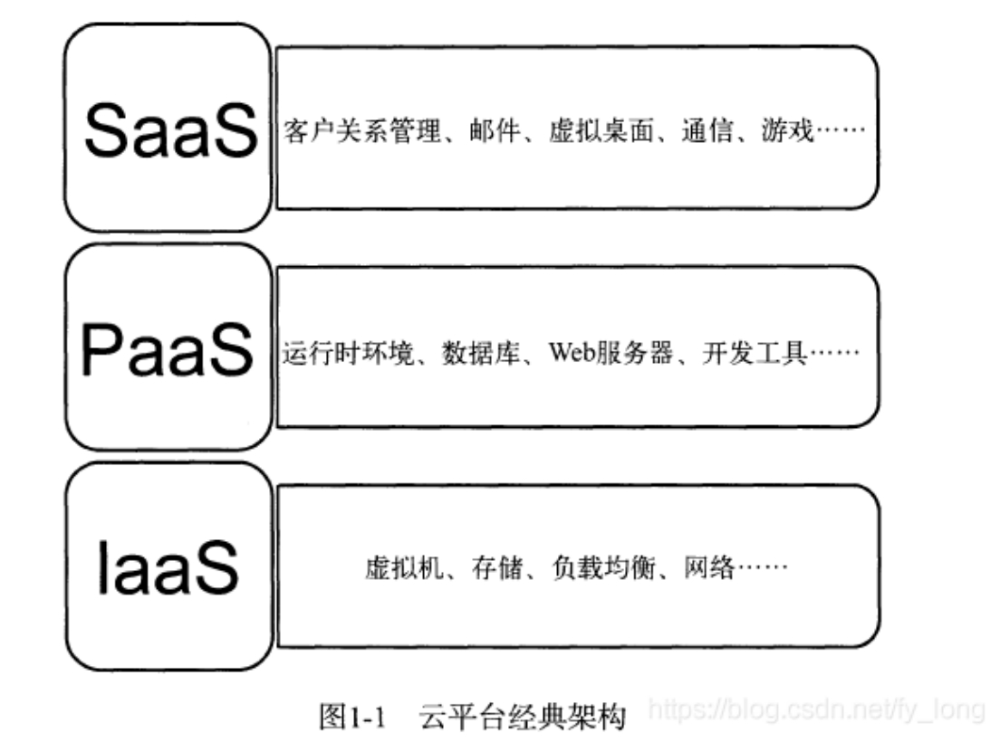 

• IaaS，IaaS主要包括计算机服务器、通信设备、存储设备等，能够按需向⽤⼾提供的计算能⼒、存储能⼒或⽹络能⼒等IT基础设施类服务，也就是能在基础设施层⾯提供的服务。今天IaaS能够得到成熟应⽤的核⼼在于虚拟化技术，通过虚拟化技术可以将形形⾊⾊计算设备统⼀虚拟化为虚拟资源池中的计算资源，将存储设备统⼀虚拟化为虚拟资源池中的存储资源，将⽹络设备统⼀虚拟化为虚拟资源池中的⽹络资源。当⽤⼾订购这些资源时，数据中⼼管理者直接将订购的份额打包提供给⽤⼾，从⽽实现了IaaS。

• PaaS，如果以传统计算机架构中“硬件+操作系统/开发⼯具+应⽤软件”的观点来看待，那么云计算的平台层应该提供类似操作系统和开发⼯具的功能。PaaS定位于通过互联⽹为⽤⼾提供⼀整套开发、运⾏和运营应⽤软件的⽀撑平台。就像在个⼈计算机软件开发模式下，程序员可能会在⼀台装有Windows或Linux操作系统的计算机上使⽤开发⼯具开发并部署应⽤软件⼀样，如k8s。

• SaaS，简单地说，就是⼀种通过互联⽹提供软件服务的软件应⽤模式。在这种模式下，⽤⼾不需要再花费⼤量投资⽤于硬件、软件和开发团队的建设，只需要⽀付⼀定的租赁费⽤，就可以通过互联⽹享受到相应的服务，⽽且整个系统的维护也由⼚商负责。

## 4.Exercise: Understand Figure 2.1 and find some process tools including open source tools and try to install and discuss them.

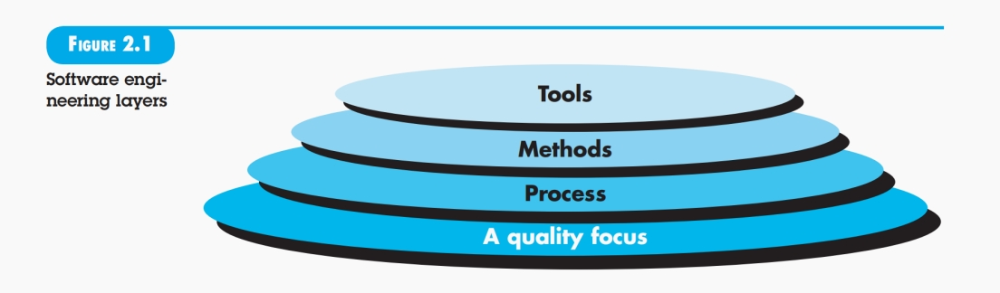 

根据图2.1，软件工程是一个层次化的技术，我们可以对软件工程进一步地抽象分成4个层次：即质量Q、过程化P、方法M、还有工具T。首先软件工程的根基是质量，软件工程的目的就是提高软件开发的质量，然后过程化这一层则回答了如何提高软件质量的问题，即软件开发过程化，再就是方法这一层贯穿于过程之中，比如UseCase建模，数据库设计方法，架构方法，分析方法，设计方法，测试方法等多种方法，最后是工具，现在很多方法和技术都工具化了，这里就出现了计算机辅助工程CASE。

关于过程化工具，这里我们找到了例如Youtrack这类工具,就可以通过定制工作流程,使不同规模的项目团队都能高效协作,从而帮助企业有效改善项目管理流程,实现更灵活、智能的软件项目协作。比如Youtrack中的一些团队管理功能大大加速了团队项目开发的效率，比如新建问题和问题模块（任务管理） ，这个模块可以用来发布通知，点击新建模块即可进行通知发布，然后右侧边栏有优先级（紧急、严重、普通等），状态（已提交、进行中、不解决等）、被指派者、预估用时以及实际用时 ；仪表板相当于个人的主页中心，会显示自己的项目以及相关的项目更新通知以及演示项目时间表；以及敏捷面板中存在以泳道图的方式查看当前不同状态下的任务进度，包括backlog、SprintBacklog、对应burndown图的显示等；此外YouTrack 带有 4 个类别的 20 份报告，可帮助跟踪、管理和分析多种表现和进度指标等。

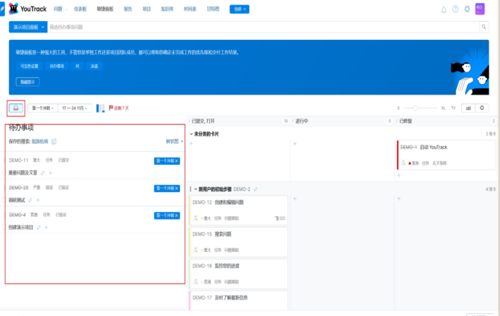 

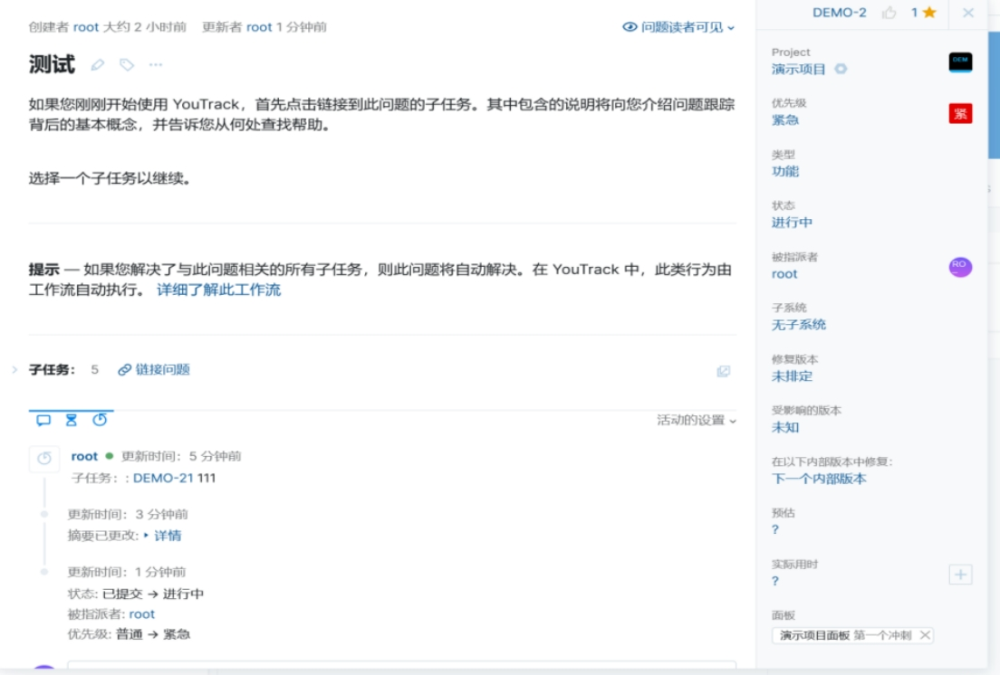 

 

## 5.Learn to use MS-project or other similar tool and break down activities into actions and tasks.

1.新建一个Ms-project项目

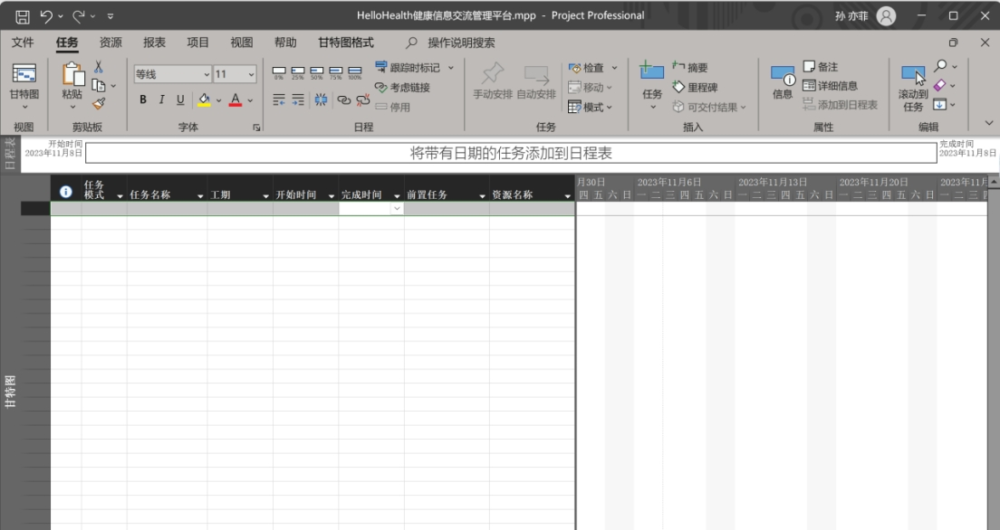 

2.列出项目的adopted activities.

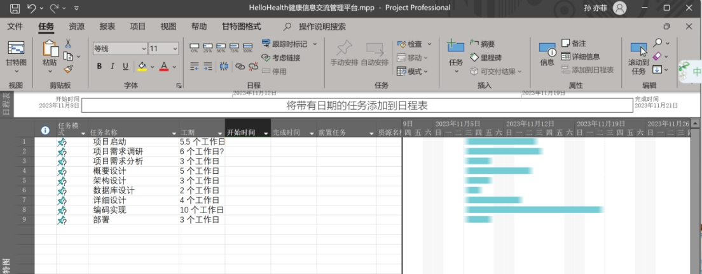 

3.将activity分解为action与task（设置ms-project软件中任务间的层级关系)

由于没有设置关联关系，此时任务之间时间线较为混乱。

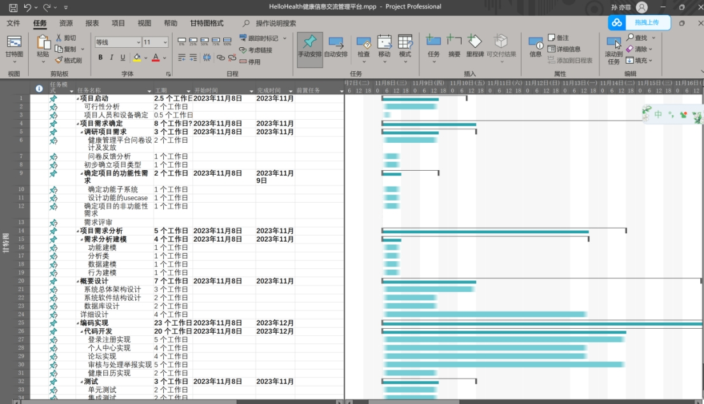 

4.设置任务之间的关联关系

任务之间的关系可以是：开始-开始 ， 开始-结束， 结束-开始， 结束-结束

在甘特图上，直接在任务的 “前置任务”上选择前置任务。也就是指定该任务之前需要完成什么任务（默认是 完成-开始的关系

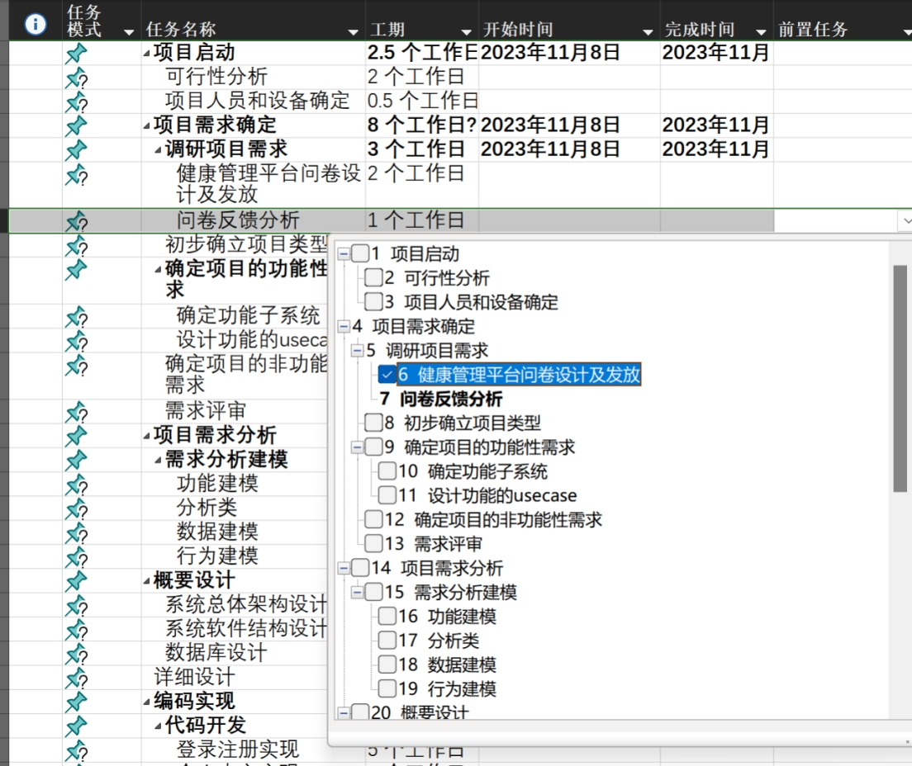 

效果如下所示，

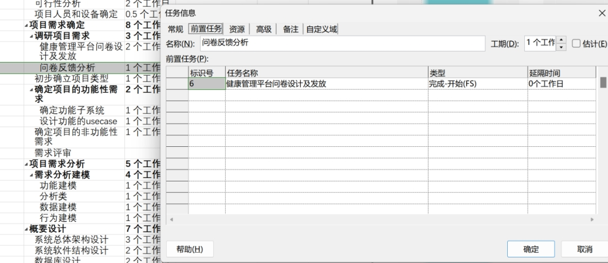 

5.整体设置后如下所示

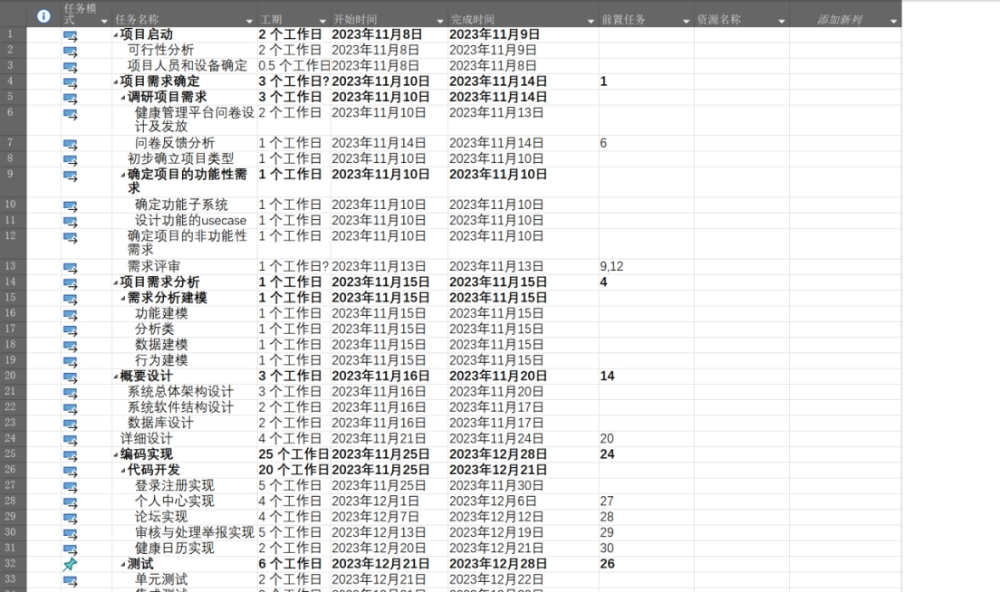 

甘特图展示：

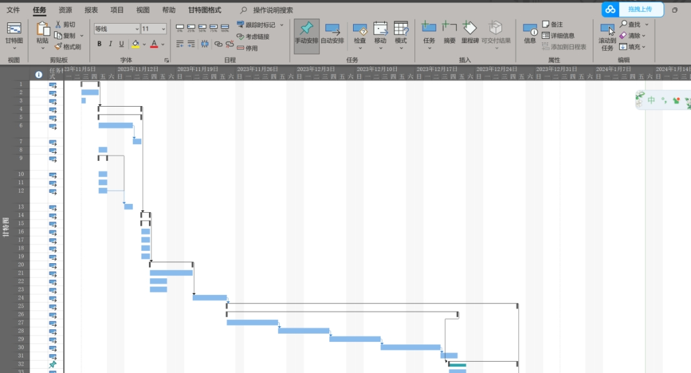 

##  6.find a project that developend by XP or Scrum, and discuss it. 

一个由Scrum开发的大型、分布式的软件项目，项目的成功经验和教训。

https://www.jianshu.com/p/1a0261d99aa0

**项目背景：**

• 项目背景是荷兰铁路系统，其中一个部分是PUB发布系统，用于控制车站的信息显示和音频广播。

• 之前采用传统瀑布方法，历经3年无法交付出可运行的系统，失败。项目被取消后重新启动，引入了敏捷开发方式，采用了Scrum框架。

 

**项目启动和团队协作：**

\1. 在项目启动阶段，一个项目经理、一个架构师和一个Scrum Master参与，为Sprint做好准备。

\2. 产品负责人选择是一个难题，最终由两个业务分析师共同担任。

\3. 利用Scrum的启动阶段，解决了需求文档不适用于敏捷计划和估算的问题，创建了原始的产品backlog。

 

**分布式团队和协作：**

\1. 项目开始时有7人，随后扩展到两个Scrum团队，包括荷兰和印度的开发人员。

\2. 使用Skype进行频繁的沟通，保持团队协作，但结对编程仍然需要同地进行。

\3. 使用ScrumWorks记录团队的工作和Sprint进度，促进跨地区的沟通。

 

**架构团队和文档管理：**

\1. 创建了一个专注于架构的团队，解决了非功能性需求的问题，通过“Scrum of Scrum”会议与特性团队沟通。

\2. 针对客户要求的大量文档，雇佣了技术文案，但文档编写需要与团队成员之间进行大量的沟通交流。

 

**需求管理和测试：**

\1. 需求存在于需求文档和产品backlog两个地方，引起了一些问题。

\2. 实施了自动化测试，包括单元测试和验收测试，保证了每个Sprint末尾的交付质量。

 

**项目成果和总结：**

\1. 审核公司对系统的可维护性和源码质量给予了高度评价，项目客户对工作满意。

\2. 学到的重要经验包括需求管理的挑战、Scrum在多个分布式团队中的适用性、启动分布式项目的最佳实践、架构团队的价值、文档管理、自动化测试的关键性等。

**总结：**

这个项目通过Scrum框架取得了成功，但在实践中也遇到了一些挑战，例如需求管理的复杂性、文档管理的沟通问题等。团队通过不断学习和调整，最终取得了客户的高度满意，并得到审核公司的积极评价。

**Discussion：根据这个例子，我们讨论得出一些重要的经验教训：**

1.**产品负责人的选择关键：** 选择一个既有领域知识、又有时间和权利设置需求优先级的产品负责人是项目成功的关键。在大型项目中，有时需要多人共同担任这个角色。

\2. **启动阶段的重要性：** 在项目启动前进行充分的准备阶段，包括项目经理、架构师和Scrum Master的参与，有助于确保后续Sprint的顺利进行。

\3. **需求管理的挑战：** 在敏捷项目中，需求应当以用户故事的形式存在于产品backlog中，但有时客户仍然需要详细的需求文档。需要找到一种平衡，确保这两者之间的协调。

\4. **分布式团队的协作：** 利用现成的硬件和免费软件，如Skype，可以有效降低分布式团队之间的沟通成本。然而，结对编程等交互协作活动可能需要同地进行。

\5. **架构团队的价值：** 针对系统的非功能性需求，创建一个专注于架构的团队，可以提高整体系统的可维护性和源码质量。

\6. **自动化测试的关键性：** 自动化测试在项目中发挥关键作用，有助于在每个Sprint末尾交付经过测试的软件，避免回归bug的干扰。

\7. **文档管理和沟通：** 大型项目可能需要大量的文档，确保与技术文案等团队成员之间进行充分的沟通，以确保文档的准确性和完整性。

\8. **需求变更的管理：** 当需求发生变化时，需要进行有效的管理，确保产品负责人关注于产品backlog，而不仅仅是需求文档。

\9. **项目启动时同地协作：** 在项目启动时，将团队成员聚集在同一地方，确保对团队实践达成一致，有助于建立有效的团队协作。

\10. **投资于自动化测试的回报：** 尽管自动化测试可能在初期投入较大，但在项目晚期可以获得高于成本的回报，特别是对于复杂的项目。

这些经验教训强调了在敏捷开发中，团队应该灵活适应变化、注重有效沟通、投资于自动化测试、重视团队协作等原则。

## 7.分析算法和数据结构

完成期末考试排课，某专业若干学生选了若干门课（一个学生可能选多门课），学校规定在一定的时间内所有学生和所有课程必须考完，而不能有漏考和考试冲突，如，同一时间同一个学生考试不能冲突、考场也不能冲突，假设考场数量是足够的，如何设计算法的数据结构。

**数据结构选择：**

\1. 图中顶点表示课程，根据⼀个人不能在同时考试的原则在每个人的课程之间建立无向边，该问题便转化为了无向图的最少着色问题

\2. 用最少的颜色对无向图的顶点着色，并保证任两个相连通的顶点具有不同的颜色

\3. 顶点的颜色种类n就代表着最少只需要n个时间段便可以完成考试时间的安排。

\4. 表示图的数据结构选用邻接矩阵。

**算法选择：**贪心，dfs(深度优先搜索)与剪枝。

1.定义一个sumans来存放完成一次深度搜索时求得的使用的颜色总数，用minans来记录最小的颜色数。

2.贪心：求每个点的颜色时，先用已有的每个颜色来试探，有符合条件的颜色时，sumans就不用加一，然后递归调用函数求下一个点的颜色；如果已有的所有颜色都试探失败，这个时候sumans加一，递归调用函数求下一个点的颜色。

3.在递归出口比较每次求得的总颜色数，每次都取最小的，进而求出最小的颜色数，与分配方案。

4.剪枝：如果此时的sumans已经大于等于了minans，说明现在的分配方案已经不是最优解，直接返回。

**代码示例：**

```c++
#include<bits/stdc++.h>
using namespace std;
/*
无向图上三角邻接矩阵
    A B C D E F
A     1 0 1 1 1
B       0 0 1 1
C         1 1 1
D           0 1
E             1
F
*/
const int maxn=6;
int nearMap[maxn][maxn];
vector<int> color(maxn);//当前颜色分配方案
int minans;
vector<int> colorans(maxn);//最终颜色分配方案
bool check(int index,int c)
{
    for(int i=0;i<maxn;i++)
    {
        if(nearMap[index][i]==1&&color[i]==c)
        {
            return false;
        }
    }
    return true;
}

void dfs(int index,int sumans)
{
    if(sumans>=minans)//当前的答案不可能是最优的，直接退出
    {
        return;
    }
    if(index==maxn)//当前已经排完了所有时间，且有可能最优，则迭代为该答案
    {
        minans=sumans;
        colorans=color;
        return;
    }
    int fg=0;
    for(int c=1;c<=sumans;c++)//检查已经用过的每个颜色是否能为当前节点使用
    {
        if(check(index,c))
        {
            color[index]=c;
            fg=1;
            dfs(index+1,sumans);
        }
    }
    if(!fg)//前面的颜色都不能使用时，赋予新颜色
    {
        //为该节点使用新颜色
        color[index]=sumans+1;
        dfs(index+1,sumans+1);
    }
}

/*
输入：
1 0 1 1 1
0 0 1 1
1 1 1
0 1
1
*/
int main()
{
    for(int i=0;i<maxn-1;i++)
    {
        for(int j=i+1;j<maxn;j++)
        {
            int fg;
            cin>>fg;
            nearMap[i][j]=nearMap[j][i]=fg;
        }
    }
    minans=0x7fffffff;//为答案先赋值最大值
    dfs(0,0);//第一个节点，暂时无颜色分配
    cout<<"最少使用"<<minans<<"个时间段"<<endl;
    cout<<"时间安排为："<<endl;
    for(int i=0;i<maxn;i++)
    {
        cout<<char('A'+i)<<" : "<<colorans[i]<<endl;
    }
}
```


## 8.find a tool that creates the interface prototype 

我们经过调研选择了Figma作为用户界面设计和原型开发工具，因为Figma可以显著提高设计和开发的效率，增强团队成员之间的协作，并利用其强大的功能集来创建高质量的设计，比如支持微交互和动画的创建，让原型更加生动和接近最终产品；支持高效的组件系统，允许创建可重用的设计元素并保持设计一致性；支持使用插件导出界面原生代码等。我们使用Figma完成的界面原型设计如下图所示：

登录页面：

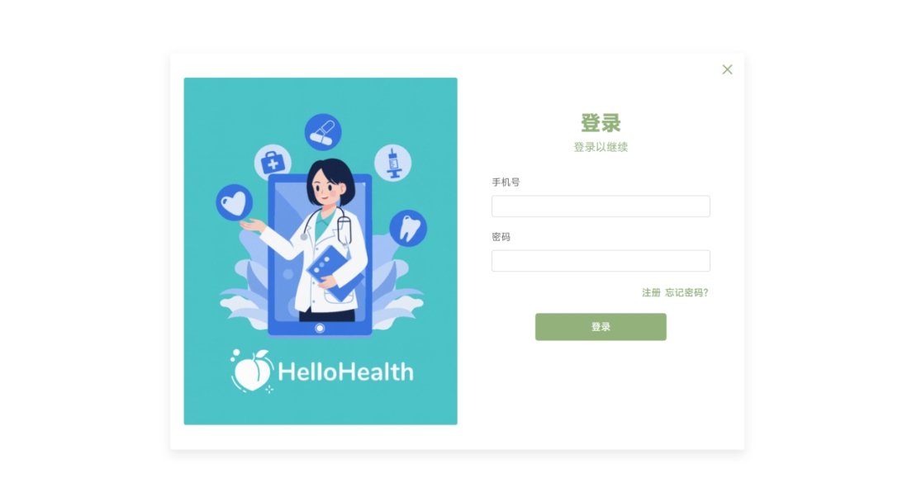 

HelloHealth首页：

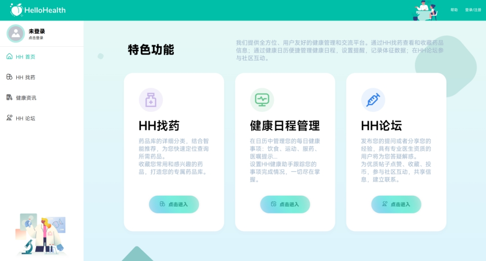 

HH找药界面

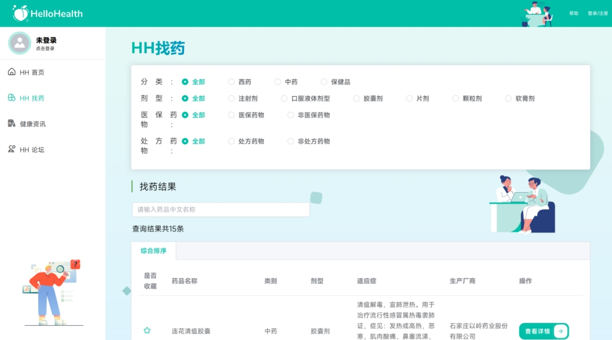 

健康资讯页面：

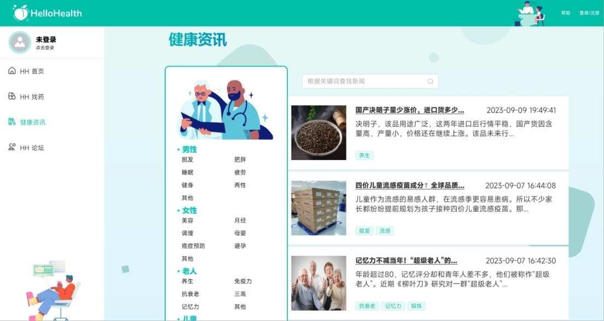 

HH论坛页面：

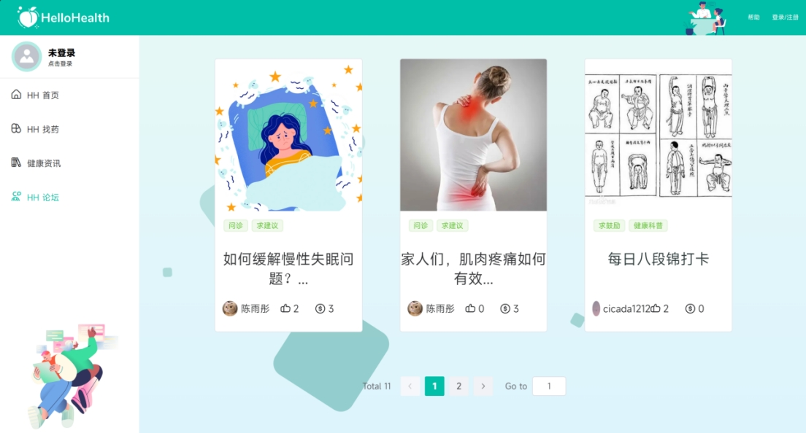 

 